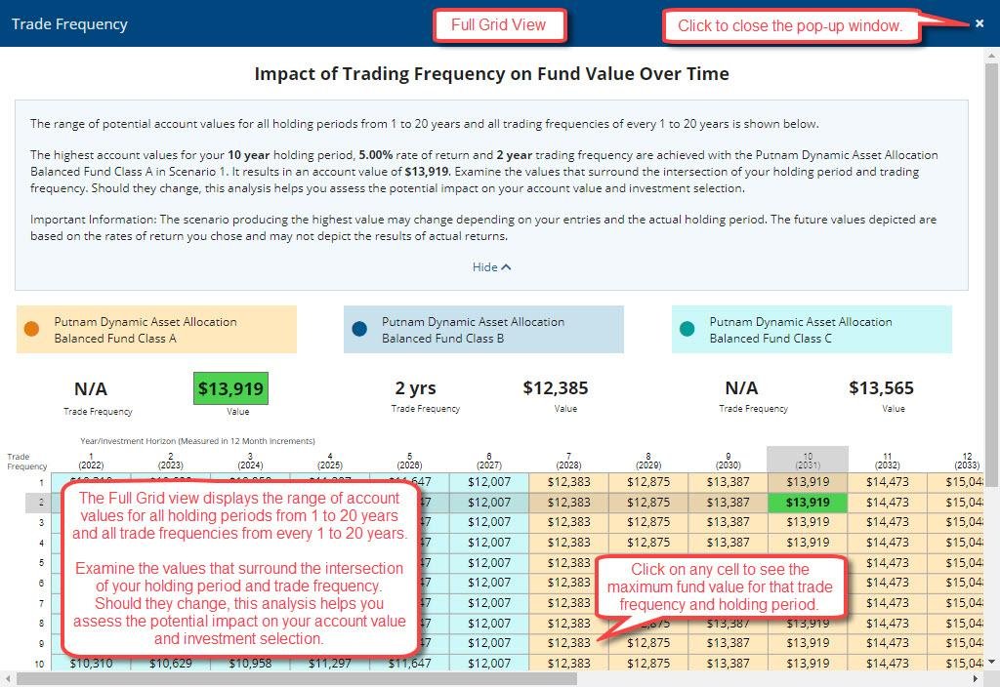

## Table of Contents

## What is a mutual fund?

A mutual fund is a type of investment where many people pool their money together to buy a variety of stocks, bonds, or other assets. It's like a big basket where everyone puts in some money, and a professional manager decides what to buy with it. This makes it easier for people who don't have a lot of money or time to invest in a diverse range of assets.

When you invest in a mutual fund, you buy shares of the fund, and the value of your shares goes up or down based on how well the investments in the fund are doing. Mutual funds can be a good way to spread out risk because they invest in many different things. This means if one investment does poorly, it might be balanced out by others that do well.

## What are mutual fund holdings?

Mutual fund holdings are the different investments that a mutual fund owns. These can include stocks, bonds, and other types of assets. When you invest in a mutual fund, you are actually buying a piece of all these different investments. The fund's manager decides which specific stocks, bonds, or other assets to buy and sell, trying to grow the fund's value over time.

The holdings of a mutual fund can change often. The manager might buy new investments or sell old ones based on their strategy and how the market is doing. You can usually find out what a mutual fund holds by looking at its prospectus or the fund's website. This information helps you understand where your money is being invested and how the fund is trying to make money for its investors.

## Why are mutual fund holdings reports important?

Mutual fund holdings reports are important because they show you what the fund is investing in. When you put your money into a mutual fund, you want to know where it's going. These reports list all the stocks, bonds, and other assets the fund owns. This helps you see if the fund is investing in things you believe in or want to support. It also lets you check if the fund is sticking to its promised investment strategy.

These reports also help you understand the risks you are taking. By seeing the specific investments, you can tell if the fund is spread out across many different types of assets or if it's focused on just a few. This can affect how safe or risky your investment is. Knowing the holdings can also help you decide if you want to keep your money in the fund or move it somewhere else based on how well the investments are doing.

## How often are mutual fund holdings typically reported?

Mutual fund holdings are usually reported every three months, or once per quarter. This means you can see what the fund owns at the end of March, June, September, and December. Some funds might also give you a quick look at their holdings every month, but the full detailed report comes out every three months.

These reports are important because they help you see where your money is going. If you invest in a mutual fund, you want to know what stocks, bonds, or other things the fund is buying. By looking at the holdings report, you can check if the fund is doing what it said it would do and if it's investing in things you like or believe in.

## What are the regulatory requirements for reporting mutual fund holdings?

In the United States, the Securities and Exchange Commission (SEC) sets rules for mutual funds to report their holdings. They must file a report called Form N-Q within 60 days after the end of the first and third quarters of the year. This form shows what the fund owns at the end of those quarters. For the second and fourth quarters, funds file a different report called Form N-CSR, which also includes the fund's financial statements. This must be filed within 60 days after the end of those quarters.

These reports help keep things fair and open. Investors can see where their money is going and check if the fund is sticking to its plan. If a fund says it will invest in certain types of stocks or bonds, the reports show if it's doing that. This helps investors make smart choices about where to put their money.

## What information is included in a mutual fund holdings report?

A mutual fund holdings report shows what a mutual fund owns. It lists all the stocks, bonds, and other things the fund has bought. This report helps you see where your money is going when you invest in the fund. It tells you how much of each thing the fund owns, like how many shares of a company's stock or how much of a certain bond. This way, you can check if the fund is investing in things you like or believe in.

The report also gives you the value of each holding. This means you can see how much each stock or bond is worth at the time of the report. It helps you understand if the fund's investments are doing well or not. The report might also tell you about any big changes in what the fund owns since the last report. This can help you see if the fund's manager is making new choices or sticking with the old ones.

## How can investors access mutual fund holdings reports?

Investors can access mutual fund holdings reports in a few easy ways. One way is to go to the website of the mutual fund company. Most companies have a section where they post these reports. You can usually find them under "Investor Resources" or "Fund Documents." Another way is to use the SEC's website. The SEC keeps all the reports that funds have to file, like Form N-Q and Form N-CSR. You can search for the fund you're interested in and download the reports for free.

These reports are important because they show you what the fund is investing in. By looking at the holdings report, you can see if the fund is buying the kinds of stocks, bonds, or other things you want to invest in. It also helps you check if the fund is sticking to its plan. If you want to make smart choices about where to put your money, these reports can give you the information you need.

## What are the differences in reporting frequency between different types of mutual funds?

Most mutual funds report their holdings every three months, or once per quarter. This means you can see what the fund owns at the end of March, June, September, and December. The reports are filed with the SEC using forms like N-Q for the first and third quarters and N-CSR for the second and fourth quarters. These reports help investors see where their money is going and check if the fund is sticking to its plan.

Some mutual funds might give you a quick look at their holdings every month, but the full detailed report still comes out every three months. This can be helpful if you want to keep a closer eye on what the fund is doing. But even with these monthly updates, the official reports that go to the SEC are still the most important ones for understanding the fund's investments over time.

## How does the frequency of reporting impact investment decisions?

The frequency of reporting can really help investors make better choices. When mutual funds report their holdings every three months, or even every month, it gives you a good look at what the fund is doing with your money. This can help you decide if you want to keep your money in the fund or move it somewhere else. If you see the fund is buying things you don't like, you might want to pull your money out. But if the fund is sticking to its plan and doing well, you might want to leave your money in or even put in more.

Knowing how often a fund reports its holdings also helps you understand how quickly you can react to changes. If a fund only reports every three months, you might not find out about big changes until a few months later. But if the fund gives monthly updates, you can see what's happening sooner and make decisions faster. This can be important if you want to stay on top of your investments and make smart choices about where to put your money.

## What are the potential drawbacks of less frequent reporting?

Less frequent reporting can make it harder for you to keep track of what's happening with your money. If a mutual fund only reports its holdings every three months, you might not know about big changes until a lot later. This means you could miss out on chances to move your money to a better place or get out of a fund that's not doing well. It's like trying to drive a car while only looking at the road every few minutes—you might miss important things happening right in front of you.

Also, less frequent reporting can make it tougher to trust the fund. When you don't get updates often, it can feel like the fund is hiding something or not being open about what it's doing. This can make you feel unsure about where your money is going and if the fund is sticking to its plan. If you can't see what's happening with your investment often enough, it might make you want to take your money out and put it somewhere you feel more comfortable.

## How do international regulations affect the frequency of mutual fund holdings reports?

International regulations can change how often mutual funds have to report their holdings. Different countries have their own rules. In the United States, mutual funds report every three months. But in other places, like Europe, the rules might be different. Some countries might want funds to report more often, like every month, to keep things more open and help investors make better choices. Other countries might be okay with less frequent reports, like every six months, because they have different ideas about what's best for investors.

These different rules can make it hard for investors who want to put money into funds from different countries. If you're looking at funds from the U.S. and Europe, you might get updates at different times. This can make it tricky to compare them and decide where to put your money. Knowing how often a fund reports its holdings can help you understand how quickly you can react to changes and make smart choices about your investments.

## What advanced analytical techniques can be used to interpret mutual fund holdings data?

One way to understand mutual fund holdings better is by using something called [factor](/wiki/factor-investing) analysis. This technique helps you see what kinds of things the fund is investing in, like big companies or small ones, or companies that grow fast or pay good dividends. By looking at these factors, you can tell if the fund is sticking to its plan or if it's changing its focus. This can help you decide if the fund is still a good fit for your goals.

Another useful technique is called cluster analysis. This helps you group the fund's investments into different categories based on how they are similar. For example, you might see that a lot of the fund's money is in tech companies or in companies from a certain country. This can show you if the fund is spreading its money out well or if it's putting too many eggs in one basket. Knowing this can help you understand the risks you're taking and make better choices about where to put your money.

You can also use something called time-series analysis to look at how the fund's holdings change over time. This can show you if the fund is buying and selling things a lot or if it's holding onto its investments for a long time. By seeing these patterns, you can get a better idea of the fund's strategy and how it might do in the future. This can help you decide if you want to keep your money in the fund or move it somewhere else.

## References & Further Reading

[1]: Securities and Exchange Commission. (2023). ["Form N-Q and Form N-CSR Filing Requirements."](https://www.sec.gov/corpfin/secg-share-repurchase-disclosure-modernization) U.S. Securities and Exchange Commission.

[2]: Andersen, T. G., Bollerslev, T., & Diebold, F. X. (2010). ["Parametric and Nonparametric Volatility Measurement."](https://www.nber.org/papers/w8160) Handbook of Financial Econometrics.

[3]: Lopez de Prado, M. (2018). ["Advances in Financial Machine Learning."](https://www.amazon.com/Advances-Financial-Machine-Learning-Marcos/dp/1119482089) Wiley.

[4]: Jansen, S. (2020). ["Machine Learning for Algorithmic Trading: Predictive Models to Extract Signals from Market and Alternative Data."](https://github.com/stefan-jansen/machine-learning-for-trading) Packt Publishing.

[5]: Chan, E. P. (2009). ["Quantitative Trading: How to Build Your Own Algorithmic Trading Business."](https://github.com/ftvision/quant_trading_echan_book) Wiley.