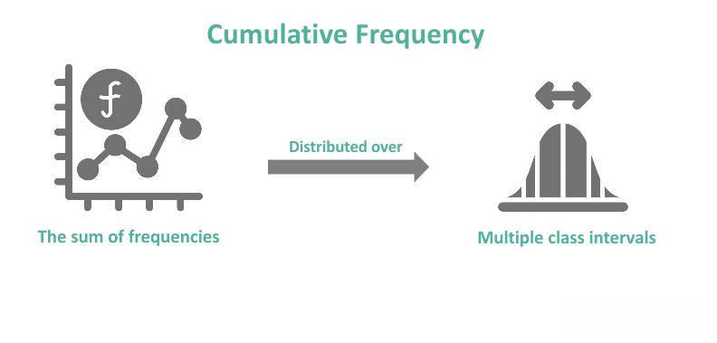

Algorithmic trading, commonly referred to as algo trading, has fundamentally transformed financial markets by automating the process of executing trades. At its core, algo trading utilizes complex computer algorithms to analyze a multitude of market variables and make swift trading decisions aimed at optimizing profit potential. In an era where speed and precision are paramount, these algorithms allow for trades to be conducted at optimal times, capitalizing on transient market opportunities that might elude human traders.

A central determinant of an algorithmic trading system's success is the frequency with which trades are executed. Frequency is integral as it directly affects profitability, market liquidity, and the overall strategic deployment of trading assets. High-frequency trading (HFT), for example, involves executing numerous trades within fractions of a second, exploiting minute price movements and inefficiencies across large volumes of transactions. This rapid trading cadence not only seeks to enhance profitability but also contributes to market liquidity by narrowing bid-ask spreads.



Conversely, low-frequency trading entails fewer transactions over prolonged periods, often influenced by macroeconomic indicators and extensive fundamental analysis. This approach tends to focus on long-term gains rather than immediate profit maximization, providing a contrasting perspective on frequency's role in trading strategies.

This article examines the concept of frequency in algorithmic trading and its influence on shaping today's investment landscape. The exploration will cover the spectrum of trading frequencies, analyzing each approach's advantages and disadvantages, and addressing the role of high-frequency trading within global markets. Understanding these elements is vital for traders and financial institutions seeking to optimize their trading strategies in an ever-evolving environment.

## Table of Contents

## Understanding Algorithmic Trading Frequencies

Frequency in [algorithmic trading](/wiki/algorithmic-trading) refers to the rate at which an algorithmic trading system executes trades. The trading frequency can vary significantly, from high-frequency trading ([HFT](/wiki/high-frequency-trading-strategies)), characterized by numerous trades executed within milliseconds, to low-frequency trading, where trades may occur over several days or weeks.

High-frequency trading employs powerful computers and data feeds to identify and exploit small price discrepancies at high volumes. These trades are executed with precision and speed, typically involving numerous transactions in very short time frames. The goal is to capitalize on minute price differences, often just fractions of a cent, across different markets or securities. The high [volume](/wiki/volume-trading-strategy) of transactions associated with HFT contributes to providing [liquidity](/wiki/liquidity-risk-premium) to markets, effectively lowering the bid-ask spreads. This dynamic can enhance the efficiencies of markets, making them more attractive to a wider range of participants.

On the other hand, low-frequency trading focuses on long-term strategies with fewer but larger trades. These strategies are often rooted in [fundamental analysis](/wiki/fundamental-analysis), including macroeconomic indicators, corporate financial health, and other comprehensive data sets. Unlike HFT, which requires substantial technological investments and computational power, low-frequency trading strategies generally involve less technical complexity. This makes them more accessible to individual investors and those who may not have access to cutting-edge technology or the capital needed for high-frequency strategies. The emphasis is on patiently waiting for larger market movements over time, which allows for developing investments aligned with long-term financial goals.

The choice between high-frequency and low-frequency trading depends on the investor's objectives, available resources, and risk tolerance. Each frequency has its own set of requirements and advantages, influencing the overall approach and strategy a trader might employ. Understanding these differences is crucial for aligning one's trading strategy with their investment goals.

## Advantages of High-Frequency Trading

High-frequency trading (HFT) is known for several advantages that have a substantial impact on the functionality and efficiency of financial markets. One of the primary benefits is the increase in market liquidity. HFT firms actively participate in markets by placing numerous buy and sell orders in milliseconds, thereby ensuring that there is a continuous flow of trades. This heightened liquidity serves to facilitate smoother transactions for all market participants, including individual and institutional investors, by reducing the time it takes to execute trades.

Tighter bid-ask spreads are another significant advantage of HFT. Bid-ask spread is the difference between the highest price a buyer is willing to pay for an asset and the lowest price a seller is willing to accept. High-frequency traders, by virtue of their rapid trading capabilities, often compete for minimal spreads, essentially narrowing the gap. This reduction benefits traders of all kinds as it decreases the cost of entering and exiting positions, thereby improving overall market efficiency.

Furthermore, the speed and efficiency associated with HFT enable traders to quickly exploit market inefficiencies. By leveraging sophisticated algorithms and powerful data feeds, HFT systems can identify slight discrepancies in asset pricing that might not be discernible within longer time frames. In effect, HFT capitalizes on transient opportunities that exist for just milliseconds, allowing traders to garner profits from small price movements that occur frequently.

Another advantage lies in the reduction of trading costs. With the automation and speed HFT offers, the reliance on manual intervention is significantly minimized. This automation helps not only in curtailing human error but also in cutting down the expenses related to personnel and slower trading methods. Moreover, HFT firms often engage in market-making activities, which involve providing offers to both buy and sell an asset simultaneously, profiting from the spread between the bid and the ask price while ensuring liquidity.

In conclusion, high-frequency trading plays a pivotal role in enhancing overall market dynamics through increased liquidity, reduced transaction costs, and the ability to efficiently address price inefficiencies. As a result, it contributes to creating a more dynamic and accessible trading environment.

## Drawbacks and Criticisms of High-Frequency Trading

High-frequency trading (HFT) has transformed financial markets, primarily benefiting those with access to cutting-edge technology and data. However, despite these advantages, HFT faces significant criticism. One major criticism is that it creates an uneven playing field, allowing large firms to dominate due to their superior technological resources and access to market data. This concentration of resources allows these firms to execute trades at speeds and volumes unattainable by smaller or less technologically advanced traders, potentially marginalizing them.

Another criticism revolves around the transient nature of liquidity provided by HFT. This liquidity can vanish as quickly as it appears, leading to heightened market [volatility](/wiki/volatility-trading-strategies). A notable example of this volatility was the 'flash crash' of May 6, 2010, when the Dow Jones Industrial Average briefly dropped about 1,000 points within minutes, causing significant market disruption. Such events highlight the potential for HFT to exacerbate market instability, raising concerns about the robustness of financial systems under stress.

Additionally, there are ongoing concerns regarding the impact of HFT on smaller traders, who may find themselves disadvantaged in an environment where milliseconds can determine profit or loss. This dynamic contributes to a perception of an inequitable trading environment, fostering debates about fairness and equity.

The potential for systemic risks introduced by HFT is another significant point of contention. The rapid execution and cancellation of orders inherent in HFT strategies can create a feedback loop that amplifies price movements, potentially triggering cascading effects across global markets. Regulators and market participants continuously debate these risks, seeking to balance innovation and efficiency with the need for stable and fair markets.

Overall, while HFT provides certain market efficiencies, including tighter bid-ask spreads and increased liquidity, the drawbacks and criticisms highlight the necessity for ongoing scrutiny and regulatory oversight to ensure a balanced and resilient financial system.

## Low-Frequency Trading: A Contrasting Approach

Low-frequency trading strategies stand in contrast to their high-frequency counterparts by focusing on long-term trends and detailed fundamental analysis. Unlike the rapid pace and technical demands of high-frequency trading, low-frequency trading involves executing fewer trades with an eye on substantial market movements over extended periods. This approach grants investors the advantage of making thoughtful decisions based on comprehensive data, such as macroeconomic indicators, corporate earnings reports, and geopolitical developments. 

One hallmark of low-frequency trading is its accessibility to individual investors who might lack the resources for high-speed trading technology. The emphasis is on a strategic understanding of market fundamentals rather than the constant monitoring and rapid execution of trades. By concentrating on long-term economic outlooks and company valuations, investors can build portfolios designed to weather market fluctuations and grow over time. This investment style often attracts those who favor a patient and less volatile approach, reducing the pressure associated with more dynamic trading strategies.

Low-frequency trading can often be modeled with a simple algorithm that evaluates fundamental data and governs trading decisions based on pre-set criteria. Here is a basic Python example to illustrate such an approach:

```python
def evaluate_investment(stock_data):
    # Analyze fundamentals like P/E ratio, revenue growth, etc.
    pe_ratio = stock_data['pe_ratio']
    revenue_growth = stock_data['revenue_growth']

    # Set thresholds for a 'buy' decision
    if pe_ratio < 15 and revenue_growth > 0.1:
        return "Buy"
    return "Hold"

# Example stock data
stock_data = {
    'pe_ratio': 14,
    'revenue_growth': 0.12
}

decision = evaluate_investment(stock_data)
print(f"Investment decision: {decision}")
```

The goal here isn’t to make numerous trades based on fleeting price discrepancies but to position investments so that they benefit from sustained economic trends and business growth. By prioritizing a smaller number of trades with larger impacts, low-frequency trading allows investors to benefit from stable returns driven by fundamental market conditions. As economies evolve and new data becomes available, these investors are able to adjust their strategies progressively, without the need for instant transactional capabilities. This patient, data-driven approach thus provides a viable alternative for those seeking long-term gains in the financial markets.

## Choosing the Right Frequency for Your Trading Strategy

The decision to engage in high-frequency trading (HFT) or low-frequency trading hinges on a trader’s specific objectives, the resources at their disposal, and their tolerance for risk. These factors collectively influence how an investor can best capitalize on the opportunities available in financial markets.

High-frequency trading is characterized by a high volume of trades executed at extraordinarily fast speeds, often within milliseconds. This strategy typically requires substantial financial resources, access to cutting-edge technology, and an appetite for quick, albeit small, profits. Traders employing HFT benefit from advanced algorithms and high-speed data feeds that can identify and exploit fleeting market inefficiencies. The potential for rapid profit accumulation is a significant appeal, but the strategy also necessitates a robust infrastructure capable of handling the rigors of high-speed trading and the associated transaction costs. For those equipped with significant capital and state-of-the-art technology, HFT offers the potential for substantial returns within very short time frames.

Conversely, low-frequency trading aligns with investors who focus on longer-term investment horizons and fundamental analysis. These traders often prioritize stability and are willing to endure market fluctuations to achieve larger profits over extended periods. Low-frequency trading strategies typically involve fewer transactions, concentrated on capitalizing on long-term trends and macroeconomic indicators. This approach is generally more accessible to individual investors who may not have the resources to compete in the high-frequency trading arena. It requires less technological overhead and focuses on deeper insights into company valuations, economic indicators, and market conditions, offering a more patient investment pathway.

The appropriate trading frequency is, therefore, not universally defined but is instead a strategic choice that must align with individual or institutional investment goals, resource availability, and risk appetite. Whether aiming for rapid gains with elaborate technological setups or opting for a more measured approach grounded in fundamental analysis, traders must carefully consider which frequency aligns with both their capabilities and their strategic objectives.

## The Impact of Technology and Regulation on Trading Frequencies

Technological advancements have dramatically influenced the frequency of trading in financial markets. Sophisticated algorithms and powerful computational hardware enable traders to execute transactions at remarkable speeds, capitalizing on minor price movements that occur in fractions of a second. High-frequency trading (HFT) relies on cutting-edge technology such as [machine learning](/wiki/machine-learning) algorithms, high-speed data feeds, and low-latency networks, which have reshaped how market participants engage in trading activities.

With the rapid pace of technological development, traders have access to vast amounts of data and the analytical tools necessary to process and act upon this information in real-time. This ability has allowed for the refinement of trading strategies, optimizing the timing and frequency of trades to enhance profitability. For instance, traders can employ predictive analytics to forecast market trends and adjust their strategies dynamically, thereby gaining a competitive advantage.

Conversely, the rise of HFT has presented challenges for regulatory bodies tasked with ensuring market integrity and protecting investors. Regulators continually adapt frameworks to address concerns associated with rapid trading practices, such as market volatility and unfair advantages conferred by superior technology. Policies like the European Union's Markets in Financial Instruments Directive II (MiFID II) and the U.S. Securities and Exchange Commission's regulations focus on increasing transparency and monitoring HFT activities to mitigate systemic risks.

Staying informed about these regulatory developments and technological innovations is crucial for traders. An understanding of existing and upcoming regulations provides traders with the insights needed to align their strategies with legal requirements, thereby avoiding potential compliance issues. Moreover, keeping abreast of technological trends enables traders to incorporate the latest tools into their trading systems, ensuring they remain competitive and capitalize on emerging opportunities.

In conclusion, technology and regulation are integral to the evolution of trading frequencies. The symbiotic relationship between these elements dictates how markets function and directly influences the strategies employed by traders worldwide. Navigating this landscape requires a keen awareness of both technological advancements and regulatory frameworks to optimize trading and manage associated risks effectively.

## Conclusion

Frequency in algorithmic trading plays a pivotal role in shaping both market dynamics and trading strategies. It dictates the pace and nature of trade execution, directly impacting liquidity, volatility, and the efficiency of market operations. High-frequency trading (HFT), characterized by its rapid execution, has transformed market landscapes by increasing liquidity and tightening bid-ask spreads, albeit with debates about fairness and stability. In contrast, low-frequency trading, with its emphasis on long-term strategies, provides an alternative that relies on macroeconomic indicators and comprehensive fundamental analysis.

Understanding the interaction between frequency, prevailing market conditions, and regulatory frameworks is essential for formulating effective trading strategies. Market conditions influence asset pricing and behavior, which, in tandem with regulatory measures, can either constrain or enhance trading activity. Traders, therefore, need to adapt to these elements, aligning their approaches with both technological capabilities and regulatory standards.

As market environments and technologies continue to advance, traders must remain agile, continually refining their strategies to harness the benefits and address the challenges presented by varying trading frequencies. This flexibility is crucial for optimizing returns, ensuring compliance, and managing risks effectively in a constantly evolving financial ecosystem.

## References & Further Reading

[1]: Aldridge, I. (2013). ["High-Frequency Trading: A Practical Guide to Algorithmic Strategies and Trading Systems"](https://books.google.com/books/about/High_Frequency_Trading.html?id=8QpIsVUMhmEC). Wiley.

[2]: Lopez de Prado, M. (2018). ["Advances in Financial Machine Learning"](https://www.amazon.com/Advances-Financial-Machine-Learning-Marcos/dp/1119482089). Wiley.

[3]: Easley, D., Lopez de Prado, M. M., & O'Hara, M. (2011). ["The Microstructure of the ‘Flash Crash’: Flow Toxicity, Liquidity Crashes and the Probability of Informed Trading"](https://papers.ssrn.com/sol3/papers.cfm?abstract_id=1695596). The Journal of Portfolio Management, 37(2).

[4]: Jovanovic, F., & Menkveld, A. J. (2015). ["Middlemen in Limit-Order Markets"](https://papers.ssrn.com/sol3/papers.cfm?abstract_id=1624329). Journal of Finance, 70(2).

[5]: Chan, E. (2009). ["Quantitative Trading: How to Build Your Own Algorithmic Trading Business"](https://github.com/ftvision/quant_trading_echan_book). Wiley.