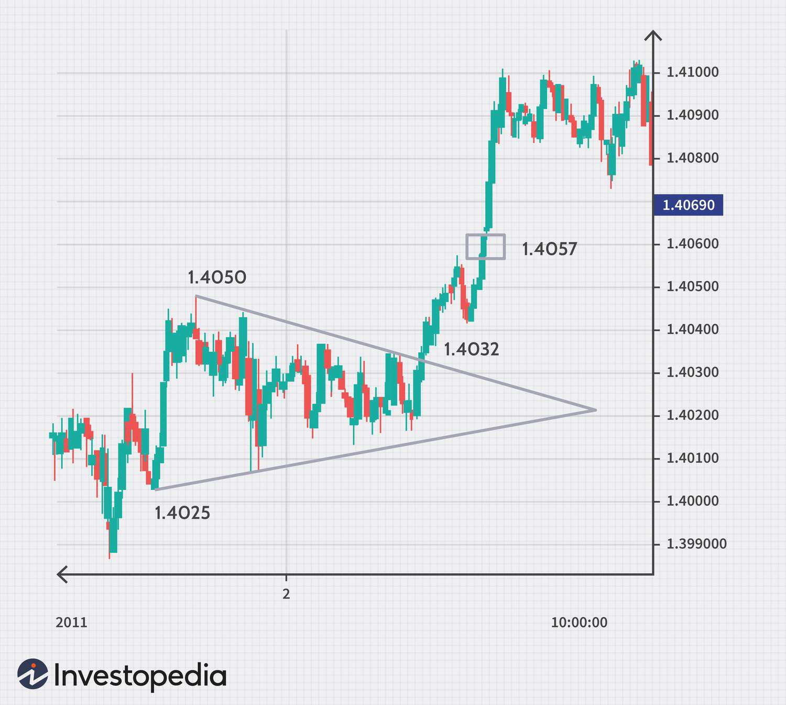

Foreign exchange trading, commonly known as Forex trading, is the process of exchanging one currency for another on a global scale. This decentralized marketplace is renowned for its immense size and liquidity, with a daily trading volume exceeding $6 trillion, dwarfing other financial markets. Participants range from large financial institutions and corporations to individual traders, all seeking to profit from fluctuations in currency exchange rates.

With the rise of advanced technology, the Forex market has experienced significant evolution, notably through the introduction and widespread adoption of algorithmic trading. Algorithmic trading, or "algo trading," utilizes computer programs to automate trading decisions and execute trades based on a set of pre-established criteria, removing the emotional component of trading and allowing for swift execution. These algorithms analyze vast amounts of market data, capitalizing on patterns and statistical correlations to make informed trading decisions, thereby enhancing market efficiency.



This guide aims to answer prevalent questions surrounding currency trading while offering insight into how algorithmic strategies integrate within the Forex market. It will explore their workings, benefits, and inherent risks, equipping the reader with the knowledge required to navigate this dynamic trading environment effectively.

## Table of Contents

## How Does Forex Trading Work?

Forex trading involves the buying and selling of currency pairs, with traders seeking to profit from the fluctuations in exchange rates between these pairs. Unlike the stock markets, Forex trading operates over-the-counter (OTC), which means it does not occur on a centralized exchange. Instead, this market consists of a decentralized network of banks, brokers, and financial institutions, allowing for the trading of currencies globally.

Currency pairs are quoted in a two-part system: a base currency and a quote currency. For instance, in the EUR/USD pair, the euro is the base currency, and the U.S. dollar is the quote currency. The price of the pair indicates how much of the quote currency is needed to purchase one unit of the base currency. Traders buy a currency pair if they anticipate the base currency will strengthen against the quote currency or sell it if they expect the base currency to weaken.

The Forex market operates continuously from Sunday evening to Friday evening, offering 24-hour trading due to the overlapping of time zones across different regions. This round-the-clock trading capability is divided into three main sessions: the Asian session, the European session, and the North American session. The market's decentralized nature and continuous operation make it possible for traders to respond promptly to global economic events and news.

In Forex trading, the absence of a physical exchange is compensated by electronic communication networks (ECNs) and interbank networks that connect traders worldwide. This infrastructure facilitates the execution of trades, with [liquidity](/wiki/liquidity-risk-premium) provided by market makers and large financial institutions. The leverage offered by brokers is another feature of Forex trading, allowing traders to control large positions with a relatively smaller initial capital, although it comes with increased risk.

Forex trading's decentralized system contrasts with centralized exchanges where trades occur through a physical or virtual exchange. The decentralized nature promotes liquidity and accessibility, enabling traders from all over the world to participate. This setup supports the vast and dynamic nature of the Forex market, providing extensive opportunities for both novice and experienced traders.

## The Basics of Algorithmic Trading in Forex

Algorithmic trading, often termed ‘algo trading,’ utilizes pre-defined algorithms to automate Forex trading. These algorithms are typically mathematical models or sets of rules that govern how trades should be executed in response to market conditions. The primary advantage of algo trading is its ability to execute trades at unprecedented speeds and efficiencies, properties that are essential in Forex’s dynamic environment.

One of the significant benefits of [algorithmic trading](/wiki/algorithmic-trading) is the elimination of emotional biases. Emotions such as fear or greed can often lead traders to make irrational decisions. By relying on algorithms, trading is purely based on logic and historical data, thereby increasing the objectivity of trading decisions. Furthermore, algorithms can process and act on information faster than humans, giving traders the ability to capitalize on fleeting market opportunities.

Several strategies are prevalent in algorithmic trading:

1. **Statistical Arbitrage**: This strategy involves the simultaneous buying and selling of various instruments to exploit short-term pricing inefficiencies. It leverages statistical methods and models to identify and profit from price differentials. For example, traders might create a basket of currency pairs and apply statistical tests to predict mean reversion behaviors.

2. **Auto-Hedging**: Designed to reduce risk, auto-hedging automatically executes trades to balance potential losses in one currency pair by offsetting gains in another. Hedging often involves complex computations and precise execution timing – tasks that algo trading excels at performing.

3. **High-Frequency Trading (HFT)**: High-frequency trading involves executing a large number of trades in fractions of a second. Algorithms in HFT are designed to take advantage of small price imbalances or liquidity issues. A successful HFT strategy requires significant technological infrastructure and access to real-time market data, which are prerequisites for identifying and exploiting marginal price movements at high speeds.

In conclusion, the use of algorithmic trading in Forex provides a technological edge through automation and precision that manual trading struggles to achieve due to human limitations. Despite the numerous advantages, successful implementation demands an understanding of both the technology and the intricate workings of the Forex market.

## Benefits of Algorithmic Trading in Forex

Algorithmic trading, often referred to as algo trading, presents a transformative approach to Forex trading by leveraging technology to enhance efficiency and accuracy. A fundamental advantage of algo trading lies in its ability to process large volumes of market data swiftly. This capability allows traders to respond to rapid changes in foreign exchange rates and market conditions aptly, thus potentially increasing profit margins. 

Precision and consistency are hallmarks of algo trading systems, distinguishing them from manual trading. By automating the trading process, algo trading minimizes human errors that may arise from emotional decision-making or fatigue. Predefined algorithms ensure that trades are executed at optimal prices with consistent strategy adherence. This systematic approach can be particularly advantageous in a market as volatile and fast-paced as Forex, where timely execution can be crucial.

One of the critical features of algorithmic trading is the ability to backtest strategies using historical data. Traders can simulate the performance of their strategies over a range of past market conditions, providing valuable insights into their potential effectiveness. This involves feeding historical data into the algorithm and analyzing the simulated trade outcomes to assess strategy risks and reward scenarios. Consequently, traders can optimize their strategies before they are deployed in live markets, reducing the likelihood of unforeseen financial losses. 

An example of a simple [backtesting](/wiki/backtesting) procedure using Python might involve libraries such as NumPy for numerical computations and pandas for managing datasets:

```python
import numpy as np
import pandas as pd

# Load historical forex data
data = pd.read_csv('forex_data.csv', parse_dates=['Date'], index_col='Date')

# Define a simple moving average strategy
data['SMA_10'] = data['Close'].rolling(window=10).mean()
data['Signal'] = np.where(data['Close'] > data['SMA_10'], 1, 0)

# Backtest
data['Position'] = data['Signal'].shift()
data['Strategy'] = data['Position'] * data['Close'].pct_change()

# Calculate returns
data['Cumulative Strategy Returns'] = (1 + data['Strategy']).cumprod()

print(data[['Close', 'SMA_10', 'Cumulative Strategy Returns']].tail())
```

Through backtesting, traders can evaluate hypothetical scenarios and refine their algorithms to handle various market intricacies. Overall, algo trading provides a robust framework for Forex traders aiming to enhance performance, mitigate risks, and handle the ever-dynamic landscape effectively.

## Risks and Considerations in Algorithmic Forex Trading

Algorithmic trading in the Forex market, while advantageous, inherently carries a set of risks that traders must acknowledge and manage. One of the primary risks is the reliance on technology. Trading algorithms depend heavily on computer systems and network connectivity. A disruption in these technological elements, whether due to hardware failure, software bugs, or network latency, can result in significant financial losses. For instance, if an algorithm is unable to execute trades due to a server outage or internet failure, it could miss out on profitable opportunities or fail to [exit](/wiki/exit-strategy) a position in a timely manner, leading to adverse outcomes.

Market disruptions caused by algorithm malfunctions are also a significant concern. Algorithms are designed based on historical data and predefined rules, which may not adequately capture real-time market conditions. For instance, an algorithm might misinterpret market signals during periods of unusual [volatility](/wiki/volatility-trading-strategies), leading to erroneous trades. This is exacerbated by the fact that algorithms can operate at speeds unattainable by human traders, potentially amplifying the impact of any mistakes.

There exists an imbalance in the access to sophisticated technology. Larger institutions often have the resources to develop advanced algorithms and infrastructure that are not available to retail traders. This disparity can create market fragmentation, where those with superior technology can execute trades more efficiently, potentially at the expense of less-equipped participants. The competitive edge conferred by advanced technologies could lead to a concentration of trades and liquidity among a few entities, distorting market dynamics.

Proper risk management protocols are essential in algorithmic Forex trading to mitigate potential downsides. Implementing stop-loss orders is a fundamental strategy. These orders automatically exit a position at a predefined price level, limiting potential losses. For example, a trader might set a stop-loss order at 1% below the buying price. If the market moves against the position, the stop-loss order will trigger and sell the position before losses escalate.

Furthermore, position sizing is crucial in managing risk. By determining the appropriate amount of capital to allocate to each trade, traders can ensure that no single trade has the potential to inflict catastrophic damage on their trading account. A common approach is the use of the 'percent risk model', where a trader risks only a small percentage of their total capital on any single trade, typically 1-2%. Here's a simple Python function that could help calculate position size:

```python
def calculate_position_size(account_balance, risk_percentage, stop_loss_distance):
    # Convert percentage to decimal
    risk_decimal = risk_percentage / 100
    # Calculate risk amount in currency
    risk_amount = account_balance * risk_decimal
    # Determine position size
    position_size = risk_amount / stop_loss_distance
    return position_size

# Example usage
account_balance = 10000  # $10,000 account balance
risk_percentage = 1  # Risk 1% of the account
stop_loss_distance = 50  # Stop-loss at 50 pips away
position_size = calculate_position_size(account_balance, risk_percentage, stop_loss_distance)
print("Position Size:", position_size)
```

In conclusion, while algorithmic trading in Forex provides tools for efficiency and speed, the risks associated with technological dependence and market dynamics cannot be ignored. Adequate preparation and vigilance through guaranteed technological stability, appropriate risk protocols, and equitable access to trading technologies are crucial to prevent potential pitfalls and ensure sustainable trading practices.

## FAQs on Forex and Algo Trading

### What is Forex market volatility and how does it affect trading?

Forex market volatility refers to the degree of variation in the exchange rate of currency pairs over a specified period. It is influenced by economic indicators, geopolitical events, and market sentiment. Volatility provides opportunities for traders to profit from price swings but also introduces risk due to unpredictable market movements. High volatility can lead to larger price swings, increasing the potential for profit but also the risk of loss. Traders often monitor economic calendars and news reports to anticipate volatility spikes, such as those occurring during the release of major economic data like employment figures or [interest rate](/wiki/interest-rate-trading-strategies) decisions. A common method for measuring volatility is the standard deviation of returns, which quantifies the [dispersion](/wiki/dispersion-trading) of price changes.

### How do I start with algorithmic trading in Forex as a beginner?

Starting with algorithmic trading in Forex involves several key steps:

1. **Education and Research:** Beginners should familiarize themselves with the basics of Forex trading and the principles of algorithmic trading. This includes understanding trading platforms and financial markets, as well as learning about technical indicators and trading strategies.

2. **Programming Skills:** Basic knowledge of programming languages such as Python is beneficial. Python is preferred due to its extensive libraries like Pandas for data manipulation, NumPy for numerical computation, and TA-Lib for technical analysis.

3. **Strategy Development:** Develop a trading strategy that suits your risk appetite and market understanding. This can involve technical indicators, fundamental analysis, or a combination of both.

4. **Backtesting:** Use historical data to test the viability of your trading strategy. Backtesting allows you to simulate your strategy over past market data to evaluate its performance. For example:

   ```python
   import pandas as pd
   import talib as ta
   import numpy as np

   # Load historical data
   data = pd.read_csv('forex_data.csv')

   # Calculate technical indicators
   data['SMA'] = ta.SMA(data['Close'], timeperiod=50)

   # Define a simple strategy
   data['Signal'] = np.where(data['Close'] > data['SMA'], 1, -1)

   # Calculate returns
   data['Return'] = data['Signal'].shift(1) * data['Close'].pct_change()
   ```

5. **Choosing a Platform:** Select a trading platform that supports algo trading, such as MetaTrader 4/5 or broker APIs that cater to automated trading.

6. **Demo Trading:** Start with a demo account to implement your strategy without financial risk. This allows you to fine-tune your algorithm in real-time market conditions.

### Can algorithms adapt to changing market conditions, and how?

Algorithms can be designed to adapt to changing market conditions by incorporating adaptive strategies and [machine learning](/wiki/machine-learning) techniques:

1. **Adaptive Algorithms:** These are designed with dynamic parameters that adjust based on market indicators. For instance, volatility-based strategies might change their position size according to current market volatility levels.

2. **Machine Learning:** Algorithms integrated with machine learning can identify patterns from historical and real-time data, adjusting their trading strategies accordingly. Techniques such as reinforcement learning can be used to refine strategies based on trial and error.

3. **Parameter Optimization:** Algorithms can use optimization techniques to regularly calibrate inputs such as stop-loss levels, take-profit thresholds, and indicator time frames. Grid search or genetic algorithms are common optimization methods.

Despite these capabilities, adaptive algorithms require continuous monitoring and reevaluation, as the financial markets are complex, and unforeseen changes can impact model performance. Regular performance review and stress testing are critical to maintaining the robustness of algorithmic trading systems.

## Conclusion

Forex trading, when integrated with algorithmic systems, offers traders the chance to achieve unparalleled efficiency and profitability. This combination allows for rapid decision-making and execution of trades, which is vital in the fast-paced nature of currency markets. By leveraging data and sophisticated algorithms, traders can automate trading processes, minimize human error, and swiftly respond to market dynamics.

However, stepping into the world of Forex with algorithmic tools requires more than just initial enthusiasm—it demands a deep understanding of both Forex markets and the operational intricacies of algorithmic trading systems. Without this foundation, traders may face increased risks, including inadequate strategy performance or technological mishaps that could lead to financial losses.

Continuous education and the ability to adapt to changing market conditions are crucial in maintaining a competitive edge. As markets evolve, so too must trading strategies and algorithms. Traders should stay informed about the latest technological advancements and economic indicators that can impact currency values. Engaging in ongoing training and analysis is essential for refining strategies and optimizing system performance.

In summary, while Forex algo trading presents lucrative potentials, success is contingent upon thorough preparation, informed execution, and the ability to evolve with the market landscape. This disciplined approach ensures that traders not only protect their capital but also enhance their trading outcomes.

## References & Further Reading

[1]: Bergstra, J., Bardenet, R., Bengio, Y., & Kégl, B. (2011). ["Algorithms for Hyper-Parameter Optimization."](https://dl.acm.org/doi/10.5555/2986459.2986743) Advances in Neural Information Processing Systems 24.

[2]: ["Advances in Financial Machine Learning"](https://www.amazon.com/Advances-Financial-Machine-Learning-Marcos/dp/1119482089) by Marcos Lopez de Prado

[3]: ["Evidence-Based Technical Analysis: Applying the Scientific Method and Statistical Inference to Trading Signals"](https://www.amazon.com/Evidence-Based-Technical-Analysis-Scientific-Statistical/dp/0470008741) by David Aronson

[4]: ["Machine Learning for Algorithmic Trading"](https://github.com/stefan-jansen/machine-learning-for-trading) by Stefan Jansen

[5]: ["Quantitative Trading: How to Build Your Own Algorithmic Trading Business"](https://www.amazon.com/Quantitative-Trading-Build-Algorithmic-Business/dp/1119800064) by Ernest P. Chan