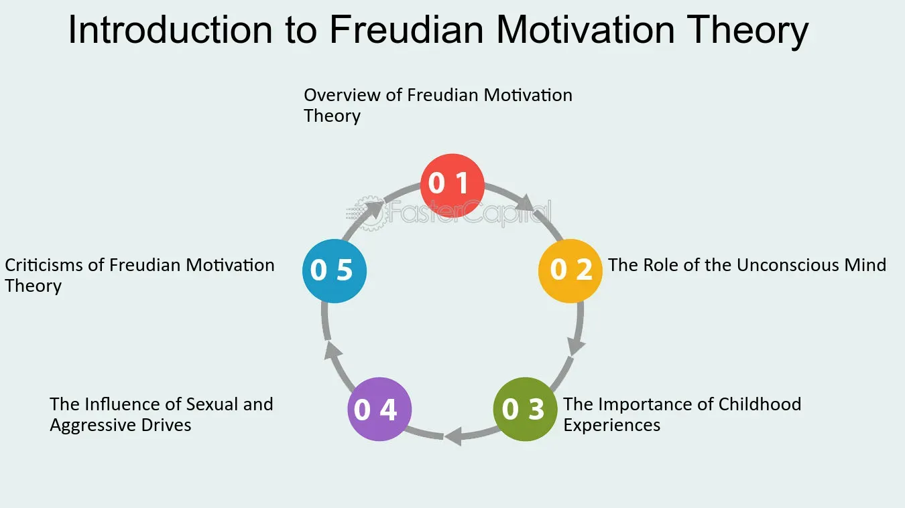

## Table of Contents

## What is Freudian Motivation Theory?

Freudian Motivation Theory is a concept developed by Sigmund Freud, a famous psychologist. It says that people's actions are driven by unconscious desires and thoughts. Freud believed that our minds have three parts: the conscious, the preconscious, and the unconscious. The unconscious part holds our hidden wishes and fears, which can influence what we do without us realizing it.

According to Freud, these unconscious desires often come from our childhood experiences. He thought that our early life shapes our motivations and behaviors as adults. For example, if someone had a tough childhood, it might affect how they act later in life. Freud's theory suggests that understanding these hidden motivations can help explain why people behave the way they do.

## Who was Sigmund Freud and what was his contribution to psychology?

Sigmund Freud was a famous doctor and thinker who lived a long time ago. He is known as the father of psychoanalysis, which is a way to help people understand their minds and feelings. Freud was born in Austria in 1856 and spent a lot of his life studying the human mind. He believed that our thoughts and actions are influenced by things we are not always aware of, which he called the unconscious mind.

Freud's big contribution to psychology was his idea that our unconscious thoughts and feelings shape who we are. He thought that many of our problems come from hidden wishes and fears that we have since we were kids. To help people, Freud created a method called psychoanalysis, where people talk about their dreams and feelings to uncover these hidden thoughts. His ideas changed the way people think about the mind and led to new ways of helping people with mental health issues.

Freud's work also introduced important concepts like the id, ego, and superego, which are parts of our mind that work together and sometimes clash. The id wants instant satisfaction, the ego tries to balance our needs with reality, and the superego acts like our conscience. These ideas helped people understand why we sometimes struggle with our choices and behaviors. Even though some of Freud's ideas are debated today, his work laid the foundation for modern psychology and therapy.

## How does Freudian Motivation Theory explain human behavior?

Freudian Motivation Theory says that what people do is often driven by feelings and wishes they don't even know they have. Sigmund Freud believed that our minds have three parts: the conscious, which is what we're aware of; the preconscious, which is stuff we can bring to mind if we try; and the unconscious, which holds our hidden thoughts and desires. According to Freud, it's the unconscious part that really drives our behavior. For example, if someone is always late, it might be because they have a hidden fear of being on time or a wish to be noticed.

Freud thought that these unconscious desires come from our childhood. He believed that what happens to us when we're young can shape how we act when we grow up. If someone had a hard time as a kid, it might affect how they behave as an adult. By understanding these hidden motivations, Freud said we can better understand why people do what they do. So, if someone knows about their unconscious fears or wishes, they might be able to change their behavior or feel better about themselves.

## What are the main components of Freud's psychoanalytic theory?

Freud's psychoanalytic theory has three main parts: the id, the ego, and the superego. The id is like the wild part of our mind. It wants what it wants right away and doesn't care about rules or what others think. Imagine a little kid who sees a toy and grabs it without thinking. That's the id. The ego is the part that tries to balance what the id wants with what's actually possible in the real world. It's like a middle person that helps us get what we need without causing too much trouble. The superego is like our inner voice that tells us what's right and wrong. It's the part that makes us feel guilty if we do something bad and proud if we do something good.

Another key idea in Freud's theory is the unconscious mind. Freud believed that a lot of our thoughts and feelings are hidden deep in our minds, and we're not even aware of them. These hidden thoughts can affect how we act without us knowing it. For example, if someone is scared of dogs because they were bitten as a kid, that fear might be in their unconscious mind and make them nervous around dogs even if they don't remember the bite. Freud thought that talking about dreams and feelings in therapy could help bring these hidden thoughts to the surface and help people understand themselves better.

Freud also talked about psychosexual stages of development. He believed that as kids grow up, they go through different stages where they focus on different parts of their bodies. For example, in the oral stage, babies are all about their mouths because they're eating and sucking on things. If something goes wrong during these stages, Freud thought it could cause problems later in life. Understanding these stages can help explain why people might have certain habits or behaviors as adults.

## How can Freudian Motivation Theory be applied to understand investor behavior?

Freudian Motivation Theory can help us understand why investors make the choices they do by looking at their unconscious desires and fears. For example, an investor might keep buying a certain stock even when it's not doing well because they have an unconscious wish to prove they're right. This could be because they felt ignored or underestimated when they were young, and now they want to show everyone they can make good decisions. By understanding these hidden motivations, we can see that their investment choices might not just be about money, but also about proving something to themselves or others.

Another way Freudian Motivation Theory applies to investor behavior is through the fear of loss. Some investors might sell their stocks too quickly because they have an unconscious fear of losing everything, which could come from a childhood experience of feeling insecure or unsafe. This fear can make them act in ways that seem irrational, like selling stocks at the first sign of trouble. By recognizing these unconscious fears, investors can work on managing their emotions better and making more thoughtful decisions about their investments.

## What role do unconscious motives play in investment decisions according to Freudian theory?

According to Freudian Motivation Theory, unconscious motives play a big role in the investment decisions people make. These motives are feelings and wishes that we are not aware of, but they still affect what we do. For example, an investor might keep buying a stock even when it's not doing well because they have an unconscious need to prove they're right. This could be because they felt ignored or underestimated when they were young, and now they want to show everyone they can make good decisions. So, their investment choices might not just be about making money, but also about proving something to themselves or others.

Another way unconscious motives influence investment decisions is through the fear of loss. Some investors might sell their stocks too quickly because they have an unconscious fear of losing everything. This fear could come from a childhood experience of feeling insecure or unsafe. As a result, they might act in ways that seem irrational, like selling stocks at the first sign of trouble. By understanding these unconscious fears, investors can work on managing their emotions better and making more thoughtful decisions about their investments.

## Can you explain the concept of the 'id', 'ego', and 'superego' in the context of investing?

In the world of investing, the 'id' is like the part of you that wants to make money fast and doesn't care about the risks. It's the part that might make you buy a stock just because you heard it's going to go up, without doing any research. The id is all about instant satisfaction and can lead to impulsive decisions, like chasing after the latest hot investment without thinking about the long-term consequences.

The 'ego' in investing is the part that tries to balance what the id wants with what's actually possible. It's like the voice that says, "Let's think this through before we jump in." The ego helps you make more rational choices by considering the risks and rewards. For example, it might stop you from putting all your money into one stock and encourage you to diversify your investments to protect against big losses.

The 'superego' is like your inner moral compass in investing. It's the part that might make you feel guilty if you make a risky investment that could hurt others, like buying stocks in a company that's not good for the environment. The superego pushes you to make ethical choices and follow the rules, even if it means missing out on some quick profits. It's the part that helps you sleep at night knowing you've made responsible and ethical investment decisions.

## How might defense mechanisms influence an investor's decision-making process?

Defense mechanisms can affect an investor's decisions by making them ignore or twist the truth about their investments. For example, if an investor uses denial, they might refuse to believe that a stock they bought is losing value. They keep thinking it will go back up, even when all signs say it won't. This can lead to holding onto bad investments for too long because they can't face the loss. Another common defense mechanism is rationalization, where an investor makes up reasons to justify a bad decision. They might say, "I bought this stock because it's a good long-term investment," even if they really bought it on a whim.

These defense mechanisms can also make investors act in ways that seem strange to others. For example, if an investor uses projection, they might blame the market or their advisor for their losses instead of taking responsibility for their choices. This can stop them from learning from their mistakes and improving their strategies. By understanding these defense mechanisms, investors can start to see when they're using them and work on making better, more honest decisions. This can lead to smarter investing and less emotional stress.

## What are some examples of how Freudian concepts manifest in financial markets?

In financial markets, Freudian concepts like the id, ego, and superego can show up in how people make investment choices. The id is like the part of an investor that wants to make money fast and might push them to buy stocks without thinking about the risks. This can lead to impulsive decisions, like jumping on the latest hot investment trend without doing any research. The ego tries to balance these quick desires with what's actually possible. It's the part that might stop an investor from putting all their money into one stock and instead encourages them to spread their investments to lower the risk. The superego acts like a moral guide, making investors feel guilty if they make risky or unethical choices, like buying stocks in companies that harm the environment. It pushes them to make responsible and ethical decisions, even if it means missing out on quick profits.

Defense mechanisms also play a big role in how investors behave in the financial markets. For example, an investor might use denial to ignore the fact that a stock they bought is losing value. They keep hoping it will go back up, even when all signs say it won't. This can lead to holding onto bad investments for too long because they can't face the loss. Another defense mechanism is rationalization, where an investor makes up reasons to justify a bad decision. They might say, "I bought this stock because it's a good long-term investment," even if they really bought it on a whim. These defense mechanisms can make investors act in ways that seem strange to others, like blaming the market or their advisor for their losses instead of taking responsibility for their choices. By understanding these defense mechanisms, investors can start to see when they're using them and work on making better, more honest decisions.

## How has Freudian Motivation Theory been critiqued or supported in the field of behavioral finance?

Freudian Motivation Theory has been both critiqued and supported in the field of behavioral finance. Critics argue that Freud's ideas are too hard to test and measure scientifically. They say that talking about unconscious motives and defense mechanisms is too vague and can't be proven in a lab. Some also think that Freud's focus on childhood experiences might not explain all of an investor's choices. They believe that other factors, like current market conditions or financial education, might be more important in understanding why people make the investment decisions they do.

On the other hand, supporters of Freudian Motivation Theory in behavioral finance believe it can help explain why investors sometimes act in ways that seem irrational. They point out that understanding unconscious motives can show why some investors hold onto losing stocks or make risky investments. For example, an investor might keep buying a stock to prove they're right, even if it's not a good choice. By recognizing these hidden feelings, investors can work on managing their emotions better and making more thoughtful decisions about their investments. While not everyone agrees with Freud's ideas, they have added to the conversation about what drives investor behavior.

## What are the limitations of applying Freudian Motivation Theory to investor behavior?

Applying Freudian Motivation Theory to investor behavior has some big limitations. One big problem is that Freud's ideas are hard to test and measure in a scientific way. When we talk about unconscious motives and defense mechanisms, it's all pretty vague. It's tough to prove these things in a lab or with data. Also, Freud focused a lot on childhood experiences, but that might not explain everything about why investors make the choices they do. Things like current market conditions or how much an investor knows about finance might be just as important, if not more.

Another limitation is that Freudian Motivation Theory might not work for everyone. Not all investors have the same unconscious desires or fears. What drives one person might not be the same for someone else. Plus, using Freud's ideas can make things too complicated. It's easy to come up with all sorts of reasons for why someone made a certain investment choice, but that doesn't always help them make better decisions in the future. While Freud's ideas can help explain some odd behavior, they don't give clear steps on how to fix it or make smarter choices.

## How can investors use an understanding of Freudian Motivation Theory to improve their investment strategies?

Investors can use Freudian Motivation Theory to improve their investment strategies by understanding their unconscious desires and fears. For example, if an investor notices they keep buying stocks to prove they're right, even when it's not a good choice, they can start to question their motives. By recognizing this, they can stop and think before making a decision. Instead of chasing after a stock just to prove a point, they can look at the facts and make a more rational choice. This can help them avoid risky investments and focus on what's best for their financial goals.

Another way investors can use Freudian Motivation Theory is by managing their emotions better. If they understand that fear of loss might be making them sell stocks too quickly, they can work on calming down and looking at the bigger picture. Maybe they can remind themselves that it's normal for stock prices to go up and down, and it's not always a reason to panic. By being aware of these unconscious fears, investors can make more thoughtful decisions and stick to their long-term plans. This can lead to better outcomes and less stress when it comes to investing.

## References & Further Reading

[1]: Freud, S. (1915). The Unconscious. In J. Strachey (Ed.), The Standard Edition of the Complete Psychological Works of Sigmund Freud (Vol. 14). Hogarth Press.

[2]: Shefrin, H. (2002). Beyond Greed and Fear: Understanding Behavioral Finance and the Psychology of Investing. Oxford University Press.

[3]: Lo, A. W. (2005). Reconciling Efficient Markets with Behavioral Finance: The Adaptive Markets Hypothesis. Journal of Investment Consulting, 7(2), 21-44.

[4]: Jansen, S. (2020). Machine Learning for Algorithmic Trading: Predictive models to extract signals from market and alternative data for systematic trading strategies with Python. Packt Publishing.

[5]: Chan, E. P. (2009). Quantitative Trading: How to Build Your Own Algorithmic Trading Business. Wiley Trading Series.

[6]: Aronson, D. R. (2007). Evidence-Based Technical Analysis: Applying the Scientific Method and Statistical Inference to Trading Signals. Wiley.

[7]: Lopez de Prado, M. (2018). Advances in Financial Machine Learning. Wiley.