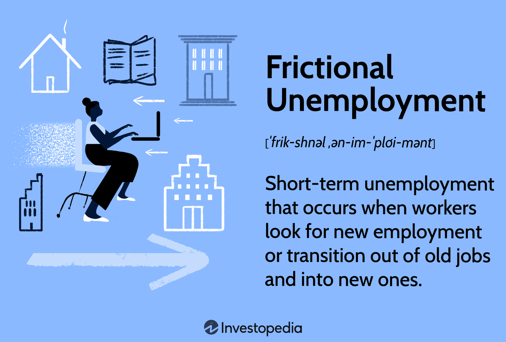

## Table of Contents

## What is frictional unemployment?

Frictional unemployment is when people are temporarily out of work while they look for a new job. It happens because it takes time to find a job that matches a person's skills and preferences. For example, someone might quit their job to move to a new city and needs time to find a new job there.

This type of unemployment is normal in a healthy economy. It shows that people are confident enough to leave their jobs to find better ones. It's not a sign of economic trouble, but rather a sign that the job market is active and people are moving around to find the best fit for themselves.

## What are the main causes of frictional unemployment?

Frictional unemployment happens because it takes time for people to find new jobs. When someone quits their job or gets laid off, they need time to search for a new one. This search can take weeks or even months. People might be looking for a job that matches their skills or one that is in a different city. During this time, they are considered frictionally unemployed.

Another reason for frictional unemployment is when new graduates enter the job market. They finish school and start looking for their first job. It can take a while for them to find the right job because they are new to the workforce and need to figure out what they want to do. This adds to the number of people who are frictionally unemployed.

Sometimes, people leave their jobs because they want to try something new or because they are not happy with their current job. They might take a break to travel or to think about what they really want to do next. This choice to leave a job and look for a new one also causes frictional unemployment. It shows that people are willing to take risks to find a better fit for themselves in the job market.

## How does the job search process contribute to frictional unemployment?

The job search process is a big reason for frictional unemployment. When someone loses their job or decides to leave it, they need time to find a new one. This time can be weeks or even months. During this period, they are not working, which means they are frictionally unemployed. People look for jobs that match their skills and what they want to do. Sometimes, they might want to move to a new city or change careers, which takes even more time.

New graduates also add to frictional unemployment because they are just starting to look for jobs. They finish school and need to find their first job, which can take a while. They might not know exactly what they want to do yet, so they spend time figuring that out. This search for the right job means they are not working right away, adding to the number of people who are frictionally unemployed. 

In short, the job search process causes frictional unemployment because it takes time for people to find the right job. Whether someone is changing jobs, moving, or just starting out, the time spent looking for work means they are not employed during that period. This is a normal part of a healthy economy where people are free to find the best job for them.

## What role does labor market information play in frictional unemployment?

Labor market information helps people understand what jobs are available and what skills they need for those jobs. When people know more about the job market, they can make better choices about where to look for work. For example, if someone knows that there are a lot of jobs in a certain city, they might move there to find work. But if they don't have good information, they might spend a long time looking for a job in the wrong place. This can make frictional unemployment last longer because people are not finding jobs quickly.

Good labor market information can also help people find jobs that match their skills faster. If someone knows what skills are in demand, they can focus their job search on those areas. This can reduce the time they spend looking for work, which means less frictional unemployment. On the other hand, if people don't have this information, they might apply for jobs they are not qualified for, which can lead to more time out of work. So, having good labor market information is important for reducing frictional unemployment.

## How does geographical mobility affect frictional unemployment?

Geographical mobility means how easily people can move from one place to another to find work. When people can move easily, it can help reduce frictional unemployment. If someone loses their job or wants to find a better one, they can move to a place where there are more job opportunities. This means they might find a new job faster and not be out of work for as long.

However, if it's hard for people to move, frictional unemployment can last longer. Moving can be expensive and difficult, especially if someone has a family or owns a home. If people can't move to where the jobs are, they might have to stay where they are and spend more time looking for work. This makes frictional unemployment higher because people are stuck in places with fewer job options.

## What is the impact of seasonal employment on frictional unemployment?

Seasonal employment can make frictional unemployment go up and down throughout the year. Jobs like working at a ski resort or selling ice cream at a beach stand only happen at certain times. When these jobs end, the people who were working them need to find new jobs. This can take some time, so they might be out of work for a while, which adds to frictional unemployment. For example, someone who works at a summer camp will need to look for a new job when the camp closes for the season.

On the other hand, when seasonal jobs start up again, they can help lower frictional unemployment. People who were out of work during the off-season can go back to their seasonal jobs. This means they don't have to keep looking for work, so they are not counted as frictionally unemployed anymore. For instance, when ski resorts open for the winter, many people who were looking for work in the fall can find jobs again. So, seasonal employment can make frictional unemployment change a lot depending on the time of year.

## How do changes in technology influence frictional unemployment?

Changes in technology can make frictional unemployment go up because new technology can change the kinds of jobs that are available. When new technology comes out, some jobs might not be needed anymore, and people who used to do those jobs have to look for new ones. This can take time, so they might be out of work for a while. For example, if a company starts using robots to do a job that people used to do, those people need to find new jobs that match their skills. This search for new work adds to frictional unemployment.

On the other hand, technology can also help lower frictional unemployment. With the internet and job search websites, it's easier for people to find out about job openings and apply for them. This can make the job search faster, so people don't have to be out of work for as long. For instance, someone can use a job search app to find and apply for jobs from their phone, which can help them find a new job more quickly. So, while technology can cause some people to lose their jobs and need to look for new ones, it can also make the job search easier and faster.

## What is the quit rate and how is it related to frictional unemployment?

The quit rate is the number of people who leave their jobs voluntarily, usually to find a better job. It's a way to measure how many people are choosing to leave their current jobs. When the quit rate is high, it means a lot of people are confident about finding new jobs, so they are willing to leave their old ones.

The quit rate is closely related to frictional unemployment. When people quit their jobs, they need time to find new ones. This time spent looking for a new job is what causes frictional unemployment. So, a high quit rate can lead to more frictional unemployment because more people are out of work while they search for new jobs. But this kind of unemployment is normal and shows that the job market is active and people are trying to find better opportunities.

## How can government policies affect the quit rate and frictional unemployment?

Government policies can change the quit rate and frictional unemployment in different ways. If the government makes it easier for people to find new jobs, like by giving them better job search tools or training programs, more people might feel okay about quitting their jobs. They know they can find a new job quickly, so the quit rate goes up. This can make frictional unemployment go up too, because more people are out of work while they look for new jobs. But this is not a bad thing. It means the job market is healthy and people are moving around to find better jobs.

On the other hand, if the government makes it harder for people to quit their jobs, like by making unemployment benefits less good or making it harder to get them, the quit rate might go down. People might stay in their jobs even if they are not happy because they are worried about not finding a new job quickly. This can make frictional unemployment go down because fewer people are out of work looking for new jobs. But it can also mean that people are stuck in jobs they don't like, which is not good for them or the economy. So, government policies can have a big effect on how many people quit their jobs and how much frictional unemployment there is.

## What are the economic implications of a high quit rate on frictional unemployment?

A high quit rate means more people are leaving their jobs to look for new ones. This can make frictional unemployment go up because when people quit, they need time to find a new job. More people out of work and looking for jobs means more frictional unemployment. But this is not always bad. It shows that people feel good about the job market and think they can find a better job. A high quit rate can mean the economy is doing well because people are confident and moving around to find the best jobs for them.

However, a high quit rate can also put pressure on businesses. When a lot of people quit, companies might have a hard time finding new workers to fill the empty jobs. This can slow down their work and make it harder for them to grow. If too many people are quitting and looking for new jobs at the same time, it can also make the job market very competitive. This might make it take longer for people to find new jobs, which can keep frictional unemployment high for a while. So, while a high quit rate can be a sign of a strong economy, it can also create some challenges for businesses and the job market.

## How do demographic factors influence the quit rate and frictional unemployment?

Demographic factors like age, education, and family situation can change how many people quit their jobs and how much frictional unemployment there is. Younger people might quit their jobs more often because they are still figuring out what they want to do. They might be more willing to take risks and try new jobs. Older workers might stay in their jobs longer because they have more to lose if they can't find a new job quickly. Education also matters. People with more education might quit their jobs more because they think they can find better jobs. But people with less education might stay in their jobs because they worry about not finding a new one.

Family situation can also affect the quit rate and frictional unemployment. People with families might be less likely to quit their jobs because they need to make sure they can support their family. They might not want to take the risk of being out of work while they look for a new job. Single people or people without kids might be more willing to quit because they don't have as much to worry about. So, different groups of people might quit their jobs at different rates, which can change how much frictional unemployment there is in the economy.

## What advanced statistical models are used to analyze the relationship between quit rate and frictional unemployment?

Advanced statistical models like regression analysis and time series analysis are used to understand how the quit rate affects frictional unemployment. Regression analysis helps researchers see how changes in the quit rate can lead to changes in frictional unemployment. They can put in data about how many people are quitting their jobs and see how it connects to how many people are out of work and looking for new jobs. This model can show if a high quit rate makes frictional unemployment go up or down.

Time series analysis is another tool that looks at how the quit rate and frictional unemployment change over time. It can show patterns and trends, like if the quit rate goes up in certain months or years, and how that affects frictional unemployment. By looking at data over time, researchers can predict what might happen in the future and understand how these two things are related. Both of these models help economists and policymakers make better decisions about the job market.

## References & Further Reading

[1]: "Understanding the Relationship Between Employment Trends and Economic Health" by Robert Button, published in Journal of Economic Perspectives.

[2]: ["Advances in Financial Machine Learning"](https://www.amazon.com/Advances-Financial-Machine-Learning-Marcos/dp/1119482089) by Marcos Lopez de Prado.

[3]: ["Quantitative Trading: How to Build Your Own Algorithmic Trading Business"](https://www.amazon.com/Quantitative-Trading-Build-Algorithmic-Business/dp/1119800064) by Ernest P. Chan.

[4]: "Algorithmic Trading and Frictional Unemployment: A Critical Analysis" by Sophia Laskaris, published in Finance and Economic Review.

[5]: ["The Work of Nations: Preparing Ourselves for 21st Century Capitalism"](https://www.amazon.com/Work-Nations-Preparing-Ourselves-Capitalism/dp/0679736158) by Robert Reich. 

[6]: ["Evidence-Based Technical Analysis: Applying the Scientific Method and Statistical Inference to Trading Signals"](https://www.amazon.com/Evidence-Based-Technical-Analysis-Scientific-Statistical/dp/0470008741) by David Aronson.