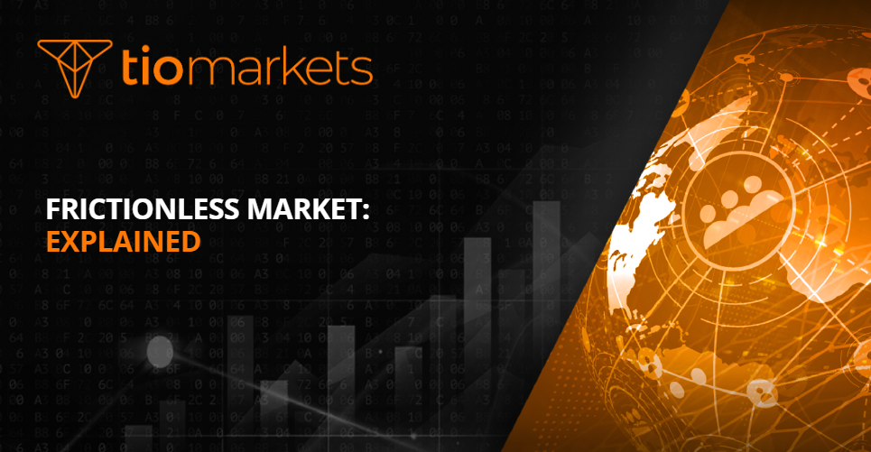

## Table of Contents

## What is a frictionless market?

A frictionless market is a type of market where it's very easy for buyers and sellers to do business with each other. There are no big obstacles or difficulties that get in the way of making a deal. Imagine you want to buy something online. In a frictionless market, you can find what you want quickly, pay for it easily, and get it delivered without any trouble.

In real life, things like complicated rules, high costs, or slow processes can make markets less smooth. A frictionless market tries to remove these problems. This makes it easier for more people to trade and can help the economy grow. While no market is perfectly frictionless, technology and better ways of doing things are helping to make markets smoother and more efficient.

## How does a frictionless market differ from traditional markets?

In a frictionless market, buying and selling things is much easier compared to traditional markets. In traditional markets, you might have to go to a store, wait in line, or deal with complicated paperwork. There might also be extra costs like fees or taxes that make things more expensive. A frictionless market cuts out these problems by using technology to make everything simpler and faster. You can buy things with just a few clicks on your computer or phone, and the whole process is smooth and easy.

Traditional markets often have a lot of steps and rules that can slow things down. For example, if you want to buy a car, you might need to go to a dealership, negotiate a price, and then deal with financing and paperwork. This can take a lot of time and effort. On the other hand, a frictionless market uses things like online platforms and digital payments to make everything quicker and easier. You can compare prices, make a purchase, and even get the product delivered to your door without leaving your home. This makes the whole experience much more convenient and efficient.

## What are the key characteristics of a frictionless market?

A frictionless market is all about making buying and selling as easy as possible. It uses technology to remove the things that can make trading hard. In a frictionless market, you can find what you want quickly, pay for it easily, and get it delivered without any trouble. There are no big obstacles or extra costs that get in the way. This makes it simple for people to do business with each other.

In a frictionless market, everything is designed to be fast and smooth. You don't have to wait in line, deal with complicated paperwork, or go through slow processes. Instead, you can use online platforms and digital payments to make everything happen with just a few clicks. This not only saves time but also makes trading more efficient. By removing these hurdles, a frictionless market helps more people to buy and sell, which can help the economy grow.

## What technologies enable the creation of frictionless markets?

Technology plays a big role in making markets frictionless. One key technology is the internet, which lets people buy and sell things from anywhere. Online platforms like Amazon and eBay make it easy to find products, compare prices, and complete purchases without leaving home. These platforms use search algorithms to help you find what you're looking for quickly. They also use digital payment systems like PayPal or credit cards, so you can pay without cash or checks.

Another important technology is mobile devices, like smartphones and tablets. These devices let you shop and do business on the go. Apps make it even easier to buy things with just a few taps on your screen. Delivery services and tracking systems also help make markets frictionless. They use technology to get products to you fast and let you know exactly where your order is at any time. All these technologies work together to make buying and selling smoother and more efficient.

## Can you provide examples of frictionless markets in operation today?

One good example of a frictionless market today is Amazon. Amazon makes it super easy for people to buy things. You can search for anything you want on their website, compare prices, and read reviews from other buyers. Once you decide what to buy, you can pay with a credit card or through services like Amazon Pay. Amazon then delivers your purchase right to your door, often in just a day or two. They even have a service called Amazon Prime, which makes delivery even faster and gives you other benefits like streaming movies and music.

Another example is the stock trading app, Robinhood. Robinhood makes it simple for people to buy and sell stocks without any fees. You can download the app on your phone, set up an account, and start trading in minutes. The app shows you real-time stock prices and lets you buy or sell with just a few taps. Robinhood also has features like fractional shares, so you can invest in expensive stocks with just a little money. This makes investing in the stock market much easier and more accessible for everyone.

## What are the benefits of frictionless markets for consumers?

Frictionless markets make life easier for consumers. They can find what they want quickly and buy it without any hassle. There's no need to go to a store or wait in line. Everything can be done online with just a few clicks. This saves time and makes shopping more convenient. Plus, because it's easier to compare prices, consumers can often find better deals and save money.

Another big benefit is that frictionless markets give consumers more choices. With online platforms, you can buy things from all over the world, not just from local stores. This means you have access to a wider range of products. Also, because the buying process is so smooth, it's easier to try new things without worrying about complicated returns or long waits. Overall, frictionless markets make shopping simpler, faster, and more enjoyable for consumers.

## What challenges do businesses face in transitioning to a frictionless market model?

Moving to a frictionless market model can be tough for businesses. They need to spend money on new technology like online platforms and digital payment systems. This can be expensive, especially for small businesses that might not have a lot of money to spend. They also need to train their workers to use these new tools, which takes time and more money. Plus, they have to make sure their website or app works well and is easy to use, or else customers might get frustrated and go somewhere else.

Another challenge is keeping customers' information safe. When everything is online, there's a bigger risk of data being stolen or hacked. Businesses need to put strong security measures in place to protect their customers. They also have to follow lots of rules about how they handle data, which can be complicated. On top of all this, they need to find ways to stand out from other businesses in the online world, where there's a lot of competition. It's a big change, but if they can do it right, it can help them reach more customers and grow their business.

## How do frictionless markets impact pricing strategies?

Frictionless markets change how businesses set their prices. Because it's easy for customers to compare prices online, businesses have to be more careful about how much they charge. If their prices are too high, customers can quickly find a cheaper option somewhere else. This means businesses often have to lower their prices to stay competitive. They might also use special deals or discounts to attract customers and make their products seem like a better value.

Another way frictionless markets affect pricing is by making it easier for businesses to change their prices. With online platforms, businesses can update their prices in real-time based on things like demand or what their competitors are doing. This can help them make more money by charging more when demand is high and less when it's low. But it also means they have to keep a close eye on the market and be ready to adjust their prices quickly to stay ahead.

## What role does data analytics play in optimizing frictionless markets?

Data analytics is really important for making frictionless markets work better. It helps businesses understand what customers want and how they shop. By looking at data, businesses can see which products are popular, when people are most likely to buy, and what prices they're willing to pay. This information helps them make smart choices about what to sell, how to price it, and how to make the shopping experience easier and more enjoyable for customers.

Using data analytics also helps businesses make their online platforms better. They can see where customers might be having trouble and fix it. For example, if a lot of people are leaving the website without buying anything, data can show why this is happening. Maybe the checkout process is too hard, or the website is slow. By fixing these problems, businesses can make shopping smoother and keep more customers happy. This makes the whole market more frictionless and helps businesses grow.

## How do regulatory frameworks adapt to the rise of frictionless markets?

As frictionless markets grow, governments and regulators need to change their rules to keep up. They have to make sure that these new ways of buying and selling are fair and safe for everyone. This means setting rules about how businesses can use customer data, making sure online payments are secure, and stopping companies from doing things that might hurt customers. Regulators also need to watch out for new problems that come up in frictionless markets, like fake reviews or scams, and find ways to stop them.

One big challenge is making sure that the rules work well across different countries. Since frictionless markets often let people buy things from all over the world, the rules need to be clear and easy to follow no matter where you are. This can be hard because different places have different laws. But by working together, regulators can create rules that help keep frictionless markets safe and fair for everyone.

## What are the potential risks and ethical considerations in frictionless markets?

Frictionless markets can bring some risks and ethical problems. One big risk is that they can make it easier for people to lose their privacy. When everything is done online, businesses collect a lot of data about what people buy and how they shop. This data can be used to make shopping better, but it can also be used in ways that people might not like. For example, companies might use this data to show people different prices based on what they think they can afford. This can be unfair and make some people pay more than others.

Another ethical issue is that frictionless markets can make it harder for small businesses to compete. Big companies with a lot of money can spend more on technology and marketing, which can make it tough for smaller shops to keep up. This can lead to less choice for customers and might hurt local economies. Also, because everything happens so fast in frictionless markets, there's a bigger chance of scams and fake products. People need to be careful and know how to spot these problems to stay safe.

## What future developments can we expect in the evolution of frictionless markets?

In the future, frictionless markets will keep getting better and easier to use. Technology like [artificial intelligence](/wiki/ai-artificial-intelligence) (AI) and [machine learning](/wiki/machine-learning) will help make shopping even smoother. AI can learn what you like and suggest things you might want to buy. It can also help businesses understand what customers want and make their websites and apps work better. Another big change will be more use of things like voice shopping, where you can buy things just by talking to your phone or a smart speaker. This will make shopping even faster and more convenient.

There will also be more focus on making sure frictionless markets are fair and safe. Governments will make new rules to protect people's privacy and stop companies from doing things that might hurt customers. They will also work to make sure small businesses can compete with big ones. As technology keeps getting better, we might see new ways of paying for things, like using cryptocurrencies or other digital money. All these changes will make frictionless markets even more efficient and enjoyable for everyone.

## References & Further Reading

[1]: ["The Economics of Financial Markets"](https://academic.oup.com/book/4127) by Roy E. Bailey

[2]: ["Algorithmic Trading: Winning Strategies and Their Rationale"](https://www.wiley.com/en-us/Algorithmic+Trading%3A+Winning+Strategies+and+Their+Rationale-p-9781118746912) by Ernest P. Chan

[3]: Black, F., & Scholes, M. (1973). ["The Pricing of Options and Corporate Liabilities."](https://www.cs.princeton.edu/courses/archive/fall09/cos323/papers/black_scholes73.pdf) Journal of Political Economy, 81(3), 637-654.

[4]: Hasbrouck, J. (2003). ["Intraday Price Formation in U.S. Equity Markets."](https://onlinelibrary.wiley.com/doi/10.1046/j.1540-6261.2003.00609.x) The Review of Financial Studies, 16(4), 1041-1071.

[5]: Hendershott, T., Jones, C. M., & Menkveld, A. J. (2011). ["Does Algorithmic Trading Improve Liquidity?"](https://onlinelibrary.wiley.com/doi/full/10.1111/j.1540-6261.2010.01624.x) The Journal of Finance, 66(1), 1-33.

[6]: ["High-Frequency Trading: A Practical Guide to Algorithmic Strategies and Trading Systems"](https://www.amazon.com/High-Frequency-Trading-Practical-Algorithmic-Strategies/dp/1118343506) by Irene Aldridge

[7]: Wooldridge, J.M. (2010). ["Econometric Analysis of Cross Section and Panel Data."](https://ipcig.org/evaluation/apoio/Wooldridge%20-%20Cross-section%20and%20Panel%20Data.pdf) MIT Press.