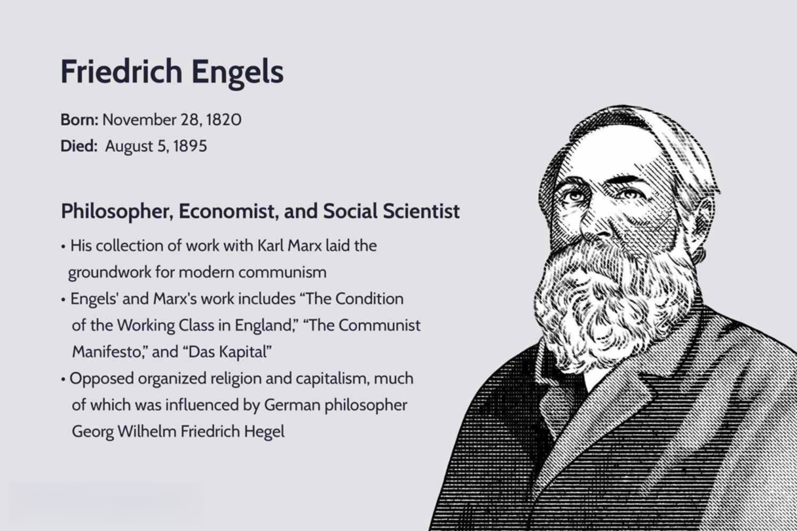

Communism, a socio-economic ideology, is rooted in the philosophical and economic theories posited by Karl Marx and Friedrich Engels. Central to Marxist theory is the critique of capitalism, which Marx and Engels viewed as a system that exploits labor for profit, leading to inherent class struggles between the bourgeoisie, who own the means of production, and the proletariat, who sell their labor. These ideas are encapsulated in seminal texts like "The Communist Manifesto," co-authored by Marx and Engels, and "Das Kapital," which Engels meticulously edited and published posthumously. Engels, through his critical work, contributed significantly to articulating a vision of a classless society where the means of production are communally owned, thus abolishing private property and addressing social inequities.

In the contemporary landscape of economics, algorithmic trading has emerged as a transformative practice within financial markets. This method employs complex algorithms to execute trades at speeds and frequencies beyond human capabilities, thereby enhancing market efficiency and liquidity. Algorithmic trading, often utilized by hedge funds and institutional investors, underscores significant shifts in financial strategies and market dynamics. It represents a stark contrast to the traditional economic theories put forth by Marx and Engels, characterized by manual labor and industrial production.

The intersection of these historical and modern concepts invites an exploration of how algorithmic trading interacts with the foundational principles of Marxist theory. Analyzing this interaction is crucial not only for understanding potential ideological conflicts but also for assessing how economic systems might evolve to accommodate or resist such advancements. The goal is to offer insights into whether contemporary financial practices can coexist with or are antithetical to the ideals of communism, thereby prompting economists, technologists, and policymakers to consider how to balance technological innovation with economic equity and social justice.

## Table of Contents

## Understanding Marxist Theory and Friedrich Engels

Karl Marx and Friedrich Engels are seminal figures in the development of communist ideology and socialist theory, forming the intellectual foundation upon which these socio-economic systems are built. Their collaboration resulted in works that have influenced political movements and economic thought globally.

Karl Marx was born in 1818 in Trier, Prussia, and engaged in studying law, history, and philosophy at various universities. Friedrich Engels, five years younger, hailed from Barmen, present-day Wuppertal, Germany, where he was born in 1820. Engels' background in a wealthy capitalist family and work experience in his family's textile business in Manchester profoundly shaped his perspectives on economic disparity and industrial capitalist society.

Together, Marx and Engels authored key texts of communist doctrine, notably "The Communist Manifesto" (1848) and "Das Kapital," the latter of which was completed posthumously by Engels after Marx's death in 1883. "The Communist Manifesto" is a political pamphlet that lays out the principles of Marxism, advocating for the proletariat, or working class, to rise against the bourgeoisie, or capitalist class. It articulated the theory of historical materialism, which posits that material conditions, specifically the mode of production, fundamentally shape society and historical development.

The labor theory of value, central to Marxist economics, was further elaborated in "Das Kapital." This theory asserts that the value of a commodity is determined by the socially necessary labor time invested in its production. Marx critiqued capitalism by highlighting how capitalists appropriate surplus value from the labor of workers, leading to systemic exploitation and class struggle. The formula for surplus value $S = V - C$ captures this concept, where $S$ represents surplus value, $V$ is the value created by labor, and $C$ is the cost of labor.

Engels played a crucial role in co-authoring "The Communist Manifesto" and was instrumental in shaping the direction of Marxist theory through his editorial work on "Das Kapital." After Marx's death, Engels ensured that the second and third volumes of "Das Kapital" were published, meticulously compiling Marx's notes and drafts. Engels' ability to translate complex theories into more accessible language was crucial in disseminating Marxist thought to a broader audience.

Engels' contributions extended beyond these editorial efforts, as he also wrote significant works independently, such as "The Condition of the Working Class in England," which provided a detailed account of the dire living conditions of workers in industrialized cities. His insights into the socioeconomic problems of his time laid the groundwork for later critiques of capitalist structures.

In summary, Marx and Engels' contributions to communist theory hinge on their analysis of class struggle and the labor theory of value. Engels' roles as a co-author, editor, and independent thinker were pivotal in the articulation and dissemination of Marxist ideas. Their works remain foundational to understanding the dynamics of class and economic systems in historical and contemporary contexts.

## Core Principles of Communism

Communism, as defined by Karl Marx and Friedrich Engels, envisions a society structured without class distinctions, where the means of production are owned communally, and private property ceases to exist. Marx and Engels argued that the historical development of societies is primarily driven by class struggle, a conflict between those who own the means of production—the bourgeoisie—and the working class, or proletariat, who sell their labor for wages. Communism aims to resolve this conflict by abolishing private ownership, thus eliminating the conditions that create class divisions.

The concept of a classless society is central to communism. This vision seeks to eliminate hierarchies that arise from economic disparities, leading to a society where wealth and power are distributed equitably. Under this system, resources and production are owned collectively by the people, ensuring that everyone has access to the basic necessities of life.

One of the fundamental principles in Marxist theory is the abolition of private property, which Marx and Engels saw as the root cause of alienation and exploitation under capitalism. They advocated for a transition from private to communal ownership, where the means of production, such as land, factories, and machinery, are owned and managed by the community for the benefit of all its members. This communal ownership is intended to dismantle the capitalist structure, which they argue leads to the concentration of wealth and power in the hands of a few.

Historically, communist movements inspired by Marxist theory have sought to implement these principles through revolutionary means. The Bolshevik Revolution in Russia (1917) led to the establishment of the Soviet Union, which claimed to implement Marxian ideals by centralizing control over production and striving for a classless society. Similarly, the Chinese Revolution (1949) established the People's Republic of China under communist ideology, rapidly transforming its socio-economic structures.

However, the impacts of such movements have been varied, often resulting in state-controlled economies rather than the pure communal ownership envisioned by Marx and Engels. While they have achieved some level of redistribution of wealth and resources, these systems have faced significant challenges, including bureaucratic inefficiencies, lack of innovation, and sometimes the emergence of new forms of inequality and oppression.

Critics argue that the practical application of Marx's theories has often deviated from their original intent. The historical attempts to implement communism have demonstrated difficulties in balancing state control with individual freedoms, often leading to authoritarian regimes. Additionally, the absence of personal incentives in state-controlled systems is said to stifle economic innovation and productivity.

The core principles of communism, as articulated by Marx and Engels, continue to influence contemporary socio-economic discussions and movements, despite the complexities and challenges observed in historical implementations. The ideals of a classless society with communal ownership remain a point of reference and debate in evaluating current and future economic systems.

## Algorithmic Trading: A New Financial Frontier

Algorithmic trading refers to the use of computer algorithms in the financial markets to execute trades automatically. These algorithms, often driven by complex mathematical models and formulas, are designed to identify profitable trading opportunities faster and more efficiently than human traders. Over the past few decades, [algorithmic trading](/wiki/algorithmic-trading) has transformed from a niche innovation to a dominant practice, especially in high-frequency trading scenarios.

The evolution of algorithmic trading can be traced back to the late 20th century, with the advent of electronic trading platforms and advances in computing power. Initially, algorithmic trading was primarily used by large institutional investors to manage their trades efficiently and reduce transaction costs. Today, it has become integral to market structures, allowing even individual traders to access sophisticated trading tools.

Algorithmic trading offers several advantages. Firstly, it increases market efficiency by ensuring that prices reflect available information more accurately and quickly. Algorithms can process vast amounts of data at high speeds, reacting to new information in milliseconds. This rapid reaction capability contributes to market [liquidity](/wiki/liquidity-risk-premium), as algorithms constantly provide bids and offers, narrowing the bid-ask spread and facilitating smoother transactions.

Moreover, algorithmic trading can enhance trading precision by executing trades at optimal times based on pre-defined criteria, reducing human error and emotional bias. These algorithms can operate in multiple markets simultaneously, making cross-market [arbitrage](/wiki/arbitrage) opportunities more accessible.

Despite its benefits, algorithmic trading also poses risks and controversies. One key concern is the potential for increased market [volatility](/wiki/volatility-trading-strategies). The speed at which these algorithms operate can exacerbate price swings, especially when a large [volume](/wiki/volume-trading-strategy) of trades is executed simultaneously. This was notably illustrated by events such as the 2010 Flash Crash, where rapid selling by algorithms contributed to a significant market plunge within minutes.

Another issue is transparency and fairness. The complexity of the algorithms and the speed of execution can create an uneven playing field, where traders lacking similar technology might be disadvantaged. Additionally, the use of these algorithms raises concerns about systemic risks, as a failure or malfunction in widely-used trading algorithms could lead to widespread market disruptions.

In summary, algorithmic trading represents a powerful innovation in financial markets, offering enhanced efficiency and liquidity. However, its potential to increase volatility and challenge market fairness requires careful consideration. Balancing the benefits with the risks through appropriate regulations is essential for maintaining a stable and equitable trading environment.

## Intersection of Economic Theories and Algorithmic Trading

Marxist theory provides a critical framework for examining the implications of algorithmic trading, particularly in terms of commodification and automation. At its core, Marxism critiques the commodification process, where goods and services—and by extension, labor—are produced primarily for exchange and are assigned monetary value. Algorithmic trading epitomizes this by transforming financial securities into commodities for rapid trade, driven by algorithms designed to maximize profit through speed and efficiency. This mechanization of decision-making underscores what Marx termed the "fetishism of commodities," where social relationships are mediated through market transactions and human inputs are subordinated to automated processes.

The integration of algorithmic trading in various economic systems reveals stark contrasts. In capitalist economies, algorithmic trading functions as a tool to amplify market efficiencies, aligning with capitalist ideals of profit maximization and optimization of resources. The technology enhances liquidity and price discovery, contributing to more efficient market operations. However, Marxist critiques underscore that such enhancements primarily benefit financial institutions and elite investors, exacerbating issues of inequality and market alienation.

Conversely, socialist and communist economies, which prioritize collective welfare and equitable resource distribution, may view algorithmic trading with skepticism. The commodification intrinsic to this practice could be seen as antithetical to the objectives of reducing socioeconomic disparities and promoting communal ownership. The emphasis on profit and competition inherent in algorithmic trading is likely to conflict with the equitable distribution of wealth valorized in these economies. Nevertheless, it’s notable that some socialist-oriented economies might seek to harness algorithmic trading to enhance economic planning and resource allocation, albeit within a more regulated and state-controlled framework.

Assessing whether modern financial technologies like algorithmic trading align or conflict with traditional Marxist ideals involves recognizing the core tension between technology's potential to increase productivity and its capacity to reinforce existing power structures. Automation, a pivotal feature of algorithmic trading, symbolizes technological progress; yet, it often entails heightened control over labor and resources by those who own the capital. This dynamic could further entrench capitalist structures, seemingly in opposition to Marxist advocacy for communal ownership and control over production means.

The dissonance between Marxist ideals and the practice of algorithmic trading suggests a fundamental clash between the democratization of technology and its current capitalist applications. For some, reconciling these tools with Marxist principles may involve reimagining their use in ways that prioritize social good over private gain, potentially through stricter regulation and inclusive access frameworks. This underscores the broader debate over how emerging technologies could be redirected to serve collective rather than individual interests.

## Implications for Future Economic Systems

As technological advancements like algorithmic trading continue to reshape financial markets, their implications for future economic systems warrant exploration. These systems, especially those aligned with socialist and communist ideologies, may necessitate significant adaptations to incorporate such modern tools.

**Adaptations within Socialist and Communist Frameworks**  
Incorporating algorithmic trading into socialist and communist frameworks could involve leveraging these technologies to achieve economic goals like efficiency and equitable resource distribution. In a socialist system, where the state often plays a pivotal role in managing the economy, algorithmic trading could be employed to optimize the allocation of resources, manage state-owned enterprises, and stabilize markets. For instance, state-sponsored trading algorithms could be designed to prioritize investments that align with social objectives, such as environmental sustainability or poverty reduction.

Communist structures, with their goal of eliminating class distinctions and redistributing wealth, might utilize algorithmic trading to monitor production metrics and consumer needs. Trading systems could be integrated with planning models to predict surpluses or shortages and adjust production accordingly. The application of big data analytics, integral to algorithmic trading, can enhance resource planning and labor allocation, moving closer to the ideal of a classless society.

**Role of Policy-making and Regulation**  
Balancing technological innovation with economic equity and stability is a crucial concern in the integration of algorithmic trading into existing systems. Effective policy-making, therefore, becomes a cornerstone. Firstly, regulations must address issues like market volatility and unfair advantages that can arise from high-frequency trading. Implementing measures such as transaction taxes or speed limits on trading could mitigate these effects and ensure a level playing field for all market participants.

Furthermore, policies designed to protect individual privacy and secure data integrity are essential as the financial sector becomes increasingly digitized. Governments can consider establishing regulatory bodies to oversee and ensure algorithmic trading practices align with societal values, promoting transparency and accountability.

From a technological standpoint, developing open-source trading algorithms can encourage community engagement and innovation, ensuring that these technologies evolve in a manner consistent with public interest. Such initiatives might be supported by government or international collaborations, fostering an environment where technological progress does not come at the cost of economic disparity.

In summary, as algorithmic trading assumes a more prominent role in the global economy, socialist and communist systems may require strategic adaptations to make the most of these technologies. Through thoughtful regulation and policy-making, societies can harness the potential of algorithmic trading while safeguarding equitable economic development and stability.

## Conclusion

The interplay between Marxist theory, communism, and algorithmic trading reveals a complex relationship between traditional economic ideologies and modern financial innovations. At the heart of Marxist economics lies the critique of capitalism, focusing on issues such as class struggle and the exploitation inherent in capitalist systems. Algorithmic trading, characterized by its reliance on automated systems to execute trading strategies, stands in contrast to these traditional views by emphasizing technological efficiency and profit maximization.

Marxist theory critiques the commodification and automation seen in algorithmic trading as further entrenchment of capitalistic principles, potentially widening social and economic inequalities. In capitalist economies, algorithmic trading often leads to increased market efficiencies and enhanced liquidity. However, it also raises concerns over market volatility and the concentration of wealth, drawing criticism from a Marxist perspective which advocates for equitable distribution of resources.

As financial technologies continue to advance, the evolution of economic theories is essential to address their implications. The incorporation of algorithmic trading within socialist and communist frameworks may require rethinking traditional economic models, exploring how technology can align with principles of equity and social welfare. This could involve creating policies that mitigate negative impacts while harnessing technological benefits in ways that do not exacerbate social inequalities.

Continuous dialogue among economists, technologists, and policymakers is crucial in navigating the challenges posed by such advancements. Collaborative efforts can help to develop regulatory frameworks that balance innovation with economic equity and stability, ensuring that technology serves as a tool for broader societal progress rather than perpetuating existing disparities. This interdisciplinary engagement will be pivotal in shaping economic systems that are responsive to both the potentials and pitfalls of modern financial technology.

## References & Further Reading

[1]: ["The Communist Manifesto"](https://www.marxists.org/archive/marx/works/1848/communist-manifesto/ch01.htm) by Karl Marx and Friedrich Engels

[2]: ["Das Kapital"](https://en.wikipedia.org/wiki/Das_Kapital) by Karl Marx, edited by Friedrich Engels

[3]: Engels, F. (1845). ["The Condition of the Working Class in England"](https://www.marxists.org/archive/marx/works/download/pdf/condition-working-class-england.pdf).

[4]: Derman, E. (2004). ["My Life as a Quant: Reflections on Physics and Finance"](https://archive.org/details/mylifeasquantref0000derm). John Wiley & Sons.

[5]: Patterson, S. (2013). ["Dark Pools: High-Speed Traders, A.I. Bandits, and the Threat to the Global Financial System"](https://books.google.com/books/about/Dark_Pools.html?id=LIoNSKUEn24C). Crown Business.

[6]: Tompkins, R. G., & D'Ecclesia, R. L. (2006). ["Algorithmic Trading: Computational Approaches for Financial Markets"](https://www.semanticscholar.org/paper/Unconditional-return-disturbances%3A-A-non-parametric-Tompkins-D%E2%80%99Ecclesia/20988b701714f80da9200e478a2f62e012ffff79). Springer-Verlag London.

[7]: Aldridge, I. (2009). ["High-Frequency Trading: A Practical Guide to Algorithmic Strategies and Trading Systems"](https://www.ahmetbeyefendi.com/wp-content/uploads/2020/07/High-Frequency-Trading-Irene-Aldridge.pdf). Wiley Trading.

[8]: MacKenzie, D. (2006). ["An Engine, Not a Camera: How Financial Models Shape Markets"](https://academic.oup.com/mit-press-scholarship-online/book/20588). The MIT Press.