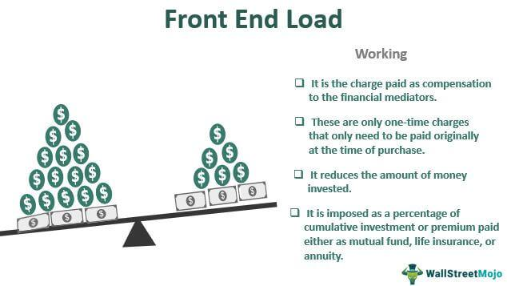

Mutual funds have become a cornerstone in the global investment landscape, providing individual and institutional investors with a diversified portfolio managed by professional fund managers. These funds pool money from multiple investors to purchase a variety of securities, including stocks, bonds, and other assets, making them accessible to a wide range of investors regardless of their investment expertise or resources. The significance of mutual funds lies in their ability to offer risk diversification, potential for higher returns, and professional management, often at a lower cost compared to investing individually in a multitude of financial instruments.

Understanding the costs associated with mutual funds is crucial for investors, as fees can substantially influence the net returns. Mutual fund fees come in several forms, including management fees, performance fees, and various load fees. Front-end load fees, in particular, are charges levied when an investment is made into the fund. These fees can affect the actual capital that is invested as they are deducted upfront, leading to a reduced initial investment amount. Awareness of these costs is essential for investors seeking to maximize their investment returns and make informed decisions when selecting mutual funds.



In recent years, the rise of algorithmic trading, or algo trading, has transformed investment strategies, introducing new efficiencies and possibilities. Algo trading utilizes complex algorithms to execute trades at speeds and frequencies unimaginable to human traders, optimizing strategies based on pre-set criteria and market conditions. This technological advancement offers increased speed, precision, and the ability to manage large volumes of trades, thereby influencing the mutual fund industry and opening new avenues for cost management and strategy optimization.

The intersection of mutual fund fees, particularly front-end load costs, and the efficiency brought by algo trading presents a complex but intriguing scenario for investors. As technology continues to evolve, investors need to be adept at leveraging these advancements to balance the inevitable costs associated with mutual funds, such as front-end load fees, with the potential gains in efficiency and returns provided by algorithmic strategies.

## Table of Contents

## Understanding Mutual Fund Fees

Mutual funds are popular investment vehicles that pool money from multiple investors to invest in a diversified portfolio of stocks, bonds, or other securities. One of the critical aspects that investors must consider when selecting a mutual fund is the fee structure, as fees can significantly impact the overall returns on investment.

### Types of Mutual Fund Fees

Mutual fund fees come in various forms, including front-end loads, back-end loads, and management fees. 

1. **Front-End Loads**: These are sales charges paid by investors when they purchase shares in a mutual fund. The fee is typically a percentage of the initial investment, reducing the amount of money actually invested in the fund. For example, if a fund has a 5% front-end load fee and an investor invests $1,000, only $950 will be put to work in the fund.

2. **Back-End Loads**: Also known as deferred sales charges, these fees are charged when an investor sells their shares in a mutual fund. The fee typically decreases the longer the investor holds the fund, potentially reaching zero after a specified period.

3. **Management Fees**: These fees are charged by the fund manager for managing the investment portfolio. They are typically expressed as a percentage of the fund's average net assets and are deducted from the fund’s returns.

### Impact of Fees on Investment Returns

Fees can erode an investor's returns over time. For instance, a high front-end load fee reduces the initial amount invested, which means the investor misses out on potential returns from that portion of funds that was used to pay the fee. Similarly, back-end load fees can diminish the returns if the investor decides to sell their shares prematurely. Management fees, being recurrent, continually diminish the net asset value of the fund, thus impacting the compound growth potential of an investment.

### Importance of Awareness

Understanding these fees is crucial for investors when choosing a mutual fund, as they directly affect the net returns. An investor should assess the fee structure in relation to the expected performance and the holding period of the investment.

### Total Expense Ratio (TER)

The Total Expense Ratio (TER) provides a comprehensive measure of the cost of owning a mutual fund. It encompasses all operational fees and management expenses involved in running the fund, excluding any sales fees such as front or back-end loads. 

The TER is calculated using the formula:

$$
\text{TER} = \frac{\text{Total Fund Expenses}}{\text{Total Fund Assets}}
$$

It is important for investors to compare the TER of different funds to understand the total cost of ownership and how it might impact their investment returns over time.

By being mindful of the different types of fees and the Total Expense Ratio, investors can make informed decisions that align with their financial goals and investment horizons.

## Front-End Load Fees: A Closer Look

Front-end load fees are a type of mutual fund charge levied on investors at the time of purchase. These fees are essentially sales commissions that compensate brokers and financial advisors for selling mutual funds to clients. Typically expressed as a percentage of the total investment, front-end load fees reduce the amount of money that gets invested into the fund. For example, if an investor places $10,000 into a mutual fund with a 5% front-end load fee, $500 is deducted as the fee, and only $9,500 is actually invested in the fund.

Certain mutual funds charge front-end load fees based on their distribution channels and the services provided by brokers. The rationale is that these fees incentivize intermediaries, ensuring that investors receive professional advice tailored to their financial goals. By attracting knowledgeable advisors, mutual funds aim to create a beneficial environment for both investors and fund managers.

The initial impact of front-end load fees is a reduction in the investor's principal amount, which can influence investment outcomes. Consider an investment scenario where two funds have the same annual return rate; however, one charges front-end load fees, and the other does not. The investor in the fund with the load fee will initially have a lower investment base, affecting the compounding potential of returns. Over time, this reduction at the outset may lead to a total return disadvantage compared to a non-load fund, particularly if the investor plans for a shorter investment horizon.

Nevertheless, front-end load fees might be strategically advantageous in specific situations. For example, investors who maintain long-term positions might find that these fees are mitigated over time as their investments grow, particularly if the fund consistently outperforms others. Conversely, for short-term investors, the immediate deduction of load fees can significantly affect returns, making such fees potentially detrimental.

In conclusion, while front-end load fees decrease the initial amount of an investment, their impact must be measured against the service benefits received and the investment timeframe. Understanding these aspects helps investors make informed decisions about where and how to allocate their resources within the mutual fund landscape.

## The Rise of Algorithmic Trading in Investment Strategies

Algorithmic trading (algo trading) refers to the use of computer algorithms to automate and execute trading decisions based on pre-defined criteria. This approach has gained significant traction in the financial industry due to its ability to enhance the speed, precision, and efficiency of trading activities. Over recent years, [algorithmic trading](/wiki/algorithmic-trading) has become a staple in investment strategies, influencing how mutual funds are managed.

The main advantages of algo trading include its ability to swiftly process vast amounts of market data and execute trades rapidly, often within milliseconds. This speed ensures that traders and investors can capitalize on short-lived opportunities that might otherwise be unavailable using traditional manual trading methods. Furthermore, algorithmic trading minimizes human error, providing greater precision. It also allows for the implementation of complex strategies that might prove challenging to execute manually, such as [arbitrage](/wiki/arbitrage) and statistical trading.

In terms of efficiency, algo trading reduces transaction costs by limiting market impact through strategies like slicing large orders into smaller ones to avoid significant price shifts. For mutual fund investments, these traits of algorithmic trading are particularly beneficial. Mutual funds, which traditionally rely on precise timing and vast data analysis to maximize returns, can leverage algo trading to optimize their strategies despite associated management fees and other costs.

Algorithmic trading's role in mutual fund investments extends to cost optimization. By automating trades, mutual funds can reduce operational costs, which ultimately leads to a more favorable Total Expense Ratio (TER). This reduction can, in part, offset fees such as front-end loads, enhancing overall investor returns. Moreover, by enabling funds to react more quickly to market developments, algo trading helps funds maintain competitive edge and manage risk more effectively.

Successfully navigating the fee structures of mutual funds through algo trading requires sophisticated strategies. Algorithms might be designed to account for varying fee implications in trade decisions, ensuring that trading activities remain cost-effective. For example, a mutual fund could use algorithmic strategies to decide when to buy or sell assets, taking into account transaction costs and potential returns, thus aligning more closely with investor goals.

In conclusion, algorithmic trading continues to revolutionize investment strategies in mutual funds by offering enhanced speed, precision, and cost efficiency. Its integration into mutual fund management illustrates how technology can be harnessed to adapt traditional investment vehicles to the demands of modern financial markets, ultimately seeking to optimize returns despite the inherent fee structures.

## Balancing Costs with Technology: The Role of Algo Trading

Algorithmic trading has fundamentally transformed the landscape of financial investments by introducing precision and automation to the decision-making process. By leveraging sophisticated algorithms, investors can not only optimize their trading strategies but also significantly reduce costs, including those associated with mutual funds, such as front-end load fees.

Algo trading tools can assist investors in identifying the most cost-efficient entry points into mutual funds, thereby minimizing the expenses incurred from front-end load fees. A front-end load fee is a commission paid at the time of the initial investment in a mutual fund, and it can erode the initial capital. Algorithmic systems are capable of analyzing historical data, market trends, and fee structures to determine optimal times and amounts for investment, reducing upfront costs.

Technology-driven strategies provide a framework for better decision-making regarding mutual fund investments. Algorithms capable of processing vast datasets can offer insights into the expected performance of various funds, taking fees into account as an integral part of the analysis. For example, algorithms can implement strategies such as [momentum](/wiki/momentum) trading or mean reversion, which rely on statistical patterns rather than subjective judgment, ensuring more consistent and objective decision-making.

One of the key potentials of algo trading lies in its ability to reduce transaction costs, which can have a significant impact on overall returns. By executing trades at the most opportune moments, algorithms can minimize bid-ask spreads and other market frictions. Such efficiency is particularly beneficial in environments where trading volumes are high, and speed is critical. Moreover, algorithms can optimize portfolio rebalancing processes, ensuring that trades reduce exposure to unnecessary fees.

For navigating complex fee structures, algorithms can be programmed to simulate multiple scenarios, taking into account different fund options and their associated costs. An example is a cost-minimization algorithm, which systematically compares expected net returns of funds after fees:

```python
def calculate_net_return(initial_investment, expected_return, front_end_load):
    cost = initial_investment * front_end_load
    net_return = (initial_investment - cost) * (1 + expected_return)
    return net_return

# Example usage
initial = 10000
expected_annual_return = 0.07
front_end_load_fee = 0.05

net = calculate_net_return(initial, expected_annual_return, front_end_load_fee)
print(f"Net Return after 1 year: ${net:.2f}")
```

In this example, investors can compare different mutual funds by inputting their expected returns and front-end load fees, allowing them to select options with the highest potential net returns. 

In conclusion, algo trading offers a powerful means of balancing costs through technical efficiency and strategic planning. By programming algorithms to account for fees alongside market factors, investors can improve both their cost structures and investment outcomes, paving the way for more sophisticated, technology-driven investing approaches.

## Practical Tips for Investors

To effectively balance mutual fund fees with investment goals, investors need to adopt a strategic approach that involves careful fund selection and the utilization of technology-driven tools such as algorithmic trading. Here are some practical tips:

**1. Key Considerations for Selecting Funds with Favorable Fee Structures**

Understanding the various fee structures is crucial. It’s important to evaluate the total expense ratio (TER) of mutual funds, which includes management fees, operational costs, and other charges. Funds with a lower TER typically provide a cost advantage, especially for long-term investors. Here are some specific points to consider:

- **Front-End Load Fees**: Select funds that either have no front-end load fees or charge minimal fees. A front-end load fee can significantly reduce the amount of capital that is actually invested.

- **Back-End Load Fees**: Consider funds with no or low back-end load fees, which are charged at the time of redemption. This is particularly important for investors who might need to withdraw their investments within a short to medium-term horizon.

- **Investment Objectives and Fees Alignment**: Ensure that the fees align with the investment goals. For instance, higher management fees may be justified if the fund consistently outperforms its benchmark index.

**2. Leveraging Algorithmic Trading Tools for Cost-Effective Investing**

Algorithmic trading can be an invaluable asset for optimizing mutual fund investments by minimizing costs and improving decision-making processes:

- **Automated Rebalancing**: Use tools that automate the rebalancing of your portfolio. This can help maintain the desired asset allocation while reducing transaction costs.

- **Fee Optimization Algorithms**: Some advanced trading platforms offer algorithms specifically designed to navigate complex fee structures efficiently. These algorithms might suggest the optimal times to buy or sell mutual fund units, taking into account any applicable fees.

- **Performance Monitoring**: Utilize algorithms to continuously monitor fund performance against fees. This real-time analysis can provide alerts when a fund's performance no longer justifies its cost, enabling timely reallocation of investments.

**3. Staying Informed about Mutual Fund Fees and Technological Advancements**

- **Educational Resources**: Regularly consult resources such as the U.S. Securities and Exchange Commission (SEC) website for updates on regulatory changes and general guidance on mutual fund fees.

- **Financial News and Publications**: Subscribing to financial news outlets and publications will keep investors informed about the latest trends in mutual fund fee structures and algo trading advancements.

- **Consult Financial Advisors**: Engage with financial advisors who are well-versed in both traditional and algorithmic investing strategies. They can provide tailored advice based on the latest technologies impacting the financial markets.

By carefully selecting funds with favorable fee structures, leveraging algorithmic trading tools, and staying informed about industry developments, investors can effectively manage mutual fund fees and align their investments with their financial goals.

## Conclusion

In this article, we reviewed the significance of mutual fund fees, with particular attention to front-end load fees, and examined how they can affect investors' returns. Understanding these costs is crucial for effective financial management. We also explored how algorithmic trading is reshaping investment approaches by leveraging technology to enhance portfolio performance.

Algorithmic trading, with its speed and precision, offers a strategic advantage by potentially minimizing transactional costs, including those accrued through various mutual fund fees. Technology aids in crafting investment strategies that optimize returns while mindful of fee structures, enabling investors to make more informed decisions.

As financial landscapes evolve, staying informed about mutual fund expenses and technological advancements becomes increasingly important. This knowledge empowers investors to harness tools like algo trading to strike a balance between managing costs and achieving investment objectives. The ongoing exploration of strategies for maximizing efficiency while minimizing costs remains a pivotal endeavor in effective investment management.

## References & Further Reading

[1]: ["Advances in Financial Machine Learning"](https://www.amazon.com/Advances-Financial-Machine-Learning-Marcos/dp/1119482089) by Marcos Lopez de Prado

[2]: ["Evidence-Based Technical Analysis: Applying the Scientific Method and Statistical Inference to Trading Signals"](https://www.amazon.com/Evidence-Based-Technical-Analysis-Scientific-Statistical/dp/0470008741) by David Aronson

[3]: ["Machine Learning for Algorithmic Trading"](https://github.com/stefan-jansen/machine-learning-for-trading) by Stefan Jansen

[4]: ["Quantitative Trading: How to Build Your Own Algorithmic Trading Business"](https://www.amazon.com/Quantitative-Trading-Build-Algorithmic-Business/dp/1119800064) by Ernest P. Chan

[5]: Bergstra, J., Bardenet, R., Bengio, Y., & Kégl, B. (2011). ["Algorithms for Hyper-Parameter Optimization."](https://dl.acm.org/doi/10.5555/2986459.2986743) Advances in Neural Information Processing Systems 24.