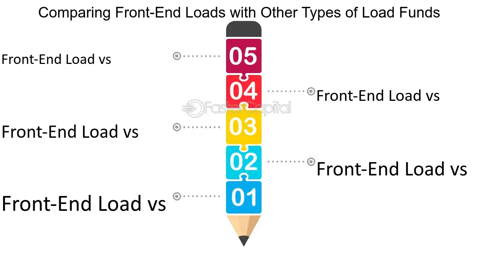

## Table of Contents

## What is a front-end load?

A front-end load is a fee that you pay when you buy certain types of investment funds, like mutual funds or annuities. This fee is charged as a percentage of the amount you invest and is taken out of your money before it is invested. For example, if you invest $1,000 in a fund with a 5% front-end load, you will pay $50 as a fee, and only $950 will actually be invested in the fund.

Front-end loads are used to compensate the financial advisors or brokers who sell the investment products. They are more common with actively managed funds, where a professional manager picks the investments. The idea is that the fee helps cover the costs of the advice and services provided by the advisor. However, front-end loads can reduce your overall returns, so it's important to consider whether the benefits of the investment justify the cost of the fee.

## How does a front-end load work in mutual funds?

When you buy a mutual fund with a front-end load, you pay a fee right away. This fee is a percentage of the money you want to invest. For example, if you want to invest $1,000 and the front-end load is 5%, you will pay $50 as a fee. That means only $950 of your money will actually go into the mutual fund. The fee is taken out before your money is invested, so it reduces the amount you have to start with.

The front-end load is used to pay the people who sell the mutual fund, like financial advisors or brokers. They get this fee for helping you choose and buy the fund. Front-end loads are more common with mutual funds that are actively managed, where someone picks the investments for the fund. But remember, the fee can make your overall returns lower because you start with less money in the fund. So, it's good to think about if the benefits of the fund are worth the fee you have to pay.

## What are the different types of front-end loads?

Front-end loads can be different depending on the mutual fund and the company that sells it. Some funds have a fixed front-end load, which means you always pay the same percentage no matter how much money you invest. For example, if the load is 5%, you pay 5% whether you invest $1,000 or $10,000. Other funds have a sliding scale front-end load, where the percentage you pay goes down if you invest more money. So, you might pay 5% on the first $10,000, but only 4% on the next $10,000.

Another type of front-end load is called a breakpoint discount. This means you can get a lower front-end load if you invest a certain amount of money or if you already have a lot of money invested in the same company's funds. For example, if you invest $50,000 or more, the front-end load might drop from 5% to 3%. This is to encourage people to invest more money or to keep their money with the same company. Knowing about these different types of front-end loads can help you make better choices when you're [picking](/wiki/asset-class-picking) a mutual fund.

## Can you explain the average percentage of front-end loads?

Front-end loads on mutual funds can vary a lot, but they usually range from about 3% to 6%. This means if you invest $1,000, you might pay between $30 and $60 as a fee before your money goes into the fund. The exact percentage can depend on the type of fund and the company that sells it.

Some funds have a fixed front-end load, so you always pay the same percentage no matter how much you invest. Other funds might give you a lower front-end load if you invest more money, which is called a breakpoint discount. This can make the average front-end load go down if you invest a bigger amount.

## How do front-end loads affect the overall return on investment?

Front-end loads can make your overall return on investment lower. When you pay a front-end load, you start with less money in the fund because the fee is taken out before your money is invested. For example, if you invest $1,000 with a 5% front-end load, you pay $50 as a fee, and only $950 goes into the fund. This means your investment starts smaller, so even if the fund does well, you might not make as much money as you would have without the fee.

Over time, the impact of the front-end load can add up. If the fund grows at a steady rate, the part you missed out on because of the fee could have grown too. So, the front-end load not only takes money away at the start, but it also means you miss out on the potential growth of that money over the years. It's important to think about this when choosing a mutual fund, to make sure the benefits of the fund are worth the cost of the fee.

## What is an example of a mutual fund with a front-end load?

An example of a mutual fund with a front-end load is the American Funds Growth Fund of America (AIVSX). If you want to invest in this fund, you have to pay a front-end load fee. For example, if you invest $10,000 and the front-end load is 5.75%, you will pay $575 as a fee. This means only $9,425 of your money will actually go into the fund.

The front-end load fee is used to pay the people who sell the fund, like financial advisors or brokers. They get this fee for helping you choose and buy the fund. Even though the fee helps cover the costs of their advice and services, it also means you start with less money in the fund. This can make your overall returns lower because you miss out on the potential growth of the money you paid as a fee.

## How can investors compare front-end loads across different funds?

Investors can compare front-end loads across different funds by looking at the fee percentage each fund charges. For example, one fund might have a front-end load of 3%, while another might charge 5.75%. By comparing these percentages, investors can see which fund will take less money out of their investment right away. They can also check if the fund offers any discounts, like breakpoint discounts, which lower the front-end load if you invest a bigger amount.

It's also important to think about how the front-end load will affect the overall return on the investment. A higher front-end load means you start with less money in the fund, which can make your returns lower over time. So, when comparing funds, investors should not only look at the front-end load percentage but also consider how much money they plan to invest and how the fee will impact their potential earnings in the long run.

## Are there strategies to minimize the impact of front-end loads?

One way to minimize the impact of front-end loads is to invest a larger amount of money at once. Many mutual funds offer breakpoint discounts, which means the front-end load percentage goes down if you invest more money. For example, if you invest $50,000 instead of $10,000, the front-end load might drop from 5% to 3%. This can save you a lot of money in fees and let more of your money go into the fund right away.

Another strategy is to look for funds that have lower front-end loads or no front-end loads at all. Some funds charge other types of fees, like back-end loads or ongoing management fees, but they might not have a front-end load. By choosing a fund with a lower or no front-end load, you can keep more of your money working for you from the start. It's important to read the fund's prospectus carefully to understand all the fees and make the best choice for your investment goals.

## What are the regulatory considerations for front-end loads?

Front-end loads on mutual funds are watched by the U.S. Securities and Exchange Commission (SEC). The SEC makes rules to make sure people know about fees like front-end loads before they invest. The rules say that mutual funds have to show all fees clearly in a document called a prospectus. This helps investors understand what they will pay and make better choices.

The Financial Industry Regulatory Authority (FINRA) also keeps an eye on front-end loads. FINRA makes sure that the fees are fair and that people selling the funds follow the rules. They check that the front-end loads are not too high and that any discounts, like breakpoint discounts, are given correctly. This helps protect investors and make sure they are treated fairly when they buy mutual funds with front-end loads.

## How do front-end loads compare to other types of fees in investment products?

Front-end loads are fees you pay when you buy certain investment products like mutual funds. They are taken out of your money before it goes into the fund. For example, if you invest $1,000 and the front-end load is 5%, you pay $50 as a fee, and only $950 goes into the fund. This fee is different from other types of fees, like back-end loads, which you pay when you sell the investment, and ongoing management fees, which you pay every year while you own the investment. Back-end loads can go down the longer you keep your money in the fund, and management fees are usually a small percentage of your total investment each year.

Compared to other fees, front-end loads can have a big effect on your investment right away because they reduce the amount of money you start with. Back-end loads and management fees might not seem as big at first, but they can add up over time. For example, a 1% management fee on a $10,000 investment means you pay $100 every year. If you keep your money in the fund for many years, these fees can take away a lot of your returns. So, it's important to think about all the fees and how they will affect your investment over time when you are choosing where to put your money.

## What historical trends can be observed in the use of front-end loads?

Over the years, the use of front-end loads in mutual funds has changed a lot. In the past, front-end loads were very common because they were a way for financial advisors and brokers to get paid for selling the funds. Many investors didn't mind paying these fees because they trusted their advisors to pick good funds for them. But as more people started learning about investing and looking for cheaper options, the popularity of front-end loads started to go down.

Today, many investors are choosing funds with lower fees or no front-end loads at all. This is because they want to keep more of their money working for them from the start. Also, the rise of online investing platforms and index funds, which usually have lower fees, has made it easier for people to avoid front-end loads. So, while front-end loads are still used, they are not as common as they used to be, and more investors are looking for ways to minimize the fees they pay.

## How might future changes in the financial industry impact the use of front-end loads?

In the future, the use of front-end loads might change because of new rules and technology in the financial world. More people are using the internet to invest, and they like funds that don't have big fees. This means companies might offer more funds with lower or no front-end loads to attract these investors. Also, if the government makes new rules about fees, it could make front-end loads less common or smaller. This is because the rules might want to make sure investors pay less and get more of their money back.

Another thing that could change front-end loads is how people think about investing. More people are learning about fees and wanting to keep more of their money. They might choose funds with no front-end loads or other types of fees that are smaller over time. This could make companies change their funds to have lower front-end loads or different kinds of fees. So, the future might see fewer front-end loads as investors and the financial industry keep changing.

## What are the key aspects to understanding mutual fund fees?

Mutual funds are popular investment vehicles that pool money from multiple investors to invest in a diversified portfolio of stocks, bonds, or other securities. One of the critical aspects that investors must consider when selecting a mutual fund is the fee structure, as fees can significantly impact the overall returns on investment.

### Types of Mutual Fund Fees

Mutual fund fees come in various forms, including front-end loads, back-end loads, and management fees. 

1. **Front-End Loads**: These are sales charges paid by investors when they purchase shares in a mutual fund. The fee is typically a percentage of the initial investment, reducing the amount of money actually invested in the fund. For example, if a fund has a 5% front-end load fee and an investor invests $1,000, only $950 will be put to work in the fund.

2. **Back-End Loads**: Also known as deferred sales charges, these fees are charged when an investor sells their shares in a mutual fund. The fee typically decreases the longer the investor holds the fund, potentially reaching zero after a specified period.

3. **Management Fees**: These fees are charged by the fund manager for managing the investment portfolio. They are typically expressed as a percentage of the fund's average net assets and are deducted from the fund’s returns.

### Impact of Fees on Investment Returns

Fees can erode an investor's returns over time. For instance, a high front-end load fee reduces the initial amount invested, which means the investor misses out on potential returns from that portion of funds that was used to pay the fee. Similarly, back-end load fees can diminish the returns if the investor decides to sell their shares prematurely. Management fees, being recurrent, continually diminish the net asset value of the fund, thus impacting the compound growth potential of an investment.

### Importance of Awareness

Understanding these fees is crucial for investors when choosing a mutual fund, as they directly affect the net returns. An investor should assess the fee structure in relation to the expected performance and the holding period of the investment.

### Total Expense Ratio (TER)

The Total Expense Ratio (TER) provides a comprehensive measure of the cost of owning a mutual fund. It encompasses all operational fees and management expenses involved in running the fund, excluding any sales fees such as front or back-end loads. 

The TER is calculated using the formula:

$$
\text{TER} = \frac{\text{Total Fund Expenses}}{\text{Total Fund Assets}}
$$

It is important for investors to compare the TER of different funds to understand the total cost of ownership and how it might impact their investment returns over time.

By being mindful of the different types of fees and the Total Expense Ratio, investors can make informed decisions that align with their financial goals and investment horizons.

## References & Further Reading

[1]: ["Advances in Financial Machine Learning"](https://www.amazon.com/Advances-Financial-Machine-Learning-Marcos/dp/1119482089) by Marcos Lopez de Prado

[2]: ["Evidence-Based Technical Analysis: Applying the Scientific Method and Statistical Inference to Trading Signals"](https://www.amazon.com/Evidence-Based-Technical-Analysis-Scientific-Statistical/dp/0470008741) by David Aronson

[3]: ["Machine Learning for Algorithmic Trading"](https://github.com/stefan-jansen/machine-learning-for-trading) by Stefan Jansen

[4]: ["Quantitative Trading: How to Build Your Own Algorithmic Trading Business"](https://www.amazon.com/Quantitative-Trading-Build-Algorithmic-Business/dp/1119800064) by Ernest P. Chan

[5]: Bergstra, J., Bardenet, R., Bengio, Y., & Kégl, B. (2011). ["Algorithms for Hyper-Parameter Optimization."](https://dl.acm.org/doi/10.5555/2986459.2986743) Advances in Neural Information Processing Systems 24.