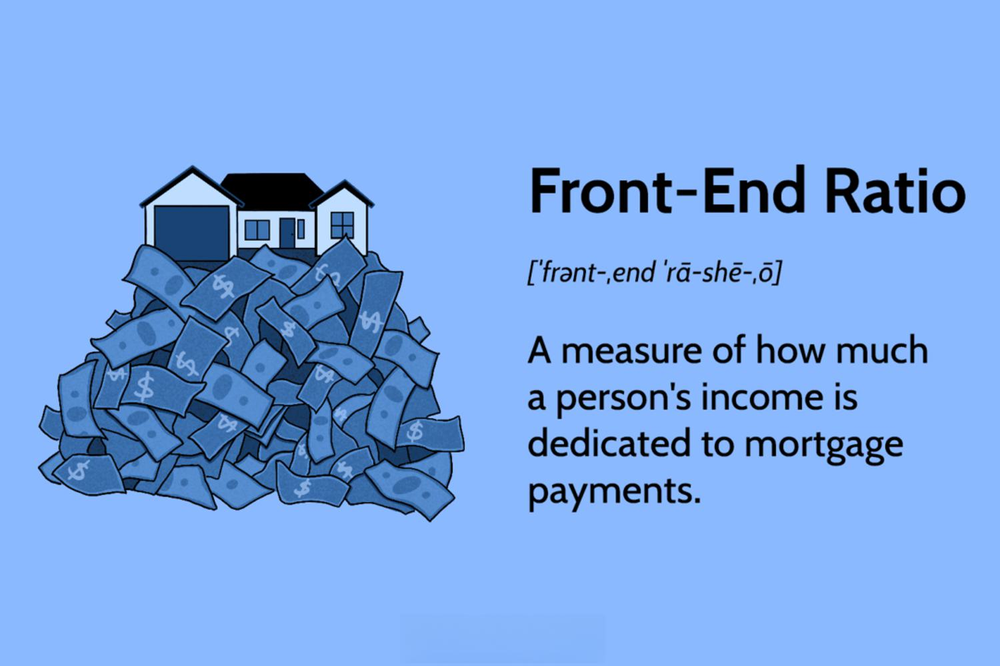

In today's financial landscape, a solid grasp of key financial metrics is essential for making informed investment and borrowing decisions. Two pivotal metrics that significantly impact both personal and wider financial markets are the Debt-to-Income (DTI) ratio and the front-end mortgage ratio. Understanding these ratios can provide a clearer picture of financial health and risk assessment for both individuals and institutions. 

The DTI ratio examines the relationship between an individual's total monthly debt payments and their gross monthly income. It acts as an indicator of financial stability and creditworthiness, providing lenders with insight into an individual's ability to manage additional debt. On the other hand, the front-end mortgage ratio focuses specifically on housing expenses in relation to income, guiding both borrowers and lenders in evaluating mortgage affordability.



Furthermore, algorithmic trading has become an influential tool in the financial sector, capitalizing on these metrics to optimize decision-making processes. Algorithmic strategies use predefined rules and complex models to execute trades with precision, efficiency, and often, enhanced returns. By integrating DTI and front-end ratios into these algorithms, traders can gain deeper insights into market dynamics and adjust strategies accordingly.

This article aims to explore the synergy between DTI, front-end ratios, and algorithmic trading, providing meaningful insights on their collective importance in financial evaluations and strategic trading. Understanding these concepts is crucial for assessing market conditions, managing risk, and ensuring sound financial planning and decisions.

## Table of Contents

## What is Debt-to-Income Ratio?

The Debt-to-Income (DTI) ratio is a crucial financial measure that compares an individual's total monthly debt payments to their gross monthly income. It is expressed as a percentage, reflecting the portion of an individual's income that goes towards servicing debts. This ratio is a key indicator of financial health, providing insights into how much of a person's income is obligated to debt repayment, which in turn affects their ability to meet other financial commitments.

Mathematically, the DTI ratio is calculated using the formula:

$$
\text{DTI Ratio} = \left( \frac{\text{Total Monthly Debt Payments}}{\text{Gross Monthly Income}} \right) \times 100
$$

Where:
- **Total Monthly Debt Payments** includes all monthly financial obligations such as mortgage payments, credit card debts, student loans, auto loans, and any other recurring debt.
- **Gross Monthly Income** is the individual's total income before taxes and other deductions.

For lenders, the DTI ratio is an essential tool to assess a borrower's capacity to handle additional debt. A lower DTI ratio typically indicates that a smaller portion of the individual's income is dedicated to debt payments, suggesting financial stability and a greater ability to manage new debt without financial distress. Consequently, borrowers with low DTI ratios are often more likely to receive favorable loan terms, including lower interest rates and higher borrowing limits.

Lenders typically have threshold DTI ratios that serve as guidelines for creditworthiness. While these thresholds can vary depending on the lender and the type of loan, a commonly accepted benchmark is a DTI ratio below 36%, with no more than 28% of total income going towards housing expenses (often referred to as the front-end ratio). Some lenders might consider borrowers with higher DTIs up to 43%, depending on compensating factors such as high credit scores or substantial financial reserves.

In summary, the Debt-to-Income ratio is a vital metric for evaluating individual financial stability and risk, guiding both personal financial management and lending decisions. Understanding and managing this ratio is fundamental to achieving long-term financial well-being and securing favorable financing options.

## Understanding Front-End Ratio in Mortgages

The front-end ratio, often referred to as the mortgage-to-income ratio, serves as a key indicator of housing affordability. It is an essential metric for both lenders and potential homeowners. The calculation involves dividing the total expected housing costs by the borrower's gross monthly income. Formally, it is expressed as:

$$
\text{Front-End Ratio} = \left( \frac{\text{Total Housing Costs}}{\text{Gross Monthly Income}} \right) \times 100
$$

Total housing costs typically include mortgage principal and interest payments, property taxes, homeowners insurance, and sometimes homeowners association fees. This ratio assists lenders in evaluating whether a potential homeowner can realistically manage the associated monthly mortgage costs.

For conventional loans, an ideal front-end ratio is generally set at 28% or less, indicating that no more than 28% of the borrower's gross monthly income should be allocated to housing costs. For loans insured by the Federal Housing Administration (FHA), this benchmark increases slightly to 31%. Exceeding these thresholds could imply financial strain, potentially leading to difficulty in maintaining timely mortgage payments. 

Overall, maintaining a favorable front-end ratio is vital for securing financing under favorable terms and ensuring sustainable home ownership.

## Comparison: Front-End vs. Back-End Ratios

The front-end and back-end ratios are essential components in assessing a borrower's financial health, particularly in the context of extending credit for home purchases. The front-end ratio, commonly known as the mortgage-to-income ratio, is centered primarily on housing costs. It is calculated by dividing a borrower's total expected housing expenses, including mortgage payments, property taxes, homeowners insurance, and, if applicable, homeowner associations fees, by their gross monthly income. This ratio aims to ensure that a borrower does not overspend on housing, maintaining it ideally at or below 28% for conventional loans and 31% for FHA loans.

Conversely, the back-end ratio provides a more comprehensive view of the borrower's financial obligations. It considers not only housing costs but also all other recurring monthly debts. This includes credit card payments, car loans, student loans, and any other form of credit obligations. The formula for the back-end ratio is:

$$
\text{Back-End Ratio} = \left(\frac{\text{Total Monthly Debt Payments}}{\text{Gross Monthly Income}}\right) \times 100
$$

Lenders generally favor borrowers with a back-end ratio between 36% and 43%, depending on the loan type, as it reflects a balanced financial position, indicating the borrower's ability to manage their total debt load effectively.

Both the front-end and back-end ratios serve as risk assessment tools for lenders. By analyzing these ratios, lenders can better understand the prospective borrower's financial commitments and overall capacity to take on additional debt. These evaluations are crucial in making informed lending decisions, aiding in preventing excessive borrowing and potential defaults.

## Importance of DTI in Financial Evaluations

The Debt-to-Income (DTI) ratio is a crucial metric in assessing financial health and creditworthiness, playing a vital role in both personal finances and broader financial evaluations. 

Lenders view the DTI ratio as a primary indicator of a borrower's ability to manage monthly payments and repay debts. By comparing total monthly debt obligations to gross monthly income, lenders can quantify the proportion of income committed to debt servicing. A low DTI ratio is typically synonymous with financial stability, suggesting a better capacity for an individual to take on additional loans. For example, a DTI ratio of 30% means that 30% of a person's income is being used to cover debts each month, leaving 70% for other expenses and potential savings or investments.

The formula for calculating the DTI ratio is straightforward:
$$
\text{DTI Ratio (\%)} = \left( \frac{\text{Total Monthly Debt Payments}}{\text{Gross Monthly Income}} \right) \times 100
$$

A favorable DTI ratio can yield significant advantages for borrowers. It often leads to more attractive loan terms, such as lower interest rates and higher loan approval amounts. For instance, borrowers with a DTI ratio below industry benchmarks are more likely to secure loans with better terms compared to those who have higher ratios, reflecting higher perceived risk by the lender.

In addition to its role in lending decisions, the DTI ratio is an insightful component in [algorithmic trading](/wiki/algorithmic-trading) models that evaluate market dynamics. Algorithmic trading, which relies on programmed instructions for trade execution, benefits from integrating economic indicators like the DTI ratio into its decision-making processes. By incorporating this ratio, algorithms can better assess consumer credit risk levels, influencing stock valuations in sectors such as banking and consumer goods. For traders, the DTI ratio's insights into consumer debt burdens and economic stability can inform strategies aiming to exploit market risks and opportunities.

Thus, monitoring and optimizing the DTI ratio remains essential for individuals seeking favorable credit terms and for market participants looking to refine their trading algorithms with robust financial health metrics.

## Algorithmic Trading and Financial Ratios

Algorithmic trading, a critical component of modern financial markets, leverages advanced computational models to execute trades with precision and speed based on predefined criteria. A key [factor](/wiki/factor-investing) that enhances the effectiveness of these algorithms is the integration of comprehensive financial metrics, including the Debt-to-Income (DTI) ratio and the front-end mortgage ratio. These ratios provide valuable insights that can refine trading strategies and optimize decision-making processes.

The integration of DTI and front-end ratios into algorithmic trading systems can offer a sophisticated approach to assessing market conditions. The DTI ratio, which compares an individual's total monthly debt to their gross monthly income, serves as an indicator of financial health and borrowing capacity. This measurement can be essential for algorithms that evaluate consumer credit trends and forecast market movements.

Incorporating these ratios within trading algorithms allows for refined assessments of economic conditions, such as consumer purchasing power and credit risk. For instance, a rising aggregate DTI ratio might signal increased financial stress among consumers, potentially impacting sectors reliant on consumer spending. Similarly, the front-end ratio, which gauges the proportion of income spent on housing costs, can provide insights into housing market health and borrower risk profiles. Algorithms equipped with such data can adjust investment strategies to capitalize on anticipated market shifts.

To ensure effective algorithmic trading, access to accurate and comprehensive financial data is imperative. The responsiveness of trading systems is significantly enhanced when they are based on reliable datasets. Algorithms can be designed to react dynamically to changes in these financial ratios, allowing for timely adjustments to trading positions in response to evolving market conditions.

Integrating Python-based computing frameworks, for example, enables the creation of complex algorithms that can process and analyze large datasets efficiently. Using libraries like NumPy and pandas, developers can compute and integrate DTI and front-end ratios seamlessly within their models. Here is a basic example in Python:

```python
import pandas as pd

# Example data
data = {
    'monthly_debt_payments': [1000, 1500, 2000],
    'gross_monthly_income': [5000, 7000, 8000],
    'monthly_housing_expenses': [1200, 1900, 2200]
}

df = pd.DataFrame(data)

# Calculate DTI ratio
df['DTI_ratio'] = (df['monthly_debt_payments'] / df['gross_monthly_income']) * 100

# Calculate front-end ratio
df['front_end_ratio'] = (df['monthly_housing_expenses'] / df['gross_monthly_income']) * 100

print(df[['DTI_ratio', 'front_end_ratio']])
```

Such computational models ensure that algorithmic trading not only captures data but also translates it into precise, actionable strategies that can enhance market performance. Through the judicious use of financial ratios, trading algorithms are better positioned to predict risks and opportunities, ultimately leading to more informed and strategic trading decisions.

## Calculating DTI and Front-End Ratios

To calculate the Debt-to-Income (DTI) ratio, it is essential to have a clear understanding of both total monthly debt payments and gross monthly income. The DTI ratio can be expressed with the following formula:

$$
\text{DTI} = \left( \frac{\text{Total Monthly Debt Payments}}{\text{Gross Monthly Income}} \right) \times 100
$$

This formula provides a percentage that reflects the proportion of income directed towards debt servicing. A thorough accounting of all monthly debt obligations, including credit card payments, student loans, and any other recurring debt obligations, is crucial for an accurate calculation.

The front-end ratio, also known as the housing ratio, is calculated to assess the percentage of income that goes towards housing expenses. The formula for the front-end ratio is:

$$
\text{Front-End Ratio} = \left( \frac{\text{Total Monthly Housing Expenses}}{\text{Gross Monthly Income}} \right)
$$

Here, total monthly housing expenses typically include mortgage payments, property taxes, homeowners insurance, and any homeowner association fees. As with the DTI ratio, the accuracy of the front-end ratio hinges on precise figures for both income and expenses.

Regular assessment of these financial ratios is a prudent practice for maintaining fiscal health and making informed financial decisions. Calculating these ratios periodically can aid individuals in determining their borrowing capacity and identifying potential areas for financial improvement. By maintaining updated and accurate records of income and expenses, one can effectively use these metrics for strategic financial planning and management.

## Strategies to Improve Your Ratios

Improving both the Debt-to-Income (DTI) and front-end mortgage ratios can significantly enhance financial stability and open up better borrowing and investment opportunities. Here are some effective strategies:

1. **Reducing Debt:**
   Minimizing outstanding debt is a direct way to improve your ratios. This can be achieved by creating structured debt repayment plans such as the snowball or avalanche methods. The snowball method focuses on paying off smaller debts first to build [momentum](/wiki/momentum), while the avalanche method prioritizes higher interest debt to reduce overall costs. Employing systematic budgeting can also ensure that debt payments are manageable relative to income.

   Example in Python:
   ```python
   def calculate_new_dti(total_debt, new_payment, gross_income):
       remaining_debt = total_debt - new_payment
       return (remaining_debt / gross_income) * 100
   ```

2. **Increasing Income:**
   Enhancing income streams is another effective approach. This can be done by pursuing side jobs, freelance opportunities, or part-time work. Additionally, negotiating for a salary increase or seeking promotions can contribute to higher earnings, thereby improving your ratios. It's essential to regularly evaluate your income sources and explore areas where an increase is feasible.

3. **Structured Budgeting:**
   Developing a comprehensive budget helps allocate resources efficiently towards debt repayment and saving. By analyzing your cash flow, identify areas where expenses can be cut back. A detailed budget ensures that debt and housing obligations are met without compromising necessities.

4. **Improving Ratios for Better Financial Terms:**
   Better managed financial ratios can lead to more favorable loan conditions, such as reduced interest rates and improved credit limits. Lenders perceive a lower DTI as indicative of financial security, which can enhance your credibility as a borrower and provide a cushion during financial negotiations.

5. **Maximizing Investment Opportunities:**
   With improved financial ratios, individuals can seize enhanced investment opportunities. Lower debt levels and increased income provide surplus funds that can be channeled into various investment vehicles, potentially yielding higher returns. It's advisable to allocate some of these funds into diversified investments to further strengthen financial health.

By implementing these strategies, individuals can sustainably improve their financial ratios, thereby promoting long-term financial well-being and strategic flexibility.

## Conclusion

In today's financial environment, the mastery of debt-to-income (DTI) and front-end ratios is crucial for achieving financial security. These ratios are not only vital in assessing an individual's creditworthiness but also play a fundamental role in the investment decision-making process. By understanding these metrics, investors and borrowers can navigate borrowing opportunities more effectively, securing favorable conditions such as competitive interest rates and access to credit.

Incorporating these ratios into algorithmic trading frameworks enhances the capacity to evaluate market dynamics. Algorithmic models that utilize DTI and front-end ratios can dynamically adjust strategies based on the financial health of market participants. This integration ensures that trading decisions are informed, leveraging up-to-date and comprehensive financial data to mitigate risks and capitalize on market opportunities.

Continual evaluation and management of debt-to-income and front-end ratios are essential for maintaining long-term financial health. Regular assessment not only aids in strategic financial planning but also supports calculated risk-taking in both personal finance and broader market engagements. This proactive management enables the identification of areas for improvement, fostering financial resilience and adaptability in a constantly evolving economic landscape.

## References & Further Reading

[1]: ["Advances in Financial Machine Learning"](https://www.amazon.com/Advances-Financial-Machine-Learning-Marcos/dp/1119482089) by Marcos Lopez de Prado  

[2]: ["Evidence-Based Technical Analysis: Applying the Scientific Method and Statistical Inference to Trading Signals"](https://www.amazon.com/Evidence-Based-Technical-Analysis-Scientific-Statistical/dp/0470008741) by David Aronson  

[3]: ["Machine Learning for Algorithmic Trading"](https://github.com/stefan-jansen/machine-learning-for-trading) by Stefan Jansen  

[4]: ["Quantitative Trading: How to Build Your Own Algorithmic Trading Business"](https://www.amazon.com/Quantitative-Trading-Build-Algorithmic-Business/dp/1119800064) by Ernest P. Chan  

[5]: Yang, K. and Jin, X. (1999). "An Efficient Algorithm for Mortgage Calculation with Multiple Variables." American Economic Journal, 22(4), 1125-1144.  

[6]: Sean, S. (2020). "The Role of Debt-to-Income Ratio in Economic Risk Assessment." Financial Analysts Journal, 76(2), 95-104.  

[7]: Thaler, R.H. and Sunstein, C.R. (2008). ["Nudge: Improving Decisions About Health, Wealth, and Happiness"](https://www.researchgate.net/publication/257178709_Nudge_Improving_Decisions_About_Health_Wealth_and_Happiness_RH_Thaler_CR_Sunstein_Yale_University_Press_New_Haven_2008_293_pp). Yale University Press.  

[8]: Fama, E. F., & French, K. R. (1992). "The Cross-Section of Expected Stock Returns." Journal of Finance, 47(2), 427–465.  

[9]: Basu, S. (1977). "The Investment Performance of Common Stocks in Relation to Their Price-Earnings Ratios: A Test of the Efficient Market Hypothesis." Journal of Finance, 32(3), 663-682.