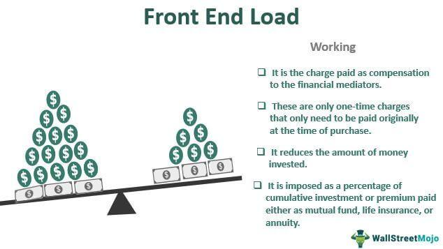

## Table of Contents

## What is a front fee?

A front fee is a charge that you pay at the beginning of a service or loan. It is also called an upfront fee or an origination fee. This fee is common in many financial services, like getting a mortgage or a personal loan. The lender or service provider asks for this fee to cover the costs of processing your application and starting the service.

Front fees can be a flat amount or a percentage of the total loan or service cost. For example, if you are getting a loan of $10,000 and the front fee is 2%, you will need to pay $200 at the start. It's important to understand these fees because they add to the total cost of what you are borrowing or the service you are using. Always ask about any front fees before you agree to a loan or service, so you know the full cost.

## Why do companies charge front fees?

Companies charge front fees to cover the costs they have when they start working with a new customer. When someone applies for a loan or a service, the company needs to spend time and money to check the application, do paperwork, and set everything up. The front fee helps the company pay for these costs right away, instead of waiting until later.

Front fees also help companies make sure that customers are serious about using their services. If someone has to pay a fee at the beginning, they are more likely to follow through with the loan or service. This can save the company time and money because they don't have to deal with people who might change their minds later.

## How is a front fee different from other types of fees?

A front fee is different from other fees because it is paid at the start of a service or loan. Other fees, like late fees or monthly service fees, are charged later on. A front fee helps cover the costs of getting everything started, like checking your application and setting up the loan or service. It's like a one-time payment you make before anything else happens.

Other types of fees can be ongoing or happen because of certain actions. For example, a late fee is charged if you don't pay on time, and a monthly service fee might be added to your bill every month for using a service. These fees are different from a front fee because they happen after you start using the service or loan, not before. Understanding the difference helps you know what to expect and plan your finances better.

## Can you provide examples of services or products that typically charge a front fee?

Many financial services charge a front fee. When you apply for a loan like a mortgage or a personal loan, the bank or lender might ask for a front fee. This fee helps them cover the costs of checking your application and setting up the loan. For example, if you want to buy a house, the mortgage lender might charge a front fee of 1% of the loan amount to process your application.

Some investment services also charge a front fee. If you want to invest in a mutual fund, you might have to pay a front-end load, which is a type of front fee. This fee is taken from your initial investment to cover the costs of managing the fund. For example, if you invest $10,000 in a mutual fund with a 5% front-end load, you'll pay $500 as a front fee right at the start.

## How can one calculate the front fee for a specific service or product?

To calculate the front fee for a specific service or product, you first need to know if the fee is a flat amount or a percentage of the total cost. If it's a flat fee, it's easy—you just pay that amount at the start. For example, if a service charges a $50 front fee, you pay $50 when you start using the service.

If the front fee is a percentage, you need to do a bit of math. You take the total cost of the loan or service and multiply it by the percentage of the front fee. For example, if you're getting a $10,000 loan with a 2% front fee, you multiply $10,000 by 0.02 to get $200. That's the front fee you pay at the beginning. Always check the terms of the service or loan to know exactly how to calculate the front fee.

## What are the legal regulations surrounding front fees?

In many countries, there are laws that say how companies can charge front fees. These laws are there to make sure that companies are fair and clear about the fees they charge. For example, in the United States, the Truth in Lending Act (TILA) makes sure that lenders tell you about all the fees, including front fees, before you agree to a loan. This way, you know exactly what you will have to pay. If a company does not follow these rules, they can get in trouble with the law.

Different countries and even different states or regions might have their own rules about front fees. It's important to know the rules where you live. For example, some places might limit how much a front fee can be or say that certain types of loans cannot have front fees at all. If you think a front fee is too high or not fair, you can talk to a lawyer or a consumer protection agency for help. They can tell you if the fee is legal and what you can do if it's not.

## How do front fees impact consumer behavior?

Front fees can change how people decide to use a service or take out a loan. When people see they have to pay money right at the start, they might think twice about going ahead. This is because the front fee makes the total cost of the loan or service seem higher right away. People might look for other options that don't have a front fee or have a smaller one. This can make companies think about how much they charge for front fees, because if the fee is too high, they might lose customers.

On the other hand, front fees can also make people more committed to using the service or paying back the loan. When someone pays a front fee, they might feel more responsible to follow through because they've already spent money. This can be good for companies because it means fewer people might back out after starting the service. But it's important for companies to be clear about front fees so people know what they're getting into and can make good choices.

## What strategies can businesses use to justify their front fees to customers?

Businesses can explain front fees to customers by being clear and honest about what the fee covers. They can tell customers that the front fee helps pay for the work they do to start the loan or service, like checking applications and setting things up. If customers understand that the fee is used to cover real costs, they might feel better about paying it. Businesses can also show how the front fee is fair by comparing it to what other companies charge, so customers can see that it's a normal part of the process.

Another way businesses can justify front fees is by showing the value they provide. They can explain how the service or loan will help the customer in the long run, making the front fee seem like a small price to pay for the benefits they will get. For example, if a loan will help someone buy a house or start a business, the front fee might seem worth it. By focusing on the positive outcomes and being open about the costs, businesses can make customers feel more comfortable with paying the front fee.

## How do front fees affect the overall pricing strategy of a business?

Front fees can change how a business sets its prices. When a business decides to charge a front fee, it needs to think about how this will affect the total cost for customers. If the front fee is too high, customers might look for other businesses with lower fees or no fees at all. This means the business might need to keep the front fee low enough to stay competitive. But the front fee also helps the business cover the costs of starting new services or loans, so they need to balance making money with keeping customers happy.

Front fees can also make a business's pricing seem more clear to customers. When customers see a front fee, they know right away what they need to pay to start using the service or loan. This can help customers plan their money better because they know the total cost upfront. But if the front fee is too confusing or seems too high, it might scare customers away. So, businesses need to explain the front fee well and show how it adds value to the service or loan, making sure customers feel good about what they are paying for.

## What are the ethical considerations businesses should keep in mind when implementing front fees?

When businesses decide to charge front fees, they need to think about being fair and honest. They should make sure customers know about the front fee before they agree to the service or loan. This means telling customers clearly how much the front fee is and what it covers. If businesses hide the front fee or make it hard to understand, it's not fair to customers. They should also think about if the front fee is too high. If it's too expensive, it might stop people from using the service, especially if they can't afford it. Businesses should try to keep front fees reasonable so more people can use their services.

Another important thing for businesses to consider is how front fees affect different groups of people. Some people might find it harder to pay a front fee right away, like those with less money or those who need the loan or service urgently. Businesses should think about how to help these customers, maybe by offering smaller front fees or payment plans. Being ethical means treating all customers fairly and helping them understand the costs. By being open and fair about front fees, businesses can build trust with their customers and make sure everyone feels respected and valued.

## How have front fees evolved over time in various industries?

Front fees have changed a lot over time in different industries. In the past, front fees were often hidden or not clearly explained to customers. This made people feel tricked and unhappy. But as time went on, laws and rules changed to make things more fair. Now, businesses have to tell customers about front fees upfront and explain what they cover. This has made front fees more open and easier for people to understand. In the banking industry, for example, front fees used to be a big part of loans, but now, some loans don't have them at all because of competition and new rules.

In other industries, like real estate, front fees have also changed. Years ago, when someone wanted to buy a house, they might have to pay a big front fee just to start the process. This could stop people from buying homes if they didn't have the money right away. But now, some real estate companies offer different ways to pay these fees, like spreading them out over time. This helps more people afford to buy homes. In the investment world, front fees, like front-end loads on mutual funds, have become smaller over time as more investment options have come up. This gives people more choices and helps them save money on fees.

## What are the best practices for disclosing front fees to ensure transparency and customer trust?

To make sure customers trust them and understand front fees, businesses should be very clear and open about these fees right from the start. They should tell customers about the front fee as soon as they talk about the loan or service. This means showing the fee in big, easy-to-read words on their website, in their ads, and in any papers customers have to sign. Businesses should also explain what the front fee is for, like covering the cost of checking the application or setting things up. By being honest and clear, businesses can help customers feel good about paying the front fee because they know what it's for.

It's also a good idea for businesses to compare their front fee to what other companies charge. This helps customers see that the fee is fair and normal for the industry. If customers ask questions about the front fee, businesses should answer them in a simple and friendly way. They should also think about offering different ways to pay the front fee, like breaking it into smaller payments over time. This can help more people use their services. By doing these things, businesses can build trust with their customers and make sure everyone feels treated fairly.

## What is a Front Fee?

A front fee, commonly known as a front-end load, represents an initial charge or commission that an investor incurs when purchasing an investment, typically mutual funds. These fees are primarily used to compensate brokers and financial planners for their services in facilitating the transaction. Understanding the implications of front fees is essential for evaluating investment costs and potential returns.

Front fees are generally a percentage of the total investment amount. For instance, if a mutual fund imposes a front fee of 5%, and an investor wishes to invest $10,000, the actual amount invested would be $9,500 after deducting the $500 fee. This initial reduction in capital can affect the overall growth potential of the investment, as there is less principal [earning](/wiki/earning-announcement) returns from the outset.

### Impact on Investment Returns

Front fees can significantly impact investment returns, especially over short investment horizons. By reducing the initial investment amount, they lower the effective amount subject to compound growth, potentially resulting in diminished returns relative to investments without such fees. This is particularly pronounced in the early years of the investment when the compound interest effect is just beginning to take hold.

To quantify this, consider the formula for compound returns: 

$$
A = P(1 + r)^n
$$

where $A$ is the amount of money accumulated after n years, including interest, $P$ is the principal investment amount, $r$ is the annual interest rate, and $n$ is the number of years the money is invested. A lower initial $P$ due to a front fee will consequently yield a lower $A$, all else being equal.

### Why Front Fees are Charged

Front fees are primarily levied to remunerate intermediary [agents](/wiki/agents) who provide valuable services such as investment advice, portfolio management, and administrative support. These agents ensure that investments align with the client's financial goals and risk appetite, and the upfront charges serve as their compensation.

### Pros and Cons of Investing in Funds with Front Fees

#### Pros:

1. **Professional Guidance**: The fees often facilitate access to financial advisors, who provide expertise and tailored investment strategies.

2. **High Quality Management**: Funds with front fees may be managed by seasoned professionals with a strong investment track record.

#### Cons:

1. **Reduced Initial Investment**: Immediate deduction from the investment capital, leading to potentially lower returns.

2. **Longer Breakeven Point**: Investors need higher returns just to recoup the initial fee, which may not be feasible in all scenarios.

### Evaluating the Value of Front Fees

To assess whether front fees are justified, investors should consider factors such as their investment horizon, the historical performance of the fund, and the quality of the associated advisory services. Long-term investors might weigh the potential benefit of professional management against the upfront cost, particularly if the fund historically outperforms its peers.

In summary, front fees are a key consideration in many investment products, influencing both the immediate and future value of an investment. With careful evaluation, investors can better determine when bearing these fees is worthwhile, ultimately aiding in more informed and cost-effective investment decision-making.

 to Algo Trading

Algorithmic trading, commonly referred to as algo trading, is a method of executing trades using programmed instructions based on predefined criteria. These instructions can involve a wide array of strategies, including timing, price, quantity, and other complex mathematical models. The core advantage of algo trading lies in its ability to perform trades at a much higher speed than a human trader, often within milliseconds, and with a precision that mitigates manual intervention errors.

The increasing popularity of algo trading can be attributed to its efficiency and effectiveness in rapidly changing financial markets. Algorithms can process vast amounts of market data almost instantaneously, allowing traders to exploit short-lived trading opportunities that might be missed by traditional trading methods. Furthermore, automated trading reduces the impact of emotional biases that can affect human decision-making, promoting more disciplined and objective trading practices.

Algorithmic trading systems are typically built using a combination of advanced statistical models and complex mathematical formulas. These systems require significant computational power to analyze market data in real-time and identify potential trading opportunities. For example, a basic algorithm might involve executing a trade when a stock’s moving average crosses a specific threshold:

```python
import pandas as pd

# Simulated stock price data
data = {'price': [100, 102, 101, 103, 104, 105, 107, 106, 108, 110]}
df = pd.DataFrame(data)

# Calculate moving averages
short_window = 3
long_window = 5

df['short_mavg'] = df['price'].rolling(window=short_window, min_periods=1).mean()
df['long_mavg'] = df['price'].rolling(window=long_window, min_periods=1).mean()

# Determine buy signals
df['signal'] = 0
df['signal'][short_window:] = \
    (df['short_mavg'][short_window:] > df['long_mavg'][short_window:]).astype(int)

# Calculate positions
df['positions'] = df['signal'].diff()

print(df)
```

This Python example illustrates a simple moving average crossover strategy. When the short-term moving average exceeds the long-term moving average, a buy signal is generated. Conversely, a sell signal is generated when the opposite occurs.

Despite its benefits, algo trading is not without risks. Algorithms can lead to market [volatility](/wiki/volatility-trading-strategies), often exacerbating rapid price changes. Additionally, they can malfunction due to flawed programming or unexpected market conditions, potentially resulting in substantial losses. Therefore, robust risk management protocols and thorough [backtesting](/wiki/backtesting) are crucial in the development and deployment of trading algorithms.

Common algo trading strategies include statistical [arbitrage](/wiki/arbitrage), [market making](/wiki/market-making), [momentum](/wiki/momentum) strategies, and mean reversion, each exploiting different market inefficiencies. The impact of these strategies on market dynamics is significant. They contribute to market [liquidity](/wiki/liquidity-risk-premium), reduce bid-ask spreads, and can lead to more accurate price discovery.

In conclusion, [algorithmic trading](/wiki/algorithmic-trading) plays a vital role in modern financial markets. Understanding its functioning, benefits, and risks is essential for investors and firms looking to harness its potential.

## References & Further Reading

[1]: Bergstra, J., Bardenet, R., Bengio, Y., & Kégl, B. (2011). ["Algorithms for Hyper-Parameter Optimization."](https://papers.nips.cc/paper/4443-algorithms-for-hyper-parameter-optimization) Advances in Neural Information Processing Systems 24.

[2]: ["Advances in Financial Machine Learning"](https://www.amazon.com/Advances-Financial-Machine-Learning-Marcos/dp/1119482089) by Marcos Lopez de Prado.

[3]: ["Evidence-Based Technical Analysis: Applying the Scientific Method and Statistical Inference to Trading Signals"](https://www.amazon.com/Evidence-Based-Technical-Analysis-Scientific-Statistical/dp/0470008741) by David Aronson.

[4]: ["Machine Learning for Algorithmic Trading"](https://github.com/stefan-jansen/machine-learning-for-trading) by Stefan Jansen.

[5]: ["Quantitative Trading: How to Build Your Own Algorithmic Trading Business"](https://github.com/LucindaYa/quant-resources/blob/master/Quantitative%20Trading%20How%20to%20Build%20Your%20Own%20Algorithmic%20Trading%20Business.pdf) by Ernest P. Chan.