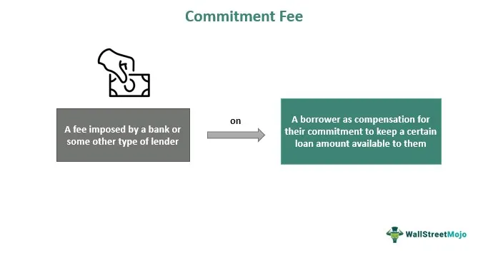

In the complex world of finance, understanding key terms is crucial for investors and professionals alike. Financial literacy is not merely an academic endeavor; it is a practical necessity for making informed decisions that can significantly impact one's financial well-being. This article aims to demystify some core financial terms, including 'front fee' and 'algo trading', providing clarity and insight. These concepts are not just jargon but are integral to strategies that drive financial markets.

As financial markets continue to evolve, these concepts play significant roles in shaping investment strategies and outcomes. For instance, understanding how a front fee can affect the overall cost of an investment allows for more strategic planning, while recognizing the efficiencies introduced by algorithmic trading can provide a competitive edge in today's fast-paced trading environment.



By grasping these terms, individuals can make more informed financial decisions and potentially enhance their investment performance. With the right knowledge, investors can better assess the costs and benefits associated with various financial products. Algorithmic trading, which utilizes computer algorithms to execute trades, represents a technological advancement that offers increased execution speed and precision. Meanwhile, understanding the implications of fees can lead to more cost-effective investment choices.

Join us as we explore the definitions, applications, and implications of these essential financial concepts. By building a foundational understanding, readers are equipped to navigate the complexities of the financial landscape, thereby maximizing their potential for achieving favorable investment outcomes.

## Table of Contents

## Understanding Financial Terms

Financial terms form the cornerstone of effective investment strategies and aid in making informed decisions. Among these, 'front fee' and 'algo trading' stand out for their significance in today's ever-evolving financial environment.

A 'front fee', or front-end load, refers to a commission paid upfront by an investor upon purchasing an investment product, such as a mutual fund. This fee compensates brokers and financial advisors for their services. While front fees can impact the net return on investment by reducing the initial amount invested, they are often considered necessary for the advice provided by professionals. Understanding the implications of front fees is vital for evaluating their cost-effectiveness and ensuring that investment choices align with financial goals.

'Algo trading', or algorithmic trading, represents a technology-driven approach to executing trades using computer algorithms. These algorithms follow predefined criteria for making trading decisions, allowing for rapid execution of trades. The efficiency and speed of algo trading have transformed market dynamics, providing investors with an edge in capturing fleeting market opportunities. Despite its advantages, algo trading comes with potential risks, such as technical glitches or model inaccuracies, necessitating a thorough understanding of its mechanisms and strategies.

Mastering these concepts not only enhances one's comprehension of financial markets but also unearths lucrative investment opportunities. Whether embarking on your investment journey or seeking to refine your strategies, grasping these financial terms is indispensable, offering valuable insights and potentially boosting investment outcomes.

## What is a Front Fee?

A front fee, commonly known as a front-end load, represents an initial charge or commission that an investor incurs when purchasing an investment, typically mutual funds. These fees are primarily used to compensate brokers and financial planners for their services in facilitating the transaction. Understanding the implications of front fees is essential for evaluating investment costs and potential returns.

Front fees are generally a percentage of the total investment amount. For instance, if a mutual fund imposes a front fee of 5%, and an investor wishes to invest $10,000, the actual amount invested would be $9,500 after deducting the $500 fee. This initial reduction in capital can affect the overall growth potential of the investment, as there is less principal [earning](/wiki/earning-announcement) returns from the outset.

### Impact on Investment Returns

Front fees can significantly impact investment returns, especially over short investment horizons. By reducing the initial investment amount, they lower the effective amount subject to compound growth, potentially resulting in diminished returns relative to investments without such fees. This is particularly pronounced in the early years of the investment when the compound interest effect is just beginning to take hold.

To quantify this, consider the formula for compound returns: 

$$
A = P(1 + r)^n
$$

where $A$ is the amount of money accumulated after n years, including interest, $P$ is the principal investment amount, $r$ is the annual interest rate, and $n$ is the number of years the money is invested. A lower initial $P$ due to a front fee will consequently yield a lower $A$, all else being equal.

### Why Front Fees are Charged

Front fees are primarily levied to remunerate intermediary [agents](/wiki/agents) who provide valuable services such as investment advice, portfolio management, and administrative support. These agents ensure that investments align with the client's financial goals and risk appetite, and the upfront charges serve as their compensation.

### Pros and Cons of Investing in Funds with Front Fees

#### Pros:

1. **Professional Guidance**: The fees often facilitate access to financial advisors, who provide expertise and tailored investment strategies.

2. **High Quality Management**: Funds with front fees may be managed by seasoned professionals with a strong investment track record.

#### Cons:

1. **Reduced Initial Investment**: Immediate deduction from the investment capital, leading to potentially lower returns.

2. **Longer Breakeven Point**: Investors need higher returns just to recoup the initial fee, which may not be feasible in all scenarios.

### Evaluating the Value of Front Fees

To assess whether front fees are justified, investors should consider factors such as their investment horizon, the historical performance of the fund, and the quality of the associated advisory services. Long-term investors might weigh the potential benefit of professional management against the upfront cost, particularly if the fund historically outperforms its peers.

In summary, front fees are a key consideration in many investment products, influencing both the immediate and future value of an investment. With careful evaluation, investors can better determine when bearing these fees is worthwhile, ultimately aiding in more informed and cost-effective investment decision-making.

 to Algo Trading

Algorithmic trading, commonly referred to as algo trading, is a method of executing trades using programmed instructions based on predefined criteria. These instructions can involve a wide array of strategies, including timing, price, quantity, and other complex mathematical models. The core advantage of algo trading lies in its ability to perform trades at a much higher speed than a human trader, often within milliseconds, and with a precision that mitigates manual intervention errors.

The increasing popularity of algo trading can be attributed to its efficiency and effectiveness in rapidly changing financial markets. Algorithms can process vast amounts of market data almost instantaneously, allowing traders to exploit short-lived trading opportunities that might be missed by traditional trading methods. Furthermore, automated trading reduces the impact of emotional biases that can affect human decision-making, promoting more disciplined and objective trading practices.

Algorithmic trading systems are typically built using a combination of advanced statistical models and complex mathematical formulas. These systems require significant computational power to analyze market data in real-time and identify potential trading opportunities. For example, a basic algorithm might involve executing a trade when a stock’s moving average crosses a specific threshold:

```python
import pandas as pd

# Simulated stock price data
data = {'price': [100, 102, 101, 103, 104, 105, 107, 106, 108, 110]}
df = pd.DataFrame(data)

# Calculate moving averages
short_window = 3
long_window = 5

df['short_mavg'] = df['price'].rolling(window=short_window, min_periods=1).mean()
df['long_mavg'] = df['price'].rolling(window=long_window, min_periods=1).mean()

# Determine buy signals
df['signal'] = 0
df['signal'][short_window:] = \
    (df['short_mavg'][short_window:] > df['long_mavg'][short_window:]).astype(int)

# Calculate positions
df['positions'] = df['signal'].diff()

print(df)
```

This Python example illustrates a simple moving average crossover strategy. When the short-term moving average exceeds the long-term moving average, a buy signal is generated. Conversely, a sell signal is generated when the opposite occurs.

Despite its benefits, algo trading is not without risks. Algorithms can lead to market [volatility](/wiki/volatility-trading-strategies), often exacerbating rapid price changes. Additionally, they can malfunction due to flawed programming or unexpected market conditions, potentially resulting in substantial losses. Therefore, robust risk management protocols and thorough [backtesting](/wiki/backtesting) are crucial in the development and deployment of trading algorithms.

Common algo trading strategies include statistical [arbitrage](/wiki/arbitrage), [market making](/wiki/market-making), [momentum](/wiki/momentum) strategies, and mean reversion, each exploiting different market inefficiencies. The impact of these strategies on market dynamics is significant. They contribute to market [liquidity](/wiki/liquidity-risk-premium), reduce bid-ask spreads, and can lead to more accurate price discovery.

In conclusion, [algorithmic trading](/wiki/algorithmic-trading) plays a vital role in modern financial markets. Understanding its functioning, benefits, and risks is essential for investors and firms looking to harness its potential.

## The Intersection of Front Fees and Algo Trading

Front fees and algorithmic trading, while distinct concepts, can have intersecting influences in the financial market, shaping the decisions of investors and altering fee structures. The emergence of algorithmic trading has prompted a reevaluation of cost considerations, including front fees, which are charged primarily by mutual funds as initial commissions to compensate brokers and financial planners.

### Impact on Investment Choices

Algorithmic trading offers the capability to execute trades based on complex algorithms rapidly. This efficiency attracts investors seeking to maximize returns and minimize costs. With algorithm-driven funds, the focus often shifts to reducing overhead costs, including front fees. Lower or zero front fees can make algorithm-driven funds more attractive by enhancing net returns. For example, a mutual fund with a 3% front fee requires an investor to first recover this cost through asset appreciation or dividends, posing a barrier to achieving quick gains.

### Technological Advancements and Fee Structures

The integration of sophisticated technology in trading systems has sparked a competitive environment among financial service providers. Technological improvements allow for the reduction of trading costs and more efficient fee structures. Algorithmic trading platforms often employ lower fee models, such as no-load mutual funds or exchange-traded funds (ETFs), which do not charge front fees. This reduction in fees is partly due to the streamlined operations and economies of scale that algorithmic trading enables.

### The Influence of Cost-Efficiency

Sophisticated investors might opt for funds with lower front fees, aiming to leverage the cost-efficiency provided by algorithmic trading. For example, consider an investor choosing between two funds: Fund A with a front fee of 2% and an average annual return of 5%, and Fund B with no front fee but a slightly lower average annual return of 4.8%. In a simple calculation, the investor might determine that Fund B, with its algorithmic trading strategies, offers more favorable long-term net returns despite the marginally lower nominal return due to the absence of upfront fees.

### Python Example

Let's illustrate how an investor could evaluate this using Python:

```python
def calculate_net_return(initial_investment, annual_return, front_fee, years):
    net_investment = initial_investment * (1 - front_fee)
    return_value = net_investment * ((1 + annual_return)**years)
    return return_value

initial_investment = 10000
years = 5
fund_a_return = calculate_net_return(initial_investment, 0.05, 0.02, years)
fund_b_return = calculate_net_return(initial_investment, 0.048, 0.0, years)

fund_a_return, fund_b_return
```

### Result 

Running the above code, we find that Fund B potentially provides higher net returns over five years despite the absence of a front fee, illustrating how algorithmic funds might benefit investors in the long term.

Understanding the interaction between front fees and algorithmic trading is crucial for investors seeking to navigate the evolving terrain of financial products. Technology-driven changes in trading and fee structures enhance transparency and cost-efficiency, prompting investors to reconsider the advantages of traditional financial models and embrace innovative strategies that optimize returns.

## Conclusion

Understanding financial terms such as front fees and algorithmic trading is crucial for anyone engaged in the financial sector. These concepts not only underpin the mechanics of financial markets but also offer valuable insights for formulating effective investment strategies. Front fees, typically associated with mutual funds, represent an upfront cost for acquiring an investment, impacting the total returns. Conversely, algorithmic trading leverages advanced computer algorithms to execute trades with precision and speed, influencing market dynamics and offering innovative ways of investing. 

By gaining knowledge about these terms, investors are empowered to make informed decisions, potentially improving their investment outcomes. The financial landscape is continually evolving, with technological advancements and shifting market conditions. Staying informed about these developments is essential. 

We hope this article has enriched your understanding and encouraged you to further explore the complexities and opportunities within the financial world.

## References & Further Reading

[1]: Bergstra, J., Bardenet, R., Bengio, Y., & Kégl, B. (2011). ["Algorithms for Hyper-Parameter Optimization."](https://papers.nips.cc/paper/4443-algorithms-for-hyper-parameter-optimization) Advances in Neural Information Processing Systems 24.

[2]: ["Advances in Financial Machine Learning"](https://www.amazon.com/Advances-Financial-Machine-Learning-Marcos/dp/1119482089) by Marcos Lopez de Prado.

[3]: ["Evidence-Based Technical Analysis: Applying the Scientific Method and Statistical Inference to Trading Signals"](https://www.amazon.com/Evidence-Based-Technical-Analysis-Scientific-Statistical/dp/0470008741) by David Aronson.

[4]: ["Machine Learning for Algorithmic Trading"](https://github.com/stefan-jansen/machine-learning-for-trading) by Stefan Jansen.

[5]: ["Quantitative Trading: How to Build Your Own Algorithmic Trading Business"](https://github.com/LucindaYa/quant-resources/blob/master/Quantitative%20Trading%20How%20to%20Build%20Your%20Own%20Algorithmic%20Trading%20Business.pdf) by Ernest P. Chan.