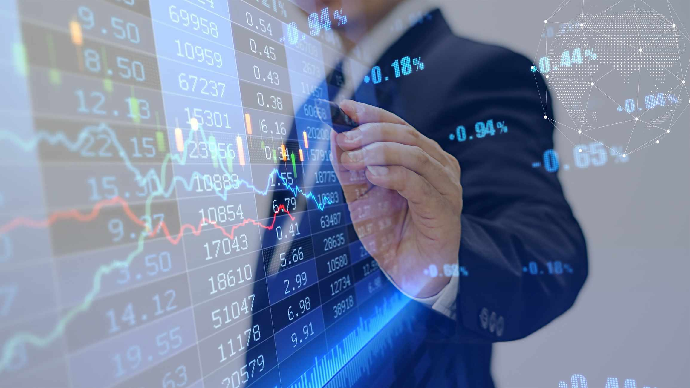

Financial markets are pivotal to the global economy as they facilitate the exchange of financial instruments, including stocks, bonds, commodities, and derivatives. These markets enable businesses to raise capital, manage risks, and invest in innovation while allowing investors to earn returns on their capital. Among the various instruments traded in these markets, futures contracts play a crucial role. A futures contract is a standardized agreement to buy or sell an asset at a predetermined price at a specified time in the future. Initially introduced to help producers and consumers hedge against price volatility, futures contracts now serve numerous purposes, including speculation and portfolio diversification, contributing significantly to the overall efficiency and liquidity of financial markets.

Algorithmic trading, also known as algo trading or automated trading, leverages computer algorithms to manage the trading process. These algorithms execute trades based on predefined criteria such as price, timing, or volume, thereby enhancing the speed and precision of trading activities. Over the past few decades, algorithmic trading has dramatically reshaped futures trading, offering participants advantages like reduced transaction costs, minimization of human errors, and the ability to exploit market inefficiencies.



This article focuses specifically on front month futures contracts in the context of algorithmic trading. Front month futures are those contracts with the closest expiration date, which tend to exhibit higher liquidity and volatility compared to longer-dated contracts. Such characteristics make them a focal point for traders leveraging algorithmic strategies, prompting a unique set of opportunities and challenges.

The objective of this article is to provide an in-depth understanding of front month futures contracts and their integration with algorithmic trading strategies. Readers can expect to learn about the core characteristics of front month futures, the nuances of deploying algorithmic strategies in futures markets, and the benefits, challenges, and future prospects of this contemporary trading approach. By comprehending these elements, traders and market participants can develop informed strategies that capitalize on the potential of algorithmic trading in navigating the dynamic landscape of futures markets.

## Table of Contents

## Understanding Front Month Futures Contracts

Front month futures contracts are the nearest expiry futures contracts available in the marketplace. These contracts typically attract significant attention from traders due to their proximity to delivery or settlement. The characteristics of front month futures include shorter time horizons until expiration and generally higher trading volumes compared to contracts with longer maturity dates.

Traders focus on front month contracts for several reasons, with liquidity and volatility being two primary factors. Due to their soon-to-expire nature, these contracts tend to see increased trading activity, providing higher liquidity. This liquidity is advantageous for traders as it ensures the ability to enter and exit positions quickly without significant price slippage. Additionally, front month contracts often exhibit greater volatility, presenting opportunities for traders to capitalize on rapid price movements.

In trading strategies, front month futures are frequently utilized for short-term speculation and tactical maneuvers. Traders might engage in strategies such as [day trading](/wiki/day-trading-spy) or [scalping](/wiki/gamma-scalping), leveraging the heightened activity in front month contracts to execute multiple trades in short intervals. Moreover, due to their higher [volatility](/wiki/volatility-trading-strategies), these contracts provide fertile ground for implementing strategies that exploit intraday price swings.

Front month futures are also crucial in risk management and speculative activities. Businesses that require hedging against price fluctuations of underlying assets often prefer the front month contracts for their hedging activities. The closer expiry aligns more closely with their shorter-term exposure, making these instruments a preferred choice to mitigate risk effectively. Conversely, speculators might focus on front month contracts to take advantage of rapid price changes, aiming to achieve significant returns by predicting market movements accurately.

Understanding the unique attributes of front month futures contracts is vital for traders and investors who seek to optimize their portfolios through targeted speculation or precise risk management. As such, these instruments play a significant role in the overall dynamics of futures markets.

## The Role of Algorithmic Trading in Futures Markets

Algorithmic trading refers to the use of computer algorithms to automate trading decisions and execute orders in financial markets, including futures markets. It involves the application of complex mathematical models and formulas to analyze market data and generate trade signals. The importance of [algorithmic trading](/wiki/algorithmic-trading) in the modern trading environment is profound, as it brings increased efficiency, precision, and speed compared to manual trading.

Algorithms are fundamentally used to execute trades based on predefined strategies. These strategies incorporate various parameters such as price, timing, and [volume](/wiki/volume-trading-strategy), programmed into the algorithm, which then autonomously monitors and acts upon market conditions. For example, an algorithm can be designed to buy a futures contract if its price falls below a certain threshold and sell it when the price reaches a target level. This allows traders to react to market changes without the need for continuous manual oversight.

One of the main advantages of algorithmic trading is its speed. Algorithms can analyze vast amounts of data and execute trades in milliseconds, a feat unattainable by human traders. This speed advantage enables traders to capitalize on short-lived market conditions and price discrepancies. Additionally, algorithmic trading enhances trading efficiency by minimizing transaction costs and reducing human error.

Another significant benefit is the ability to process large volumes of data. Modern trading systems harness the computing power of high-performance hardware and sophisticated software, allowing them to evaluate multiple data streams simultaneously and identify patterns or signals for potential trades. This capability is essential for managing the complexity and scale of current financial markets.

Several common types of algorithms are utilized in futures trading, including trend-following algorithms, [arbitrage](/wiki/arbitrage) strategies, and market-making strategies. Trend-following algorithms are designed to capture gains through the sustained movement of prices in one direction. Arbitrage strategies seek to exploit price differences between related markets or instruments to make a profit. Market-making algorithms provide [liquidity](/wiki/liquidity-risk-premium) by continuously quoting buy and sell prices and profiting from the spread.

The growth of algorithmic trading has been significantly facilitated by technological advancements. High-frequency trading ([HFT](/wiki/high-frequency-trading-strategies)) systems, driven by powerful computational technology and high-speed data transmission networks, have revolutionized the pace at which trades are executed. Additionally, sophisticated trading platforms and the evolution of [machine learning](/wiki/machine-learning) and [artificial intelligence](/wiki/ai-artificial-intelligence) have further enhanced the capability to develop and optimize trading algorithms. These technologies enable the continuous improvement of algorithms, adapting them to ever-changing market dynamics and efficiently managing the complexities of futures trading.

In conclusion, algorithmic trading represents a cornerstone of modern futures markets, offering remarkable advantages in speed, efficiency, and data processing capabilities. As technology continues to evolve, the prominence and sophistication of algorithm-driven strategies are likely to increase, further shaping the future of financial markets.

## Benefits of Algorithmic Trading with Front Month Futures Contracts

Algorithmic trading offers a range of benefits when applied to front month futures contracts. These advantages stem from the ability of trading algorithms, or algos, to efficiently leverage the inherent characteristics of these contracts.

Front month futures contracts are known for their high liquidity and pronounced volatility, making them a fertile ground for traders looking to exploit rapid market changes. Algorithms are particularly adept at navigating these conditions because they can process and execute trades far faster than a human trader. The speed offered by algorithmic trading allows for the quick capturing of short-term price movements—opportunities that might be missed in the brief time a manual execution takes. 

Moreover, algorithms are designed to identify inefficiencies in the market. For instance, an algorithm running a trend-following strategy might detect patterns that indicate the continuation of a price surge, enabling it to enter and [exit](/wiki/exit-strategy) trades with precision. Similarly, arbitrage algorithms can exploit price discrepancies between the futures and spot markets or between correlated assets, capitalizing on these differences before the market adjusts.

Another significant benefit of algorithmic trading in the context of front month futures is its capacity to minimize emotional decision-making. In highly volatile markets, human traders may fall prey to cognitive biases, such as fear of loss or greed, potentially leading to irrational trading decisions. Algorithms, devoid of emotions, strictly adhere to predefined rules, ensuring decisions are consistently aligned with the trader’s strategy without being influenced by psychological factors.

A notable example illustrating the advantages of algo trading in front month futures can be observed in the operations of high-frequency trading (HFT) firms. These firms leverage sophisticated algorithms to transact large volumes of trades at high speeds, often holding positions for mere seconds. By doing so, they can profit from micro-changes in market prices that occur within the front month period—something difficult to achieve manually.

In conclusion, algorithmic trading, when applied to front month futures contracts, provides traders with the ability to efficiently harness market liquidity and volatility, exploit short-term price inefficiencies, and mitigate the risks associated with human emotional biases. These capabilities contribute to more disciplined and potentially more profitable trading outcomes.

## Challenges and Risks of Algorithmic Trading in Front Month Futures

Algorithmic trading in front month futures contracts offers numerous advantages, yet it comes with distinct challenges and risks that traders must navigate to achieve success. Understanding these risks is crucial for developing robust trading strategies and ensuring market integrity.

One significant risk is market mispricing, which occurs when algorithms misinterpret or fail to react appropriately to market signals, leading to erroneous trades. The rapid pace at which algorithms execute trades can exacerbate minor mispricings into substantial financial losses. Technological failures pose another hazard; issues such as server downtime, network latency, or software bugs can interrupt trade execution and result in missed trading opportunities or unexpected positions.

Algorithmic errors, whether due to coding flaws or logical misconceptions, can also have severe consequences. An algorithm executing unintended trades due to a programming error can lead to financial loss and disrupt the market, especially if operating at high volumes.

Regulatory compliance is a critical component of algorithmic trading. Regulators around the globe have instituted frameworks to ensure that high-speed trading practices do not undermine market fairness and transparency. Traders must adhere to these regulations, which often involve rigorous testing, documentation, and real-time monitoring of algorithms. Compliance processes target not only the prevention of market manipulation and insider trading but also ensure that algorithms function within set risk parameters.

High-frequency trading (HFT), a subset of algorithmic trading, can significantly impact market stability and liquidity. While HFT can enhance liquidity by facilitating rapid trade execution, it can also lead to market volatility, particularly during times of stress when HFT algorithms withdraw liquidity from the market. The 2010 Flash Crash is a notable example of such volatility, where automated trades exacerbated a market downturn within minutes.

To mitigate these challenges, traders can employ several risk management strategies. Regular algorithm audits and updates are essential to ensure they remain aligned with current market conditions. Stress testing algorithms under simulated unfavorable market scenarios can help identify potential weaknesses. Implementing circuit breakers that halt trading during erratic market movements or when pre-defined risk thresholds are reached can also prevent significant losses.

Moreover, maintaining a diversified set of algorithms that operate under various strategies can reduce the impact of a single algorithm's failure. Traders should also leverage real-time monitoring tools that detect anomalies or deviations from expected trading patterns, allowing for swift corrective action. These risk management measures not only protect individual traders but also contribute to the overall stability and integrity of futures markets.

## Developing Strategies for Front Month Futures Algo Trading

Developing algorithmic trading strategies for front month futures contracts involves a systematic approach that leverages both historical data analysis and continuous optimization. Traders aim to create robust models that can adapt to the fast-paced nature of these contracts while maximizing profitability. Here is a structured approach to developing these strategies.

### Backtesting Strategies on Historical Data
Backtesting is a crucial step in the development of any algorithmic trading strategy. It involves testing a trading hypothesis using historical data to validate its effectiveness before deploying it in live markets. For front month futures contracts, traders should focus on:

- **Data Collection**: Gather comprehensive historical data, including price, volume, and any relevant market indicators. Given the liquidity and volatility of front month contracts, high-frequency data can provide insights into price patterns and potential trading opportunities.

- **Algorithm Implementation**: Implement the trading strategy as a programmatic algorithm in a language like Python. For example, using libraries such as pandas and numpy for data manipulation, traders can efficiently process large datasets. 

```python
import pandas as pd

def calculate_moving_average(data, window):
    return data['Price'].rolling(window=window).mean()
```

- **Performance Metrics**: Evaluate the strategy using key performance indicators such as Sharpe ratio, maximum drawdown, and win/loss ratio. These metrics help assess the risk-adjusted returns and potential pitfalls.

- **Walk-Forward Analysis**: To ensure the robustness of the strategy, traders can adopt walk-forward analysis, which involves continuously testing the strategy on different data subsets to avoid overfitting to a single historical period.

### Continual Updating and Optimization
Markets are dynamic, and the assumptions that underlie a profitable strategy today may not hold tomorrow. Therefore, traders need to:

- **Adaptive Algorithms**: Implement algorithms that can adapt based on new market conditions. Techniques like reinforcement learning can be used to dynamically update strategy parameters based on real-time feedback.

- **Periodic Review**: Regularly revisit and revise strategies based on recent performance data and any changes in market conditions. 

### Tools and Platforms for Algo Development
Several platforms facilitate the development, testing, and execution of algorithmic trading strategies:

- **QuantConnect**: An algorithmic trading platform that supports backtesting and live trading in various markets, providing tools for strategy development in C# and Python.

- **MetaTrader**: Popular for forex and futures trading, this platform offers algorithmic trading capabilities through its integrated development environment (IDE) for creating trading bots or Expert Advisors.

- **Python Libraries**: Libraries such as backtrader and Zipline offer frameworks for developing, testing, and deploying trading strategies. They provide modules for data handling, analysis, and performance evaluation.

### Role of Data Analysis and Machine Learning
Data analysis and machine learning form the backbone of modern algorithmic trading strategies:

- **Feature Engineering**: Develop features that capture the essential dynamics of front month futures. This could include time-based features, momentum indicators, or statistical relationships with other financial instruments.

- **Machine Learning Models**: Use machine learning models for predictive analytics. Techniques such as decision trees, support vector machines, and neural networks can discover complex patterns in data that may not be apparent through traditional methods.

- **Model Evaluation**: Implement cross-validation techniques to ensure that machine learning models generalize well to unseen data. 

This structured approach equips traders with the capability to develop innovative algorithmic trading strategies for front month futures, taking advantage of technological advancements to enhance their trading performance.

## The Future of Algorithmic Trading in Front Month Futures Markets

Algorithmic trading in front month futures markets is on a trajectory of continual transformation, driven by technological advancements and evolving global economic conditions. Several trends and developments are likely to shape its future.

AI and machine learning are poised to revolutionize algorithmic trading strategies. These technologies enhance the ability to analyze massive datasets in real-time, uncover patterns, and make data-driven decisions with unprecedented accuracy. Machine learning models can be trained to predict market movements by identifying subtle relationships in historical data, thereby improving the precision of trading strategies. For instance, neural networks and [deep learning](/wiki/deep-learning) algorithms can process complex input features and adapt to changing market dynamics more effectively than traditional statistical methods.

Emerging technologies such as blockchain also have the potential to impact futures trading significantly. Blockchain could enhance transparency, reduce transaction costs, and ensure the integrity of trade executions. Smart contracts, facilitated by blockchain, could be employed to automate settlements and enforce trade terms without the need for intermediaries, thus increasing efficiency and trust among participants.

Global economic changes are another [factor](/wiki/factor-investing) influencing trading algorithms. Economic indicators, changes in monetary policy, geopolitical tensions, and macroeconomic trends can all cause shifts in market behavior. Algorithms must be adapted to account for these variables, requiring continual updates to remain effective. A robust algorithmic framework would integrate economic forecasts and sentiment analysis to anticipate and react swiftly to such changes.

To stay ahead in this evolving landscape, traders should focus on continuous learning and adaptation. This involves [backtesting](/wiki/backtesting) trading strategies on up-to-date data, optimizing algorithmic models, and being proactive in adopting new technologies. Utilizing specialized platforms and tools that provide comprehensive analytics and strategy development capabilities can be crucial. Traders should also consider engaging in collaborative environments that foster innovation, allowing them to leverage collective expertise.

In summary, the future of algorithmic trading in front month futures markets is expected to be heavily influenced by AI and machine learning, blockchain technology, and global economic fluctuations. Adaptability, technological acumen, and proactive strategy refinement will be critical for traders aiming to thrive in this advancing arena.

## Conclusion

In summary, this article has highlighted the integral role of front month futures contracts in the landscape of algorithmic trading. Front month futures offer traders heightened liquidity and volatility, making them attractive for short-term trading strategies. Algorithmic trading further enhances the potential of these contracts by providing precision, efficiency, and the capability to handle massive data sets. Together, these elements enable traders to exploit market inefficiencies and make informed decisions devoid of emotional bias.

However, this combination is not without its challenges. Potential pitfalls include algorithmic errors, technological glitches, and the risks associated with high-frequency trading, which could impact market stability. Furthermore, regulatory considerations must be duly adhered to ensure compliance and mitigate risks. Traders must be diligent in developing robust risk management strategies to navigate these challenges effectively.

For those looking to create their own trading strategies, this article serves as a foundation, encouraging an approach that focuses on continuous learning and adaptation. Tools such as backtesting and optimization, coupled with data analysis and machine learning, are essential for refining strategies in this fast-paced trading environment. 

As the landscape of trading technologies evolves, staying informed is crucial. With advancements like artificial intelligence and blockchain poised to shape the future, traders have an opportunity to leverage these technologies to enhance their strategies further. Readers are encouraged to keep exploring topics related to financial markets and trading technologies to remain competitive and adaptive in a constantly changing market.

## References & Further Reading

[1]: Bergstra, J., Bardenet, R., Bengio, Y., & Kégl, B. (2011). ["Algorithms for Hyper-Parameter Optimization."](https://papers.nips.cc/paper/4443-algorithms-for-hyper-parameter-optimization) Advances in Neural Information Processing Systems 24.

[2]: ["Advances in Financial Machine Learning"](https://www.amazon.com/Advances-Financial-Machine-Learning-Marcos/dp/1119482089) by Marcos Lopez de Prado

[3]: ["Evidence-Based Technical Analysis: Applying the Scientific Method and Statistical Inference to Trading Signals"](https://www.amazon.com/Evidence-Based-Technical-Analysis-Scientific-Statistical/dp/0470008741) by David Aronson

[4]: ["Machine Learning for Algorithmic Trading"](https://github.com/stefan-jansen/machine-learning-for-trading) by Stefan Jansen

[5]: ["Quantitative Trading: How to Build Your Own Algorithmic Trading Business"](https://www.amazon.com/Quantitative-Trading-Build-Algorithmic-Business/dp/1119800064) by Ernest P. Chan