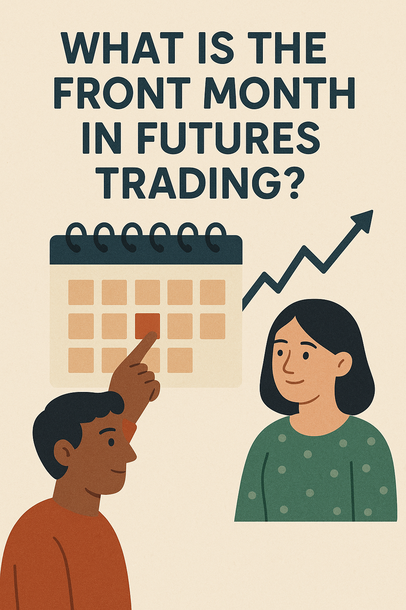

## Table of Contents

## What is the front month in futures trading?

In futures trading, the front month refers to the futures contract that is closest to expiring. This means it is the next contract that will reach its delivery or settlement date. Traders and investors often pay close attention to the front month because it gives them the most immediate information about the market's current conditions and expectations.

The front month is important because it is usually the most actively traded contract. This high level of activity can lead to more liquidity, which makes it easier for traders to buy and sell contracts. As the front month contract nears its expiration, traders will often shift their focus to the next month's contract, which then becomes the new front month.

## How is the front month determined?

The front month in futures trading is simply the contract that will expire soonest. Every futures contract has a set date when it will end, and the one with the closest end date is called the front month. For example, if you are looking at oil futures, and the contracts available are for January, February, and March, the January contract would be the front month because it expires first.

As time goes on, the front month changes. Once the current front month contract expires, the next closest contract becomes the new front month. So, using the oil futures example again, after January's contract expires, February's contract becomes the front month. This rolling process keeps the market focused on the most immediate future, helping traders make decisions based on the latest information.

## Why is the front month important for traders?

The front month is important for traders because it shows what people think will happen soon in the market. It's the futures contract that will end first, so it gives the newest information about what might happen with prices. Traders watch the front month closely because it's usually the one that's traded the most. When lots of people are buying and selling, it's easier for traders to do their trades too.

As the front month gets close to ending, traders start to look at the next month's contract. This helps them keep up with what's happening and plan their next moves. By always focusing on the front month, traders can make better decisions based on the latest market news and trends.

## What is the difference between the front month and back months?

The front month and back months are terms used in futures trading. The front month is the futures contract that will expire soonest. It's important because it gives the most recent information about what people think will happen with prices in the near future. Traders pay close attention to the front month because it's usually the most actively traded, which means it's easier to buy and sell these contracts.

Back months, on the other hand, are all the futures contracts that will expire after the front month. These contracts are further out in time, so they reflect what people expect to happen in the more distant future. While they might not be traded as much as the front month, they are still important for traders who want to plan for the long term or hedge against future price changes. As time goes on, a back month contract will eventually become the new front month when the current front month expires.

## How does the front month affect the pricing of futures contracts?

The front month affects the pricing of futures contracts because it is the contract that will expire soonest. Since it's the most immediate, it shows what people think will happen with prices very soon. Traders look at the front month to see what's happening right now in the market. Because the front month is usually traded a lot, it can influence the prices of other contracts. If the price of the front month goes up or down a lot, it can make people think about changing their trades in other months too.

As the front month gets close to expiring, traders start to pay more attention to the next month's contract. This shift can cause the prices of the back months to change too. For example, if the front month's price is high and it's about to expire, traders might buy the next month's contract, which could make its price go up. So, the front month not only tells us about the current market but also helps set the stage for what might happen with prices in the future.

## What are the risks associated with trading front month contracts?

Trading front month contracts can be risky because they are about to expire soon. If you hold onto a front month contract until it expires, you might have to take delivery of the actual commodity, like oil or wheat. If you don't want the actual stuff, you'll need to sell your contract before it expires. This can be stressful because you might have to sell it at a bad price if the market moves against you.

Another risk is that the front month contracts can be more volatile. Since they are the most actively traded, their prices can change a lot in a short time. This means you could lose money quickly if the market goes the wrong way. It's important to keep an eye on the market and be ready to make quick decisions when trading front month contracts.

## How can traders use the front month to predict market trends?

Traders can use the front month to predict market trends by looking at how its price is moving. Since the front month is the futures contract that will expire soonest, it shows what people think will happen with prices in the very near future. If the price of the front month is going up, it might mean that people expect prices to go up soon. If it's going down, it could mean they expect prices to drop. By watching these price changes, traders can get a sense of where the market might be headed.

Another way traders use the front month is by comparing it to the back months. If the front month's price is a lot different from the back months, it can tell traders about the market's short-term versus long-term expectations. For example, if the front month is much higher than the back months, it might mean there's a short-term event or news that's pushing prices up, but people think things will calm down later. By understanding these differences, traders can make better guesses about future market trends and plan their trades accordingly.

## What strategies are effective for trading front month futures?

One effective strategy for trading front month futures is to closely watch the price movements and trade based on short-term trends. Since the front month contract is the one that will expire soonest, it's usually the most actively traded. This means you can see quick changes in price that might show what people think will happen soon. If you see the price going up, you might want to buy the contract, hoping to sell it later at a higher price. If the price is going down, you might want to sell it, hoping to buy it back later at a lower price. This strategy works well if you're good at spotting these short-term trends and can act quickly.

Another strategy is to use the front month to hedge against price changes in the spot market. If you're worried that the price of something you need to buy or sell will go up or down soon, you can use the front month futures contract to protect yourself. For example, if you need to buy oil in a month and you're worried the price will go up, you can buy a front month oil futures contract now. If the price does go up, the gain on your futures contract can help cover the higher cost of the oil. This way, you can manage your risk better and feel more secure about future price changes.

## How does the roll-over process work from the front month to the next month?

The roll-over process in futures trading happens when the front month contract is about to expire. Traders need to move their positions from the expiring front month to the next month's contract. This is called rolling over. They do this by selling the front month contract and buying the next month's contract at the same time. This way, they keep their position in the market but move it to a contract that will expire later.

The timing of the roll-over is important. Traders usually start rolling over their positions a few days or weeks before the front month expires. This helps them avoid the risk of having to take delivery of the actual commodity, like oil or wheat, which they might not want. By rolling over, traders can keep trading without interruption and continue to bet on future price movements. The process can affect the prices of both the front month and the next month's contracts, so traders need to watch the market closely during this time.

## What impact does the front month have on the overall futures market?

The front month has a big impact on the overall futures market because it's the contract that will expire soonest. It's like a window into what people think will happen with prices very soon. Since the front month is usually traded a lot, it can move prices up or down quickly. This can make other traders change their plans and trades too. When the front month's price goes up or down, it can make people think about buying or selling contracts for other months as well.

As the front month gets close to expiring, traders start to pay more attention to the next month's contract. This shift is called rolling over. When lots of traders roll over their positions, it can change the prices of the next month's contract. This rolling over process keeps the market moving and helps set the stage for what might happen with prices in the future. So, the front month not only tells us about the current market but also helps guide the whole futures market.

## How do changes in the front month contract specifications affect trading?

When the specifications of the front month contract change, it can really shake things up for traders. The front month is the futures contract that will expire soonest, and it's usually the one that's traded the most. If the rules about what the contract covers, like the quality of the commodity or the delivery date, change, traders might have to rethink their strategies. They might need to adjust their trades or even switch to a different contract if the new specifications don't fit their needs.

These changes can also make the market more unpredictable. Traders might be unsure about what the new rules mean for prices, so they might trade less or be more cautious. This can lead to more ups and downs in the market as everyone tries to figure out the new normal. In the end, changes in the front month contract specifications can make trading more challenging and can affect how the whole futures market works.

## What advanced analytics can be applied to front month data for better trading decisions?

Advanced analytics can help traders make better decisions by looking at front month data in new ways. One way is to use time series analysis to spot patterns in how the front month's price changes over time. This can help traders predict what might happen next. Another way is to use [machine learning](/wiki/machine-learning) to find hidden patterns in the data that might be hard to see otherwise. By training a model on past front month data, traders can get predictions about future price movements. These tools can give traders a better understanding of the market and help them make smarter trades.

Another useful tool is sentiment analysis, which looks at what people are saying about the market on social media, news, and other places. By understanding the overall mood, traders can see if people are feeling positive or negative about the front month contract. This can help them guess if prices might go up or down. Also, using risk management models can help traders understand how much risk they are taking with their front month trades. These models can show them the best ways to protect their money and make safer trading decisions. By using these advanced analytics, traders can get a clearer picture of the market and make better choices.

## References & Further Reading

[1]: Bergstra, J., Bardenet, R., Bengio, Y., & Kégl, B. (2011). ["Algorithms for Hyper-Parameter Optimization."](https://papers.nips.cc/paper/4443-algorithms-for-hyper-parameter-optimization) Advances in Neural Information Processing Systems 24.

[2]: ["Advances in Financial Machine Learning"](https://www.amazon.com/Advances-Financial-Machine-Learning-Marcos/dp/1119482089) by Marcos Lopez de Prado

[3]: ["Evidence-Based Technical Analysis: Applying the Scientific Method and Statistical Inference to Trading Signals"](https://www.amazon.com/Evidence-Based-Technical-Analysis-Scientific-Statistical/dp/0470008741) by David Aronson

[4]: ["Machine Learning for Algorithmic Trading"](https://github.com/stefan-jansen/machine-learning-for-trading) by Stefan Jansen

[5]: ["Quantitative Trading: How to Build Your Own Algorithmic Trading Business"](https://www.amazon.com/Quantitative-Trading-Build-Algorithmic-Business/dp/1119800064) by Ernest P. Chan