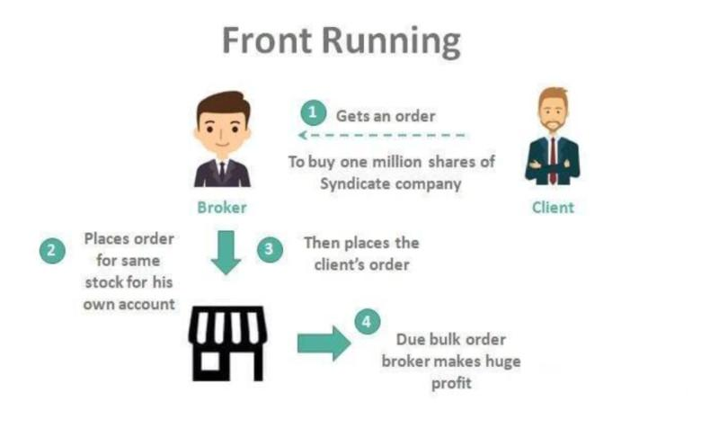

Front running is considered a highly controversial practice within financial markets due to its capacity to undermine the principles of fair and equitable trading. This illegal maneuver involves executing transactions based on non-public information to gain an advantage over other market participants. Despite its illicit nature, front running poses a significant challenge to detect and prevent, a challenge that has only magnified with the proliferation of algorithmic trading.

The automation and speed provided by algorithmic trading facilitate rapid decision-making and order execution, which can be manipulated to exploit inefficiencies and obtain advantageous market positions based on unpublished information. This article will explore the intricacies of front running within financial markets, paying particular attention to how algorithmic trading strategies play a role in facilitating or preventing such activities.

Additionally, the ethical and legal challenges that accompany front running practices will be examined. Front running erodes the trust of market participants, as it compromises the integrity and perceived fairness of the markets. Consequently, regulatory bodies have developed various measures to identify and deter front running. Understanding these strategies is essential, not only for maintaining fairness but also for enforcing regulations effectively.

As financial markets continue to evolve alongside technological advancements, the issue of front running must be managed vigilantly. This requires a balanced approach that integrates innovation in trading technology with stringent ethical guidelines and robust legal frameworks to preserve market integrity.

## Table of Contents

## Understanding Front Running

Front running is an illegal trading practice where individuals exploit non-public information to execute transactions ahead of pending market orders, thereby obtaining an unfair advantage over other participants. This unethical behavior typically involves brokers or traders acting on insider information or executing trades before fulfilling customer orders, allowing them to profit from anticipated market movements.

In essence, front running undermines the integrity of financial markets by creating an uneven playing field. This malpractice not only disadvantages regular investors but also erodes trust in the financial system. Participants engaged in front running may leverage their access to privileged information, such as large pending customer orders or undisclosed company announcements, to position themselves advantageously in the market.

The detection of front running has become increasingly complex with the evolution of electronic trading platforms and the proliferation of [algorithmic trading](/wiki/algorithmic-trading) strategies. These technologies have enhanced trading efficiency and reduced transaction times, but they have also provided sophisticated means for executing trades that can obscure malicious activities like front running. Algorithms, capable of analyzing market data at lightning speed, can be programmed to engage in strategic trade executions, sometimes leveraging information asymmetries to reap swift benefits.

As the financial landscape continues to embrace technological innovations, ensuring compliance with ethical trading standards is vital. Institutions must adopt effective surveillance systems and reinforce ethical guidelines to detect and deter front running, thereby preserving market fairness and integrity.

## Mechanisms and Techniques of Front Running

Front running is executed through various techniques that are based on exploiting asymmetrical access to market information. This section outlines the primary mechanisms of front running, including insider trading, trading ahead of customer orders, and high-frequency trading.

**Insider Trading**

Insider trading occurs when individuals with privileged access to non-public information, such as forthcoming trades or company announcements, use this knowledge to conduct their trades. This unethical advantage allows insider traders to enter or [exit](/wiki/exit-strategy) positions in anticipation of the market movements that result from the pending disclosures. Such activities are illegal as they erode trust in market fairness. The detection of insider trading is challenging but critical, as it relies on identifying unusual trading activity that coincides with significant market events.

**Trading Ahead of Customer Orders**

Another mechanism is the practice of entering trades based on the knowledge of pending customer orders. Brokers, utilizing insights into the anticipated trading activities of their clients, might execute their own trades first to benefit from expected price movements. This creates a situation where brokers prioritize their interests over those of their clients, leading to a conflict of interest that damages client trust and market integrity. This practice is often more detectable than others because it typically involves a clear pattern of trade sequencing that can be discerned with proper surveillance.

**High-Frequency Trading (HFT)**

High-frequency trading involves the use of sophisticated algorithms and high-speed data networks to execute large volumes of trades at rapid speeds. While [HFT](/wiki/high-frequency-trading-strategies) can contribute to market [liquidity](/wiki/liquidity-risk-premium) and efficiency, it can also be used to engage in front running by leveraging the speed advantage to respond to market signals more swiftly than institutional traders. For instance, by using latency advantages, HFT algorithms might predict the short-term movements of large trades and position themselves favorably. This requires robust monitoring as the distinction between legitimate high-speed trading and front running can be subtle and challenging to establish clearly.

Each of these techniques exploits differing forms of information asymmetry, and they all pose significant challenges in detection and prevention due to their often opaque nature and the sophisticated methods used to conceal them from regulators and other market participants.

## Legal and Ethical Implications of Front Running

Front running is a practice that is both illegal and unethical, largely because it undermines the principles of market fairness and diminishes investor trust. By exploiting non-public information to gain an advantage, frontrunners create an uneven playing field that disadvantages ordinary investors who do not have access to the same information. This practice is prohibited under numerous regulatory frameworks designed to ensure equitable trading environments.

In the United States, for instance, the Securities and Exchange Commission (SEC) enforces rules against front running, ensuring that market participants adhere to fair trading practices. These regulations are part of broader efforts to maintain transparency and protect investors from unethical practices. Violations can lead to severe penalties, including fines and the suspension of trading privileges. The SEC utilizes various tools and modern technology to monitor trading activities and identify potential instances of front running. These efforts are critical in deterring this unfair trading practice.

Ethical concerns associated with front running encompass the breach of fiduciary duty, where brokers prioritize their financial gains over the interests of their clients. This not only breaches trust but also can result in financial harm to investors who expect impartiality and fairness when participating in the market. Ethical trading practices necessitate that all traders operate on a level playing field, ensuring that no party has undue advantage due to insider access to information.

Overall, the legal and ethical considerations surrounding front running emphasize the need for continuous regulatory vigilance and the fostering of an ethical culture within the financial industry. Maintaining investor trust and market integrity relies on rigorous enforcement of laws and a commitment to ethical norms in trading practices.

## Algorithmic Trading and Front Running

Algorithmic trading leverages advanced computational algorithms to execute trades with speed and precision, significantly influencing the dynamics of modern financial markets. These algorithms, by processing large volumes of data and executing trades in milliseconds, can outperform human capabilities, creating opportunities for both legitimate trading strategies and potential exploitation such as front running.

Ethically, algorithmic trading presents several challenges, primarily surrounding the transparency and integrity of market data use. Transparency becomes imperative when considering the possibility of algorithms misusing non-public information. Algorithms programmed to take advantage of inside knowledge, such as impending large institutional trades or undisclosed company news, can unfairly tilt market dynamics. By parsing through data faster than manual operations, these algorithms might infer trading patterns or pending large trades, positioning ahead of other participants—a form potentially indistinguishable from front running.

Developers and traders, therefore, [carry](/wiki/carry-trading) the responsibility of ensuring that their algorithms conform to ethical norms, which includes a strict prohibition against exploiting any form of insider information. This involves maintaining strict compliance with legal standards and implementing robust ethical guidelines in the development phase of trading algorithms. Developers might employ techniques such as ensuring that the decision-making processes within algorithms lack access to non-public data inputs, using only public information or historical data.

Moreover, there should be clear segregation between the datasets accessible to trading algorithms and those containing sensitive or proprietary information. Algorithm audits and regular compliance checks can be enforced to ascertain adherence to ethical standards. For instance, traders might write algorithm documentation specifying the type of data inputs allowed and implement logging mechanisms to track the algorithms' data access patterns.

Algorithmic trading's advantages, when ethically conducted, are vast. They include improved market liquidity and efficiency and reduced trading costs. However, it's crucial that the industry remains vigilant and proactive, ensuring that the growth of algorithmic trading does not come at the cost of market fairness and integrity. Ethical adherence by traders and developers, alongside vigilant regulatory oversight, is essential in preventing the misuse of algorithms to conduct front running.

## Combating Front Running: Regulatory and Industry Efforts

Regulatory bodies, such as the U.S. Securities and Exchange Commission (SEC) and the Financial Industry Regulatory Authority (FINRA), play crucial roles in combating the practice of front running in financial markets. These organizations utilize a variety of technological methods to effectively monitor and detect illicit trading activities. Key to their efforts are advanced surveillance tools that analyze trade data in real-time to identify suspicious patterns that may indicate front running.

Technological advancements have enabled the development of sophisticated algorithms and [machine learning](/wiki/machine-learning) techniques that can sift through vast datasets to spot anomalies. For instance, pattern recognition systems can flag trades executed with unusually precise timing relative to large pending orders, a telltale sign of front running. The use of such technology allows regulators to act swiftly and with greater precision when investigating potential violations.

International cooperation among regulatory bodies also plays a significant role in the fight against front running. Given that global markets are interconnected, cross-border collaboration is essential for effective enforcement. Information-sharing agreements between countries help regulators access relevant data, thereby enhancing their ability to investigate and prosecute transgressions that may span multiple jurisdictions.

Another vital aspect of combating front running is industry-wide educational initiatives. These initiatives are designed to cultivate a culture of ethical behavior among traders and financial institutions. By educating market participants about the legal and ethical standards expected of them, these programs aim to reduce the incidence of front running and related unethical practices. Training on regulatory compliance and the importance of maintaining market integrity is often tailored to reflect the latest regulatory guidelines and ethical expectations.

Therefore, the collective efforts of regulatory bodies and industry participants are indispensable in maintaining a fair and transparent trading environment. This convergence of technological tools, international cooperation, and educational endeavors forms a comprehensive framework aimed at reducing and eventually eliminating front running from financial markets.

## Conclusion

The ongoing challenge of front running in financial markets necessitates a concerted effort involving regulators, industry professionals, and technology developers. The complexity of modern trading systems, particularly with the rise of algorithmic and high-frequency trading, has increased the difficulty of detecting and mitigating front running practices. This complexity requires an adaptive approach, where regulatory frameworks must evolve in tandem with technological advancements to effectively address these challenges. Regulators, such as the U.S. Securities and Exchange Commission (SEC) and the Financial Industry Regulatory Authority (FINRA), play a critical role by deploying sophisticated monitoring systems to detect anomalies that may indicate front running. 

The industry itself also bears responsibility for maintaining market integrity. Firms engaged in trading activities should foster an ethical culture that prioritizes fairness and transparency. This involves not only adhering to legal requirements but also implementing internal controls and educational initiatives to prevent unethical behavior at all levels. Technology developers are uniquely positioned to contribute by creating robust trading algorithms that resist manipulation and by ensuring their systems prioritize ethical standards.

Ensuring market integrity requires a delicate balance between embracing technological innovations and upholding rigorous ethical standards. As trading technology continues to evolve, so too must the legal frameworks that govern these practices. Regulators must maintain vigilance, adapting policies and leveraging technology to prevent and penalize front running effectively. By doing so, they safeguard the fairness and trust essential to the functioning of financial markets. Through collaboration and continued innovation, the goal of reducing front running can be pursued with greater efficacy, supporting a trading environment that benefits all participants fairly.

## References & Further Reading

[1]: Aiken, M., Bsat, M., & Lam, M. (2014). ["Detecting Front-Running Trades in Financial Markets."](https://pubmed.ncbi.nlm.nih.gov/24581683/) Procedia - Social and Behavioral Sciences, 109, 986-990.

[2]: Aldridge, I. (2013). ["High-Frequency Trading: A Practical Guide to Algorithmic Strategies and Trading Systems"](https://www.amazon.com/High-Frequency-Trading-Practical-Algorithmic-Strategies/dp/1118343506) by Irene Aldridge

[3]: de Prado, M. L. (2018). ["Advances in Financial Machine Learning"](https://papers.ssrn.com/sol3/papers.cfm?abstract_id=3257419) by Marcos Lopez de Prado

[4]: Hasbrouck, J. (2007). ["Empirical Market Microstructure: The Institutions, Economics, and Econometrics of Securities Trading"](https://academic.oup.com/book/52241) by Joel Hasbrouck

[5]: Pirrong, C. (2011). ["The Economics of High-Frequency Trading."](https://www.annualreviews.org/content/journals/10.1146/annurev-financial-121415-033010) Commodity Futures Trading Commission.

[6]: Securities and Exchange Commission. (2010). ["Concept Release on Equity Market Structure."](https://www.sec.gov/rules-regulations/2010/01/concept-release-equity-market-structure)

[7]: U.S. Securities and Exchange Commission (2021). ["SEC Enforcement Actions: Insider Trading Cases."](https://www.sec.gov/newsroom/press-releases/2022-129)