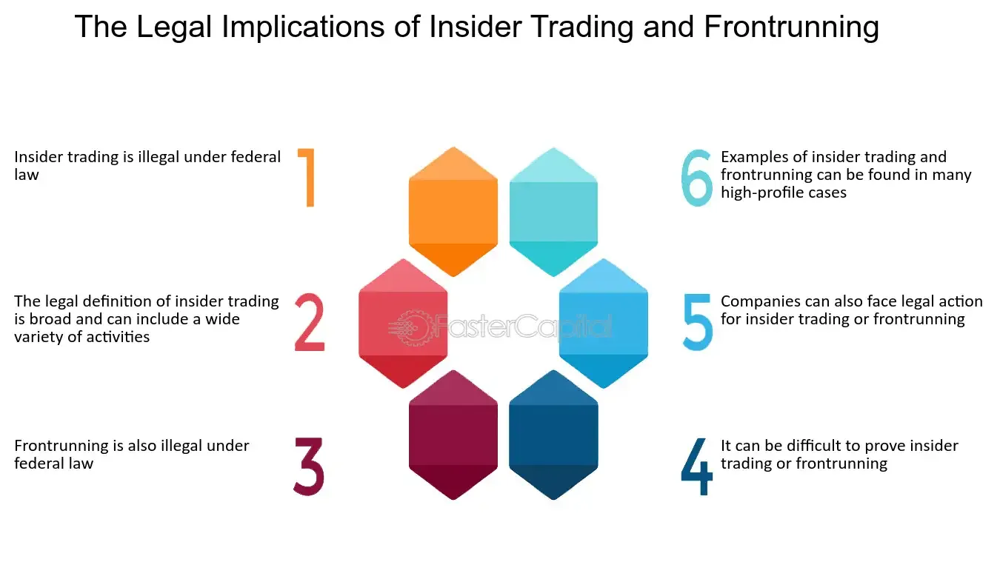

## Table of Contents

## What is front-running?

Front-running is when someone uses secret information to buy or sell things before others do. Imagine you know a big news story is coming out that will make a company's stock price go up. If you buy the stock before the news comes out, you can sell it later for a profit. This is unfair because it gives an advantage to the person with the secret information.

This practice is illegal in many places because it's not fair to other investors who don't have the same information. It can happen in stock markets, but also in other areas like real estate or even with cryptocurrencies. Regulators try to stop front-running by watching for unusual trading patterns and punishing those who break the rules.

## How does front-running occur in financial markets?

Front-running in financial markets happens when someone uses secret information to trade before others. Imagine a broker who knows a big investor is about to buy a lot of a certain stock. If the broker buys that stock first, they can sell it later at a higher price once the big investor's purchase pushes the price up. This is unfair because the broker is using information that others don't have.

Regulators try to stop front-running by watching for unusual trading patterns. They look for signs that someone might be trading based on secret information. If they find evidence of front-running, they can punish those involved with fines or even jail time. This helps keep the market fair for everyone, so no one can use secret information to make unfair profits.

## Can you provide a simple example of front-running?

Imagine a stock broker named Sarah. Sarah knows that a big investor is about to buy a lot of shares in a company called TechCo. Before the big investor makes their move, Sarah quickly buys some TechCo shares herself. When the big investor buys their shares, the price of TechCo goes up. Sarah then sells her shares at the higher price, making a quick profit.

This is front-running because Sarah used secret information about the big investor's plan to make money. It's unfair because other people didn't know about the big investor's move and couldn't buy the shares at the lower price. Front-running is illegal because it gives an unfair advantage to the person with the secret information.

## What are the ethical implications of front-running?

Front-running is bad because it's not fair. When someone uses secret information to make money, it hurts other people who don't know the secret. It makes the market unfair because not everyone has the same chance to make good trades. This can make people lose trust in the market, which is bad for everyone.

Regulators try to stop front-running because they want the market to be fair. They watch for people doing sneaky things and punish them if they catch them. This helps keep the market honest and makes sure everyone has the same chance to succeed. It's important for everyone to follow the rules so the market can work well for everyone.

## How does front-running affect market integrity?

Front-running hurts the fairness of the market. When someone uses secret information to trade before others, it means not everyone has the same chance to make good trades. This is unfair because the person with the secret information gets an advantage over everyone else. It can make people feel like the market is not honest, which can make them lose trust in it.

When people lose trust in the market, they might not want to invest as much. This can make the market less active and less healthy. Regulators work hard to stop front-running because they want to keep the market fair and trustworthy. By watching for and punishing front-running, they help make sure everyone has an equal chance to succeed in the market.

## What are the different types of front-running?

Front-running can happen in different ways. One type is called 'broker front-running.' This happens when a broker knows a big order is coming and buys or sells the same thing before the order goes through. For example, if a broker knows a big investor wants to buy a lot of a certain stock, the broker might buy that stock first and then sell it at a higher price after the big order pushes the price up.

Another type is 'insider front-running.' This happens when someone inside a company uses secret information about the company to trade before that information becomes public. For example, if an employee knows their company is about to announce good news that will make the stock price go up, they might buy the stock before the announcement and sell it at a profit after the news comes out.

Both types of front-running are illegal because they give an unfair advantage to the person with the secret information. They hurt the fairness of the market and can make people lose trust in it. Regulators try to stop these practices by watching for unusual trading and punishing those who break the rules.

## What legal measures are in place to prevent front-running?

To stop front-running, there are laws and rules that watch over the market. These rules say that using secret information to trade before others is not allowed. Regulators, like the Securities and Exchange Commission (SEC) in the United States, keep an eye on the market to find any unusual trading. If they see something that looks like front-running, they can investigate and punish the people involved. Punishments can include big fines or even jail time, which helps scare people away from doing it.

These rules are important because they help keep the market fair for everyone. When people know that front-running is illegal and that they can get in big trouble for it, they are less likely to try it. This makes the market more honest and trustworthy. By making sure everyone follows the same rules, regulators help make sure that no one can use secret information to get an unfair advantage over others.

## How do regulatory bodies detect front-running?

Regulatory bodies use special tools and methods to find front-running. They look at trading data to see if anyone is buying or selling things in a strange way. For example, if someone buys a lot of a stock right before big news comes out, that might be a sign of front-running. They also watch for patterns, like if a broker always trades just before a big order comes in. By looking at these signs, regulators can figure out if someone might be using secret information to trade.

When regulators think they've found front-running, they start an investigation. They might talk to the people involved and look at more trading data to see if their first guess was right. If they find proof that someone did front-running, they can take action. This might mean giving the person a fine or even sending them to jail. By doing this, regulators help keep the market fair and make sure everyone follows the rules.

## What are the penalties for engaging in front-running?

If someone gets caught front-running, they can face big punishments. These punishments are meant to stop people from doing it and to keep the market fair. The penalties can be fines, which are like a money punishment. The fines can be very big, sometimes millions of dollars. This is to make sure that the cost of getting caught is more than any money they might make from front-running.

Besides fines, people caught front-running can also go to jail. Going to jail is a serious punishment and can happen if the front-running was very bad or if the person did it many times. Jail time helps make sure that people think twice before trying to use secret information to make money unfairly. By having these strong punishments, regulators help keep the market honest and fair for everyone.

## How can investors protect themselves from front-running?

Investors can protect themselves from front-running by being careful about who they share their trading plans with. If you're working with a broker, make sure they are trustworthy and have a good reputation. Don't tell them about your big trades until the last moment, so they don't have time to front-run you. Also, try to use brokers that have strong rules against front-running and are watched closely by regulators.

Another way to protect yourself is by using different brokers for different trades. This makes it harder for any one broker to see a pattern in your trading and front-run you. You can also use trading platforms that don't let brokers see your orders until they are already being processed. By taking these steps, you can lower the chance that someone will use your trading plans to make money unfairly.

## What technological tools are used to facilitate or combat front-running?

Technology can help people do front-running or stop it. Some people use fast computers and special software to see what big investors are doing and trade before them. These tools can look at lots of trading data very quickly and find patterns that might show a big order is coming. This lets them buy or sell things just before the big order, making money from the price change. But using technology this way is not fair and is against the rules.

To stop front-running, regulators use their own technology. They have systems that watch the market all the time, looking for strange trading patterns. If they see something that looks like front-running, they can start an investigation. They also use software to check if brokers are following the rules and not using secret information to trade. By using technology to watch the market, regulators can catch people who try to front-run and keep the market fair for everyone.

## How has the rise of algorithmic trading influenced front-running practices?

The rise of [algorithmic trading](/wiki/algorithmic-trading) has made front-running easier and harder at the same time. On one hand, algorithms can quickly look at lots of trading data and find patterns that might show a big order is coming. This lets people use computers to buy or sell things just before the big order, making money from the price change. This kind of front-running is called "algorithmic front-running" and it's not fair because it uses technology to get an advantage over others.

On the other hand, regulators are using their own technology to fight back. They have systems that watch the market all the time, looking for strange trading patterns that might be front-running. If they see something that looks like front-running, they can start an investigation and punish the people involved. By using technology to keep an eye on the market, regulators can catch people who try to front-run and help keep the market fair for everyone.

## References & Further Reading

[1]: Aldridge, I. (2013). ["High-Frequency Trading: A Practical Guide to Algorithmic Strategies and Trading Systems"](https://www.wiley.com/en-us/High-Frequency+Trading%3A+A+Practical+Guide+to+Algorithmic+Strategies+and+Trading+Systems%2C+2nd+Edition-p-9781118343500). John Wiley & Sons.

[2]: DeGroot, M. (2020). ["Front-Running: The Ethics and Legality in Investment Transactions"](https://www.globalrelay.com/resources/the-compliance-hub/glossary/what-is-front-running/). Journal of Business Ethics.

[3]: Financial Industry Regulatory Authority (FINRA). ["FINRA Fines Citadel Securities"](https://www.ft.com/content/dc3f8fb5-62e7-4774-98bb-28db801589ee) via FINRA official press release.

[4]: Lopez de Prado, M. (2018). ["Advances in Financial Machine Learning"](https://www.amazon.com/Advances-Financial-Machine-Learning-Marcos/dp/1119482089). Wiley Finance.

[5]: Lewis, M. (2014). ["Flash Boys: A Wall Street Revolt"](https://en.wikipedia.org/wiki/Flash_Boys). W. W. Norton & Company.

[6]: Securities and Exchange Commission (SEC). ["Regulatory Framework for Front-Running"](https://www.usa.gov/agencies/securities-and-exchange-commission) via SEC official website.

[7]: Cartea, Á., Jaimungal, S., & Penalva, J. (2015). ["Algorithmic and High-Frequency Trading"](https://assets.cambridge.org/97811070/91146/frontmatter/9781107091146_frontmatter.pdf). Cambridge University Press.