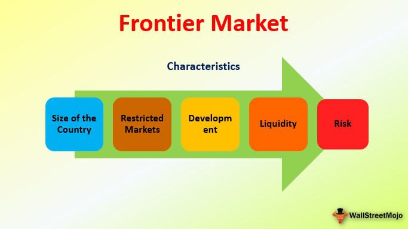

Frontier markets refer to a subset of global financial markets that are considered less advanced than emerging markets but more developed than what is typically classified as least developed countries. These markets are characterized by their potential for high growth, yet they come with a distinct set of risks, including political instability, lack of liquidity, and relatively underdeveloped infrastructure. Despite these challenges, frontier markets hold significance in the global economy due to their potential to deliver strong returns on investment, driven by rapid urbanization, expanding middle classes, and youthful populations that promise to stimulate economic activity and consumer demand.

Emerging economies are nations experiencing rapid industrialization and economic expansion. These countries, such as Brazil, Russia, India, and China (often referred to as BRIC), are pivotal in shifting the center of economic power. The potential for growth in emerging economies far exceeds that in developed nations, primarily due to their evolving market structures, increasing productivity, and improving governance. Investment strategies in these regions aim to capitalize on these growth trajectories, with investors seeking high returns by understanding local markets, regulations, and cultural nuances.



Investment strategies in frontier and emerging markets require a nuanced approach to balance potential profits against inherent risks. These strategies often involve a combination of direct investments, such as equities and fixed income, and indirect exposure through mutual funds and exchange-traded funds (ETFs). The goal is to diversify portfolios, tap into underserved markets, and leverage asymmetries in information that often exist in these environments.

Algorithmic trading, which employs computer algorithms to execute trades based on programmed criteria, is increasingly vital in financial markets. This method enhances trading efficiency, speed, and accuracy, minimizing human error while coping with massive volumes of market data. Algorithmic trading's role extends to frontier and emerging markets, where it can offer substantial advantages by quickly identifying profitable opportunities and executing trades at optimal prices and moments. 

This article explores the intersection of frontier markets, emerging economies, investment strategies, and algorithmic trading. The synthesis of these elements offers investors a framework for navigating the complexities of less mature markets while leveraging technology to minimize risks and maximize returns. By examining the dynamics at play, investors can better understand the challenges and opportunities these markets present, ultimately fostering a more informed and strategic approach to global investments.

## Table of Contents

## Understanding Frontier Markets

Frontier markets are a subset of international financial markets, characterized by their nascent development stage and limited integration into the global economy. These markets are distinguished by their lower levels of market capitalization, liquidity, and regulatory sophistication compared to both emerging and developed markets. Frontier markets are generally smaller and less accessible but offer potentially higher returns due to their untapped growth potential.

Unlike developed markets, which feature highly liquid and well-regulated financial systems, frontier markets are less transparent and may lack essential financial infrastructure. While emerging markets such as China, India, and Brazil have more mature financial systems and infrastructures, frontier markets are one step behind, somewhere in between the least developed economies and emerging markets. They are often characterized by rapid economic growth and political systems in transition but remain susceptible to greater economic and political risks.

Examples of countries considered to be frontier markets include Vietnam, Nigeria, Bangladesh, and Kenya. These nations exhibit promising demographics, such as growing middle classes and increasing urbanization, which can lead to significant economic development. Countries within frontier markets often have the potential for high economic growth, driven by factors such as untapped natural resources, a young workforce, and an expanding consumer base.

Investing in frontier markets presents an array of opportunities and challenges. On the one hand, these markets provide access to high-growth regions that are potentially less correlated with developed market equities, thus offering diversification benefits. Additionally, frontier markets can offer attractive valuations and yield opportunities, especially in sectors like financial services, telecommunications, and natural resources.

On the other hand, challenges include political instability, currency [volatility](/wiki/volatility-trading-strategies), limited market [liquidity](/wiki/liquidity-risk-premium), and issues related to corporate governance and transparency. The absence of robust legal and regulatory frameworks can pose significant risks to investors. Market access is often complicated by underdeveloped infrastructure and limited availability of financial instruments.

Historically, frontier markets have shown varied performance, often influenced by geopolitical changes, commodity price fluctuations, and foreign exchange instability. However, the long-term potential of these markets remains significant, driven by favorable demographic trends, economic reforms, and increased foreign direct investment. As these markets continue to evolve, they hold the promise of substantial growth and investment returns for those willing to navigate their complexities.

## Emerging Economies and Investment Opportunities

Emerging economies, often positioned between developing and fully developed economies, play a critical role in the global economic landscape. They are characterized by rapid industrialization, significant growth potential, and an increasing integration into the global market. Such economies typically show a progression towards more efficient markets and improved infrastructure.

**Key Indicators of Growth and Development in Emerging Economies**

Emerging economies are distinguished by several indicators that highlight their growth and development trajectory. Key indicators include:

1. **Gross Domestic Product (GDP) Growth Rates**: A consistent and high GDP growth rate is often a hallmark of an emerging economy. For instance, countries like India and China have exhibited sustained GDP growth, outpacing many developed nations.

2. **Industrialization and Urbanization**: Rapid industrialization and increased urbanization are pivotal to the economic transformation of these markets. This shift leads to better employment opportunities and improves the overall standard of living.

3. **Foreign Direct Investment (FDI)**: Emerging economies often attract substantial FDI, a critical component for infrastructure development and technological advancement. High levels of FDI can spur economic activity and enhance competitiveness.

4. **Market Reforms and Economic Policies**: Reforms aimed at liberalizing the economy, such as deregulation, privatization, and investment-friendly policies, contribute significantly to economic growth.

5. **Human Capital Development**: Investment in education and healthcare improves the quality of human capital, which is essential for sustaining economic growth.

**Potential Investment Opportunities in Emerging Markets**

Emerging markets offer myriad investment opportunities due to their growth potential and diversification benefits. Sectors such as technology, infrastructure, and consumer goods are particularly attractive. The rising middle class in these economies increases demand for consumer products and services, presenting substantial investment prospects.

**Comparative Analysis with More Established Markets**

Compared to established markets, emerging economies often present higher growth prospects but come with increased volatility and risk. While developed markets are generally more stable with established financial systems, emerging markets offer the potential for higher returns due to their rapid growth and development.

Investors can leverage this dynamic by diversifying their portfolios to include exposure to emerging markets. This can be achieved by investing in country-specific exchange-traded funds (ETFs) or through direct investments in local companies.

**Risks and Considerations for Investors Entering Emerging Economies**

Investing in emerging markets comes with unique challenges and risks:

- **Political and Economic Instability**: Emerging economies may experience political instability, which can lead to economic uncertainty and affect market performance.

- **Currency Fluctuations**: Exchange rate volatility can significantly impact investment returns, as these markets often have less stable currencies.

- **Regulatory and Compliance Concerns**: Different regulatory environments and potential lack of transparency can pose challenges to investors unfamiliar with local market conditions.

- **Liquidity Risks**: Less developed market infrastructure can lead to lower market liquidity, making it more difficult to enter or exit investments without affecting prices.

Investors need to conduct comprehensive due diligence, assessing both macroeconomic indicators and specific market conditions. Diversification across various markets and sectors, together with risk management strategies, can help mitigate some of these risks while harnessing the growth potential of emerging economies.

## Algorithmic Trading: A Modern Approach

Algorithmic trading, often referred to as algo-trading, represents a significant evolution in the financial markets, driven by technological advancements. At its core, [algorithmic trading](/wiki/algorithmic-trading) involves the use of computer programs to execute trading strategies at speeds and frequencies that would be impossible for human traders. These algorithms utilize predefined criteria to analyze market conditions and execute trades, making decisions based on complex mathematical models.

One of the primary advantages of algorithmic trading over traditional methods is its ability to process vast amounts of data in real-time, leading to more informed and efficient trading decisions. By eliminating human emotions from trading, algorithms can maintain consistent performance, adhering strictly to the trading strategy's rules. This consistency can result in reduced transaction costs and enhanced market liquidity, benefiting both the traders and the broader market.

Within the dynamic landscape of financial markets, algorithms play a crucial role. They can execute a variety of strategies, such as [arbitrage](/wiki/arbitrage), [trend following](/wiki/trend-following), and [market making](/wiki/market-making). For example, in arbitrage, algorithms can exploit price differences of the same asset in different markets to generate profits. In trend following, algorithms might use historical price data to identify trends and execute trades that align with these trends.

Data-driven insights and [artificial intelligence](/wiki/ai-artificial-intelligence) (AI) have further revolutionized modern trading practices. Machine learning algorithms, a subset of AI, can analyze historical data to identify patterns and predict future market movements. These predictions enable traders to optimize their strategies and anticipate changes in market dynamics. For instance, a [machine learning](/wiki/machine-learning) algorithm might use linear regression to determine the relationship between historical prices and trading volumes, thus identifying potential future price movements.

```python
import numpy as np
from sklearn.linear_model import LinearRegression

# Example of using linear regression for predicting future prices
def predict_price(historical_prices, volume):
    # Reshape the data
    X = np.array([volume](/wiki/volume-trading-strategy)).reshape(-1, 1)
    y = np.array(historical_prices)

    # Fit the model
    model = LinearRegression().fit(X, y)

    # Predict future prices
    predicted_price = model.predict([[new_volume]])
    return predicted_price

# Historical data
historical_prices = [10, 12, 11, 13, 14]  # Example historical prices
volume = [100, 120, 115, 130, 125]        # Example trading volume

# Predict the price for a new volume
new_volume = 128
predicted_price = predict_price(historical_prices, volume)
```

Algorithmic trading has shown promise even in frontier and emerging markets, which are typically characterized by lower liquidity and higher volatility. Successful case studies highlight how tailored algorithms have been developed to navigate these unique environments, capturing opportunities while managing risks effectively. For example, in a frontier market where market data might be sparse or unreliable, specialized algorithms can adapt to local trading conditions and regulatory frameworks, ensuring efficient execution.

In conclusion, algorithmic trading represents a modern approach that leverages technology to enhance the efficiency and effectiveness of trading in both developed and emerging markets. Its application in dynamic markets requires not only sophisticated technology but also a deep understanding of the market peculiarities to harness its full potential.

## Integrating Algorithmic Trading in Frontier Markets

Algorithmic trading, while deeply entrenched in developed markets, faces a distinct set of challenges and opportunities when applied in frontier markets. These markets, often characterized by lower liquidity and higher volatility, demand tailored strategies and tools to effectively harness the potential of algorithmic trading.

### Strategies for Implementing Algorithmic Trading

In less liquid and more volatile markets, traditional trading strategies can struggle. Algorithmic trading strategies need to be adaptive, focusing on liquidity management and market impact. Algorithms designed for frontier markets often use liquidity-seeking and cost-effective execution strategies. A common approach involves breaking up large orders into smaller ones to minimize market impact—a technique known as "order slicing." 

Moreover, [statistical arbitrage](/wiki/statistical-arbitrage) and mean reversion strategies can be effectively employed in such environments, capitalizing on the temporary mispricing of assets due to market inefficiencies.

### Unique Challenges

Algorithmic trading in frontier markets faces unique hurdles, including limited data availability and technological infrastructure. These markets may have less historical data for [backtesting](/wiki/backtesting) strategies, leading to increased model risk. Additionally, higher latency in trade execution and unreliable network connectivity can impact algorithm performance. Traders must also navigate varying regulatory environments and currency risks, often with less transparent regulatory frameworks.

### Tools and Platforms

Despite these challenges, several tools and platforms can facilitate algorithmic trading in frontier markets. Tools like MetaTrader, QuantConnect, and NinjaTrader offer extensive customization and the ability to implement complex algorithms. Machine learning libraries, such as TensorFlow and PyTorch, can be leveraged to develop predictive models that improve decision-making processes. Cloud-based computing services also enable traders to access scalable computing resources, which are essential for handling large datasets and executing complex algorithms in real time.

### Risk Management and Regulatory Considerations

Effective risk management is crucial in frontier markets. Strategies must include real-time monitoring mechanisms to quickly respond to market conditions. Traders should develop comprehensive risk assessments that account for geopolitical risks and currency fluctuations. Furthermore, adhering to regulatory frameworks is essential, as these can significantly vary across markets. Compliance with local regulations regarding trading practices and data management is mandatory, and understanding these regulations helps mitigate legal risks.

### Future Outlook and Growth Potential

The future of algorithmic trading in frontier markets looks promising, spurred by technological advancements and increasing interest from institutional investors. As infrastructure improves and data becomes more accessible, these markets are likely to see a rise in algorithmic trading activities. The integration of artificial intelligence and machine learning could further enhance strategy development and execution, making it possible to navigate the complexities of these markets more effectively.

The potential growth of algorithmic trading in frontier markets will likely contribute to improved market efficiencies, increasing their attractiveness to global investors seeking diversification and higher returns. As technology continues to drive financial innovation, algorithmic trading is poised to play a pivotal role in shaping the future landscape of trading in frontier markets.

## Investment Strategies for Emerging Economies

Investment strategies for emerging economies require a comprehensive understanding of the unique economic dynamics and market conditions present in these regions. Emerging economies, characterized by rapid industrialization and transitioning infrastructures, offer numerous investment opportunities but also come with inherent risks. A strategic approach tailored to these conditions is essential for optimizing investment outcomes.

One effective strategy is leveraging algorithmic trading, which utilizes mathematical models and computational techniques to make informed trading decisions. Algorithmic trading allows for the analysis of vast datasets, identifying patterns and trends not easily detectable by human traders. By employing algorithms, investors can execute trades at speeds and efficiencies unmatched by traditional methods. Furthermore, algorithmic trading can help in managing the volatility typically associated with emerging markets by implementing strategies like statistical arbitrage and [momentum](/wiki/momentum) trading.

Diversification is another key strategy for investing in emerging economies. Building a diversified portfolio minimizes risk by spreading investments across various sectors and geographical locations. This approach can include equities, bonds, and even real estate in emerging markets. By diversifying, investors can offset losses in underperforming areas with gains in others.

Understanding market trends through data-informed investment decisions is crucial in navigating the complexities of emerging economies. Investors should focus on key indicators such as GDP growth rates, political stability, and regulatory environments. Utilizing data analytics tools can enhance the ability to forecast economic shifts and make proactive investment choices.

When it comes to investment timelines, both short-term and long-term strategies have their place. Short-term investments can capitalize on market volatility and provide quick returns, yet they require constant monitoring and rapid decision-making. On the other hand, long-term investments can benefit from the overall growth trajectory of emerging markets. These investments typically involve holding assets for extended periods, allowing for the natural appreciation in value as the market matures. Balancing these approaches can help in managing risk while seeking out growth opportunities.

In conclusion, investment strategies for emerging economies must be adaptable and informed by a deep understanding of local market conditions. By leveraging algorithmic trading, maintaining a diversified portfolio, making data-driven decisions, and balancing investment timelines, investors can effectively navigate and capitalize on the growth potential of these dynamic markets.

## Conclusion

Frontier markets and emerging economies present significant opportunities in the global economic landscape due to their untapped potential for growth. These markets are characterized by their developing financial infrastructures and fewer regulatory constraints compared to mature markets. However, they also present unique challenges, such as higher volatility and less liquidity. This dual nature makes them an attractive yet complex avenue for investors seeking diversification and higher returns.

Algorithmic trading has become an increasingly vital tool for investors navigating the complexities of frontier and emerging markets. By leveraging advanced data analytics and automation, algorithmic trading strategies provide a significant advantage. These strategies allow traders to execute trades with speed and precision, effectively managing the volatility and lower liquidity inherent in these markets. The adaptability of algorithms to rapidly changing market dynamics enables them to optimize returns while mitigating risks.

As technology continues to evolve, the integration of machine learning and artificial intelligence in trading systems is poised to further enhance investment strategies. The ability to process vast amounts of data in real-time allows for more informed decision-making, potentially leading to more sustainable and profitable investment outcomes.

Investors are encouraged to consider the vast potential within frontier and emerging markets. The combination of algorithmic trading and the growth trajectories of these markets provide a compelling case for inclusion in diversified investment portfolios. As technology drives transformation in the global investment landscape, the role of informed and technologically adept trading strategies will be pivotal in capitalizing on the opportunities presented by these dynamic economies.

## References & Further Reading

[1]: Bergstra, J., Bardenet, R., Bengio, Y., & Kégl, B. (2011). ["Algorithms for Hyper-Parameter Optimization."](https://dl.acm.org/doi/10.5555/2986459.2986743) Advances in Neural Information Processing Systems 24.

[2]: ["Advances in Financial Machine Learning"](https://www.amazon.com/Advances-Financial-Machine-Learning-Marcos/dp/1119482089) by Marcos Lopez de Prado

[3]: ["Evidence-Based Technical Analysis: Applying the Scientific Method and Statistical Inference to Trading Signals"](https://www.amazon.com/Evidence-Based-Technical-Analysis-Scientific-Statistical/dp/0470008741) by David Aronson

[4]: ["Machine Learning for Algorithmic Trading"](https://github.com/stefan-jansen/machine-learning-for-trading) by Stefan Jansen

[5]: ["Quantitative Trading: How to Build Your Own Algorithmic Trading Business"](https://www.amazon.com/Quantitative-Trading-Build-Algorithmic-Business/dp/1119800064) by Ernest P. Chan