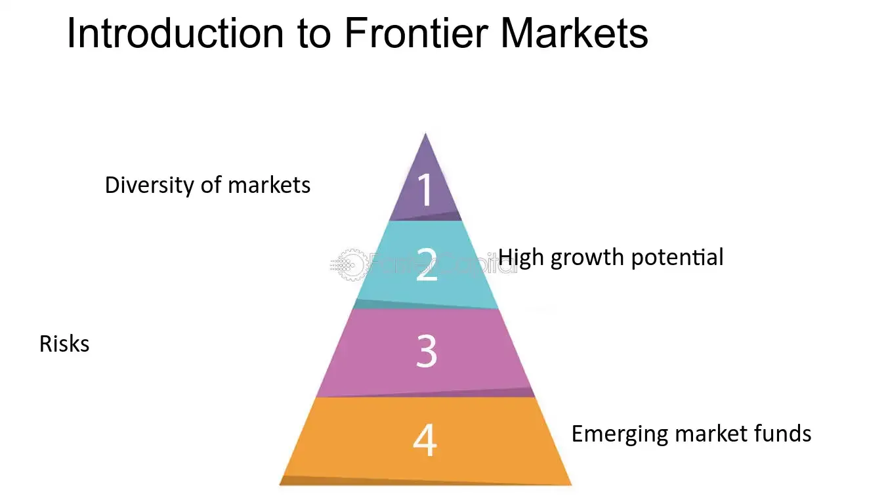

## Table of Contents

## What are frontier markets?

Frontier markets are countries that are at an earlier stage of economic development than emerging markets. They are less developed, have smaller economies, and often have less stable political systems. These markets can be found in regions like Africa, the Middle East, and parts of Asia. Investing in frontier markets can be riskier because they are less known and can be harder to get into and out of. However, they also offer the potential for high returns because they are growing quickly.

People might be interested in frontier markets because they want to spread their investments across different countries and types of economies. By investing in these less developed markets, investors hope to benefit from the growth that can happen as these countries develop. However, it's important to understand that these markets can be volatile. Changes in government, economic policies, or even natural disasters can greatly affect them. So, while there is a chance for big gains, there is also a higher risk of losing money.

## How do frontier markets differ from emerging and developed markets?

Frontier markets are different from emerging and developed markets because they are less developed and smaller in size. They are at the earliest stage of economic growth, often found in countries in Africa, the Middle East, and parts of Asia. These markets are less known to investors and can be harder to buy into and sell out of. They also have less stable political systems and can be affected a lot by changes in government or economic policies.

Emerging markets, on the other hand, are in the middle stage of development. They are growing faster than developed markets but are more established than frontier markets. Countries like Brazil, Russia, India, and China are examples of emerging markets. They have larger economies and more investors interested in them. While they can still be risky, they are generally more stable and easier to invest in than frontier markets.

Developed markets are the most advanced and stable. These include countries like the United States, Japan, and most of Western Europe. They have strong economies, well-established financial systems, and lots of investors. Investing in developed markets is usually seen as safer but with less potential for high returns compared to emerging or frontier markets. The trade-off is lower risk for lower growth potential.

## What are some examples of countries classified as frontier markets?

Frontier markets are countries that are still growing and developing their economies. Some examples include Vietnam, Nigeria, and Bangladesh. These countries are working on building their industries and improving their financial systems. They are not as well-known to investors as bigger markets, but they can offer good opportunities for growth.

Another set of frontier market countries includes Pakistan, Kenya, and Sri Lanka. These countries are also trying to develop their economies but face challenges like political instability and less developed infrastructure. Investors might find these markets exciting because they could grow a lot in the future, but they also come with more risk.

Other examples of frontier markets are Ghana, Argentina, and Romania. Each of these countries has its own unique set of opportunities and challenges. Ghana is making progress in its oil and gas industry, while Argentina is known for its agriculture and natural resources. Romania is part of the European Union but still has a lot of room to grow its economy.

## What are the key characteristics of frontier markets?

Frontier markets are countries that are just starting to grow their economies. They are less developed than bigger markets like the United States or China. These countries are often found in places like Africa, the Middle East, and parts of Asia. They have smaller economies and less stable governments. This makes them riskier to invest in because things can change quickly. But because they are growing, they can also offer big rewards for people who invest in them.

These markets are not as well-known to investors as bigger markets, so it can be harder to buy and sell investments in them. They might not have as many big companies or as much money moving in and out of them. But as these countries develop, their economies can grow a lot. This means that if you invest early, you might see your money grow more than in a developed market. However, you have to be ready for the ups and downs that come with investing in these less stable places.

## What is the historical context of frontier markets?

The idea of frontier markets started to become popular in the early 2000s. Before that, people mostly talked about developed markets like the United States and Japan, and emerging markets like Brazil and China. Frontier markets were seen as the next step in the world of investing. They were countries that were just starting to grow their economies and were not as well-known to investors. The term "frontier markets" was used to describe these less developed countries that had the potential for big growth.

Over time, more and more investors started to look at frontier markets as a way to spread their investments and find new opportunities. Countries like Vietnam, Nigeria, and Bangladesh became known as frontier markets. These places were working on building their industries and improving their financial systems. While they offered the chance for high returns, they also came with more risk because their economies and governments were less stable. As the world economy changed, frontier markets became an important part of the global investment landscape, offering a way for investors to be part of the growth in these developing countries.

## How have frontier markets evolved over time?

Frontier markets have changed a lot since people started talking about them in the early 2000s. At first, they were seen as small and risky places to invest. Countries like Vietnam and Nigeria were just starting to grow their economies. Investors were excited about the potential for big returns, but they also knew that these places could be unstable. Over the years, more people started to pay attention to frontier markets as they looked for new opportunities to grow their money.

As time went on, some frontier markets began to grow and develop more. They built better roads, schools, and businesses, which made their economies stronger. This made them more attractive to investors who were looking for places with a lot of growth potential. However, not all frontier markets grew at the same pace. Some faced challenges like political problems or natural disasters, which made investing in them riskier. Despite these ups and downs, frontier markets have become an important part of the global economy, offering new chances for investors to be part of the growth in these developing countries.

## What are the main economic indicators used to assess frontier markets?

People use different economic indicators to understand how well frontier markets are doing. One important indicator is the Gross Domestic Product (GDP) growth rate. This shows how fast the country's economy is growing. Another key indicator is the inflation rate, which tells us how much prices are going up. If inflation is too high, it can make life harder for people and businesses. Investors also look at the unemployment rate to see if more people are getting jobs, which is a good sign for the economy. 

Other important indicators include the balance of trade, which shows if a country is selling more things to other countries than it is buying, and foreign direct investment (FDI), which measures how much money from other countries is coming into the economy. The stability of the currency is also important because a stable currency makes it easier for businesses to plan and grow. All these indicators help investors decide if a frontier market is a good place to put their money, even though these markets can be riskier than more developed ones.

## What are the potential risks and rewards of investing in frontier markets?

Investing in frontier markets can be really exciting because these countries are just starting to grow their economies. They can offer big rewards if you invest early. For example, if a country like Vietnam or Nigeria starts to do really well, the value of your investment could go up a lot. These markets are growing faster than bigger, more developed countries, so there's a chance to make more money. Plus, by investing in these places, you're spreading out your investments, which can help protect your money if other markets aren't doing well.

But frontier markets also come with a lot of risks. They can be unstable because their governments and economies are not as strong as those in developed countries. Things like changes in government, wars, or natural disasters can make the value of your investments go down quickly. It can also be harder to buy and sell investments in these markets because they are not as well-known to investors. So, while the rewards can be big, you have to be ready for the possibility of losing money too. It's important to do a lot of research and maybe even talk to a financial advisor before deciding to invest in frontier markets.

## How do geopolitical factors influence frontier markets?

Geopolitical factors can have a big impact on frontier markets. These are countries that are just starting to grow their economies, and they can be affected a lot by things like wars, changes in government, or even disagreements with other countries. For example, if there's a war or a big political change in a frontier market, it can make the economy unstable. This can scare away investors who might be worried about losing their money. Also, if a country has problems with its neighbors, it can be harder for them to trade and grow their economy.

On the other hand, good geopolitical relationships can help frontier markets grow. If a country gets along well with its neighbors and other countries, it can be easier for them to trade and attract foreign investment. For example, if a frontier market joins a big trade group or gets help from a bigger country, it can help their economy grow faster. So, while geopolitical factors can make things risky, they can also create opportunities for growth if things go well.

## What role do frontier markets play in global economic development?

Frontier markets are important for global economic development because they are the places where new growth happens. These countries are just starting to build their economies, and as they grow, they can help the whole world's economy get bigger. When frontier markets do well, they create new jobs and businesses, which can make life better for people living there. They also give investors from other countries a chance to make money by putting their money into these growing economies. This can help spread wealth around the world and make the global economy stronger.

But frontier markets can also face a lot of challenges. They might have problems like unstable governments, wars, or natural disasters that can slow down their growth. These issues can make it harder for them to develop and can scare away investors who are worried about losing their money. Even with these challenges, frontier markets are still important because they show us where the world's economy might grow in the future. By helping these countries develop, we can make the whole world's economy more balanced and give more people a chance to improve their lives.

## How can investors access frontier markets, and what are the common investment vehicles?

Investors can access frontier markets in different ways. One common way is through mutual funds or exchange-traded funds (ETFs) that focus on these markets. These funds pool money from many investors and use it to buy a mix of stocks, bonds, or other investments in frontier countries. This makes it easier for people to invest in these markets without having to pick individual stocks or worry about the challenges of buying and selling directly in these less developed markets.

Another way to invest in frontier markets is through direct investment in stocks or bonds of companies in these countries. This can be riskier and more complicated because it requires more research and understanding of the local market. Some investors also use private equity or venture capital to invest directly in businesses in frontier markets. These methods can offer higher returns but also come with higher risks because the economies and governments in these countries can be less stable.

## What are the future prospects and challenges for frontier markets?

Frontier markets have a lot of potential for growth in the future. These countries are just starting to build their economies, and as they develop, they can create new jobs and businesses. This growth can make life better for people living there and also give investors from other countries a chance to make money. If frontier markets can keep growing and attract more investment, they could become important parts of the global economy. Countries like Vietnam and Bangladesh are already showing signs of strong growth, which is exciting for the future.

However, frontier markets also face many challenges. They can be unstable because their governments and economies are not as strong as those in developed countries. Things like wars, changes in government, or natural disasters can make it hard for these countries to grow. It can also be difficult for investors to put money into these markets because they are not as well-known and can be harder to buy and sell investments in. Despite these challenges, if frontier markets can overcome these issues, they have the potential to play a big role in the world's economy and help spread wealth and opportunities around the globe.

## References & Further Reading

[1]: Bergstra, J., Bardenet, R., Bengio, Y., & Kégl, B. (2011). ["Algorithms for Hyper-Parameter Optimization."](https://dl.acm.org/doi/10.5555/2986459.2986743) Advances in Neural Information Processing Systems 24.

[2]: ["Advances in Financial Machine Learning"](https://www.amazon.com/Advances-Financial-Machine-Learning-Marcos/dp/1119482089) by Marcos Lopez de Prado

[3]: ["Evidence-Based Technical Analysis: Applying the Scientific Method and Statistical Inference to Trading Signals"](https://www.amazon.com/Evidence-Based-Technical-Analysis-Scientific-Statistical/dp/0470008741) by David Aronson

[4]: ["Machine Learning for Algorithmic Trading"](https://github.com/stefan-jansen/machine-learning-for-trading) by Stefan Jansen

[5]: ["Quantitative Trading: How to Build Your Own Algorithmic Trading Business"](https://www.amazon.com/Quantitative-Trading-Build-Algorithmic-Business/dp/1119800064) by Ernest P. Chan