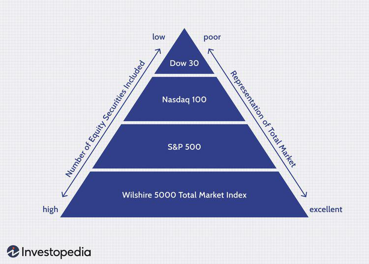

In the ever-evolving landscape of financial markets, stock market indices are essential tools that shape investment strategies by providing a snapshot of market performance. These indices serve as benchmarks, helping investors understand market trends and make informed decisions. Among these is the FT Wilshire 5000 Index (FTW5000), a comprehensive index recognized for its expansive coverage of the U.S. investible market. Often referred to as the "total market index," the FTW5000 seeks to capture the entirety of public companies headquartered in the United States, making it one of the broadest indices in terms of market scope.

The FT Wilshire 5000 Index is significant because it reflects the performance of thousands of U.S. stocks, serving as a barometer for the overall health of the U.S. equities market. Its comprehensive nature provides an encompassing view of how various sectors and companies contribute to the market's dynamics. This article will examine the intricacies of the FT Wilshire 5000 Index, its historical evolution, and the vital role it plays in algorithmic trading. By understanding the functioning and scope of the FTW5000, investors and traders can gain valuable insights that enhance their ability to navigate the complex financial environment effectively.



## Table of Contents

## What is the FT Wilshire 5000 Index?

The FT Wilshire 5000 Index, previously referred to as the Wilshire 5000 Total Market Index, is a comprehensive market capitalization-weighted index encompassing a wide spectrum of the U.S. stock market. Established with the objective of capturing 100% of the investible market in the United States, the index reflects the performance of an extensive array of U.S. stocks across various sectors. Acting as a critical barometer, the index provides insights into the overall health and trajectory of the U.S. equities market.

The concept of market capitalization-weighted indices, such as the FT Wilshire 5000, signifies that components within the index are weighted according to their market values. This results in stocks with larger market capitalizations exerting a greater influence on the index's overall performance. The calculation of the index value can be expressed as:

$$
\text{Index Value} = \frac{\sum_{i=1}^{n} (P_i \times Q_i)}{D}
$$

where $P_i$ represents the price of each stock $i$, $Q_i$ is the number of outstanding shares, and $D$ is the divisor used to maintain consistency over time despite changes such as stock splits or rebalancing activities.

Historically, the FT Wilshire 5000 included over 7,500 stocks at its peak, representing nearly all publicly traded equities in the U.S. This expansive inclusion made it one of the most comprehensive indices available. However, changes in market conditions and corporate activities, such as mergers and acquisitions, have led to the current makeup of approximately 3,687 stocks. This reduction illustrates the dynamic nature of the market and the ongoing evolution of the index itself.

Overall, the FT Wilshire 5000 Index serves a dual purpose: it provides investors with a macro-level view of the U.S. stock market's health while also offering a detailed representation of market segments. Its utility as a traditional benchmark makes it a valuable tool for investment analysis and strategy development.

## Historical Context of the FT Wilshire 5000 Index

The Wilshire 5000 Index, established in 1974, was designed to offer a comprehensive measure of the U.S. stock market's performance by including all publicly traded companies with readily available price data. Initially managed by Wilshire Associates, a global investment management, consulting, and technology firm, the index briefly came under the aegis of Dow Jones due to a licensing arrangement in 2004, before reverting to Wilshire's management by 2009. This transition reflects the strategic partnerships that index providers often navigate to expand their service scope and visibility.

Throughout its history, the Wilshire 5000 has mirrored the dynamic landscape of U.S. financial markets, capturing significant economic cycles defined by peaks of economic expansion and troughs of recession. Notably, the index's trajectory has chronicled periods of intense market growth and contraction, responding to factors such as technological advancements, macroeconomic policies, and global financial crises. Its composition and value fluctuate in tandem with these developments, offering a lens into the broader market movements.

A key milestone for the Wilshire 5000 was in 2014 when it surpassed 20,000 points, a notable achievement reflecting a sustained phase of economic growth post the 2008 financial crisis. This performance marked investor optimism and a rebound in corporate earnings. By 2022, the index approached near all-time highs, underscoring a decade characterized by robust market activity, driven by innovations in technology, healthcare, and consumer sectors. Such highs in the index point to a widespread economic recovery and expansion, notwithstanding periods of [volatility](/wiki/volatility-trading-strategies) induced by global events like the COVID-19 pandemic and geopolitical tensions.

These historical markers of the Wilshire 5000 Index thus provide rich context for understanding the shifts in capital markets over the decades. They underscore the index's role not only as a barometer of market health but also as a tool for investors seeking to comprehend the broad economic implications of various market phases.

## FT Wilshire 5000 Index: A Breakdown

The FT Wilshire 5000 Index (FTW5000) encapsulates a significant portion of the U.S. investible market. It reflects a wide array of sectors, with information technology, healthcare, and consumer discretionary being the most influential. This diversity ensures that the index effectively mirrors the multifaceted nature of the U.S. stock market. 

Historically, the sector composition within the FTW5000 has adapted to economic shifts. For instance, the information technology sector's influence has grown substantially over recent decades, mirroring technological advancements and digital transformation. This shift highlights the dynamic nature of market forces and the evolving focus of investor interest.

The FTW5000 includes companies of varying market capitalizations — from large-cap firms to smaller companies. This varied inclusion fosters a comprehensive market perspective that smaller indices might not capture. It serves as a holistic view of the nation's economic health, capturing fluctuations across different company sizes and sectors.

To underline these changes quantitatively, consider using pandas, a Python library, to analyze shifts in sector weightings. Here is a basic example of how one might examine these changes over time:

```python
import pandas as pd
import matplotlib.pyplot as plt

# Simulated data
data = {
    'Year': [2000, 2005, 2010, 2015, 2020],
    'Information Technology': [15, 17, 19, 21, 23],
    'Healthcare': [10, 11, 12, 13, 14],
    'Consumer Discretionary': [12, 13, 14, 15, 16]
}

df = pd.DataFrame(data)

# Plotting
plt.figure(figsize=(10, 6))
for sector in df.columns[1:]:
    plt.plot(df['Year'], df[sector], label=sector)

plt.title('Sector Weighting Changes Over Time in FT Wilshire 5000')
plt.xlabel('Year')
plt.ylabel('Sector Weight (%)')
plt.legend()
plt.grid()
plt.show()
```

This code demonstrates how the weightings of different sectors have shifted over the years, offering a visualization of the evolving market trends that the FT Wilshire 5000 captures. Understanding these shifts is crucial for investors looking to optimize their strategies in a dynamic market environment.

## Algorithmic Trading and FT Wilshire 5000 Index

Algorithmic trading has become an integral part of modern financial markets, leveraging sophisticated quantitative models to execute trades with remarkable speed and accuracy. This approach often takes advantage of market indices, which provide aggregated market data that can be analyzed for patterns and trends. The FT Wilshire 5000 Index (FTW5000) serves as a crucial component in these strategies, offering a broad and comprehensive view of the U.S. stock market.

The FT Wilshire 5000 Index encompasses thousands of U.S. stocks, effectively acting as a microcosm of the entire market. This wide-reaching index enables algorithmic traders to access a holistic market perspective, essential for developing robust trading algorithms. By analyzing the performance and movements of the FTW5000, traders can identify valuable trends and signals that inform the execution of their trades.

Historical data from the FTW5000 provides a rich dataset for algorithmic traders looking to backtest their strategies. Backtesting involves applying trading algorithms to historical market data to gauge how they would have performed in the past. This process is crucial in verifying the efficacy of a trading strategy before deploying it in live markets. The diverse range of stocks within the FTW5000 ensures that traders can study how their algorithms respond to different market conditions and sectorial shifts.

Moreover, the index's comprehensive nature helps to mitigate uncertainties that arise from market volatility. By incorporating the full spectrum of the U.S. stock market, the FTW5000 allows traders to create diversified trading strategies that can absorb shocks stemming from individual stock performance fluctuations. This diversification is key in risk management, particularly in high-frequency trading environments where decisions are made in fractions of a second.

An example of implementing a simple quantitative strategy using the FT Wilshire 5000 Index might involve calculating a moving average of the index's value to determine market trends. In Python, a moving average can be computed as follows:

```python
import numpy as np
import pandas as pd

# Assume 'ftw5000_data' is a Pandas DataFrame containing historical FTW5000 index values
# with a column 'Close' for closing prices

window_size = 20  # 20-day moving average
ftw5000_data['Moving_Average'] = ftw5000_data['Close'].rolling(window=window_size).mean()

# Generate trading signals
ftw5000_data['Signal'] = np.where(ftw5000_data['Close'] > ftw5000_data['Moving_Average'], 1, 0)
```

In this code snippet, a 20-day moving average is computed to generate buy (1) or sell (0) signals based on whether the index's current price exceeds the moving average. This straightforward approach illustrates the foundational concepts backing more complex algorithmic systems.

Through such quantitative techniques, traders leveraging the FT Wilshire 5000 Index can optimize their operations, ultimately enhancing decision-making processes and potentially improving trading outcomes. The integral role of comprehensive indices like FTW5000 in [algorithmic trading](/wiki/algorithmic-trading) underscores their importance in navigating the complexities of today's financial markets.

## Comparing the FT Wilshire 5000 to Other Market Indices

When comparing the FT Wilshire 5000 Index to other market indices, it is important to recognize that while the FTW5000 offers an extensive overview of the U.S. stock market, it shares this comprehensive scope with other indices such as the CRSP US Total Market Index and the Russell 3000.

The CRSP US Total Market Index, managed by the Center for Research in Security Prices, similarly encompasses the entirety of the U.S. equities market, but it is distinct due to its method of index weighting and structure. This index employs a float-adjusted market capitalization methodology, emphasizing stocks that are more accessible to investors by accounting only for shares available to the public rather than total outstanding shares. This approach potentially offers a refined view of the investable market, especially for participants focused on [liquidity](/wiki/liquidity-risk-premium) and public share accessibility.

The Russell 3000 Index, on the other hand, includes the largest 3,000 U.S. stocks and provides broad market coverage. Its composition is marked by a division into the Russell 1000 and Russell 2000, which focus on large-cap and small-cap stocks, respectively. This segmentation allows investors to either gauge the market as a whole or to fine-tune their focus on specific capitalization segments, enabling strategic asset allocation based on individual risk tolerance and return objectives.

Understanding the differences between these indices helps investors and traders choose the appropriate benchmark aligned with their investment strategies. For instance, an investor seeking broad market exposure with a focus on freely traded shares might opt for the CRSP US Total Market Index, while those wanting granular insights into specific market capitalizations might favor the Russell 3000. Each index's distinctive methodology and composition cater to diverse investor preferences, allowing for informed benchmarking decisions in line with specific trading or investment goals.

## Conclusion

The FT Wilshire 5000 Index serves as a vital instrument for assessing the overall health and dynamism of the U.S. stock market. As the most comprehensive U.S. market index, it encapsulates a vast array of publicly traded companies, giving investors and traders a wide lens through which to view market trends and economic shifts. This broad coverage makes the index a cornerstone for constructing diversified investment portfolios and developing sophisticated trading algorithms. Given its extensive representation and historical data, the FT Wilshire 5000 Index is integral to understanding market behaviors and identifying emerging trends.

The significance of the FT Wilshire 5000 extends beyond its breadth. Its historical performance charts the trajectory of economic ups and downs, serving as a reference point for potential future market movements. By analyzing such historical data, investors gain valuable insights that aid in navigating market complexities.

For those involved in algorithmic trading, the FT Wilshire 5000 provides a rich tapestry of data that can bolster quantitative models. Its comprehensive market scope allows algorithms to better identify patterns, reduce uncertainties, and enhance trading efficiency. As financial markets grow increasingly complex, the role of robust and inclusive indices like the FT Wilshire 5000 becomes even more important. Investors and traders, therefore, must continually engage with such indices, employing them in their strategies to remain informed and competitive in a dynamic financial ecosystem.

## References & Further Reading

[1]: ["FTSE Russell Fact Sheet: Wilshire 5000 Total Market Index"](https://www.wilshireindexes.com/index-documents/wilshire-5000-total-market-index-factsheet) - FTSE Russell.

[2]: ["Wilshire 5000 Total Market Index"](https://finance.yahoo.com/quote/%5EW5000/history/) - Wilshire Associates Official Page.

[3]: Malkiel, B. G. (2015). ["A Random Walk Down Wall Street: The Time-tested Strategy for Successful Investing."](https://www.amazon.com/Random-Walk-Down-Wall-Street/dp/0393358380) W. W. Norton & Company.

[4]: Fabozzi, F. J., Focardi, S. M., & Rachev, S. T. (2010). ["The Basics of Financial Econometrics: Tools, Concepts, and Asset Management Applications"](https://onlinelibrary.wiley.com/doi/book/10.1002/9781118856406). John Wiley & Sons.

[5]: Harvey, C. R., Liu, Y., & Zhu, H. (2016). ["… and the Cross-Section of Expected Returns"](https://people.duke.edu/~charvey/Research/Published_Papers/P118_and_the_cross.PDF). The Review of Financial Studies, 29(1), 5-68.

[6]: ["History of the Wilshire 5000"](https://en.wikipedia.org/wiki/Wilshire_5000) - Wilshire.com Archive.