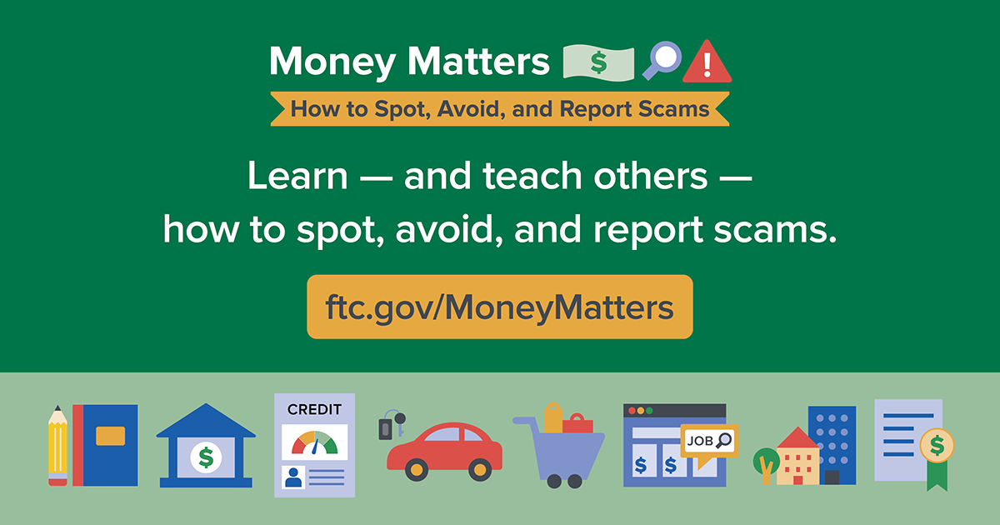

## Table of Contents

## What is the FTC?

The FTC stands for the Federal Trade Commission. It is a government agency in the United States. The FTC's main job is to protect consumers and make sure businesses follow the rules. They do this by stopping unfair business practices and making sure companies tell the truth about their products and services.

The FTC also works to keep competition fair in the market. This means they stop companies from working together to raise prices or keep other businesses out. By doing this, they help make sure that consumers have choices and that prices stay fair. The FTC uses laws like the FTC Act to do their work and can take companies to court if they break the rules.

## What are pandemic scams?

Pandemic scams are tricks that bad people use to take advantage of others during a health crisis like the COVID-19 outbreak. These scams can come in many forms, like fake cures or vaccines, fake charities asking for money, or people pretending to be from the government to steal personal information. They often use the fear and confusion of the situation to make people believe their lies.

These scams can hurt people by taking their money or stealing their personal information. For example, someone might sell a fake cure that doesn't work, or a fake charity might take donations and use the money for themselves instead of helping others. It's important to be careful and check if something is real before giving out money or personal information. Always look for signs that something might be a scam, like asking for payment in unusual ways or pressuring you to act quickly.

## How has the FTC responded to pandemic-related fraud?

The Federal Trade Commission (FTC) has been working hard to stop scams related to the COVID-19 pandemic. They have been looking out for fake products, like cures and vaccines that don't work, and stopping people who are trying to trick others into giving them money or personal information. The FTC has been warning people about these scams and telling them how to stay safe.

The FTC has also been taking action against companies and people who are breaking the rules. They have filed lawsuits against those who are scamming people and have been working to get money back for those who have been tricked. By doing this, the FTC is trying to make sure that people are protected during this difficult time and that they can trust the information and products they come across.

## What specific actions has the FTC taken against scammers during the pandemic?

The FTC has been busy fighting scammers during the pandemic. They have been looking for people selling fake cures and vaccines that don't work. The FTC has also been watching out for fake charities that ask for money but don't help anyone. They warn people about these scams and tell them how to stay safe. The FTC wants to make sure people know what to look out for and how to protect themselves.

The FTC has also taken legal action against scammers. They have filed lawsuits against companies and people who are breaking the rules. The FTC tries to get money back for people who have been tricked by these scams. By doing this, the FTC is working hard to stop scammers and help people who have been hurt by them during the pandemic.

## Can you provide examples of cases where the FTC has taken action?

The FTC took action against a company called NourishLife. This company was selling a product called FOCUS, which they said could help kids with autism. The FTC said NourishLife was lying about what the product could do. They were telling parents it could help their kids, but it didn't work. The FTC made NourishLife stop selling FOCUS and give money back to the people who bought it.

Another case was against a company called Quincy Bioscience. They were selling a product called Prevagen, which they said could help with memory problems. The FTC said Quincy Bioscience was lying about what Prevagen could do. They were telling people it could help with memory, but it didn't work. The FTC made Quincy Bioscience stop saying things that weren't true about Prevagen and give money back to the people who bought it.

## What types of scams were most prevalent during the pandemic?

During the pandemic, many people fell for scams about fake cures and vaccines. Scammers were selling things like special teas or vitamins, saying they could stop or cure COVID-19. These products didn't work, and people lost money buying them. The scammers used the fear and confusion about the virus to trick people into thinking their products could help.

Another common scam was fake charities. Scammers set up fake groups that said they were helping people affected by the pandemic. They asked for donations, but instead of using the money to help others, they kept it for themselves. People wanted to help during the crisis, but these fake charities took advantage of their kindness.

There were also scams where people pretended to be from the government. They would call or email, saying they needed personal information or money to help with things like stimulus checks or testing. These scammers used the chaos of the pandemic to trick people into giving them private details or cash.

## How does the FTC identify and track these scams?

The FTC uses many ways to find and track scams during the pandemic. They look at complaints from people who have been tricked. When someone reports a scam, the FTC uses that information to learn about new tricks and find the people behind them. They also watch the internet and social media for signs of scams. By looking at websites, ads, and posts, the FTC can spot fake products or fake charities that are trying to trick people.

The FTC also works with other groups to find and stop scams. They share information with other government agencies and law enforcement to catch scammers faster. By working together, they can see patterns and find out who is behind the scams. This teamwork helps the FTC take action against scammers and protect more people from getting tricked.

## What are the legal consequences for scammers caught by the FTC?

When scammers get caught by the FTC, they can face big legal problems. The FTC can take them to court and make them stop their scams. They might have to pay money back to the people they tricked. This is called restitution. Sometimes, the FTC can also make scammers pay fines, which are extra money punishments for breaking the law.

If the scams are very bad, the people behind them might even go to jail. This happens if they broke other laws too, like stealing people's money or personal information. The FTC works with other parts of the government, like the police, to make sure scammers face these consequences. By doing this, the FTC helps protect people and stop scammers from hurting others again.

## How can consumers report suspected scams to the FTC?

If you think you've seen a scam, you can tell the FTC about it. You can go to their website, which is ftc.gov/complaint. There, you can fill out a form to report the scam. You'll need to give details about what happened, like what the scam was about and how it affected you. The FTC uses this information to learn about new scams and stop the people behind them.

You can also call the FTC to report a scam. Their phone number is 1-877-FTC-HELP. When you call, someone will listen to your story and ask questions to understand what happened. Reporting scams helps the FTC protect other people from getting tricked. The more they know, the better they can fight against scammers.

## What measures can individuals take to protect themselves from these scams?

To protect yourself from scams, always be careful with emails, texts, or calls that ask for your personal information or money. Scammers often pretend to be from the government or a company you know. They might say you need to pay for a service or give them your details to get a benefit. If someone contacts you out of the blue and asks for this kind of information, stop and think. It's a good idea to check if the person or company is real before you do anything. You can do this by looking up their contact information on their official website or calling them using a number you know is right.

Another way to stay safe is to be careful about what you buy, especially during a crisis like a pandemic. If someone is selling a product that says it can cure or prevent a disease, be very careful. Always check if the product is approved by health experts like the FDA. Also, if you want to give money to a charity, make sure it's real. You can check this on websites like Charity Navigator or by calling the charity directly. By taking these steps, you can help keep your money and personal information safe from scammers.

## How does the FTC collaborate with other agencies to combat these scams?

The FTC works with other groups to stop scams. They share information with other government agencies like the FBI and the Department of Justice. This helps them find out more about the scams and catch the people doing them faster. By working together, they can see patterns and learn about new tricks that scammers are using. This teamwork makes it easier for the FTC to take action and protect more people from getting tricked.

The FTC also works with state and local law enforcement. They share what they know about scams happening in different places. This helps everyone understand the problem better and stop scammers from moving to new areas to keep tricking people. By working with all these groups, the FTC can do a better job of fighting scams and keeping people safe.

## What long-term strategies is the FTC developing to prevent future pandemic-related fraud?

The FTC is working on long-term plans to stop scams during future health crises. They want to be ready before a new problem happens. The FTC is looking at what worked and what didn't during the last pandemic. They are using this information to make better rules and tools to fight scams. They also want to teach people more about how to spot and avoid scams. By doing this, the FTC hopes to stop scammers before they can hurt people.

The FTC is also working with other groups to make their plans stronger. They are talking to other government agencies, health experts, and even companies to share ideas and information. This teamwork helps them find new ways to stop scams and protect people. By working together, the FTC and these groups can make sure they are ready for any future health crisis and keep people safe from scammers.

## References & Further Reading

[1]: Federal Trade Commission. ["COVID-19 and Beyond: The FTC's Response to Pandemic-Related Fraud."](https://www.ftc.gov/news-events/features/coronavirus)

[2]: Federal Trade Commission. ["FTC Sends Refunds to Consumers in Raging Bull Trading Scheme."](https://www.ftc.gov/enforcement/recent-ftc-cases-resulting-refunds/refund-programs-frequently-asked-questions)

[3]: Securities and Exchange Commission. ["Investor Alert: Beware of COVID-19 Scams."](https://www.investor.gov/introduction-investing/general-resources/news-alerts/alerts-bulletins/investor-alerts/beware-fraudsters-impersonating-investment-professionals-and-firms-investor-alert)

[4]: Commodity Futures Trading Commission. ["CFTC COVID-19 Scam Alert."](https://www.cftc.gov/)

[5]: United States Department of Justice. ["Department of Justice Announces Enforcement Action Involving COVID-19 Related Fraud."](https://www.justice.gov/)

[6]: ["Advances in Financial Machine Learning"](https://www.amazon.com/Advances-Financial-Machine-Learning-Marcos/dp/1119482089) by Marcos Lopez de Prado

[7]: Federal Trade Commission. ["Consumer Education: COVID-19 Scams."](https://www.ftc.gov/news-events/features/coronavirus/scams-consumer-advice)

[8]: BBC News. ["Coronavirus: Thousands fall victim to pandemic scams."](https://www.bbc.com/news/articles/cvgmk9ege84o)