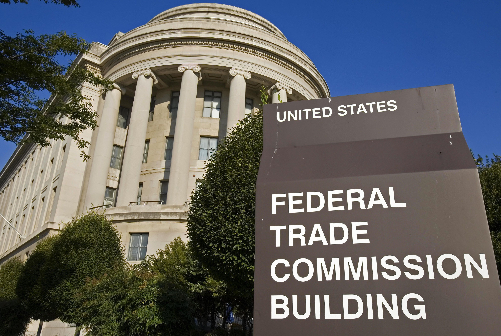

The COVID-19 pandemic has brought unprecedented challenges globally, impacting not only healthcare systems but also economic structures. As nations implemented lockdowns and physical interactions diminished, a significant shift towards digital platforms occurred. This shift provided fertile ground for scammers to devise sophisticated and innovative fraud schemes, ultimately leading to a notable increase in fraudulent activities across various sectors.

Fraudsters quickly adapted to the changing landscape, exploiting individuals' fears and uncertainties during the pandemic. Common scams included bogus health products claiming to cure or prevent COVID-19, fraudulent charities purporting to aid pandemic relief efforts, and deceptive financial opportunities like get-rich-quick schemes. The urgency and confusion surrounding the pandemic created an environment ripe for exploitation.

In response, the Federal Trade Commission (FTC) intensified its efforts to safeguard consumers against these scams. The FTC plays a crucial role in consumer protection, particularly in times of crisis. This article examines the FTC's strategies in addressing pandemic-related frauds and highlights their focus on consumer protection measures. It also explores the developments in algorithmic trading and the potential risks associated with unverified investment schemes, which saw a rise during the pandemic period. Through enforcement actions and consumer education, the FTC strives to mitigate the risks of fraud in an increasingly digital world.

## Table of Contents

## The Impact of Pandemic Scams

Since the onset of the COVID-19 pandemic, there has been a marked increase in fraudulent activities, as reported by the Federal Trade Commission (FTC). The global crisis prompted swift adaptation of daily activities to online platforms, providing scammers with unprecedented opportunities to exploit vulnerabilities. This shift led to a notable surge in scams, culminating in substantial financial losses amounting to $674 million attributed to COVID-19-related fraud by early 2022.

One of the most prominent types of scams observed involved bogus cures and treatments for COVID-19. These fraudulent schemes preyed on public fears and the urgent need for solutions during the health crisis. Scammers marketed unverified and often dangerous products, claiming they could prevent or cure the virus, thereby extracting money from unsuspecting consumers.

Another prevalent scam involved get-rich-quick schemes. As the economic impact of the pandemic led to widespread financial insecurity, fraudsters capitalized on the situation by offering deceptive opportunities for substantial and rapid financial gain. These schemes frequently promised guaranteed returns on investments through dubious means, leaving victims with significant financial losses once the fraud was uncovered.

Further contributing to the problem were scams promising fake financial aid. Amid widespread job losses and economic downturns, government relief programs were a critical lifeline for many. Scammers, posing as officials, offered phony aid or expedited processing of relief funds in exchange for personal information or upfront fees, only to disappear without delivering on their promises.

The immense scale and diversity of these scams highlight the persistent challenge posed to consumers during the pandemic. The FTC's reports underscore the urgent need for vigilance and the adaptation of consumer protection measures to combat this evolving threat.

## FTC's Strategies in Combating Pandemic Scams

The Federal Trade Commission (FTC) implemented a robust strategy to combat pandemic-related scams, employing a three-pronged approach: law enforcement engagement, data collection and analysis, and consumer education.

1. **Law Enforcement Engagement**: The FTC collaborated with law enforcement agencies at multiple levels to identify and halt misleading claims associated with the pandemic. By pooling resources and jurisdictional authorities, the FTC was able to initiate actions against numerous fraudulent entities. These efforts included issuing cease-and-desist orders to businesses making unsubstantiated claims, particularly those offering bogus health products or fake financial relief services. In one instance, the FTC acted swiftly to stop deceptive advertising practices by companies falsely promoting COVID-19 prevention or treatment products.

2. **Data Collection and Analysis**: The agency emphasized the use of comprehensive data analysis to detect and track fraudulent activities. By leveraging data-driven insights, the FTC could identify patterns and clusters of scams that arose during the pandemic. This analytical approach enabled the FTC to prioritize cases based on the volume of consumer reports and the severity of financial harm, allowing for more efficient allocation of enforcement resources.

3. **Consumer Education**: Recognizing the pivotal role of informed consumers in preventing fraud, the FTC ramped up efforts in consumer education. The agency developed a range of educational materials designed to help individuals recognize and avoid scams. These resources included online guides, webinars, and social media campaigns that highlighted common pandemic-related scams and provided tips for verification of legitimate claims. This proactive educational outreach aimed to arm consumers with knowledge, thus reducing their susceptibility to deceptive practices.

By deploying these strategies, the FTC enhanced its ability to protect consumers during a time when vulnerabilities were amplified by the global shift towards digital transactions and online interactions. Moreover, their collaborative efforts with online platforms facilitated the detection and removal of fraudulent posts, creating a safer digital marketplace for consumers.

## Rise of Algorithmic Trading Scams

During the COVID-19 pandemic, a surge in online activities created fertile ground for [algorithmic trading](/wiki/algorithmic-trading) scams. As more individuals sought financial independence or supplementary income, fraudsters seized the opportunity to market ostensibly lucrative trading algorithms. These fraudulent schemes often promised high returns with minimal risk, enticing unsuspecting investors.

One notorious example of such a scheme is the case involving RagingBull.com. This platform, ostensibly an educational service specializing in investment advice and algorithmic trading, was accused by the Federal Trade Commission (FTC) of deceiving consumers. It allegedly lured users with false earnings claims and misrepresentations about the profitability of their trading strategies. RagingBull.com reportedly charged substantial fees for subscriptions while many consumers did not achieve the advertised successes.

The deceptive nature of these scams usually revolves around unverified or falsified data about trading performance. Fraudsters may show simulated returns, omitting critical information about market risks and potential losses. This lack of transparency and accountability can lead to significant financial losses for consumers who trust these schemes.

Algorithmic trading, by definition, involves the use of computer algorithms to automate trading decisions in financial markets. These systems can process large amounts of data rapidly, identify trading opportunities, and execute trades at high speeds. While algorithmic trading can be a tool for legitimate investment strategies, it becomes problematic in a scam context when false promises and opaque operations are involved.

The rise of these scams during the pandemic underscores the importance of verifying the authenticity of trading platforms and the claims they make. Investors should conduct due diligence, seeking independent reviews and understanding the inherent risks associated with algorithmic trading. They should also be cautious of any platform guaranteeing extraordinary returns with little to no risk.

To counteract the proliferation of algorithmic trading scams, the FTC and regulatory bodies emphasize consumer education, urging individuals to report suspicious activities. This reporting aids in identifying and dismantling fraudulent operations, contributing to a safer investment environment.

## Consumer Protection Measures by the FTC

The Federal Trade Commission (FTC) has taken a proactive stance in consumer protection, particularly amidst the rise in scams exacerbated by the COVID-19 pandemic. To equip consumers with the knowledge necessary to avoid being duped, the FTC has launched extensive educational campaigns. These campaigns include creating and disseminating easily accessible resources online that guide consumers on identifying and steering clear of fraudulent schemes.

One of the primary focuses of these educational resources is the emphasis on due diligence before engaging in trading or investment opportunities. The FTC advises consumers to thoroughly research and verify any platform or individual offering investment opportunities. This includes checking for legitimate licenses and any past fraudulent reports associated with the entity. Tools provided by the FTC, such as the Consumer Sentinel Network, serve as critical databases for consumers to cross-check potential fraudulent activities.

Moreover, the FTC underscores the importance of reporting suspected fraud cases. Encouraging consumers to report fraud not only aids in tracking these scams but also plays a crucial role in prevention and enforcement. The FTC utilizes these reports to monitor trends and take corrective actions against fraudulent activities, which can include legal action against perpetrators. Through these efforts, the FTC seeks to build a robust defense system that protects consumers from the financial harm posed by pandemic-related scams, thereby strengthening overall market integrity.

Maintaining a vigilant approach to consumer protection remains essential as digital engagement continues to grow. The FTC's strategic initiatives aim to foster a secure and informed online environment where consumers can confidently participate in economic activities without falling prey to deceptive practices.

## Proposed Rulemaking for Enhanced Consumer Refunds

The Federal Trade Commission (FTC) has taken decisive steps to enhance consumer protections in the face of rising fraud, particularly during the pandemic. One of these steps involves proposing rulemaking aimed at empowering the FTC under Section 19 of the FTC Act. This legal provision would allow the FTC to seek refunds for consumers affected by fraudulent activities, thereby bolstering its ability to provide restitution. The emphasis on consumer refunds is an essential component of the FTC’s strategy to not only compensate victims but also serve as a deterrent against future fraudulent behaviors.

The proposed rulemaking specifically targets deceptive earnings claims and misleading endorsements, especially prevalent in online trading platforms and algorithmic trading schemes. With the surge in digital trading activities, unscrupulous actors have exploited the situation by making unrealistic promises of high returns, often endorsed by seemingly credible personalities or influencers. This practice has misled many consumers into making poor financial decisions, resulting in significant losses.

The FTC's proposal seeks to tighten regulations surrounding such claims to ensure transparency and accountability. By focusing on deceptive earnings assertions, the FTC aims to dismantle the profitability myths propagated by these platforms. Furthermore, addressing misleading endorsements involves holding both the endorsers and the entities behind them accountable for false claims, thus fostering a more truthful advertising environment.

The proposed rules underscore the importance of consumer restitution, providing a framework for financial redress to those defrauded. This approach not only aids in returning financial losses to consumers but also strengthens the overall consumer confidence in digital marketplaces. The deterrence aspect of these rules is vital for discouraging potential fraudsters by increasing the risks and consequences associated with dishonest practices.

In summary, the FTC's proposed rulemaking is a significant move towards enhancing consumer protection by ensuring compensation for victims and preventing deceptive practices in the future. This targeted approach highlights the dual aims of restitution and deterrence, crucial for maintaining integrity and trust in an increasingly digitalized economy.

## Conclusion

The FTC's ongoing efforts to combat pandemic-related scams have highlighted the critical need for heightened consumer protection. Through a combination of strategic law enforcement actions and comprehensive consumer education initiatives, the FTC has endeavored to shield the public from a wide array of fraudulent schemes, including those involving algorithmic trading. By maintaining robust partnerships with various platforms and issuing targeted cease-and-desist orders, the FTC aims to prevent misleading claims that could jeopardize consumer financial security.

As the digital landscape continues to evolve, the onus also falls on stakeholders, particularly consumers, to remain informed and vigilant against potential fraud. By understanding the tactics employed by scammers and actively engaging with educational resources provided by the FTC, consumers can better protect themselves against deceit. Such awareness is crucial in effectively mitigating risks associated with fraudulent activities. The FTC's commitment to enforcing rules and proposing new measures for enhanced consumer refunds further exemplifies its role in ensuring consumer restitution and deterring future scams. This multi-faceted approach underscores the FTC's dedication to fostering a safer online environment in the face of burgeoning digital fraud threats.

## References & Further Reading

[1]: Federal Trade Commission. ["COVID-19 and Beyond: The FTC's Response to Pandemic-Related Fraud."](https://www.ftc.gov/news-events/features/coronavirus)

[2]: Federal Trade Commission. ["FTC Sends Refunds to Consumers in Raging Bull Trading Scheme."](https://www.ftc.gov/enforcement/recent-ftc-cases-resulting-refunds/refund-programs-frequently-asked-questions)

[3]: Securities and Exchange Commission. ["Investor Alert: Beware of COVID-19 Scams."](https://www.investor.gov/introduction-investing/general-resources/news-alerts/alerts-bulletins/investor-alerts/beware-fraudsters-impersonating-investment-professionals-and-firms-investor-alert)

[4]: Commodity Futures Trading Commission. ["CFTC COVID-19 Scam Alert."](https://www.cftc.gov/)

[5]: United States Department of Justice. ["Department of Justice Announces Enforcement Action Involving COVID-19 Related Fraud."](https://www.justice.gov/)

[6]: ["Advances in Financial Machine Learning"](https://www.amazon.com/Advances-Financial-Machine-Learning-Marcos/dp/1119482089) by Marcos Lopez de Prado

[7]: Federal Trade Commission. ["Consumer Education: COVID-19 Scams."](https://www.ftc.gov/news-events/features/coronavirus/scams-consumer-advice)

[8]: BBC News. ["Coronavirus: Thousands fall victim to pandemic scams."](https://www.bbc.com/news/articles/cvgmk9ege84o)