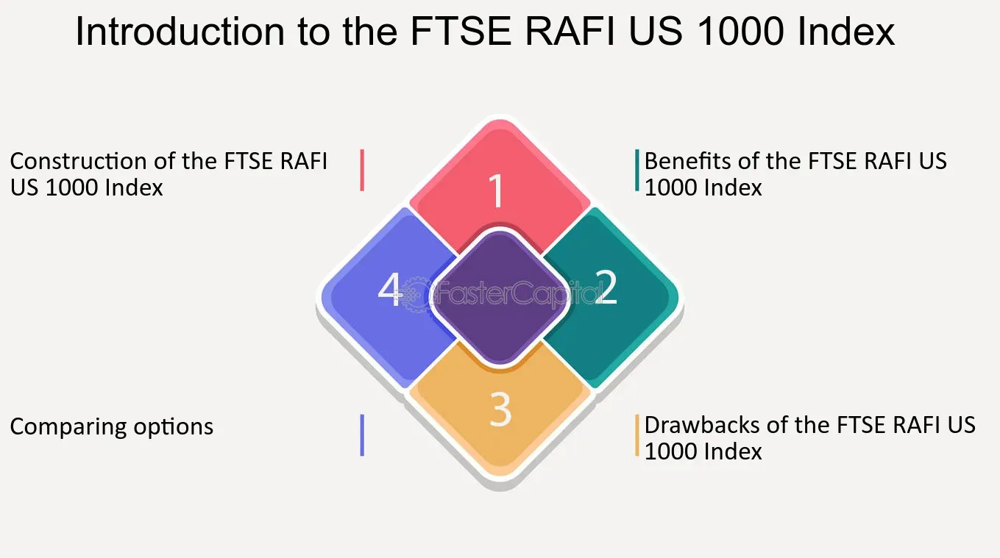

## Table of Contents

## What is the FTSE RAFI US 1000 Index?

The FTSE RAFI US 1000 Index is a stock market index that tracks the performance of the largest 1,000 companies in the United States. It is designed to be a more fundamental approach to indexing, meaning it focuses on a company's size, profits, sales, and dividends rather than just its stock price. This method is different from traditional market-cap weighted indexes, where companies with higher stock prices have a bigger impact on the index's performance.

The index is created by FTSE Russell, a company that makes many different indexes. They use a special formula to pick the companies for the FTSE RAFI US 1000 Index. This formula looks at four things: a company's book value (its assets minus its debts), its cash flow (the money coming in and going out), its sales, and its dividends (the money it pays to shareholders). By focusing on these fundamental factors, the index aims to give a more stable and potentially better long-term performance compared to indexes that only consider stock prices.

## Who created the FTSE RAFI US 1000 Index?

The FTSE RAFI US 1000 Index was created by FTSE Russell, a company that makes many different indexes. They worked together with Research Affiliates, another company that focuses on investment strategies. Together, they came up with the idea for this special index.

The index is different because it doesn't just look at a company's stock price. Instead, it looks at four important things about a company: its book value, its cash flow, its sales, and its dividends. By focusing on these things, the index tries to give a more stable and possibly better performance over time compared to other indexes that only consider stock prices.

## What does RAFI stand for in the FTSE RAFI US 1000 Index?

RAFI stands for "Research Affiliates Fundamental Index." This name comes from the company Research Affiliates, which worked with FTSE Russell to create the index. They wanted to make an index that looks at a company's real value, not just its stock price.

The FTSE RAFI US 1000 Index uses four important things to decide which companies to include: book value, cash flow, sales, and dividends. By focusing on these, the index tries to give a more stable and possibly better performance over time compared to other indexes that only consider stock prices.

## How is the FTSE RAFI US 1000 Index different from market-cap weighted indexes?

The FTSE RAFI US 1000 Index is different from market-cap weighted indexes because it doesn't just look at a company's stock price to decide how important it is in the index. Market-cap weighted indexes, like the S&P 500, give more weight to companies with higher stock prices. This means that if a company's stock price goes up a lot, it can have a big effect on the whole index. But the FTSE RAFI US 1000 Index uses a different way to decide which companies are important. It looks at four things about a company: its book value, its cash flow, its sales, and its dividends. This way, the index tries to focus on a company's real value, not just how much people are willing to pay for its stock at the moment.

Because the FTSE RAFI US 1000 Index uses these four things to pick companies, it can be more stable over time. Market-cap weighted indexes can go up and down a lot because they are based on stock prices, which can change quickly. But the FTSE RAFI US 1000 Index tries to give a more steady performance by focusing on the real, fundamental parts of a company. This can help investors who want to avoid big ups and downs in their investments and are looking for a more reliable way to grow their money over the long term.

## What are the key components of the FTSE RAFI US 1000 Index?

The FTSE RAFI US 1000 Index includes the largest 1,000 companies in the United States. It is different from other indexes because it doesn't just look at a company's stock price. Instead, it uses four important things to decide which companies to include: book value, cash flow, sales, and dividends. Book value is what a company is worth if you take away its debts from its assets. Cash flow is the money coming in and going out of the company. Sales are how much money the company makes from selling things. Dividends are the money the company pays to its shareholders.

By focusing on these four things, the FTSE RAFI US 1000 Index tries to show a company's real value, not just how much people are willing to pay for its stock at the moment. This can make the index more stable over time because it doesn't go up and down as much as indexes that only look at stock prices. Investors who want to avoid big ups and downs in their investments might like this index because it can help them grow their money more steadily over the long term.

## How are companies selected for inclusion in the FTSE RAFI US 1000 Index?

Companies are picked for the FTSE RAFI US 1000 Index by looking at four important things about them: their book value, cash flow, sales, and dividends. Book value is what a company is worth if you take away its debts from its assets. Cash flow is the money coming in and going out of the company. Sales are how much money the company makes from selling things. Dividends are the money the company pays to its shareholders. The index looks at these four things to decide which companies are the biggest and most important in the United States.

The FTSE RAFI US 1000 Index includes the top 1,000 companies based on these four things. This way, the index tries to show a company's real value, not just how much people are willing to pay for its stock at the moment. By focusing on these fundamental parts of a company, the index can be more stable over time. It doesn't go up and down as much as indexes that only look at stock prices. This can help investors who want to avoid big ups and downs in their investments and are looking for a more reliable way to grow their money over the long term.

## What are the weighting factors used in the FTSE RAFI US 1000 Index?

The FTSE RAFI US 1000 Index uses four things to decide how much each company matters in the index. These four things are called weighting factors, and they are book value, cash flow, sales, and dividends. Book value is what a company is worth if you take away its debts from its assets. Cash flow is the money coming in and going out of the company. Sales are how much money the company makes from selling things. Dividends are the money the company pays to its shareholders. Each of these factors is equally important, so they all have the same weight when deciding how important a company is in the index.

By using these four weighting factors, the FTSE RAFI US 1000 Index tries to show a company's real value, not just how much people are willing to pay for its stock at the moment. This is different from other indexes that only look at a company's stock price. The FTSE RAFI US 1000 Index can be more stable over time because it doesn't go up and down as much as indexes that only consider stock prices. This can help investors who want to avoid big ups and downs in their investments and are looking for a more reliable way to grow their money over the long term.

## How often is the FTSE RAFI US 1000 Index rebalanced?

The FTSE RAFI US 1000 Index is rebalanced every year. This means that once a year, the people who make the index look at all the companies again and change how much each company matters in the index. They do this by looking at the four things they care about: book value, cash flow, sales, and dividends. If a company's numbers for these things have changed, its importance in the index might change too.

Rebalancing helps keep the index fair and up-to-date. It makes sure that the index still shows the real value of the companies, not just their stock prices. By doing this every year, the FTSE RAFI US 1000 Index can stay true to its goal of being a more stable and reliable way for investors to grow their money over time.

## What are the benefits of investing in the FTSE RAFI US 1000 Index?

Investing in the FTSE RAFI US 1000 Index can be a good choice for people who want a more stable way to grow their money over time. This index doesn't just look at a company's stock price like other indexes do. Instead, it looks at four important things about a company: its book value, cash flow, sales, and dividends. By focusing on these things, the index tries to show a company's real value. This can make the index less likely to go up and down a lot, which can be good for investors who don't like big changes in their investments.

Another benefit of the FTSE RAFI US 1000 Index is that it is rebalanced every year. This means that once a year, the people who make the index look at all the companies again and change how much each company matters in the index. This helps keep the index fair and up-to-date. It makes sure that the index still shows the real value of the companies, not just their stock prices. By doing this every year, the FTSE RAFI US 1000 Index can stay true to its goal of being a more reliable way for investors to grow their money over the long term.

## How does the FTSE RAFI US 1000 Index perform compared to traditional indexes?

The FTSE RAFI US 1000 Index often performs differently from traditional indexes like the S&P 500. Traditional indexes are based on a company's stock price, so if a company's stock price goes up a lot, it can have a big effect on the whole index. But the FTSE RAFI US 1000 Index looks at a company's real value by considering its book value, cash flow, sales, and dividends. This can make the FTSE RAFI US 1000 Index more stable over time because it doesn't go up and down as much as indexes that only look at stock prices.

Over the long term, the FTSE RAFI US 1000 Index has sometimes done better than traditional indexes. This is because it focuses on the real, fundamental parts of a company, which can help it avoid big ups and downs. Investors who want a more reliable way to grow their money over time might like the FTSE RAFI US 1000 Index because it can help them avoid the big changes that can happen with traditional indexes.

## What are the potential risks associated with the FTSE RAFI US 1000 Index?

Investing in the FTSE RAFI US 1000 Index comes with some risks that people should know about. One risk is that even though the index looks at a company's real value, it can still go down if the economy is not doing well. If a lot of companies have lower book values, cash flows, sales, or dividends, the whole index can go down too. This means that investors might lose money if they invest in the index at the wrong time.

Another risk is that the FTSE RAFI US 1000 Index might not always do better than traditional indexes like the S&P 500. Even though it has done well in the past, there's no guarantee it will do well in the future. The way the index picks companies can also mean it misses out on some good opportunities. If a company's stock price goes up a lot but its book value, cash flow, sales, and dividends don't change much, the FTSE RAFI US 1000 Index might not include it or give it as much importance as a traditional index would. This can mean missing out on some big gains.

## How can investors gain exposure to the FTSE RAFI US 1000 Index?

Investors can gain exposure to the FTSE RAFI US 1000 Index by buying exchange-traded funds (ETFs) or mutual funds that track this index. These funds are designed to mimic the performance of the index, so when the index goes up, the value of the fund usually goes up too. One popular [ETF](/wiki/etf-trading-strategies) that follows the FTSE RAFI US 1000 Index is the Invesco FTSE RAFI US 1000 ETF. By investing in this ETF, people can easily get the same returns as the index without having to buy all 1,000 companies themselves.

Another way to gain exposure is through financial products like index funds or structured products that are based on the FTSE RAFI US 1000 Index. These products can be offered by banks or investment companies and might come with different levels of risk and reward. Investors should always do their homework and maybe talk to a financial advisor to make sure they understand the product and its risks before they invest. This way, they can make smart choices about how to include the FTSE RAFI US 1000 Index in their investment plans.

## References & Further Reading

[1]: Arnott, R. D., Hsu, J., & Moore, P. (2005). ["Fundamental Indexation"](https://papers.ssrn.com/sol3/papers.cfm?abstract_id=604842). Financial Analysts Journal, 61(2), 83–99.

[2]: ["The Intelligent Investor: The Definitive Book on Value Investing"](https://www.amazon.com/Intelligent-Investor-Definitive-Investing-Essentials/dp/0060555661) by Benjamin Graham

[3]: Hsu, J. C., & Campollo, A. (2006). ["The Fundamentals of Fundamental Indexing"](https://www.researchgate.net/publication/255997316_An_Examination_of_Fundamental_Indexation). Financial Analysts Journal, 62(5), 44-54.

[4]: ["Algorithmic Trading: Winning Strategies and Their Rationale"](https://www.wiley.com/en-us/Algorithmic+Trading%3A+Winning+Strategies+and+Their+Rationale-p-9781118746912) by Ernie Chan

[5]: Arnott, R. D., Hsu, J. C., Kalesnik, V., & Tindall, P. (2013). ["The Surprising Alpha from Malkiel's Monkey and Upside‐Down Strategies"](https://www.semanticscholar.org/paper/The-Surprising-Alpha-From-Malkiel%E2%80%99sMonkey-and-Arnott-Hsu/2a6ee54fe1de3930ab3a7446b8dc4673682a3e4b). Journal of Finance, 68(4), 1563-1586.