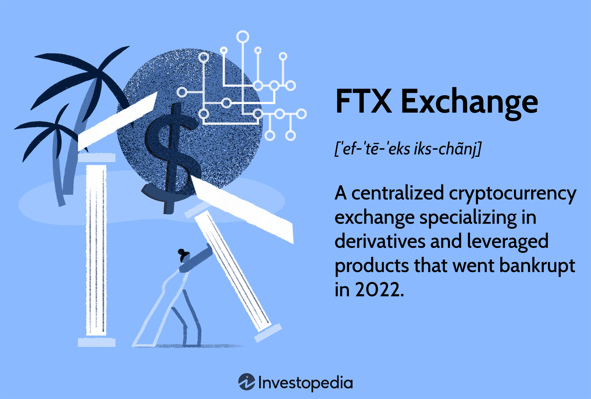

The emergence of cryptocurrencies has transformed the financial landscape, offering new opportunities and challenges within a digital asset trading ecosystem. Central to this transformation are cryptocurrency exchanges, platforms that enable users to trade digital currencies, tokens, and other crypto assets. Among these platforms, FTX stood out as a significant entity in the market. Founded by Sam Bankman-Fried and Gary Wang in 2018, FTX quickly distinguished itself through its innovative trading solutions, attracting both retail and institutional investors worldwide.

FTX's appeal lay in its diverse product offerings and cutting-edge trading features. The platform was known for providing futures, options, and tokenized stocks, offering traders nuanced options for trading strategies and exposure to a wide array of assets, both traditional and digital. This capability was enhanced by FTX's integration of algorithmic trading, which allowed traders to automate their strategies, thereby increasing trading efficiency and precision. Algorithmic trading, or algo trading, enabled faster execution of trades and provided scalability to trading operations, contributing significantly to FTX's competitive advantage in the marketplace.

The growth of FTX was supported by its strong leadership and innovative approach, which emphasized transparency, user education, and comprehensive trading solutions. This focus attracted a diverse, global user base and solidified its reputation as a forward-thinking exchange. However, the platform's trajectory was not without obstacles. Despite implementing robust security and compliance measures, FTX faced challenges such as allegations of market manipulation and wash trading. These issues raised questions about its ethical standards and regulatory compliance, setting the stage for its eventual unraveling.

FTX's journey from rise to fall offers critical insights into the operations of cryptocurrency exchanges, particularly concerning security, compliance, and the strategic role of algo trading. The collapse of FTX, marked by financial controversies and a high-profile bankruptcy, underscores the need for effective risk management and transparent governance in the cryptocurrency industry.

This article endeavors to unpack FTX's complex narrative, reflecting on the lessons from its operational strategies and downfall. It also looks ahead to the future of cryptocurrency exchanges, assessing how these platforms can sustainably grow in a rapidly evolving financial landscape.

## Table of Contents

## The Rise of FTX

FTX was established in 2018 by Sam Bankman-Fried and Gary Wang, swiftly carving a niche as a formidable entity in the cryptocurrency domain. The platform's rise was marked by its intuitive user interface and a multitude of product offerings that appealed to both novice and expert traders. Among its standout features were advanced trading options such as futures, options, and tokenized stocks. These offerings enabled traders to explore various trading strategies, facilitating leverage on positions and allowing for exposure to both traditional assets and the burgeoning world of digital currencies.

The innovative approach of FTX was pivotal in its rapid ascent. The exchange was designed to cater to a wide array of trading needs, promoting tools that enhanced trading efficiency and broadened participants' opportunities in the market. This was particularly appealing to users seeking to capitalize on both market upswings and downturns.

FTX's rapid expansion was significantly bolstered by the strong leadership of its co-founders. Sam Bankman-Fried, imbued with a strong reputation through his previous work with Alameda Research, was instrumental in the exchange's success. His experience and expertise in trading and market dynamics injected credibility and trust into FTX, fostering a strong following.

The platform's growth trajectory was further fueled by an emphasis on transparency and education, principles that attracted a global audience. FTX stood out with its commitment to transparency, which resonated with a user base seeking trustworthy and reliable trading platforms. Additionally, the educational focus of the platform empowered users, equipping them with the necessary knowledge to navigate the complexities of [cryptocurrency](/wiki/cryptocurrency) trading.

FTX also offered comprehensive trading solutions, positioning itself as a one-stop-shop for digital trading needs. This approach, combined with an innovative product lineup, solid leadership, and a focus on user empowerment and transparency, allowed FTX to thrive in an increasingly competitive market landscape.

## FTX and Algo Trading

Algorithmic trading, often known as algo trading, has redefined trading methods in financial markets by providing the speed and precision required for executing trades. FTX emerged as a pioneering platform in integrating algo trading, which allowed users to automate trading strategies and execute complex orders with increased efficiency. 

FTX's trading platform was designed to support various [algorithmic trading](/wiki/algorithmic-trading) tools that attracted both novice and experienced traders. These tools empowered users to automate strategies, enhancing their ability to capitalize on market fluctuations. For example, traders could set algorithms to execute trades based on specific conditions, such as price thresholds or market indicators. By minimizing human intervention, traders using FTX could implement high-frequency trading strategies that benefited from market [volatility](/wiki/volatility-trading-strategies).

Moreover, the integration of algo trading on FTX significantly bolstered market [liquidity](/wiki/liquidity-risk-premium). High-frequency trading, a form of algo trading characterized by a high number of transactions executed in fractions of a second, improved the liquidity of various trading pairs on the platform. This increase in liquidity was particularly appealing to institutional investors, who require substantial liquidity to enter and [exit](/wiki/exit-strategy) positions without adversely impacting market prices.

Algo trading also provided a competitive edge for FTX by allowing it to cater to sophisticated institutional strategies. Technical advancements in algo solutions made it easier for institutional clients to manage large volumes of trades efficiently. The combination of state-of-the-art technology and comprehensive market access positioned FTX as a formidable participant in the digital trading space.

In summary, FTX’s embrace of algorithmic trading facilitated its competitive advantage and shaped the market environment of cryptocurrency exchanges. The incorporation of sophisticated trading tools attracted a wide range of market participants, from retail traders to large institutional investors, thus reinforcing its standing within the cryptocurrency ecosystem.

## Security and Compliance at FTX

FTX's approach to security and compliance was a critical aspect of its operations, reflecting the overarching need for robust measures in the digital trading space. The exchange implemented several strategies to safeguard user funds and adhere to regulatory standards.

A cornerstone of FTX's security infrastructure was the use of two-[factor](/wiki/factor-investing) authentication (2FA), which added an additional layer of protection against unauthorized access to user accounts. This system required users to provide two forms of identification before accessing their accounts, reducing the risk of password-related breaches. Furthermore, FTX employed know-your-customer (KYC) processes, which verified the identity of users as part of its commitment to legal compliance and to deter illicit activities such as fraud and identity theft.

In addition to these measures, FTX utilized real-time anti-money laundering (AML) controls. These controls enabled the monitoring of transactions to identify and prevent suspicious activities, thereby fostering a secure trading environment. By leveraging advanced algorithms and data analysis, the exchange aimed to detect anomalous patterns indicative of money laundering schemes.

Despite these proactive security measures, FTX encountered significant challenges that affected its compliance reputation. Allegations of wash trading, a practice where trades are made to give the illusion of market activity and manipulate asset prices, emerged as a critical issue. Such allegations undermined the integrity of FTX's market operations and raised concerns regarding its adherence to fair trading practices.

Moreover, accusations of market manipulation further contributed to the erosion of trust and credibility. These compliance issues highlighted gaps in FTX's ability to enforce its security protocols and maintain a transparent trading environment.

In summary, while FTX established a strong framework for security and compliance, the exchange ultimately faced difficulties that impacted its standing and contributed to its eventual decline. The scrutiny over its practices underscores the importance of continual monitoring and enforcement of regulations to safeguard the interests of users and maintain market stability.

## The Decline and Fall of FTX

FTX, once a prominent name in the cryptocurrency arena, experienced a precipitous decline marked by a series of scandals and regulatory challenges that ultimately led to its demise. The exchange's journey from a leading market innovator to bankruptcy serves as a striking example of the vulnerabilities and risks inherent in the digital assets market.

Accusations of fraudulent operations, notably wash trading, severely tarnished FTX's reputation. Wash trading involves the artificial inflation of trading volumes through transactions that create a misleading market activity picture. Such practices raised substantial concerns regarding FTX's commitment to maintaining transparency and adhering to ethical standards, pivotal aspects of trust within financial ecosystems.

The liquidity crisis involving FTX's native token, FTT, further aggravated the situation. As liquidity plays a crucial role in ensuring the smooth operation of an exchange, the emergence of liquidity issues signaled deeper financial instability. The crisis culminated in a loss of investor confidence, triggering a rapid sell-off of FTT and further diminishing FTX's standing in the market. This chain of events precipitated the company's filing for bankruptcy in November 2022, highlighting the critical role of robust liquidity management in sustaining a digital asset exchange.

A significant episode in FTX's collapse was the arrest and subsequent trial of its CEO, Sam Bankman-Fried. Facing charges of fraud and conspiracy, the trial underscored the severe legal and regulatory ramifications of the exchange's operational practices. The highest levels of governance within FTX were called into question, damaging the credibility and trustworthiness of the exchange.

The collapse of FTX underscores crucial lessons for the cryptocurrency sector within trust and governance. Ensuring transparency, ethical conduct, and strong regulatory compliance mechanisms are fundamental to building and maintaining investor confidence in cryptocurrency exchanges. These elements are vital for the sustainability and growth of digital asset platforms in an industry frequently scrutinized for potential misconduct.

In conclusion, the decline of FTX reflects the complex dynamics of emerging financial technologies and the urgent need for vigilance in regulatory affairs. It serves as a cautionary tale of the potential consequences when ethical standards and financial integrity are compromised within the digital trading environment.

## Lessons Learned from the FTX Debacle

FTX's spectacular ascent and subsequent downfall illuminate several critical lessons pivotal to the evolution of cryptocurrency exchanges. At the heart of these lessons is the fundamental necessity for a robust regulatory framework. The absence of comprehensive regulation in the cryptocurrency market allowed FTX to operate with relative autonomy, which ultimately led to vulnerabilities in their financial practices and operations. Regulatory oversight could have offered a layer of protection, ensuring that exchanges adhere to standardized practices that safeguard investor interests and market integrity.

Another lesson from the FTX debacle is the paramount importance of transparency and effective risk management. FTX's financial distress was exacerbated by opaque business practices and inadequate disclosure of financial health. Transparent operations, possibly enforced through mandatory reporting and independent audits, would have mitigated mistrust and provided stakeholders with a clearer understanding of the exchange's actual financial position. Effective risk management strategies, such as tightening leverage limits and enhancing liquidity provisions, could have averted the liquidity crisis that precipitated FTX's collapse.

Investor protection emerges as another critical focal point. The collapse of FTX affected thousands of investors and traders who faced substantial financial losses. Ensuring investor protection mechanisms, such as insurance funds or reserve pools for compensations during exchange insolvencies, would have played a crucial role in sustaining market confidence and minimizing investor risk.

The ethical conduct of the exchange operators is also a significant factor in avoiding pitfalls similar to those experienced by FTX. Establishing an ethical business culture, underscored by accountability and integrity, is essential for maintaining trust in digital trading platforms. Industry stakeholders should not only uphold compliance with regulatory standards but also imbue their operations with a commitment to ethical trading practices.

Future crypto exchanges can derive valuable insights from FTX's tumultuous journey by adopting these takeaways. Navigating the burgeoning digital trading landscape requires an agile blend of regulatory adherence, transparent operations, risk-minimized strategies, and unwavering ethical standards. By internalizing these lessons, new and existing exchanges can endure market challenges while optimizing opportunities presented by this dynamic financial ecosystem.

As cryptocurrency exchanges continue to evolve, the relevance of these insights becomes increasingly pronounced. They form the foundation for a more secure, transparent, and ethically responsible digital trading environment, sought after by investors and regulators alike.

## Conclusion

FTX captivated the cryptocurrency world with its innovative approach to digital trading, offering unique solutions that challenged the status quo of digital asset platforms. Initially, its rise exhibited the high potential digital exchanges hold in revolutionizing financial markets, driven by cutting-edge trading mechanisms and a broad spectrum of investment products. However, this very ascent underscored the vulnerabilities associated with rapid growth and inadequate regulatory oversight. FTX's trajectory highlights how unchecked practices, despite groundbreaking technological advancements, can lead to significant pitfalls.

The experiences drawn from FTX's saga provide critical insights for the sustainability and ethical governance of cryptocurrency exchanges. It stresses the importance of integrating lessons from failures into the ongoing efforts for robust cryptocurrency regulation. This involves emphasizing the need for transparent operations, stringent compliance standards, and ethical business practices, which collectively contribute to maintaining investor trust and market stability.

Innovation remains a key driver in the evolution of digital trading platforms. However, the focus must also incorporate rigorous security measures and adherence to legal and ethical standards. This balanced approach is essential to prevent malpractices and ensure the longevity of these exchanges. The exchange's historical narrative serves as a stern reminder for current and future platforms to prioritize scrutiny and integrity.

Ultimately, FTX's legacy is a profound lesson in the complexities of digital trading. It is a cautionary example of what can transpire when innovation is not matched with appropriate governance and caution. As cryptocurrency markets continue to mature, stakeholders must remain vigilant and committed to upholding the principles of transparency and accountability to foster a secure and trustworthy trading environment.

## References & Further Reading

[1]: Bastian, M., Heymann, S., & Jacomy, M. (2009). ["Gephi: An Open Source Software for Exploring and Manipulating Networks."](https://ojs.aaai.org/index.php/ICWSM/article/view/13937) International AAAI Conference on Weblogs and Social Media.

[2]: Popper, N. (2020). ["Digital Gold: Bitcoin and the Inside Story of the Misfits and Millionaires Trying to Reinvent Money."](https://www.amazon.com/Digital-Gold-Bitcoin-Millionaires-Reinvent/dp/006236250X) Harper Paperbacks.

[3]: Michel, W. (2019). ["Antifragility in Financial Markets: How to Build a Portfolio That Benefits from Volatility."](https://pmc.ncbi.nlm.nih.gov/articles/PMC10177715/) Springer.

[4]: Kharif, O. (2022). ["FTX’s Sam Bankman-Fried Lived an Alleged Crypto Empire Built on Mismanagement."](https://www.sciencedirect.com/science/article/pii/S1161030124003575) Bloomberg.

[5]: Vigna, P., & Casey, M. J. (2016). ["The Age of Cryptocurrency: How Bitcoin and the Blockchain Are Challenging the Global Economic Order."](https://www.amazon.com/Age-Cryptocurrency-Blockchain-Challenging-Economic/dp/1250081556) Picador.