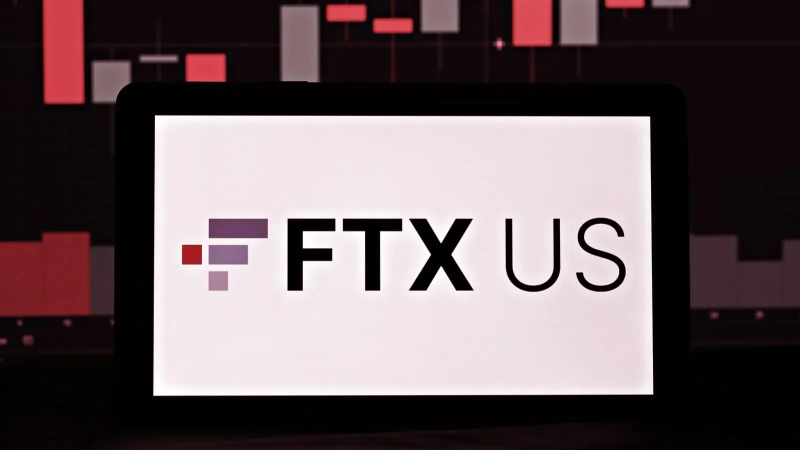

## Table of Contents

## What is FTX US Derivatives?

FTX US Derivatives is a part of FTX, a company that deals with trading. It is made for people in the United States who want to trade things like futures and options. Futures and options are special kinds of agreements that let people buy or sell something at a set price in the future. FTX US Derivatives makes sure that it follows the rules set by the U.S. government for these kinds of trades.

The main goal of FTX US Derivatives is to give a safe and easy place for people to trade. It uses special technology to make sure that trading happens quickly and without problems. This helps traders feel confident that their trades are safe and that they can trust the platform. By focusing on the U.S. market, FTX US Derivatives helps more people in the country get involved in trading futures and options.

## How does FTX US Derivatives differ from other cryptocurrency exchanges?

FTX US Derivatives stands out from other cryptocurrency exchanges because it focuses on trading futures and options, which are special types of contracts. These contracts let people agree to buy or sell something at a set price in the future. Unlike many other exchanges that mainly deal with buying and selling cryptocurrencies directly, FTX US Derivatives is all about these futures and options. This makes it a good choice for people who want to trade these specific types of contracts and are based in the United States.

Another way FTX US Derivatives differs is that it follows strict rules set by the U.S. government. This is important because it helps make sure that trading is safe and fair for everyone. Other [cryptocurrency](/wiki/cryptocurrency) exchanges might not follow these rules, which can sometimes make them riskier. By sticking to these regulations, FTX US Derivatives gives traders more confidence that their trades are secure and that the platform is trustworthy. This focus on safety and compliance is a big reason why some people choose to use FTX US Derivatives over other exchanges.

## What types of financial products does FTX US Derivatives offer?

FTX US Derivatives offers futures and options, which are types of financial products. Futures are agreements to buy or sell something at a set price in the future. For example, you can agree to buy Bitcoin at a certain price a month from now. Options are similar, but they give you the choice to buy or sell at a set price, without forcing you to do it. This means you can decide later if you want to go through with the trade.

These products are different from just buying and selling cryptocurrencies directly. With futures and options, you can try to make money by guessing if the price of something will go up or down in the future. This can be riskier, but it also gives you more ways to trade. FTX US Derivatives focuses on these products to help people in the United States trade them safely and easily.

## Who can trade on FTX US Derivatives?

Anyone in the United States who wants to trade futures and options can use FTX US Derivatives. You need to be a U.S. resident and follow the rules set by the government. This means you have to be old enough to trade and meet other requirements that keep trading safe and fair.

FTX US Derivatives is made for people who want to try trading futures and options, which are special agreements about buying or selling something later. If you are interested in these types of trades and live in the U.S., you can sign up and start trading on this platform. It's designed to be easy to use and follows strict rules to make sure your trades are safe.

## What are the requirements for opening an account on FTX US Derivatives?

To open an account on FTX US Derivatives, you need to be a resident of the United States. You also have to be at least 18 years old, because that's the age when you can legally trade futures and options. When you sign up, you'll need to give some personal information like your name, address, and Social Security number. This is to make sure you are who you say you are and to follow the rules set by the government.

Once you've given your information, you'll need to go through a process called KYC, which stands for "Know Your Customer." This means you might need to show some documents like a driver's license or passport to prove your identity. After your identity is verified, you can put money into your account and start trading. FTX US Derivatives wants to make sure that trading is safe and fair for everyone, so these steps help keep the platform secure.

## How does FTX US Derivatives ensure the security of user funds?

FTX US Derivatives takes several steps to keep user funds safe. They use strong encryption to protect your information and money when you trade. They also keep most of the money in special accounts that are separate from their own money. This way, even if something goes wrong with the company, your money stays safe.

They also have rules and checks to make sure only the right people can use your account. You might need to use two-step verification, which means you need to enter a special code sent to your phone before you can log in. This adds an extra layer of security to stop people from getting into your account without permission. By doing all these things, FTX US Derivatives works hard to keep your money secure while you trade.

## What are the fees associated with trading on FTX US Derivatives?

When you trade on FTX US Derivatives, you have to pay some fees. There are two main types of fees: maker fees and taker fees. Maker fees are what you pay when you add a new trade to the market that other people can take. Taker fees are what you pay when you take an existing trade from the market. The exact amount you pay depends on how much you trade. If you trade a lot, you might get a lower fee.

Besides trading fees, there might be other costs too. For example, if you want to move money in or out of your account, you might have to pay a fee for that. Also, if you don't trade for a while, you might have to pay a fee to keep your account open. It's a good idea to check the fee page on the FTX US Derivatives website to know exactly what you'll have to pay.

## Can you explain the process of margin trading on FTX US Derivatives?

Margin trading on FTX US Derivatives lets you borrow money to trade. This means you can trade with more money than you actually have in your account. You put up some of your own money as a "margin," which is like a deposit. If the trade goes well, you can make more money than if you just used your own money. But if the trade goes badly, you could lose more than you put in. That's why it's important to understand the risks before you start margin trading.

When you want to start margin trading, you'll need to open a margin account on FTX US Derivatives. You'll choose how much money you want to borrow and what you want to trade. The platform will tell you how much margin you need to put up. If the value of your trade goes down a lot, you might get a "margin call," which means you need to add more money to your account or close your trade. This helps make sure you can pay back what you borrowed. Margin trading can be a powerful tool, but it's important to use it carefully.

## What are the regulatory compliance measures that FTX US Derivatives follows?

FTX US Derivatives follows strict rules set by the U.S. government to make sure trading is safe and fair. They are registered with the Commodity Futures Trading Commission (CFTC) and are a member of the National Futures Association (NFA). This means they have to follow all the rules these groups set, like making sure they check who their customers are and that they keep their money safe.

They also have to follow rules about how they handle customer information and how they report their activities. This helps make sure that everything they do is open and honest. By following these rules, FTX US Derivatives shows that they care about keeping their platform safe and trustworthy for everyone who uses it.

## How does FTX US Derivatives handle customer support and dispute resolution?

FTX US Derivatives has a team that helps customers with any problems they have. If you need help, you can reach out to them through email or by using the help center on their website. They try to answer questions quickly and make sure you understand what's going on. If you have a problem with a trade or your account, they'll work with you to fix it.

If there's a dispute, FTX US Derivatives has a way to solve it. They follow the rules set by the government, which means they have to be fair. If you can't solve the problem with their customer support team, you can go to the National Futures Association (NFA) to help. The NFA can look at your case and help make things right. This way, you know there's always someone to turn to if you need help.

## What advanced trading features does FTX US Derivatives provide for experienced traders?

FTX US Derivatives offers several advanced trading features that can help experienced traders. One of these features is leverage, which lets traders borrow money to trade with more than they have in their account. This can make profits bigger, but it also makes losses bigger if things go wrong. Another feature is the ability to set up stop-loss and take-profit orders. These orders help traders automatically close trades at certain prices, which can help manage risk and lock in profits without having to watch the market all the time.

Another useful tool is the ability to trade options, which are special contracts that give traders the right, but not the obligation, to buy or sell something at a set price in the future. This can be a good way to make money if you think the price of something will go up or down. FTX US Derivatives also has advanced charting tools and indicators that help traders see patterns and make better decisions. These tools can show things like moving averages and other data that experienced traders use to understand the market better.

## What has been the impact of FTX US Derivatives on the broader cryptocurrency market?

FTX US Derivatives has made a big difference in the world of cryptocurrencies by giving people in the United States a safe place to trade futures and options. These are special kinds of agreements that let people buy or sell something at a set price later. By focusing on these products and following strict rules set by the U.S. government, FTX US Derivatives has helped more people feel confident about trading. This has made the market bigger and more active because more people are willing to try trading when they know it's safe.

The platform has also brought more attention to futures and options trading within the cryptocurrency market. Before, many people only thought about buying and selling cryptocurrencies directly. But now, with FTX US Derivatives, they can see the benefits of trading futures and options too. This has led to more people learning about these products and trying them out. As a result, the overall market has become more diverse and interesting, with more ways for people to make money and manage their risks.

## References & Further Reading

[1]: Bergstra, J., Bardenet, R., Bengio, Y., & Kégl, B. (2011). ["Algorithms for Hyper-Parameter Optimization."](https://dl.acm.org/doi/10.5555/2986459.2986743) Advances in Neural Information Processing Systems 24.

[2]: ["Advances in Financial Machine Learning"](https://www.amazon.com/Advances-Financial-Machine-Learning-Marcos/dp/1119482089) by Marcos Lopez de Prado

[3]: ["Evidence-Based Technical Analysis: Applying the Scientific Method and Statistical Inference to Trading Signals"](https://www.amazon.com/Evidence-Based-Technical-Analysis-Scientific-Statistical/dp/0470008741) by David Aronson

[4]: ["Machine Learning for Algorithmic Trading"](https://github.com/stefan-jansen/machine-learning-for-trading) by Stefan Jansen

[5]: ["Quantitative Trading: How to Build Your Own Algorithmic Trading Business"](https://www.amazon.com/Quantitative-Trading-Build-Algorithmic-Business/dp/1119800064) by Ernest P. Chan

[6]: Brownlees, C., & Gallo, G. M. (2006). ["Financial Econometric Analysis at Ultra-High Frequency: Data Handling Concerns"](https://papers.ssrn.com/sol3/papers.cfm?abstract_id=886204). Computational Economics, 30(1), 119-139.

[7]: Hull, J. C. (2017). ["Options, Futures, and Other Derivatives"](https://www.semanticscholar.org/paper/Options%2C-Futures%2C-and-Other-Derivatives-Hull/89bdee500c8623864fc9eb7a471546aa713acc44) Pearson Education 

[8]: Chan, E. (2013). ["Algorithmic Trading: Winning Strategies and Their Rationale"](https://github.com/ftvision/quant_trading_echan_book) Wiley Trading

[9]: Szabolcs, C. (2023). ["The Impact of Algorithmic Trading on Cryptocurrency Markets: Analysis and Future Trends."](https://www.researchgate.net/publication/378548435_Algorithmic_Trading_and_AI_A_Review_of_Strategies_and_Market_Impact) arXiv preprint arXiv:2302.05217.