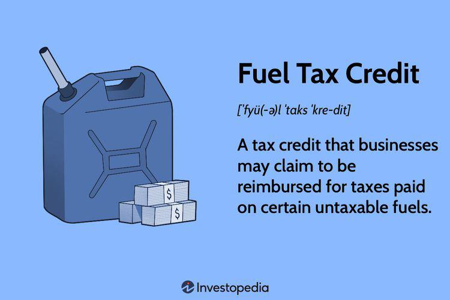

In the current economic climate, comprehending how tax credits function is essential for both businesses and individuals aiming to optimize their financial strategies. Tax credits, including Fuel Tax Credits and transferable tax credits, serve as a crucial tool for incentivizing specific economic activities. By directly reducing taxable income for eligible parties, these credits provide significant financial benefits that extend beyond what traditional deductions offer. This article aims to explore the mechanisms by which tax credits operate, shedding light on their implications for sectors such as fuel taxation and automated trading.

Fuel Tax Credits, for instance, are particularly significant as they encourage businesses to engage in environmentally beneficial activities while simultaneously easing operational costs. These credits diminish the monetary burden of fuel expenses for eligible industries, thereby promoting economic efficiency and sustainability. Similarly, transferable tax credits advance the versatility of financial planning by allowing businesses to sell or transfer these credits. This aspect is particularly relevant for industries where cash flow is crucial, enabling entities to generate liquidity and continue their operations effectively.



The strategic applications of tax credits extend further into high-tech sectors like algorithmic trading. Here, tax incentives can bolster investments in cutting-edge technologies, ultimately enhancing competitiveness and operational efficiency. Organizations that utilize tax credits can achieve substantial improvements in their financial outcomes, aligning their tax strategies with broader economic goals while contributing to technological advancements.

This examination begins with an overview of tax credits, setting the stage for a deeper understanding of their broader impact on business operations and financial results. By leveraging available tax credits, companies and individuals can craft more efficient and sustainable economic strategies, underscoring the importance of keeping informed and compliant with evolving tax regulations.

## Table of Contents

## Understanding Tax Credits: A Brief Overview

Tax credits are pivotal tools used by governments to incentivize certain behaviors and activities that are beneficial to the broader economy or society. These incentives can cover a multitude of areas, from renewable energy projects to research and development initiatives. Unlike tax deductions, which reduce the amount of income subject to taxation, tax credits directly reduce the total tax liability. For example, if a business has a tax liability of $10,000 and a tax credit of $1,000, the final tax owed will be $9,000. This direct nature of savings positions tax credits as highly advantageous compared to deductions.

There are different forms of tax credits, with varying implications for liquidity and business strategies. Some tax credits are non-refundable, meaning they can only reduce the tax owed to zero, without providing any further benefit if the amount of the credit exceeds the tax liability. Refundable tax credits, on the other hand, can not only eliminate taxes due but may also result in a refund if the credit exceeds the liability.

Transferable tax credits introduce another layer of flexibility. These credits can be sold or transferred to other entities, offering [liquidity](/wiki/liquidity-risk-premium) to the original credit holder and a tax benefit to the purchaser. This transferability is particularly valuable in industries where businesses may not have sufficient tax liability to fully utilize the credits they earn. By selling surplus credits, organizations can generate immediate cash flow. 

To effectively leverage tax credits, businesses need to understand when and how to claim them, considering the specific requirements and limitations associated with each credit type. Strategic application of these credits can significantly influence a company's tax strategy, affecting its operational budgeting and financial outcomes. For example, a firm investing heavily in renewable energy can strategically plan investments and utilize relevant tax credits to offset high initial costs, thereby improving their financial statement outcomes.

Overall, tax credits are not only a means of reducing tax liability but also serve as strategic tools that, when applied effectively, promote economic activities aligned with policy objectives, such as sustainability and innovation. Understanding their applications and advantages is essential for businesses aiming to optimize their fiscal health and compliance.

## The Fuel Tax Credit Mechanism

The Fuel Tax Credit is a fiscal mechanism that allows eligible businesses to claim credits against their federal taxes based on the consumption of fuel for qualifying activities. This mechanism is primarily targeted at industries where fuel is a significant operational cost but not necessarily linked to transportation, such as agriculture and construction. By enabling businesses in these sectors to claim credits, operational costs are reduced, which in turn can enhance profitability and competitiveness.

Industries such as agriculture use significant amounts of fuel for machinery and vehicles that do not operate on public roads, making them eligible for these credits. Similarly, in construction, heavy machinery and equipment consume substantial amounts of fuel which can also qualify for these tax benefits. This can lead to a considerable reduction in tax liabilities, providing immediate financial relief to businesses.

These credits also play a critical role in supporting environmental initiatives. By encouraging the use of renewable fuels and cleaner technologies, fuel tax credits align business incentives with broader environmental goals. This is particularly relevant as global emphasis on reducing carbon emissions and transitioning to sustainable energy sources intensifies. Businesses are therefore not only financially incentivized to optimize their fuel consumption but also to adopt environmentally friendly practices.

Eligibility for Fuel Tax Credits is determined by specific criteria, including the type of fuel used and the purpose for which it is consumed. To ensure compliance and to avoid the risk of financial penalties, businesses must accurately document their fuel usage and the associated activities. This necessitates comprehensive record-keeping and a thorough understanding of the qualifying conditions. Missteps in application or documentation can lead to compliance issues and potential financial penalties, making it essential for businesses to stay informed and consult with tax professionals when necessary.

In summary, the Fuel Tax Credit mechanism is an instrumental tool for reducing operational costs in certain industries while simultaneously promoting environmental sustainability. By understanding and properly applying for these credits, businesses can optimize their financial outcomes while supporting regulatory and environmental objectives.

## Fuel Tax Credits and the IRS: Key Considerations

In the implementation and utilization of Fuel Tax Credits, adherence to IRS guidelines is crucial to ensure compliance and prevent improper claims. The 'Dirty Dozen' list by the IRS frequently highlights improperly claimed tax credits as a prevalent issue, pointing to the necessity for businesses to maintain accuracy and integrity in their reporting.

The IRS mandates meticulous record-keeping for businesses seeking Fuel Tax Credits. This includes detailed documentation of fuel usage and the specific qualifying activities for which the fuel is used. Accurate records are fundamental to substantiating claims and aligning with IRS criteria. Without such documentation, businesses risk the potential for audits and could face significant penalties should discrepancies be found.

For instance, businesses must differentiate between fuel used for transportation versus non-transportation purposes, as only the latter typically qualifies for these credits. The IRS requires that claims are clearly delineated with supporting evidence for the specific gallons of fuel used in qualified activities. An effective practice for maintaining compliance is the utilization of digital record-keeping tools. These can automate the tracking of fuel usage and generate comprehensive reports that match the IRS requirements. Here's an example of how such a system could be implemented using Python:

```python
import pandas as pd
from datetime import datetime

# Sample data structure for fuel usage records
data = {
    "Date": [datetime(2023, 1, 1), datetime(2023, 1, 2)],
    "Fuel_Consumed_Gallons": [150, 200],
    "Qualifying_Activity": ["Agriculture", "Construction"]
}

# Create a DataFrame
df = pd.DataFrame(data)

# Function to calculate total fuel used for qualifying activities
def calculate_qualifying_fuel(df):
    return df[df['Qualifying_Activity'].isin(['Agriculture', 'Construction'])]['Fuel_Consumed_Gallons'].sum()

total_qualifying_fuel = calculate_qualifying_fuel(df)
print(f"Total Qualifying Fuel: {total_qualifying_fuel} Gallons")
```

Maintaining compliance with IRS requirements necessitates businesses to consult with tax professionals regularly. These professionals provide critical insights into evolving tax laws and ensure that businesses leverage beneficial tax strategies while mitigating the risk of erroneous claims. Vigilance in these practices not only safeguards against punitive actions but also optimizes the monetary advantages that Fuel Tax Credits offer.

Ultimately, rigorous adherence to IRS guidelines helps businesses maximize their financial benefits from Fuel Tax Credits while maintaining compliance with federal tax regulations. As tax laws evolve, consistent professional consultation and robust documentation practices remain pivotal in navigating the complexities of tax credit claims efficiently.

## Transferable Tax Credits: Enhancing Flexibility

Transferable tax credits provide substantial financial flexibility by enabling entities to monetize these credits, thereby enhancing their capacity to fund operations effectively. These credits hold notable significance in industries where traditional tax equity financing proves insufficient, such as renewable energy. Unlike non-transferable credits, transferable tax credits can be sold to other entities, allowing the original holder to convert future tax benefits into immediate capital. This mechanism proves vital for businesses lacking the tax liability necessary to utilize the full extent of their credits, creating a secondary market that fosters liquidity and financial maneuverability.

The renewable energy sector significantly benefits from transferable tax credits. Traditional tax equity financing often falls short in meeting the burgeoning capital demands of clean energy projects. By leveraging transferable credits, developers can attract a broader array of investors, thus facilitating the influx of capital necessary for substantial project scaling. Additionally, these credits make it possible for smaller developers to participate in projects that might otherwise remain inaccessible due to capital constraints.

The introduction of transferable tax credits under frameworks like the Inflation Reduction Act (IRA) underscores a strategic policy shift aimed at accelerating clean energy initiatives. By enabling transferability, the IRA catalyzes investment from new market participants, providing a robust financial incentive to invest in sustainable projects. This policy is designed to encourage more investment by offering tax benefits that are immediately realizable, rather than deferred, thus making clean energy ventures more attractive to a wider range of investors.

In summary, transferable tax credits represent a versatile tool for enhancing financial flexibility, particularly in sectors like renewable energy where traditional funding mechanisms are often inadequate. Their ability to provide immediate liquidity and appeal to a diverse investor base positions transferable tax credits as a pivotal component in the funding portfolio of modern businesses striving for sustainable growth and innovation.

## Tax Incentives in Algorithmic Trading

Algorithmic trading firms are increasingly leveraging tax incentives designed to foster technological advancement and innovation. These incentives enable businesses to offset capital investments in areas such as software development, high-frequency trading systems, and computational infrastructure, thus significantly reducing their operational costs and enhancing their competitive advantage.

The financial technology landscape is rapidly evolving, with [algorithmic trading](/wiki/algorithmic-trading) demanding sophisticated technologies that utilize [artificial intelligence](/wiki/ai-artificial-intelligence) (AI) and [machine learning](/wiki/machine-learning) (ML). Tax credits and incentives aim to support these technological advancements by providing monetary relief and encouraging further investments. For instance, research and development (R&D) tax credits can be highly beneficial for firms engaging in the creation and refinement of proprietary trading algorithms. These credits allow companies to deduct a portion of their R&D expenditures from their taxable income, effectively lowering their tax liability.

Moreover, advancements in AI and ML have transformed algorithmic trading by increasing speed, accuracy, and predictive capabilities. These technologies require substantial capital investment in terms of both hardware and software. Tax incentives play a crucial role in mitigating these costs, enabling firms to allocate resources more efficiently. This, in turn, allows them to focus on optimizing algorithms and improving their market strategies.

An example of how tax incentives can support technological investment in algorithmic trading is through accelerated depreciation. Governments often allow accelerated depreciation schedules for specific technological equipment, enabling firms to recoup their investments more rapidly. This increases cash flow, allowing for additional reinvestment into state-of-the-art technologies or personnel training programs aimed at enhancing algorithmic models.

As algorithmic trading continues to push the boundaries of financial markets, the importance of tax incentives for technological advancement cannot be overstated. These incentives not only bolster the financial positions of trading firms but also contribute to the broader economic growth by driving innovation in technology. Firms are encouraged to work closely with tax professionals to identify applicable tax credits and incentives that can further enhance their operational efficiency and competitive edge in the market.

## Conclusion

Tax credits, whether for fuel usage or other applications, offer significant financial and operational benefits to businesses. They serve as powerful tools for reducing tax liabilities and enhancing cash flow, which can be pivotal for both established enterprises and emerging startups. For businesses, aligning their strategies with these incentives is vital for ensuring sound economic growth. Proper utilization of tax credits requires a comprehensive understanding of the regulatory frameworks governing them. Organizations must integrate these credits into their financial planning processes and align them with corporate goals to fully leverage their potential.

Businesses should also keep abreast of changes in tax legislation, as these can directly impact the availability and value of tax credits. Legislative updates often introduce new credits or modify existing ones, affecting strategic financial decisions. Staying informed allows businesses to adapt quickly to changes, ensuring they continue to receive maximum benefits. This may involve consulting with tax professionals or legal advisors who can provide insights into upcoming regulatory shifts and help strategize accordingly.

In summary, tax credits not only provide immediate financial relief by effectively reducing taxes owed, they also encourage longer-term investments. By fostering sustainable business practices, such as investments in renewable energy or technological advancements, tax credits play a crucial role in promoting economic growth and innovation. Their strategic use can drive development and expansion while aligning with broader societal goals, such as environmental sustainability and technological progression.

## References & Further Reading

[1]: ["Fuel Tax Credits"](https://www.irs.gov/credits-deductions/individuals/fuel-tax-credit-ftc) at IRS.gov

[2]: ["Automating Inequality: How High-Tech Tools Profile, Police, and Punish the Poor"](https://www.amazon.com/Automating-Inequality-High-Tech-Profile-Police/dp/1250074312) by Virginia Eubanks

[3]: ["Tax Credits and Incentives"](https://www.investopedia.com/terms/t/taxcredit.asp) at Ernst & Young 

[4]: ["Algorithmic Trading and DMA: An Introduction to Direct Access Trading Strategies"](https://archive.org/details/algorithmictradi0000john) by Barry Johnson

[5]: Internal Revenue Service. (2021). ["Improperly Claimed Fuel Tax Credits Identified on the IRS' 'Dirty Dozen' List for the Eighth Consecutive Year"](https://www.idahostatesman.com/news/business/article297488388.html)