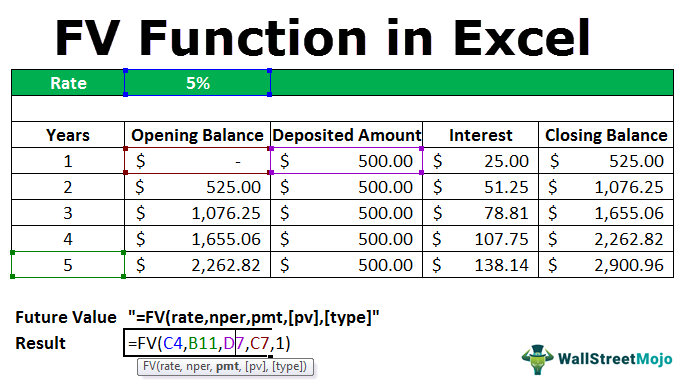

In the fast-paced world of financial trading and investment, staying ahead requires the deployment of sophisticated analytical tools. These tools are vital in navigating the complexities of market dynamics and optimizing investment strategies. Among these analytical methods, the Fugit calculation is particularly significant in options trading. This calculation assists traders and financial analysts by providing a temporal estimation for the potential exercise of options, specifically American-style options, which can be exercised at any time before expiration. The importance of Fugit becomes even more pronounced within financial analytics and algorithmic trading, where precision in timing and risk assessment is critical.

Fugit is not merely a calculation but a strategic enhancer that improves decision-making in options trading. It provides a probabilistic framework to understand when early exercise might occur, thus aiding in the development and implementation of strategies for managing options portfolios. As algorithmic trading continues to advance, integrating such calculations becomes essential for creating models that can adapt to fluctuating market conditions.



This article will investigate the intricacies of Fugit, its role, and how it is applied within modern financial markets. Understanding and mastering Fugit calculations empowers traders to enhance their decision-making processes, manage risks efficiently, and potentially optimize their investment returns in an ever-evolving economic landscape.

## Table of Contents

## Understanding Fugit

Fugit, deriving its name from the Latin phrase 'tempus fugit' which means 'time flies,' serves as a crucial metric in options trading, particularly for American-style options. Its primary function is to ascertain the optimal timing for exercising an American option before expiration. The term was introduced by economist Mark Garman, who focused on enhancing the understanding and implementation of early exercise strategies.

The primary utility of Fugit lies in assisting investors in evaluating the remaining time period within which the exercise of options could still yield advantages. American-style options offer flexibility as they can be exercised anytime before expiration, unlike European options, which can only be exercised at maturity. This inherent flexibility necessitates a metric like Fugit to aid decision-making regarding the timing of exercising options.

To fully comprehend and apply the concept of Fugit, a strong grasp of binomial tree models is essential. Binomial tree models are extensively used in options pricing and valuation because they provide a discrete-time framework for modeling the possible future movements of an option’s underlying asset price. This model breaks down the time to expiration into potentially small intervals, and at each interval, calculates the potential upward or downward movement in the price of the underlying asset.

In a typical binomial model, each node represents a possible price of the asset, and from each node, there could be two possibilities: an upward or a downward movement. To implement Fugit in the context of binomial tree models, the model calculates probabilities of exercising the option at each node, helping investors or traders to identify the expected time of exercise. This probabilistic approach plays a key role in option valuation by allowing the calculation of expected payoffs, taking into account the possibility of early exercise in American options.

In practice, calculating Fugit involves analyzing the optimal exercise strategy by assessing the time to expiration, market conditions, and price movements as mapped out by the binomial tree model. By applying Fugit, traders aim to maximize the potential profit from an option, navigating the complexities introduced by variables such as [volatility](/wiki/volatility-trading-strategies) and interest rates, which impact the decision on when to exercise.

Overall, the Fugit metric is indispensable for traders interested in optimizing the exercise of options, and a solid understanding of the binomial tree model is necessary for its successful application.

## The Importance of Fugit in Options Trading

Fugit provides traders with a probabilistic estimate of when an American option might be optimally exercised. This insight is fundamental for effective risk management and strategy optimization in options trading. By estimating the likelihood and timing of early exercise, Fugit assists traders in forecasting potential cash flows and returns from their options positions.

Knowing the probable timing of early exercise is particularly crucial during periods of high interest rates or when dealing with dividend-paying stocks. American options can be exercised at any point before expiration, which can be influenced by interest rates and dividends. For instance, when interest rates are high, the cost of carrying options positions increases, prompting early exercise to capitalize on favorable borrowing costs. Similarly, dividend-paying stocks may incentivize early exercise to capture the dividend payout.

An accurate measure of Fugit enhances the effectiveness of delta hedging strategies. Delta represents the rate of change of the option's price concerning the price of the underlying asset. Traders use delta hedging to create a risk-neutral portfolio by adjusting their positions to offset potential losses. By incorporating Fugit into delta hedging, traders can better anticipate the timing of exercise events, allowing for more precise adjustments to maintain a neutral delta. This minimization of risk exposure results in optimized strategies and potentially higher returns.

In practice, calculating Fugit involves complex modeling and simulations that take into account variables such as volatility, interest rates, and dividends. These factors are integral in determining the expected time to exercise and are critical for refining trading decisions. Therefore, Fugit serves as a valuable tool for traders aiming to enhance their analytical capabilities, improve risk assessments, and drive optimal trading outcomes.

## Calculation Methods of Fugit

Calculating Fugit involves complex simulations and mathematical modeling to quantify the optimal timing for exercising options. The primary methods employed include Monte Carlo simulations, binomial tree models, and finite difference methods.

Monte Carlo simulations are a powerful technique for approximating the value of Fugit. This method uses random sampling and statistical modeling to estimate the expected time for exercising an option. By repeatedly simulating the price paths of the underlying asset and calculating the payoff of early exercise, traders can derive a probabilistic forecast for Fugit. The flexibility of Monte Carlo simulations makes them particularly useful, as they can incorporate various market variables such as stochastic volatility and interest rates.

Binomial tree models provide a structured approach to calculating Fugit by discretizing the time to expiration and modeling the possible price movements of the underlying asset at each node. In a binomial tree, each node represents a possible price of the asset at a given time, with branches representing upward or downward movements. The value of Fugit is determined by traversing this tree and evaluating the potential benefits of early exercising the option against holding it until maturity. This method is adept at handling American-style options due to its ability to incorporate the option's early exercise feature.

Finite difference methods are numerical techniques used to solve differential equations that describe option pricing. These methods approximate the continuous changes in option prices due to market factors by breaking them down into discrete time and price steps. By solving the partial differential equations governing option price evolution, traders can compute the optimal timing strategy for option exercise, thereby determining the Fugit.

The calculation of Fugit must consider several market factors, including volatility, interest rates, and dividends, which influence the timing and benefits of exercising an option early. The expected time to exercise is a reflection of the probability of various market scenarios playing out, impacting the decision-making of traders significantly. As such, Fugit provides a critical insight into the likelihood of early option exercise, facilitating more informed and strategic trading operations.

## Applications in Financial Analytics and Algo Trading

Fugit plays a critical role in the development of [algorithmic trading](/wiki/algorithmic-trading) models by offering precise assessments of risk and timing strategies. This is particularly important as financial markets become increasingly complex and data-driven decision-making becomes more essential. The ability to predict optimal timings for option exercises allows algorithm developers and quants to improve the robustness and efficiency of their trading systems.

Financial analysts leverage Fugit to simulate and model potential scenarios under diverse market conditions, enhancing the accuracy of their forecasts. For instance, changes in interest rates, dividends, and market volatility directly influence the timing and likelihood of exercising options. By incorporating Fugit calculations, analysts can refine their predictive models, thus gaining deeper insights into market movements and potential outcomes.

In the context of algorithmic trading, precise timing and risk management are foundational elements. Algo systems must adapt to market dynamics quickly and efficiently. Calculating Fugit allows for the anticipation of market behaviors, leading to the development of trading algorithms that can dynamically adjust to new market information. In algorithmic frameworks, this might involve continuously updating the model inputs such as underlying price data, volatility estimates, and [interest rate](/wiki/interest-rate-trading-strategies) changes to refine the calculation of expected exercise time.

For example, utilizing Python and libraries like NumPy or Pandas, an algorithm can be developed to calculate Fugit through a binomial tree model. This involves constructing a binomial tree to simulate multiple potential future stock price paths and computing the optimal exercise strategy for each path. Here is a simple illustrative Python snippet for a binomial model setup:

```python
import numpy as np

def binomial_fugit(S0, K, r, T, sigma, steps):
    dt = T / steps
    u = np.exp(sigma * np.sqrt(dt))
    d = 1/u
    p = (np.exp(r * dt) - d) / (u - d)

    # Initialize stock price tree
    stock_prices = np.zeros((steps + 1, steps + 1))
    stock_prices[0, 0] = S0

    for i in range(1, steps + 1):
        stock_prices[i, 0] = stock_prices[i - 1, 0] * d
        for j in range(1, i + 1):
            stock_prices[i, j] = stock_prices[i - 1, j - 1] * u

    # Initialize option values
    option_values = np.maximum(stock_prices - K, 0)

    # Compute option values & Fugit
    for i in range(steps - 1, -1, -1):
        for j in range(i + 1):
            option_values[i, j] = np.maximum(stock_prices[i, j] - K, 
                                             np.exp(-r * dt) * (p * option_values[i + 1, j + 1] +
                                                                (1 - p) * option_values[i + 1, j]))

    return option_values[0, 0]

# Parameters
S0 = 100  # Initial stock price
K = 100   # Option strike price
r = 0.05  # Risk-free rate
T = 1     # Time to expiry in years
sigma = 0.2  # Volatility
steps = 100  # Number of binomial steps

fugit_value = binomial_fugit(S0, K, r, T, sigma, steps)
print(f"Fugit value: {fugit_value}")
```

This code sets up a binomial tree for option pricing and includes consideration for early exercise by evaluating potential stock paths and payoff scenarios. The integration of Fugit in such models aids in constructing trading algorithms that optimize the timing of option exercises, thus enhancing trading strategy effectiveness.

The strategic use of Fugit in financial analytics and algorithmic trading significantly boosts the capacity for effective risk management and strategy optimization. This ensures that trading decisions are not only based on historical data but are forward-looking, taking potential future market shifts into account for maximizing returns.

## Fugit in Risk Management

Fugit plays a critical role in constructing effective hedging strategies for options trading, particularly for American and Bermudan options. Since these options allow for early exercise, the ability to predict optimal exercise times is crucial. Fugit provides a probabilistic framework for estimating these times, allowing traders to craft more precise hedging measures. For example, by determining the Fugit value, traders can align their hedge ratios to closely match the actual risk exposure over time, thereby minimizing potential losses from unexpected market movements.

Utilizing Fugit in sensitivity analysis further enhances a trader's understanding of market risks. Through simulations, traders can evaluate how changes in factors like volatility, interest rates, and dividends influence the early exercise probability. Sensitivity analysis with Fugit offers insights into how these factors affect the overall option pricing and the associated risks. Traders can use these insights to develop strategies that are resilient against adverse market conditions, optimizing their portfolios to maintain stability.

Understanding the influence of Fugit enables traders to swiftly adjust their strategies ahead of anticipated market changes. For instance, in a scenario where rising interest rates increase the likelihood of early exercise, Fugit calculations would prompt adjustments in hedge positions to account for this increased risk. By regularly incorporating Fugit calculations into their analytical toolset, traders maintain a proactive stance, ensuring that their strategies remain agile and responsive to the dynamics of the market. This adaptability is essential for mitigating losses and maximizing the potential for returns in a volatile trading environment.

## Limitations and Considerations

Fugit serves as an essential tool in options trading, yet its effectiveness is inherently tied to the assumptions and models employed. This dependency can introduce variability in outcomes. The financial models used to compute Fugit rely on assumptions about market behavior, interest rates, volatility, and other factors. These assumptions might not always reflect the complexities and nuances of real-world market conditions.

The primary challenges in utilizing Fugit effectively include model dependency and potential misalignment with actual exercise behavior. For instance, the decision-making process of market participants may not strictly conform to the theoretical conditions under which Fugit is calculated. While a model might suggest a certain probability of early exercise under a specific set of conditions, real-world factors like irrational trading behavior or unexpected economic events can drastically alter this probability.

Given these considerations, traders must remain vigilant in continuously monitoring and recalibrating their models. Market dynamics are ever-changing, influenced by an array of unforeseen factors such as political events, economic shifts, and technological advancements. The ability to adjust models swiftly in response to these changes is crucial for maintaining accurate Fugit estimations.

In practice, this involves regular analysis of market trends and data to refine the assumptions and inputs used in Fugit calculations. Traders and analysts should implement robust data analysis tools and techniques to capture and interpret new information effectively. Python, a versatile programming language, offers several libraries like NumPy, Pandas, and SciPy that can aid in performing these analyses. By leveraging these tools, traders can enhance their model's adaptability to reflect the latest market insights, improving the reliability of their Fugit computations.

Despite these challenges, an adaptable approach to Fugit calculation allows traders to optimize their strategies, ensuring informed decision-making even amidst the unpredictability of real-world markets.

## Conclusion

Fugit remains an essential tool for options traders, particularly in financial analytics and algorithmic trading. By mastering Fugit calculations, traders can enhance their decision-making processes, allowing for effective risk management and optimized returns. The Fugit calculation gives traders a probabilistic insight into the optimal timing for exercising options, which is vital when dealing with complex market scenarios involving American and Bermudan options that have flexible exercise conditions.

As financial markets continue to evolve with increasing complexity, integrating analytical methods like Fugit is crucial for maintaining a competitive edge. These calculations accommodate various market parameters, such as volatility, interest rates, and dividends, providing traders with a dynamic perspective on early exercise opportunities. The ability to predict and react to changes in these factors can significantly influence trading success.

Using Fugit effectively allows traders to refine their algorithmic trading strategies, adapting to shifting market dynamics with precision. This adaptability is necessary to ensure that strategies remain viable amidst the myriad changes that characterize modern financial markets. As such, the continued development and application of Fugit and similar analytical methods will be indispensable in the pursuit of consistent trading performance and strategic foresight.

## References & Further Reading

[1]: Garman, M. B. (1989). ["The importance of 'Fugit' timing in options valuation and hedging."](https://www.cambridge.org/core/journals/journal-of-financial-and-quantitative-analysis/article/abs/currency-option-pricing-with-stochastic-domestic-and-foreign-interest-rates/9342EB2F50EC8232951F4C74BF1A0C7F) Financial Management, 18(3), 34-35.

[2]: Cox, J. C., Ross, S. A., & Rubinstein, M. (1979). ["Option Pricing: A Simplified Approach."](https://www.sciencedirect.com/science/article/pii/0304405X79900151) Journal of Financial Economics, 7(3), 229-263.

[3]: Hull, J. (2018). ["Options, Futures, and Other Derivatives"](https://www.semanticscholar.org/paper/Options%2C-Futures%2C-and-Other-Derivatives-Hull/89bdee500c8623864fc9eb7a471546aa713acc44) (10th Edition). Pearson.

[4]: Glasserman, P. (2003). ["Monte Carlo Methods in Financial Engineering"](https://link.springer.com/book/10.1007/978-0-387-21617-1) (Stochastic Modelling and Applied Probability, Vol. 53). Springer.

[5]: Luenberger, D. G. (1997). ["Investment Science"](https://www.amazon.com/Investment-Science-David-G-Luenberger/dp/0199740089) Oxford University Press.

[6]: Wilmott, P. (2006). ["Paul Wilmott Introduces Quantitative Finance"](https://www.amazon.com/Paul-Wilmott-Introduces-Quantitative-Finance/dp/0470319585) (2nd Edition). Wiley.