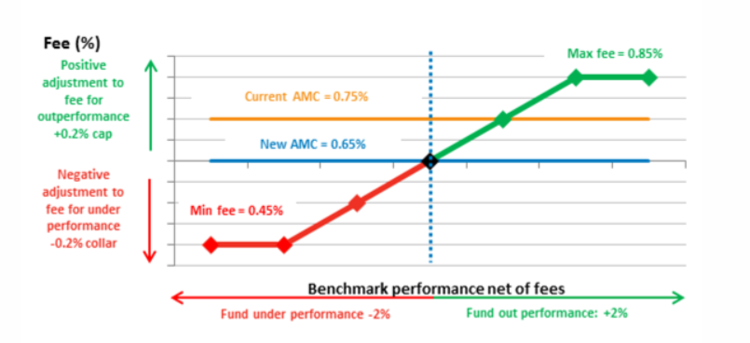

## Table of Contents

## What is a Fulcrum Fee?

A Fulcrum Fee is a type of performance-based fee that some investment managers use. It's different from regular fees because it goes up or down based on how well the investments are doing. If the investments do better than expected, the fee might go up. But if they do worse, the fee might go down. This way, the fee is like a balance point, or fulcrum, that moves with the performance of the investments.

This kind of fee can be good for investors because it makes sure that the investment manager's pay is tied to how well they are doing their job. If the manager does a great job and the investments do well, they get paid more. But if the investments don't do so well, the manager gets paid less. This can help keep the manager motivated to do their best to make the investments grow.

## How does a Fulcrum Fee differ from a traditional fee structure?

A Fulcrum Fee is different from a traditional fee structure because it changes based on how well the investments are doing. In a traditional fee structure, the fee is usually a fixed percentage of the assets being managed, no matter how the investments perform. For example, if you have a traditional fee of 1% on a $100,000 investment, you will pay $1,000 every year, whether your investment goes up or down.

With a Fulcrum Fee, the fee goes up if the investments do better than expected, and it goes down if they do worse. This means the fee is more like a balance that moves with the performance of the investments. It can be good for investors because it makes sure the investment manager's pay is connected to how well they are doing their job. If the investments do well, the manager gets paid more, but if they do poorly, the manager gets paid less. This can help keep the manager motivated to do their best.

## What are the main components of a Fulcrum Fee?

A Fulcrum Fee has a few main parts that make it work. The first part is the base fee, which is like the starting point. It's usually a percentage of the money being managed, just like in a regular fee. But with a Fulcrum Fee, this base fee can change. The second part is the performance benchmark. This is a goal that the investments need to reach. If the investments do better than this goal, the fee goes up. If they do worse, the fee goes down.

The third part is the adjustment mechanism. This is how much the fee changes based on how the investments are doing. If the investments do a lot better than the goal, the fee might go up a lot. If they do a lot worse, the fee might go down a lot. This part makes sure the fee moves like a balance, or fulcrum, with the performance of the investments. All these parts together make the Fulcrum Fee different from regular fees because it keeps the investment manager's pay connected to how well they are doing their job.

## Can you explain the mechanism of a Fulcrum Fee?

A Fulcrum Fee works by changing the amount of money that an investment manager gets paid based on how well the investments are doing. It starts with a base fee, which is a percentage of the money being managed, just like a regular fee. But with a Fulcrum Fee, this base fee can go up or down. The fee changes depending on whether the investments do better or worse than a certain goal, called the performance benchmark. If the investments do better than this goal, the fee goes up. If they do worse, the fee goes down.

The way the fee changes is called the adjustment mechanism. This part decides how much the fee goes up or down based on how the investments are doing. If the investments do a lot better than the goal, the fee might go up a lot. If they do a lot worse, the fee might go down a lot. This makes the fee like a balance, or fulcrum, that moves with the performance of the investments. It's different from regular fees because it keeps the investment manager's pay connected to how well they are doing their job, which can help keep them motivated to do their best.

## What are the advantages of using a Fulcrum Fee for investors?

Using a Fulcrum Fee can be good for investors because it makes the investment manager's pay go up or down based on how well the investments are doing. If the investments do well, the manager gets paid more. This can make the manager work harder to make the investments grow, because they know they will get more money if they do a good job. It's like a reward for doing well, which can help keep the manager motivated.

Another advantage is that if the investments don't do so well, the manager gets paid less. This means the manager has to be careful and do their best to make sure the investments don't lose money. It's like a balance that keeps the manager's pay fair based on how the investments are doing. This way, investors can feel more confident that the manager is working hard to get the best results for their money.

## What are the potential drawbacks of a Fulcrum Fee?

One potential drawback of a Fulcrum Fee is that it can be more complex than a regular fee. Because the fee goes up or down based on how the investments are doing, it can be harder for investors to understand exactly how much they will have to pay. This can make it more difficult to plan and budget for the fees, which might make some investors feel unsure or uncomfortable.

Another issue is that the way the fee changes might not always be fair. If the investments do well because of things that the manager can't control, like the overall market going up, the manager might get paid more even though they didn't do anything special. On the other hand, if the investments do poorly because of things outside the manager's control, like a sudden drop in the market, the manager might get paid less even though they did a good job. This can make the fee seem unfair to both the manager and the investors.

## How is performance measured in a Fulcrum Fee structure?

In a Fulcrum Fee structure, performance is measured by comparing the returns of the investments to a set goal, which is called the performance benchmark. This benchmark could be a specific number or a standard like a stock market index. If the investments do better than this benchmark, it means the performance is good. If they do worse, it means the performance is not as good.

The fee changes based on how much better or worse the investments do compared to the benchmark. If the investments do a lot better than the benchmark, the fee might go up a lot. If they do a lot worse, the fee might go down a lot. This way, the fee moves like a balance, or fulcrum, with the performance of the investments. It's all about how the investments are doing compared to the goal that was set.

## Can you provide examples of funds that use a Fulcrum Fee?

Some funds that use a Fulcrum Fee are mutual funds and hedge funds that want to make sure their managers are paid based on how well they do their job. For example, there are mutual funds like the Vanguard Fulcrum Fund, which adjusts the fees paid to the fund manager depending on how the investments perform compared to a benchmark like the S&P 500. If the fund does better than the S&P 500, the manager gets a higher fee. If it does worse, the fee goes down.

Another example is hedge funds, which often use more complex fee structures to keep their managers motivated. A well-known [hedge fund](/wiki/hedge-fund-trading-strategies) that uses a Fulcrum Fee is the Bridgewater Associates' Pure Alpha Fund. This fund compares its performance to a specific benchmark, and the fee changes based on how much better or worse the fund does compared to that benchmark. If the fund's investments do well, the manager's fee goes up, but if they do poorly, the fee goes down. This way, the manager has a strong reason to try their best to make the investments grow.

## How does a Fulcrum Fee impact fund manager behavior?

A Fulcrum Fee can make fund managers work harder because their pay goes up or down based on how well the investments do. If the investments do better than expected, the manager gets paid more. This can make them try their best to pick good investments and make smart choices. They know that if they do a good job, they will get more money, so they have a big reason to work hard and do well.

On the other hand, if the investments don't do so well, the manager gets paid less. This can make them be more careful and think more about the risks they take. They don't want to lose money because it will mean less pay for them. So, a Fulcrum Fee can help keep managers focused on doing their best to make the investments grow and keep them from taking too many risks that could hurt the investors.

## What are the regulatory considerations for implementing a Fulcrum Fee?

When a fund wants to use a Fulcrum Fee, they have to follow rules set by groups like the Securities and Exchange Commission (SEC) in the United States. The SEC wants to make sure that fees are fair and clear to investors. This means that the fund has to explain the Fulcrum Fee in a way that investors can understand. They have to tell investors how the fee works, what the performance benchmark is, and how the fee will change based on the investments' performance. This is important so that investors know exactly what they are paying for and can trust the fund.

Another thing to think about is that the rules can be different in different places. Some countries might have their own rules about how fees can be set and changed. The fund has to make sure they follow all the rules in the places where they work. This can be a bit tricky because the rules might change over time, so the fund needs to keep up with any new laws or changes. By following all the rules, the fund can use a Fulcrum Fee in a way that is fair and legal.

## How can a Fulcrum Fee be adjusted over time?

A Fulcrum Fee can be changed over time to make sure it keeps working well for both the fund and the investors. If the fund sees that the performance benchmark isn't working as well as it should, they might decide to change it. For example, if the market changes a lot, they might pick a new benchmark that fits better with how things are going now. They might also change how much the fee goes up or down based on the investments' performance. This way, the fee stays fair and keeps the manager motivated to do a good job.

To make these changes, the fund has to talk to the investors and tell them what's happening. They need to explain why the fee is being changed and how it will affect the investors. This is important because the investors need to trust the fund and understand the fees they are paying. By keeping the Fulcrum Fee up to date, the fund can make sure it's still a good way to pay the manager based on how well the investments are doing.

## What advanced strategies can fund managers employ with a Fulcrum Fee?

With a Fulcrum Fee, fund managers can use advanced strategies to try to make the investments do better. They might focus on [picking](/wiki/asset-class-picking) investments that have a good chance of beating the performance benchmark. This could mean looking for companies that are growing fast or finding new ways to invest that other people haven't thought of yet. Because their pay goes up if the investments do well, managers might be more willing to take smart risks that could lead to big rewards. They might also use special tools and data to help them make better choices about where to put the money.

Another strategy is to keep a close eye on how the investments are doing and make changes quickly if needed. If the investments start to do worse than the benchmark, the manager might sell some of them and buy new ones that they think will do better. This way, they can try to keep the investments on track to beat the benchmark and earn a higher fee. By being active and making smart moves, the manager can show investors that they are working hard to make the most of their money.

## References & Further Reading

[1]: Stein, H. S. (1990). [“Shareholder Wealth Effects of the Investment Advisers Act," University of Chicago Press.](https://www.jstor.org/stable/2487718)

[2]: Mitchell, M. L., & Pulvino, T. C. (2001). [“Characteristics of Risk and Return in Risk Arbitrage,” Journal of Finance.](https://onlinelibrary.wiley.com/doi/full/10.1111/0022-1082.00401)

[3]: Hasbrouck, J. (2008). [“Trading Costs and Returns for U.S. Equities: The Evidence from Daily Data”](https://pages.stern.nyu.edu/~jhasbrou/Research/GibbsCurrent/HasbrouckJF.pdf), Journal of Finance.

[4]: Sharpe, W. F. (1992). ["Asset Allocation: Management Style and Performance Measurement."](https://web.stanford.edu/~wfsharpe/art/sa/sa.htm) Journal of Portfolio Management, 18(2), 7-19.

[5]: Afonso, G., Kovner, A., & Schoar, A. (2010). ["Stressed, Not Frozen: The Federal Funds Market in the Financial Crisis"](https://www.nber.org/system/files/working_papers/w15806/w15806.pdf), Journal of Finance.