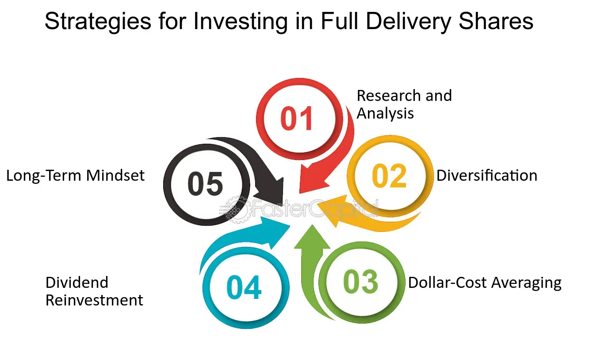

## Table of Contents

## What are Full Delivery Shares?

Full Delivery Shares are a type of stock transaction where the buyer receives the actual shares instead of just a promise to deliver them later. When you buy full delivery shares, the shares are transferred to your account right away. This is different from other types of transactions where you might have to wait or where the shares might not be fully delivered.

This type of share transaction is often preferred by investors who want to make sure they own the shares immediately. It can be important for people who need to use the shares as collateral or for other financial purposes right away. Full delivery shares give investors more control and certainty over their investments.

## How do Full Delivery Shares differ from other types of shares?

Full Delivery Shares are different from other types of shares because when you buy them, you get the actual shares right away. With other types of shares, you might only get a promise that the shares will be delivered to you later. This means that with Full Delivery Shares, you don't have to wait or worry about whether you will actually get the shares.

Other types of shares, like those in a futures contract or an options agreement, might not give you the shares immediately. Instead, you might have to wait until a certain date or meet certain conditions before you get the shares. Full Delivery Shares give you more control because you own the shares as soon as you buy them, which can be important if you need to use them for something else right away.

## What are the benefits of investing in Full Delivery Shares?

Investing in Full Delivery Shares has some good benefits. One big benefit is that you get the shares right away. This means you don't have to wait or worry about when you will get them. It's like buying something and taking it home with you right then and there. This can be important if you need to use the shares for something else, like borrowing money with them as collateral.

Another benefit is that you have more control over your investment. When you own the shares, you can decide what to do with them. You can keep them, sell them, or use them however you want. This gives you peace of mind because you know exactly what you own and when you own it. It's a straightforward way to invest without the uncertainty that comes with other types of share transactions.

## What are the risks associated with Full Delivery Shares?

One risk of investing in Full Delivery Shares is that you might pay more for them. Because you get the shares right away, sellers might charge a higher price compared to other types of shares where you have to wait. This means you might spend more money upfront to own the shares immediately.

Another risk is that the value of the shares can still go down, just like with any other type of investment. Even though you own the shares right away, there's no guarantee that they will increase in value. If the company's performance is not good or if the market goes down, the price of your shares could drop, and you could lose money.

Also, having Full Delivery Shares means you need to manage them carefully. You need to keep track of them and decide what to do with them. This can be more work than other types of investments where you might not have to manage the shares directly. If you're not good at managing your investments, this could be a problem.

## How can one purchase Full Delivery Shares?

To buy Full Delivery Shares, you need to use a brokerage account. A brokerage account is like a special bank account where you can buy and sell stocks. You can open a brokerage account with a bank or a company that helps people buy and sell stocks. Once you have your account set up, you can look for the shares you want to buy. You can do this by using the tools on the brokerage's website or app. When you find the shares you want, you can place an order to buy them. Make sure to choose the option for Full Delivery Shares so you get the shares right away.

After you place your order, the brokerage will handle the buying process for you. They will take your money and use it to buy the shares. Once the purchase is complete, the shares will be put into your brokerage account right away. This means you own the shares and can see them in your account. You can then decide what to do with them, like keeping them, selling them, or using them as collateral for a loan. It's important to keep an eye on your investments and make sure you understand how to manage your shares.

## What are the tax implications of owning Full Delivery Shares?

When you own Full Delivery Shares, you need to think about taxes. If you make money from selling your shares, you might have to pay capital gains tax. This is a tax on the profit you make from selling something for more than you paid for it. The tax rate can be different depending on how long you owned the shares. If you owned them for less than a year, it's called a short-term capital gain, and it's usually taxed at a higher rate. If you owned them for more than a year, it's a long-term capital gain, and the tax rate is usually lower.

You also need to think about taxes if your shares pay dividends. Dividends are payments that companies sometimes give to people who own their shares. If you get dividends, you have to pay taxes on that money too. The tax rate on dividends can also be different depending on how long you owned the shares. It's a good idea to talk to a tax professional to understand all the tax rules and make sure you're doing everything right. They can help you figure out how much you might owe and how to report it on your taxes.

## How do Full Delivery Shares impact a company's financial strategy?

When a company issues Full Delivery Shares, it can affect its financial strategy in important ways. One way is by raising money quickly. When the company sells Full Delivery Shares, it gets the money right away. This can help the company pay for things it needs, like new equipment or expanding its business. It's like getting a big payment all at once, which can be good for the company's cash flow. But, the company also needs to think about how this might affect the value of its shares. If it sells too many shares, the price might go down, which could make investors unhappy.

Another way Full Delivery Shares can impact a company's financial strategy is by changing how it manages its stock. When the company gives out Full Delivery Shares, it needs to keep track of who owns them. This can be more work for the company because it has to make sure everything is done right and that the shares are delivered to the buyers quickly. The company also needs to think about how this might affect its relationship with investors. If investors like getting Full Delivery Shares because they feel more secure, it might make them more likely to invest in the company again in the future. But if the company doesn't handle the shares well, it could lose the trust of its investors.

## Can Full Delivery Shares be used as collateral for loans?

Yes, Full Delivery Shares can be used as collateral for loans. When you own Full Delivery Shares, you get the actual shares right away. This means you can use them to borrow money from a bank or another lender. The lender will hold onto your shares until you pay back the loan. If you don't pay back the loan, the lender can sell your shares to get their money back.

Using Full Delivery Shares as collateral can be a good way to get a loan because it shows the lender that you have something valuable. But you need to be careful. If the value of the shares goes down a lot, the lender might ask for more collateral or even sell your shares to cover the loan. So, it's important to keep an eye on the value of your shares and make sure you can pay back the loan on time.

## What are the regulatory requirements for companies issuing Full Delivery Shares?

When a company wants to issue Full Delivery Shares, it has to follow rules set by government agencies like the Securities and Exchange Commission (SEC) in the United States. These rules are there to protect investors and make sure the company is honest about its shares. The company has to give a lot of information about its business, like how it makes money, who runs it, and any risks it faces. This information is put into documents like a prospectus, which people can read before they decide to buy the shares. The company also has to make sure it follows rules about how it sells the shares and who it sells them to.

The company also needs to keep good records of who owns the shares and make sure they are delivered to the buyers right away. This can be a lot of work, but it's important for keeping everything fair and clear. If the company doesn't follow these rules, it could get in trouble with the government. It might have to pay fines or even stop selling shares. So, it's really important for the company to do everything right when it issues Full Delivery Shares.

## How do Full Delivery Shares affect shareholder voting rights?

When you own Full Delivery Shares, you get the right to vote at the company's meetings. This means you can have a say in important decisions, like who should be on the board of directors or whether the company should do something big, like merging with another company. The number of shares you own decides how many votes you get. So, if you own more Full Delivery Shares, you have more votes and more power in the company's decisions.

But, the way voting works can be different depending on the company. Some companies might have rules that say you need to own the shares for a certain amount of time before you can vote. Or, they might have different types of shares where some shares have more voting power than others. So, it's important to read the company's rules to understand how your Full Delivery Shares affect your voting rights.

## What advanced strategies can be employed when trading Full Delivery Shares?

When trading Full Delivery Shares, one advanced strategy is to use them for hedging. Hedging means you buy or sell other investments to protect yourself from losing money. For example, if you own Full Delivery Shares in a company, you might also buy options or futures that will make money if the share price goes down. This way, if the share price drops, you lose money on your shares but make money on your other investments, so you don't lose as much overall. It's like having an insurance policy for your shares.

Another strategy is to use Full Delivery Shares for [arbitrage](/wiki/arbitrage). Arbitrage is when you buy something in one place and sell it in another place for a higher price. With Full Delivery Shares, you might see that the price of the shares is different on different stock exchanges. You can buy the shares where they are cheaper and sell them where they are more expensive. This can be a quick way to make money, but it needs a lot of research and fast action because the price differences might not last long.

## How do global economic factors influence the performance of Full Delivery Shares?

Global economic factors can have a big impact on the performance of Full Delivery Shares. When the world economy is doing well, people feel more confident about investing, and the demand for shares can go up. This can make the price of Full Delivery Shares go up too. But if there's a global economic problem, like a recession or a big drop in the stock market, people might get scared and sell their shares. This can make the price of Full Delivery Shares go down. Things like interest rates, inflation, and big events like wars or natural disasters can also affect how well Full Delivery Shares do.

Another way global economic factors can influence Full Delivery Shares is through currency exchange rates. If the currency of the country where the company is based gets stronger, it can make the shares more expensive for people in other countries. This might make fewer people want to buy the shares, which can lower the price. On the other hand, if the currency gets weaker, the shares might become cheaper for foreign investors, which could increase demand and push the price up. So, it's important to keep an eye on what's happening in the world economy when you're thinking about buying or selling Full Delivery Shares.

## References & Further Reading

[1]: Hendershott, T., Jones, C.M., & Menkveld, A.J. (2011). ["Does Algorithmic Trading Improve Liquidity?"](https://onlinelibrary.wiley.com/doi/full/10.1111/j.1540-6261.2010.01624.x) The Journal of Finance, 66(1), 1–33.

[2]: Kearns, M., & Nevmyvaka, Y. (2013). ["Machine Learning for Market Microstructure and High-Frequency Trading."](https://www.cis.upenn.edu/~mkearns/papers/KearnsNevmyvakaHFTRiskBooks.pdf) In: Machine Learning in Finance: From Theory to Practice.

[3]: Jain, P.K. (2005). ["Financial Market Design and the Equity Premium: Electronic vs. Floor Trading."](https://onlinelibrary.wiley.com/doi/10.1111/j.1540-6261.2005.00822.x) The Journal of Finance, 60(6), 2955–2985.

[4]: Aldridge, I. (2009). ["High-Frequency Trading: A Practical Guide to Algorithmic Strategies and Trading Systems."](https://www.ahmetbeyefendi.com/wp-content/uploads/2020/07/High-Frequency-Trading-Irene-Aldridge.pdf) Wiley. 

[5]: Narang, R.K. (2009). ["Inside the Black Box: A Simple Guide to Quantitative and High-Frequency Trading."](https://onlinelibrary.wiley.com/doi/book/10.1002/9781118267738) Wiley.