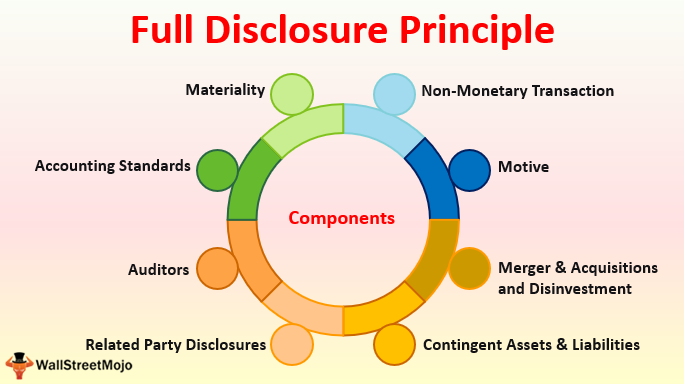

In today's fast-paced financial markets, business transparency and full disclosure have become paramount for stakeholders. Financial reporting plays a critical role in ensuring this transparency, serving as the primary means through which companies communicate their financial health and performance to shareholders, investors, and regulatory bodies. As businesses strive to maintain trust and credibility, transparent financial reporting has become an indispensable aspect of effective corporate governance.

Algorithmic trading, a technology-driven practice, also depends heavily on the availability of accurate and transparent data. This form of trading utilizes complex algorithms to analyze large datasets and execute trades at high speeds, relying on precise and timely information extracted from financial reports. Discrepancies or delays in data can significantly affect the efficacy of these strategies, potentially leading to financial losses or missed opportunities.

This article explores the interconnected nature of financial reporting, business transparency, full disclosure, and algorithmic trading. We will examine how financial reporting ensures transparency in businesses, providing stakeholders with the information needed to make informed decisions. Understanding the role of full disclosure is crucial in safeguarding stakeholder interests, fostering an environment of trust, and promoting fairness in financial markets. 

Moreover, the impact of financial transparency on algorithmic trading strategies is profound. High-quality, transparent financial data enables finely-tuned algorithms to operate effectively, ensuring that trading decisions are based on accurate and current information. By understanding these relationships, companies can enhance their transparency practices, ultimately benefiting both themselves and their stakeholders.

## Table of Contents

## The Importance of Financial Reporting in Business Transparency

Financial reporting plays a crucial role in fostering business transparency by offering detailed insights into a company's performance and financial standing. This transparent reporting is fundamental in building and maintaining trust among investors and other stakeholders. By providing a clear and accurate depiction of their financial health, companies help stakeholders make informed decisions, promoting confidence in the market environment.

Companies are obligated to deliver a true and fair view of their financial status. This accountability is not just a regulatory requirement but a cornerstone for ensuring the smooth functioning of financial markets. The principle of transparency in financial reporting is fundamental to attracting and retaining investment, as it assures investors that their decisions are based on reliable and comprehensive information.

Investor confidence is vital for the efficient operation of capital markets. When investors trust the financial information provided by a company, they are more likely to invest capital, which in turn supports the company's growth and stability. Transparent financial reporting reduces information asymmetry between management and stakeholders, minimizing the risk of adverse selection in investment choices.

The absence of transparent financial reporting can lead to significant risks for businesses. Without it, companies may face credibility issues, making it challenging to secure investment and financing. This lack of access to capital can hinder a company's ability to fund operations or pursue growth opportunities, ultimately impacting its long-term viability and competitiveness in the market. Furthermore, opaque reporting practices can lead to market inefficiencies, where prices do not accurately reflect all available information, potentially distorting investment decisions and capital allocation.

In summary, financial reporting is essential in advancing business transparency. It ensures that companies provide a reliable and honest portrayal of their financial positioning, which is crucial for maintaining investor confidence and ensuring efficient, effective capital markets. By prioritizing transparent reporting practices, businesses can avoid potential credibility issues and enhance their ability to secure necessary resources for sustainable growth.

## Understanding Full Disclosure in Financial Reporting

Full disclosure in financial reporting is a regulatory mandate that obliges companies to present all material facts pertinent to their financial statements, thus ensuring stakeholders have access to comprehensive data that might influence their decision-making processes. This requirement is not only a matter of legal compliance but also crucial for fostering transparency and accountability within the business landscape.

### Elements of Full Disclosure

The elements that constitute full disclosure encompass several critical aspects:

1. **Materiality**: Materiality is a pivotal concept in full disclosure, referring to the significance of financial information that could influence the economic decisions of users. Companies must assess which pieces of information are deemed material and include them in their reports. Material facts typically include details such as significant contracts, events that affect financial health, and major accounting policies.

2. **Notes to Financial Statements**: These notes provide additional information related to the numbers shown on the primary financial statements. They offer context, clarify accounting methods, and disclose details such as contingencies, commitments, and subsequent events that can impact future financial performance.

3. **Management Discussion and Analysis (MD&A)**: This section provides managers an opportunity to present their perspective on the financial condition, results of operations, and future outlook of the company, offering insights that go beyond the numbers in financial statements.

4. **Regulatory Filings**: Public companies are required to file numerous reports, such as annual Form 10-K, quarterly Form 10-Q, and current reports on Form 8-K with the Securities and Exchange Commission (SEC), providing structured and detailed information on their financial status and operational results.

### Challenges in Implementing Full Disclosure

Implementing full disclosure effectively is fraught with challenges:

- **Complexity of Information**: Financial statements and their footnotes can be complex, especially for firms with diverse and intricate operations. Determining the level of detail required to satisfy full disclosure mandates can be daunting, and over-disclosure may detract from the clarity of significant information.

- **Cost of Compliance**: The resources required to compile, analyze, and audit financial data comprehensively can be substantial, affecting particularly small to medium-sized enterprises that may lack the financial wherewithal to meet these demands.

- **Judgment and Estimation**: Companies must make numerous judgments and estimates, especially in areas such as asset valuation and liability recognition. Determining the right balance between comprehensive disclosure and protecting proprietary information is often challenging.

- **Varying International Standards**: Multinational organizations must navigate different regulations and accounting frameworks across countries, leading to inconsistencies and communication barriers in financial reporting and disclosure.

### Addressing the Challenges

To address these challenges, companies can adopt several strategies:

- **Leveraging Technology**: Advances in software and automation can streamline the data collection and reporting process, reducing the resource burden and improving the accuracy and timeliness of disclosures.

- **Clear Disclosure Guidelines**: Developing internal guidelines tailored to the organization’s specific industry, operational scale, and reporting requirements can ensure consistent and material information disclosure.

- **Regular Training and Updates**: Ongoing education for finance and accounting teams on regulatory changes and best practices is crucial to maintaining compliance and improving the quality of disclosures.

By understanding and addressing these challenges, businesses can enhance transparency and accountability, building trust with investors and other stakeholders.

## The Role of Transparency in Algorithmic Trading

Transparency in financial reporting is essential to the effectiveness of [algorithmic trading](/wiki/algorithmic-trading). Algorithmic trading systems rely heavily on precise, current financial data to execute trades. Algorithms process vast amounts of data, including stock prices, trading volumes, and economic indicators, to identify patterns and predict asset price movements. Any inaccuracies or delays in financial information can lead to erroneous trading signals, potentially resulting in substantial financial losses and increased market [volatility](/wiki/volatility-trading-strategies).

Clear and accurate financial reporting enhances the efficiency and reliability of algorithmic trading strategies. Algorithms can promptly adjust to changing market conditions by incorporating transparent data, improving their predictive accuracy and execution speed. For instance, accurate earnings reports and balance sheet data enable algorithms to evaluate a company’s financial health, influencing decisions on stock purchases or sales. 

Furthermore, full disclosure plays a pivotal role in algorithmic trading. When companies provide comprehensive details about their financial activities, risks, and future prospects, algorithmic systems can incorporate this information into their models more effectively. For example, detailed disclosure about revenue sources and potential liabilities allows algorithms to assess a company's sustainable growth prospects better. 

Conversely, the absence of full disclosure can adversely affect algorithmic trading. If a company withholds or manipulates financial information, algorithms may base their trading decisions on incomplete or misleading data. This can result in incorrect valuations and suboptimal trading strategies. A notable case was the Enron scandal, where the lack of transparency and false reporting led to flawed algorithmic assumptions, contributing to massive financial losses for investors relying on these systems.

In summary, transparent financial reporting ensures that algorithmic trading systems operate with accuracy and confidence. Full disclosure facilitates comprehensive data analysis, enhancing the ability of algorithms to make informed trading decisions. Companies that prioritize transparency not only comply with regulatory standards but also support a more stable and predictable trading environment.

## Challenges in Ensuring Full Disclosure and Transparency

Ensuring full disclosure and transparency in financial reporting is critical but presents numerous challenges that companies must navigate. These challenges stem from the complexity of financial information, the costs associated with compliance, and the subjective assessment of what constitutes essential disclosure. Each of these aspects poses unique obstacles that require strategic solutions to overcome.

The complexity of financial information is a formidable hurdle. Financial statements often entail extensive data and intricate details that can obscure clarity rather than promote transparency. This complexity is amplified when considering the varied operations of multinational corporations, which must report financial activities across multiple jurisdictions with differing rules and standards. For instance, a company operating in both the United States and Europe might need to reconcile the Euro-centric International Financial Reporting Standards (IFRS) with the U.S. Generally Accepted Accounting Principles (GAAP). This can result in convoluted disclosures, challenging stakeholders attempting to discern accurate information.

Additionally, the cost of compliance with full disclosure requirements can be burdensome, particularly for smaller firms. These companies often possess limited resources, making it difficult to allocate funds for the extensive reporting systems and staff required to ensure compliance. The necessity to invest in auditing systems, legal consultations, and specialized software further strains financial resources. In contrast, larger multinational corporations face the challenge of integrating diverse reporting systems and processes across different subsidiaries, which can be both time-consuming and expensive.

Another significant challenge is the subjective nature of full disclosure, which can vary based on industry expectations, stakeholder demands, and regulatory standards. Determining what should be disclosed requires careful judgment and carries the risk of either excessive disclosure, which could overwhelm users, or insufficient disclosure, which might mislead stakeholders. This subjective decision-making is further complicated by the rapid changes in regulations and evolving stakeholder expectations, necessitating agile systems and processes to adapt to these changes.

To address these challenges, companies can implement several solutions to enhance full disclosure and transparency. Embracing advanced technologies such as automation and [artificial intelligence](/wiki/ai-artificial-intelligence) can streamline reporting processes, reducing human error and improving accuracy. For example, using natural language processing tools can aid in analyzing vast amounts of financial data to identify key disclosure requirements more efficiently.

Standardization initiatives can also alleviate the complexities associated with international reporting standards. Companies may benefit from adopting a universal framework that harmonizes the differing requirements, similar to the convergence projects undertaken by the IFRS and GAAP to align their accounting standards.

Finally, fostering a culture of transparency and continuous education within organizations can empower employees to understand the importance of precise and comprehensive reporting. Training programs and workshops focusing on the evolving regulatory environment and stakeholder expectations can prepare staff to handle disclosure challenges more effectively.

In summary, while achieving full disclosure and transparency in financial reporting presents significant challenges, strategic use of technology, standardization efforts, and cultivating an organizational culture of transparency can offer viable solutions to enhance the quality and reliability of financial reports.

## Benefits of Transparency for Stakeholders

Transparency in financial reporting offers a multitude of advantages for stakeholders, which include investors, regulators, and companies themselves. By promoting clearer communication of financial data, transparency aids in better risk assessment and decision-making processes. For investors, this means accessing reliable information that can guide their investment strategies and decisions. When financial information is readily available and accurate, it reduces the risk of information asymmetry, empowering investors to evaluate the true performance and potential of investment opportunities.

Regulators benefit from transparent reporting as it facilitates the effective monitoring and oversight of market activities. When companies adhere to transparent practices, regulatory bodies can more easily identify discrepancies, potential fraud, or non-compliance issues, thereby safeguarding the integrity of financial markets. Additionally, transparency paves the way for more efficient regulatory processes, reducing the need for extensive audits or investigations.

For companies, fostering transparency can lead to a significant competitive edge. Transparent financial reporting builds trust and credibility with both investors and customers, enhancing a company's reputation. Trust, as a cornerstone of business relationships, encourages continued investment and long-term partnerships, ultimately contributing to sustainable growth. Moreover, businesses that prioritize transparency are often perceived as more ethical and responsible, which can translate into increased brand loyalty and market share.

Real-world examples underscore the benefits transparency can bring. Consider the shift in market dynamics following the implementation of the Sarbanes-Oxley Act, which mandated improved corporate governance and financial disclosures. Companies that embraced these regulations not only improved their market valuation but also experienced reduced capital costs due to increased investor confidence. Similarly, firms that have consistently delivered comprehensive and honest financial reports have attracted larger pools of investment, as stakeholders are more likely to engage with entities they perceive as transparent and trustworthy.

In conclusion, transparency in financial reporting enhances the capacity of stakeholders to make informed decisions, ensures effective regulatory oversight, and enables companies to cultivate a competitive advantage. The alignment of interests between stakeholders and transparent organizations fosters a healthier financial ecosystem, promoting trust and encouraging economic stability and growth.

## Best Practices for Full Disclosure and Transparency

Achieving full disclosure and transparency in financial reporting is essential for maintaining trust and accountability within the business landscape. To this end, companies should adhere to a set of best practices that ensure the completeness and accuracy of the information they provide. 

One of the primary practices is following Generally Accepted Accounting Principles (GAAP) or International Financial Reporting Standards (IFRS). These frameworks establish a standardized approach to financial reporting, ensuring that the financial statements are consistent, comparable, and reliable. By strictly adhering to these principles, companies can provide a true and fair view of their financial health, which is crucial for maintaining stakeholder confidence.

In addition to following accounting standards, providing detailed notes in financial statements is essential. These notes should elucidate significant accounting policies, any unusual transactions, and other pertinent details that might impact an investor’s interpretation of the financial statements. This level of detail helps stakeholders gain a deeper understanding of the financial reports, enhancing transparency and informed decision-making.

Timely reporting is another crucial component of full disclosure. Financial information should be made available to stakeholders promptly to avoid information asymmetry and potential market manipulation. Timely disclosures ensure that all stakeholders have equal access to the information they need to make informed decisions, thus maintaining market integrity.

With advancements in technology, organizations can leverage advanced software solutions to streamline their reporting processes. Technologies such as data analytics, artificial intelligence, and cloud computing can significantly enhance the efficiency and accuracy of financial reporting. For example, AI-powered tools can help automate the preparation and review of financial statements, reducing errors and improving compliance with disclosure requirements.

Moreover, blockchain technology offers promising solutions for enhancing transparency. It provides a decentralized and immutable ledger that can verify and record transactions, thus ensuring the integrity and traceability of financial records. This technology can be particularly beneficial in areas where precise record-keeping and verification are critical.

For companies looking to enhance their transparency practices, a strategic roadmap is essential. This roadmap should include:
1. Implementing robust internal controls to ensure data integrity.
2. Regularly reviewing and updating accounting policies to comply with current standards.
3. Training personnel on the importance of transparency and ethical reporting.
4. Establishing a culture of open communication where employees feel encouraged to report irregularities or potential issues.

By adhering to these best practices and utilizing advanced technology, companies can foster a transparent financial environment that benefits all stakeholders. This commitment to full disclosure not only enhances investor confidence but also strengthens a company’s reputation and competitive advantage in the marketplace.

## Conclusion

Financial reporting, business transparency, and full disclosure serve as critical pillars in the effective functioning of financial markets and the optimization of algorithmic trading systems. These elements collectively promote a level playing field by ensuring that all market participants are privy to accurate, timely, and comprehensive information. Through transparent financial reporting, companies foster trust and confidence among investors and stakeholders, subsequently enhancing their market value and credibility.

By committing to transparency and full disclosure, organizations can not only meet regulatory compliance standards effectively but also drive innovation within trading practices. Transparency facilitates more efficient risk management and decision-making processes, enabling algorithmic trading systems to function optimally with reliable data inputs.

As the financial landscape evolves, companies must prioritize transparency to meet the growing expectations of stakeholders who demand accountability and integrity. Adapting to these expectations is vital for sustaining investor confidence and staying competitive in an increasingly data-driven market environment.

Ultimately, a strong commitment to transparency and full disclosure is indispensable for long-term success. Businesses that uphold these principles can better position themselves in the financial ecosystem, thus ensuring resilience and sustainable growth amid continuous market developments.

## References & Further Reading

[1]: ["Financial Reporting and Analysis"](https://www.wallstreetmojo.com/financial-reporting/) by Charles H. Gibson

[2]: Lev, B. (2018). ["Evaluating the Information Content of Financial Reports."](https://www.researchgate.net/publication/325565576_The_deteriorating_usefulness_of_financial_report_information_and_how_to_reverse_it) Journal of Financial Reporting, 3(1).

[3]: Ullah, S., Moinuddin, M., & Ijaz, M. (2021). ["The Impact of Corporate Governance on Financial Transparency."](https://fbj.springeropen.com/articles/10.1186/s43093-021-00093-6) Research in International Business and Finance, 56.

[4]: Gomber, P., Arndt, B., Lutat, M., & Uhle, T. (2011). ["High-Frequency Trading."](https://papers.ssrn.com/sol3/papers.cfm?abstract_id=1858626) European Journal of Finance, 17(10).

[5]: ["The Elements of Financial Statements"](https://www.wikiaccounting.com/elements-financial-statements/) by IFRS Foundation

[6]: Palepu, K., Healy, P., & Peek, E. (2019). ["Business Analysis and Valuation: IFRS Edition."](https://books.google.com/books/about/Business_Analysis_and_Valuation.html?id=PQG6zgEACAAJ) Cengage Learning EMEA.

[7]: Hull, J. (2021). ["Options, Futures, and Other Derivatives"](https://archive.org/details/john-hull-options-futures-and-other-derivatives-pearson-2021) by John C. Hull