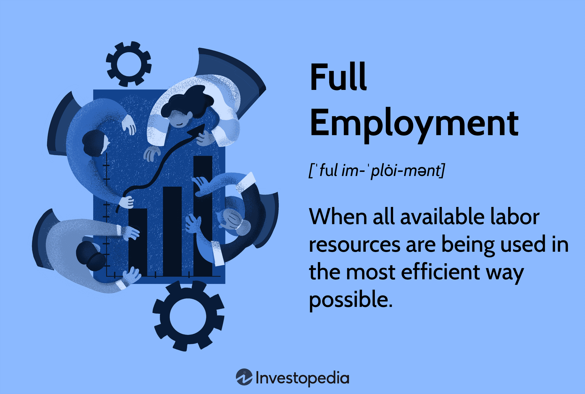

In today's complex economic landscape, understanding employment is crucial for both policymakers and individuals. Employment serves as a fundamental pillar of economic stability and growth, affecting everything from household income levels to national economic policies. As such, a comprehensive understanding of various employment aspects is essential for crafting and implementing effective economic strategies.

This article explores several key components of employment, focusing on full employment, distinct types of employment, and the influence of algorithmic trading on modern economies. Full employment represents an economic situation where all available labor resources are efficiently utilized, with minimal unemployment. Achieving this state involves intricate challenges, as it requires balancing employment levels with inflation. Theoretical models like the Phillips Curve provide insight into this delicate balance, highlighting the inverse relationship between unemployment and inflation.



Employment types have significantly evolved over the years, extending beyond traditional full-time roles to include part-time work, freelancing, and participation in the gig economy. Each type carries unique implications for economic policy and labor market dynamics. Understanding these employment categories is vital for developing tailored strategies that address unemployment issues and guide economies towards their goals.

Moreover, algorithmic trading—a technological advancement that employs automatic systems and complex algorithms for optimal trade execution—has significantly reshaped the financial markets. While it enhances trading efficiency, algorithmic trading also influences job roles within the finance sector, necessitating new skills and workforce adaptability. As such, technology and employment dynamics weave a complex tapestry influencing modern economic landscapes.

This introduction sets the stage for a deeper examination of full employment's nuances and the diverse employment types' effects on economic policies. Furthermore, it acknowledges the substantial role that algorithmic trading plays in contemporary markets and its implications for employment in the finance sector. Understanding these elements is crucial for individuals and policymakers aiming to navigate and craft effective economic strategies in a rapidly evolving world.

## Table of Contents

## Understanding Full Employment

Full employment is defined as a state in which all available labor resources are utilized to their full potential within the economy. In this context, it represents a theoretical scenario where every individual seeking employment can find a job at the prevailing wage rate. Though idealistic, the practical interpretation of full employment acknowledges the existence of some level of unemployment, generally pegged at around 5%. This rate accounts for natural unemployment, which includes people transitioning between jobs or entering the workforce for the first time.

Economists acknowledge that some degree of unemployment is both inevitable and necessary. It facilitates job transitions and helps in controlling inflation, as an economy that operates with absolutely no unemployment is likely to face pressures that could lead to inflationary spirals. The key is finding the right balance that achieves low levels of unemployment without triggering unchecked inflation.

The Phillips Curve is one of the most significant economic theories relevant to understanding this balance between employment and inflation. Named after economist A.W. Phillips, the curve illustrates an inverse relationship between the rate of inflation and the rate of unemployment in an economy. According to the Phillips Curve, as unemployment falls, inflation tends to rise, suggesting a trade-off between the two. The theory posits that lower unemployment can lead to upward pressure on wages, which can subsequently push overall price levels higher.

In practical terms, managing full employment requires vigilant economic policies that can adjust to the shifting dynamics of the labor market and broader economy. Policymakers often use tools such as fiscal policy adjustments and monetary policy, including [interest rate](/wiki/interest-rate-trading-strategies) changes, to manage these dynamics and stabilize both employment and inflation rates.

Understanding full employment entails recognizing this intricate balance and appreciating the necessity of some unemployment to foster a dynamic and resilient economy. It emphasizes the role of policymakers in carefully orchestrating economic conditions that promote optimal utilization of labor resources without succumbing to inflationary pressures that could destabilize the economic environment.

## Types of Unemployment and Their Impact

Unemployment is a critical indicator of economic health, and understanding its various types is essential for developing effective economic strategies. Unemployment can generally be categorized into four main types: structural, frictional, cyclical, and institutional, each with distinct causes and implications for the labor market.

Structural unemployment arises when there is a mismatch between the skills of the workforce and the needs of the industry. This often results from technological advancements and changes in industry demand, as new technologies render certain skills obsolete. For example, automation in manufacturing has displaced many workers whose skills are no longer in demand, creating a need for retraining and education to help them transition to new roles. A classic case of structural unemployment can be illustrated by the decline in coal mining jobs as energy industries shift towards renewable sources.

Frictional unemployment, on the other hand, consists of temporary unemployment that occurs when individuals are transitioning between jobs. This type of unemployment is natural and often reflects a healthy economy where workers have the flexibility to find roles that better match their skills and preferences. Frictional unemployment exists even in robust economies and is typically short-term, influenced by workers voluntarily changing careers, relocating for personal reasons, or entering the job market for the first time.

Cyclical unemployment is directly linked to the economic cycle, increasing during recessions and decreasing in times of economic growth. During a recession, economic activity slows down, leading to decreased demand for goods and services, which causes businesses to lay off workers. Conversely, in periods of economic expansion, the demand for labor rises as businesses seek to grow. This type of unemployment is often addressed through fiscal and monetary policies aimed at stimulating economic activity.

Institutional unemployment results from notable influences by institutions on the labor market. This includes factors such as union activities, minimum wage laws, and other governmental regulations that can affect how labor markets operate. For instance, strong labor unions might negotiate higher wages that lead to reduced hiring, or extensive welfare benefits might create disincentives for job seeking among the unemployed. Understanding how these institutional factors interact with labor markets is crucial for policymakers aiming to minimize unemployment levels.

Each type of unemployment carries unique challenges and necessitates targeted approaches for mitigation. Structural unemployment, with its need for workforce retraining, differs greatly in resolution compared to cyclical unemployment, which might be addressed through economic stimulus. Similarly, frictional unemployment is often seen as a sign of labor market fluidity, while institutional unemployment requires policy-level adjustments. Recognizing these distinctions allows for more nuanced solutions, improving the overall efficacy of employment strategies.

## Examples of Full Employment in Practice

Full employment represents an economic state where nearly all who are willing and able to work at prevailing wage rates find jobs. Countries like Japan and Germany have successfully maintained low unemployment rates, often cited as examples of near full employment. Understanding the strategies employed by these nations offers valuable insights into balancing economic growth with minimal inflation.

Japan's labor market is characterized by its historically low unemployment rates, which have consistently hovered around 2-3% in recent years. This low unemployment rate can be attributed to several factors, including strong cultural emphasis on lifelong employment, a robust manufacturing sector, and significant investments in technology and automation. The Japanese government has also actively implemented policies to address demographic challenges, such as an aging population, by encouraging higher workforce participation among women and older workers.

Germany, on the other hand, maintains an unemployment rate of about 3-4%, thanks in part to its strong vocational training system and labor market policies. The dual education system, which combines apprenticeships with classroom instruction, equips young people with skills directly relevant to the job market, thus reducing youth unemployment. Additionally, Germany's Hartz reforms in the early 2000s restructured the labor market, resulting in increased flexibility and lower long-term unemployment. The approach emphasizes short-time work schemes that prevent layoffs during economic downturns, thus stabilizing employment.

Both Japan and Germany offer lessons on maintaining low unemployment rates without triggering inflation. They demonstrate the importance of adaptable labor markets, effective training systems, and policies fostering workforce participation. By understanding and applying similar strategies, other nations could potentially achieve sustainable full employment levels, enhancing economic stability and growth.

## Types of Employment

Employment types have significantly diversified over the years, adapting to the demands of modern economies and the evolving nature of work itself. These variations in employment influence economic policy and labor market dynamics, necessitating a comprehensive understanding to formulate strategies aimed at minimizing unemployment and achieving economic stability.

**Traditional Full-Time Employment**

Full-time employment remains a cornerstone of the labor market, typically characterized by a standard workweek of approximately 40 hours. It often includes benefits such as healthcare, pensions, and paid leave. This type of employment provides stability and predictability for both employers and employees, allowing for long-term financial planning and career development. However, it also requires significant commitments of time and resources from employees, which may not always align with modern life demands.

**Part-Time Work**

Part-time employment, defined by fewer working hours than full-time positions, offers flexibility to both workers and employers. This type is particularly significant in industries like retail and hospitality, which may require labor during specific hours or peak periods. While part-time workers typically receive fewer benefits, the flexibility allows them to balance other commitments, such as education or family care. Economic policies often focus on ensuring fair wages and working conditions for part-time employees, aiming to prevent labor market segmentation and inequality.

**Freelance Work**

Freelancing involves individuals providing services to multiple clients without long-term commitments. This type of work is prevalent in creative industries, IT, and consultancy. Freelancers enjoy high autonomy and the potential for diverse job opportunities. However, they face challenges such as income unpredictability, lack of benefits, and the complexity of managing their employment taxes and insurances. Policymakers are increasingly focusing on creating frameworks that provide freelancers with access to social protections and benefits typically reserved for traditional employees.

**Gig Economy**

The gig economy encompasses short-term, flexible jobs facilitated by digital platforms, such as ride-sharing, food delivery, and online task services. Gig workers have unparalleled flexibility but often lack security, stable income, and employee benefits. The rise of this employment type has sparked debates on workers' rights, with some arguing for better regulations and protections akin to those granted to traditional employees. Economic strategies aiming at the gig economy frequently concentrate on ensuring fair compensation, job security, and access to benefits for gig workers while maintaining the flexibility that attracts many to this type of employment.

Each of these employment types plays a critical role in shaping economic policies. Crafting effective labor market strategies requires recognizing these distinctions and addressing the unique challenges posed by each category. By understanding the implications of the diverse employment landscape, policymakers can develop nuanced approaches to reduce unemployment rates and align with broader economic objectives.

## Algorithmic Trading and Its Employment Implications

Algorithmic trading involves the use of automated systems and advanced algorithms to conduct trades at the most opportune moments, fundamentally altering the landscape of financial markets. These systems analyze vast amounts of data rapidly, execute trades with precision, and harness complex mathematical models to optimize trading outcomes. This technological advancement has significantly enhanced market efficiency, providing increased [liquidity](/wiki/liquidity-risk-premium) and reducing transaction costs.

The impact of [algorithmic trading](/wiki/algorithmic-trading) on employment within the finance sector is multifaceted. On one hand, algorithmic trading has led to a decrease in the demand for traditional trading roles, where manual execution and decision-making were primary tasks. The automation of these processes means fewer traders are needed to perform routine transactions. As routine tasks become automated, professionals in the finance sector are compelled to shift their focus from transaction execution to analysis, strategizing, and overseeing the performance of these algorithms.

The evolution of algorithmic trading also necessitates the development of new skills and expertise. Financial professionals are increasingly required to possess strong quantitative skills, programming knowledge, and an understanding of [machine learning](/wiki/machine-learning) and data analysis. For instance, proficiency in programming languages such as Python has become a valuable asset, as it enables professionals to write, analyze, and modify trading algorithms. Here's a simple Python script showcasing how algorithms might be structured for trading tasks:

```python
import numpy as np

def moving_average(prices, window_size):
    weights = np.repeat(1.0, window_size)/window_size
    moving_averages = np.convolve(prices, weights, 'valid')
    return moving_averages

def signal_generation(prices, short_window=10, long_window=50):
    short_ma = moving_average(prices, short_window)
    long_ma = moving_average(prices, long_window)

    signals = np.zeros(len(short_ma))
    signals[short_ma > long_ma[:len(short_ma)]] = 1
    signals[short_ma < long_ma[:len(short_ma)]] = -1

    return signals

# Example price data
prices = np.random.normal(100, 10, 100)

signals = signal_generation(prices)
```

This simple example shows how a moving average strategy might be implemented to generate buy or sell signals based on short-term and long-term price trends. Such algorithmic approaches to trading necessitate a deep understanding of statistical tools and computing techniques.

Moreover, the algorithmic trading ecosystem generates employment opportunities in areas like algorithm development, system maintenance, and cybersecurity. As financial institutions rely more heavily on technology, these areas require ongoing attention and expertise to ensure systems operate smoothly and securely.

Algorithmic trading represents a shift towards a more technologically driven employment landscape in finance, demanding continuous learning and adaptation. Workers must remain agile, acquiring skills that enable them to develop, manage, and optimize complex algorithmic systems. This shift underscores the importance of education and training programs that equip individuals with the skill sets essential for thriving in this evolving landscape.

## Conclusion

Achieving full employment remains a fundamental yet challenging goal for policymakers globally. The concept of full employment is not merely a quantitative measure of joblessness but a delicate balance between maximizing employment and managing inflation. Policymakers are tasked with fostering economic environments where labor resources are fully utilized while preventing inflation from escalating. This equilibrium is crucial because excessive inflation can erode purchasing power and destabilize economies, whereas high unemployment can lead to social and economic discontent.

The dynamic nature of employment has been significantly influenced by technological advancements, particularly in algorithmic trading and automation. Algorithmic trading, for instance, utilizes sophisticated algorithms and automated systems to execute large volumes of trades at speeds unmanageable by human traders. This advancement enhances market efficiency and liquidity, but it also necessitates a transformation in the workforce. Financial professionals are now required to develop new skills, such as proficiency in data analysis and algorithmic design, to remain relevant in the evolving landscape.

Technological advancements and evolving employment types necessitate a robust understanding of these changes to create effective economic policies. Policymakers need to analyze and comprehend these shifts to adapt strategies that accommodate new employment structures, support workforce transitions, and address the economic implications of these innovations. Education and training systems must also evolve to equip individuals with the skills necessary in a technology-driven labor market.

As economies progress, continual adaptation and learning are essential for institutions and individuals alike. Institutions must create policies and frameworks that support innovation while ensuring economic stability. Simultaneously, individuals must remain proactive in acquiring new skills and knowledge to adapt to the changing job market. This dual approach of institutional support and individual responsibility is critical for navigating the complexities of modern employment landscapes and maintaining economic vibrancy.

## References & Further Reading

[1]: Phillips, A. W. (1958). ["The Relationship Between Unemployment and the Rate of Change of Money Wage Rates in the United Kingdom, 1861-1957."](https://onlinelibrary.wiley.com/doi/full/10.1111/j.1468-0335.1958.tb00003.x) Economica, 25(100): 283-299.

[2]: Krugman, P., Obstfeld, M., & Melitz, M. J. (2018). ["International Economics: Theory and Policy."](https://www.pearson.com/se/Nordics-Higher-Education/subject-catalogue/economics/International-Economics-Theory-and-Policy-Krugman.html) Pearson.

[3]: Lopez de Prado, M. (2018). ["Advances in Financial Machine Learning."](https://www.amazon.com/Advances-Financial-Machine-Learning-Marcos/dp/1119482089) Wiley.

[4]: Aronson, D. (2006). ["Evidence-Based Technical Analysis: Applying the Scientific Method and Statistical Inference to Trading Signals."](https://www.amazon.com/Evidence-Based-Technical-Analysis-Scientific-Statistical/dp/0470008741) Wiley.

[5]: Chan, E. P. (2008). ["Quantitative Trading: How to Build Your Own Algorithmic Trading Business."](https://github.com/ftvision/quant_trading_echan_book) Wiley.

[6]: Jansen, S. (2020). ["Machine Learning for Algorithmic Trading."](https://github.com/stefan-jansen/machine-learning-for-trading) Packt Publishing.