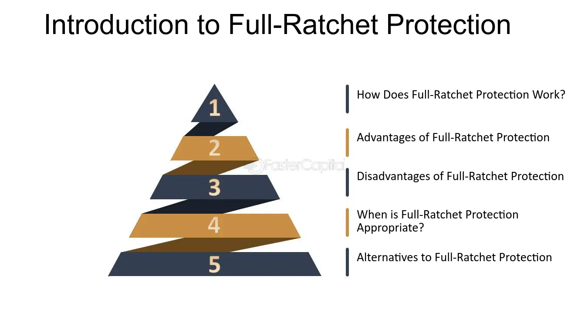

## Table of Contents

## What is a Full Ratchet Anti-Dilution Mechanism?

A Full Ratchet Anti-Dilution Mechanism is a way to protect early investors in a company if the company issues new shares at a lower price later on. Imagine you bought shares for $10 each. If the company later sells new shares for $5 each, a Full Ratchet would adjust your original shares to match the new, lower price. This means you would get more shares for the same amount of money you initially paid, keeping the value of your investment the same as if you had bought at the lower price.

This mechanism can be very good for early investors because it protects them from losing value in their investment. However, it can be tough for the company and new investors. If the company has to give out a lot more shares to early investors, it means there are fewer shares left for new investors or the company's founders. This can make it harder for the company to grow and raise more money in the future.

## How does a Full Ratchet Anti-Dilution Mechanism work?

A Full Ratchet Anti-Dilution Mechanism is a way to keep the value of an early investor's shares the same if a company sells new shares at a lower price later on. Imagine you bought shares for $10 each. If the company then sells new shares for $5 each, a Full Ratchet would adjust the price of your original shares to $5 too. This means you would get more shares for the same amount of money you paid, so the total value of your investment stays the same as if you had bought the shares at the new, lower price.

This mechanism is good for early investors because it protects them from losing money if the company's share price goes down. However, it can be hard for the company and new investors. If the company has to give out a lot more shares to early investors, it means there are fewer shares left for new investors or the company's founders. This can make it harder for the company to grow and raise more money in the future.

## What are the key differences between Full Ratchet and Weighted Average Anti-Dilution?

Full Ratchet and Weighted Average Anti-Dilution are two ways to protect early investors if a company sells new shares at a lower price. Full Ratchet is simpler and stronger. If new shares are sold at a lower price, it adjusts the price of the early investor's shares all the way down to the new price. This means early investors get more shares to keep their investment's value the same. It's like getting a full refund and buying at the new, lower price.

Weighted Average Anti-Dilution is more complicated but fairer to everyone. Instead of adjusting the price all the way down to the new price, it uses a formula to find a middle ground. This formula considers how many new shares are sold and at what price. The result is a smaller adjustment to the early investor's share price. This means early investors get some extra shares, but not as many as with Full Ratchet. It's kinder to the company and new investors because it doesn't take away as many shares from them.

Both methods aim to protect early investors, but Full Ratchet can be tough on the company and new investors. It can make it harder for the company to raise more money in the future because it has to give out more shares to early investors. Weighted Average is a compromise that tries to balance the needs of early investors, the company, and new investors.

## Why might a company choose to implement a Full Ratchet Anti-Dilution Mechanism?

A company might choose to implement a Full Ratchet Anti-Dilution Mechanism to make their early investors feel safe and happy. Early investors put money into the company when it's new and risky. By using Full Ratchet, the company promises to protect these investors if the share price drops later. This promise can make the company more attractive to early investors, helping it raise the money it needs to start and grow.

However, choosing Full Ratchet can also be a big decision for the company. It's a strong protection for early investors, but it can make things harder for the company later on. If the share price does drop and the company has to give out a lot more shares to early investors, there will be fewer shares left for new investors or the company's founders. This can make it tougher for the company to raise more money in the future and could slow down its growth. So, the company needs to think carefully about whether the benefits of attracting early investors with Full Ratchet are worth the potential challenges it might face down the road.

## What are the potential downsides for existing shareholders when a Full Ratchet is used?

When a company uses a Full Ratchet Anti-Dilution Mechanism, it can be tough on existing shareholders. If the company sells new shares at a lower price, the Full Ratchet means early investors get more shares to keep their investment's value the same. This means the total number of shares goes up, but the company doesn't get any new money for these extra shares. As a result, each existing shareholder's piece of the company gets smaller, even though they haven't sold any shares. This can make their investment worth less, which isn't good for them.

Also, Full Ratchet can make it harder for the company to raise money in the future. New investors might not want to buy shares if they know early investors will get a lot more shares for free. This can scare away new money the company needs to grow. If the company can't raise more money easily, it might have to slow down its plans or even struggle to keep going. So, while Full Ratchet protects early investors, it can create big problems for other shareholders and the company itself.

## Can you explain the impact of a Full Ratchet on a startup's valuation?

When a startup uses a Full Ratchet Anti-Dilution Mechanism, it can change how much the company is worth. Imagine early investors bought shares at a high price, but later the startup has to sell new shares at a lower price. Full Ratchet means the early investors get more shares to keep their investment's value the same as if they had bought at the lower price. This means the total number of shares goes up, but the company doesn't get any new money for these extra shares. As a result, each share is worth less, which can make the whole company seem less valuable.

This can also make it harder for the startup to raise more money in the future. New investors might be scared off if they know the early investors will get a lot more shares for free. This can make it tough for the startup to bring in the money it needs to grow. So, while Full Ratchet protects early investors, it can lower the startup's valuation and make it harder to get the funds needed for future growth.

## What alternatives exist to the Full Ratchet Anti-Dilution Mechanism?

One common alternative to the Full Ratchet Anti-Dilution Mechanism is the Weighted Average Anti-Dilution Mechanism. This method is kinder to everyone involved. Instead of adjusting the price of early investors' shares all the way down to the new, lower price, it uses a formula to find a middle ground. This formula takes into account how many new shares are sold and at what price. As a result, early investors get some extra shares, but not as many as with Full Ratchet. This means the company doesn't have to give away as many shares, making it easier to raise more money in the future and keeping the value of the company more stable.

Another alternative is the Broad-Based Weighted Average Anti-Dilution Mechanism, which is a type of Weighted Average but includes more types of shares in its calculations. This makes the adjustment even smaller, further protecting the company and new investors. Some companies might also choose not to use any anti-dilution protection at all, especially if they believe it's important to keep things simple and fair for everyone. This can make the company more attractive to new investors who don't want to worry about complex adjustments to their shares.

## How does the Broad-Based Weighted Average method differ from Full Ratchet?

The Broad-Based Weighted Average method is a lot different from the Full Ratchet Anti-Dilution Mechanism. With Full Ratchet, if a company sells new shares at a lower price, it adjusts the price of the early investors' shares all the way down to the new price. This means early investors get a lot more shares to keep their investment's value the same. But with the Broad-Based Weighted Average method, the adjustment is smaller. It uses a special formula that looks at how many new shares are sold and at what price. This formula also includes more types of shares in its calculations, making the adjustment even smaller than with a regular Weighted Average.

This smaller adjustment with the Broad-Based Weighted Average method is kinder to the company and new investors. It means the company doesn't have to give away as many shares to early investors, so there are more shares left for new investors and the company's founders. This can make it easier for the company to raise more money in the future and keep its value more stable. On the other hand, Full Ratchet can make it harder for the company to grow because it has to give out a lot more shares to early investors, leaving fewer shares for others.

## What are the legal implications and considerations of using a Full Ratchet Anti-Dilution Mechanism?

When a company decides to use a Full Ratchet Anti-Dilution Mechanism, it needs to think about the legal stuff. This mechanism is put into the legal agreement between the company and its investors. It's important to make sure this agreement is clear and follows the law. If it's not done right, it could lead to fights between the company and its investors. Also, the company needs to tell any new investors about the Full Ratchet. If they don't, it could be seen as not being honest, which could cause legal problems.

Using Full Ratchet can also affect how the company is run. It might make it harder to raise more money later because new investors might not like it. The company's leaders need to think about how this could affect their plans to grow. They might need to talk to a lawyer to make sure everything is legal and to understand all the risks. This way, they can make the best choice for the company and its investors.

## How do investors typically view Full Ratchet Anti-Dilution provisions?

Investors often see Full Ratchet Anti-Dilution provisions as a strong way to protect their money. Early investors, who put money into a company when it's new and risky, like Full Ratchet because it keeps the value of their investment safe if the company's share price drops later. They feel more secure knowing that they won't lose money if the company has to sell new shares at a lower price. This protection can make them more willing to invest in the company in the first place.

However, not all investors are happy with Full Ratchet. New investors might not like it because it can make their shares worth less. If the company has to give out a lot more shares to early investors, there are fewer shares left for new investors. This can make it harder for the company to raise more money in the future, which can be a problem for everyone. So, while Full Ratchet is good for early investors, it can be tough on new investors and the company itself.

## In what scenarios might a Full Ratchet Anti-Dilution Mechanism be negotiated away?

A Full Ratchet Anti-Dilution Mechanism might be negotiated away if the company and its investors agree it's not the best choice. This can happen when the company wants to make it easier to raise more money in the future. New investors might not want to invest if they know early investors will get a lot more shares for free. So, the company might decide to use a different kind of anti-dilution protection, like Weighted Average, which is kinder to everyone.

Another scenario where Full Ratchet might be negotiated away is if the company's founders want to keep more control. Full Ratchet can mean the company has to give out a lot more shares to early investors, leaving fewer shares for the founders. If the founders want to keep a bigger piece of the company, they might push to remove Full Ratchet from the agreement. This way, they can make sure they have enough shares to keep running the company the way they want.

## What case studies or real-world examples illustrate the use of Full Ratchet versus other anti-dilution methods?

One famous example of using Full Ratchet is the case of Square (now known as Block) in its early days. When Square was starting out, it used Full Ratchet to protect its early investors. This meant that if Square sold new shares at a lower price later, the early investors would get more shares to keep their investment's value the same. This protection helped Square raise the money it needed to grow. But it also made things harder for Square later on because new investors didn't like the idea of early investors getting more shares for free. This made it tougher for Square to raise more money in the future.

Another example is the case of Uber, which used a Weighted Average Anti-Dilution Mechanism instead of Full Ratchet. When Uber sold new shares at a lower price, it used a formula to adjust the price of early investors' shares, but not all the way down to the new price. This meant early investors got some extra shares, but not as many as they would have with Full Ratchet. This was kinder to Uber and new investors because it didn't take away as many shares from them. As a result, Uber was able to keep raising money more easily and grow into the big company it is today.

## What are Full Ratchet Mechanisms and How Do They Work?

A full ratchet mechanism is a protective financial provision commonly used in venture capital agreements to shield early investors from dilution in their ownership percentage. This mechanism recalculates the conversion price of preferred stocks whenever a reduction in the price per share occurs due to subsequent financing rounds. The goal is to preserve the initial investment value by ensuring that early investors can convert their preferred shares at the same, lowest price offered in later rounds.

The full ratchet formula can be expressed as follows: 

$$

\text{New Conversion Price} = \text{Lowest Future Price} 
$$

This adjustment allows investors to receive additional shares to compensate for the lower conversion price, effectively maintaining their ownership percentage in the company.

Full ratchet mechanisms are especially beneficial during volatile market conditions. In such environments, share prices can fluctuate significantly, potentially decreasing drastically during subsequent funding rounds, known as "down rounds." A down round occurs when a company raises capital at a valuation lower than previous rounds. This situation can significantly dilute the ownership of existing shareholders, making protective provisions like full ratchet mechanisms crucial.

By recalibrating the conversion price, the mechanism ensures that early investors are not financially disadvantaged. For example, if an investor initially acquired preferred shares at $10 per share and a company later issues new shares at $5 per share, a full ratchet provision would adjust the investor's conversion price to $5. Consequently, the investor would receive additional shares upon conversion, maintaining the relative value of their investment.

This protective strategy can be critical for safeguarding investor interests, but it can also create challenges for startups and founders, which will be discussed in subsequent sections. Overall, understanding the mechanics of full ratchet provisions is essential for navigating investment agreements and protecting financial interests in fluctuating markets.

## What are the differences between Full Ratchet and Weighted Average Anti-Dilution?

Full ratchet and weighted average anti-dilution provisions represent two distinct methods for protecting investor interests during rounds of financing that may involve reduced share prices—also known as "down rounds." These mechanisms are designed to shield early investors from the negative effects of dilution, yet each offers a different balance of advantages and impacts on company stakeholders.

A full ratchet anti-dilution provision offers robust protection for early investors by resetting the conversion price of their original preferred shares to match the lowest price at which new shares are issued. As an example, consider an investor holding convertible preferred shares initially priced at $10 per share. If a new financing round prices shares at $5, the full ratchet clause ensures the conversion price adjusts to $5, effectively allowing the investor to convert into more shares than originally anticipated. The formula for this adjustment can be conceptualized as:

$$
\text{Adjusted Conversion Price} = \min(\text{Original Conversion Price}, \text{New Issue Price})
$$

While this provision is highly advantageous for the investor, it can result in significant dilution of ownership for common shareholders, including company founders, reducing their control and potential future gains.

In contrast, weighted average anti-dilution provisions offer a more nuanced adjustment methodology by incorporating both the number of shares and the price at which they were issued. This provision calculates a new conversion price that reflects a weighted impact of all shares issued, offering a middle ground between protecting investors and minimizing the dilution impact on existing stakeholders. The general formula for a weighted average adjustment is:

$$
\text{New Conversion Price} = \frac{(\text{Old Conversion Price} \times \text{Outstanding Shares}) + (\text{New Issue Price} \times \text{New Shares})}{\text{Total Shares Post-Issue}}
$$

Here’s a simple Python implementation of the weighted average method:

```python
def weighted_average(old_price, outstanding_shares, new_price, new_shares):
    total_value = (old_price * outstanding_shares) + (new_price * new_shares)
    total_shares = outstanding_shares + new_shares
    return total_value / total_shares

# Example
old_price = 10.0  # old conversion price
outstanding_shares = 1000  # initially outstanding shares
new_price = 5.0  # new issue price
new_shares = 500  # newly issued shares

new_conversion_price = weighted_average(old_price, outstanding_shares, new_price, new_shares)
print(f"New Conversion Price: {new_conversion_price}")
```

Weighted average anti-dilution clauses typically yield higher conversion prices than full ratchet clauses, thereby preserving more of the original stakeholders' equity and voting power. This balance encourages long-term investment and participant collaboration without the significant erosion of original equity stakes that full ratchet provisions can cause. Therefore, while both mechanisms aim to protect investors from the adverse effects of down rounds, weighted average anti-dilution is often favored for its equitable consideration of all parties involved.

## References & Further Reading

[1]: Gompers, P., & Lerner, J. (2001). ["The Venture Capital Revolution."](https://www.jstor.org/stable/2696596) The Journal of Economic Perspectives, 15(2), 145-168.

[2]: Sahlman, W. A. (1990). ["The Structure and Governance of Venture-capital Organizations."](https://www.sciencedirect.com/science/article/pii/0304405X90900658) Journal of Financial Economics, 27(2), 473-521.

[3]: Kaplan, S. N., & Strömberg, P. (2003). ["Financial Contracting Theory Meets the Real World: An Empirical Analysis of Venture Capital Contracts."](https://www.jstor.org/stable/3648635) Review of Economic Studies, 70(2), 281-315.

[4]: Lopez de Prado, M. (2018). ["Advances in Financial Machine Learning."](https://www.amazon.com/Advances-Financial-Machine-Learning-Marcos/dp/1119482089) Wiley.

[5]: Jansen, S. (2020). ["Machine Learning for Algorithmic Trading: Predictive models to extract signals from market and alternative data for systematic trading strategies with Python."](https://www.amazon.com/Machine-Learning-Algorithmic-Trading-alternative/dp/1839217715) Packt Publishing.