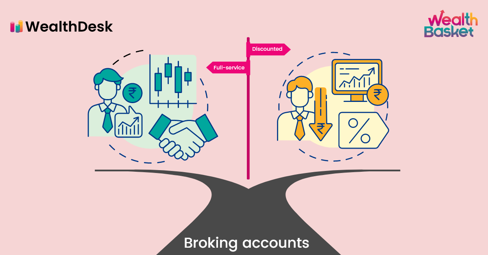

## Table of Contents

## What is a full-service broker?

A full-service broker is a type of financial professional who helps people buy and sell investments like stocks and bonds. They offer a wide range of services, including giving advice on which investments to choose, managing your investment portfolio, and providing research and reports to help you make decisions. Full-service brokers are often more expensive than other types of brokers because they provide personalized service and expert guidance.

People usually choose full-service brokers when they want more help with their investments and don't mind paying extra for it. These brokers can be very helpful for people who are new to investing or who have a lot of money to invest and want to make sure it's managed well. They can also help with things like planning for retirement or saving for a big goal, making them a good choice for anyone looking for a more hands-on approach to their finances.

## How does a full-service broker differ from a discount broker?

A full-service broker and a discount broker are two different types of financial professionals that help people buy and sell investments. The main difference between them is the level of service they provide. A full-service broker offers a lot of help and guidance. They give advice on what to invest in, manage your investment portfolio, and provide research and reports to help you make decisions. Because they offer so much help, full-service brokers usually charge higher fees.

On the other hand, a discount broker offers fewer services and charges lower fees. They mainly help you buy and sell investments, but they don't give much advice or manage your portfolio for you. Discount brokers are good for people who know a lot about investing and want to make their own decisions without paying a lot of money for help. If you're new to investing or want more guidance, a full-service broker might be a better choice, even though it costs more.

## What services does a full-service broker typically offer?

A full-service broker offers a lot of help to people who want to invest their money. They give advice on what stocks, bonds, or other investments you should buy. They also help you plan how to reach your financial goals, like saving for retirement or buying a house. If you're new to investing or don't have a lot of time to manage your money, a full-service broker can be really useful because they do a lot of the work for you.

They also manage your investment portfolio, which means they keep track of how your investments are doing and make changes if needed. Full-service brokers provide research and reports to help you understand the market better. They might even help you with your taxes by giving you advice on how to save money. Because they offer so much help, full-service brokers charge higher fees than other types of brokers, but many people think it's worth it for the personalized service and expert guidance.

## Who typically uses the services of a full-service broker?

People who use full-service brokers are often those who want a lot of help with their investments. They might be new to investing and not sure where to start, or they might have a lot of money to invest and want to make sure it's managed well. These people are willing to pay more for the personalized service and expert advice that full-service brokers provide.

Full-service brokers are also popular with people who don't have the time to manage their own investments. They might be busy with work or family and need someone to take care of their money for them. These brokers can help with big financial goals, like planning for retirement or saving for a child's education, making them a good choice for anyone looking for a hands-on approach to their finances.

## What are the advantages of using a full-service broker?

One big advantage of using a full-service broker is that you get a lot of help with your investments. They give you advice on what to buy and sell, and they manage your money for you. This is great if you're new to investing or if you don't have time to keep track of your investments yourself. They also provide research and reports that help you understand the market better, so you can make smarter choices about where to put your money.

Another advantage is that full-service brokers can help you plan for big financial goals, like saving for retirement or buying a house. They know a lot about different investments and can help you create a plan that fits your needs. Even though they charge more than other types of brokers, many people think it's worth it because they get personalized service and expert guidance. This makes full-service brokers a good choice for anyone who wants a hands-on approach to their finances.

## How do the fees of full-service brokers compare to other types of brokers?

Full-service brokers charge higher fees than other types of brokers because they offer a lot more help. They give you advice on what to invest in, manage your money for you, and provide research and reports. All this extra help means you have to pay more, but many people think it's worth it because they get personalized service and expert guidance.

Discount brokers, on the other hand, charge much lower fees because they don't offer as much help. They mainly help you buy and sell investments, but they don't give much advice or manage your portfolio for you. If you know a lot about investing and want to make your own decisions, a discount broker can save you money. But if you're new to investing or want more guidance, the higher fees of a full-service broker might be a better choice for you.

## Can you provide examples of well-known full-service brokerage firms?

Some well-known full-service brokerage firms are Merrill Lynch and Morgan Stanley. These companies have been around for a long time and have a lot of experience helping people with their investments. They offer a lot of help, like giving advice on what to buy and sell, managing your money for you, and providing research and reports to help you make smart choices.

Another example is Goldman Sachs. They are also a big name in the world of finance and offer full-service brokerage. They help people plan for big financial goals, like saving for retirement or buying a house. Because they offer so much help, these full-service brokers charge higher fees, but many people think it's worth it for the personalized service and expert guidance they get.

## What kind of investment advice can you expect from a full-service broker?

When you work with a full-service broker, you can expect to get a lot of advice on your investments. They will help you figure out what stocks, bonds, or other investments you should buy. They'll look at your financial goals and how much risk you're okay with taking. If you want to save for retirement or buy a house, they can tell you which investments might help you reach those goals. They'll also keep an eye on how your investments are doing and suggest changes if something isn't working out.

Full-service brokers also give you research and reports to help you understand the market better. They might tell you about new trends or companies that are doing well. This can help you make smarter choices about where to put your money. Even though they charge more than other types of brokers, many people think it's worth it because they get personalized advice and someone to manage their money for them.

## How does a full-service broker help with estate planning and wealth management?

A full-service broker can help a lot with estate planning and wealth management. They can give you advice on how to pass on your money and assets to your family or others after you're gone. They'll help you set up things like wills and trusts, which are important for making sure your wishes are followed. They can also help you figure out the best way to give money to charity or to your kids without paying too much in taxes.

For wealth management, a full-service broker will look at all your money and investments and come up with a plan to help you reach your financial goals. They'll help you decide where to put your money to make it grow over time. They can also help you plan for big things like retirement or buying a house. Because they know a lot about different investments, they can give you personalized advice that fits your needs. Even though they charge more, many people think it's worth it for the expert help and peace of mind they get.

## What are the potential disadvantages of using a full-service broker?

One potential disadvantage of using a full-service broker is the higher fees they charge. Because they offer a lot of help and personalized service, full-service brokers cost more than other types of brokers. If you're trying to save money, these higher fees might make you think twice about using a full-service broker. Even if you get a lot of help, the extra cost can add up over time and affect how much money you make from your investments.

Another disadvantage is that you might not have as much control over your investments. Full-service brokers manage your money for you, which can be good if you're new to investing or don't have time. But if you like making your own decisions and want to be more hands-on with your investments, a full-service broker might not be the best choice. You might feel like you're not as involved in the process as you'd like to be.

## How has technology impacted the role of full-service brokers?

Technology has changed the way full-service brokers do their jobs. Now, they can use computers and the internet to give their clients better and faster service. They can send research and reports to their clients quickly, and they can keep track of how investments are doing in real time. This means they can give better advice and make smarter choices about where to put your money. They can also use special software to help plan your financial goals, like saving for retirement or buying a house.

But technology has also made it easier for people to invest on their own. There are now a lot of apps and websites that let you buy and sell stocks without needing a full-service broker. This has made some people think they don't need to pay for a full-service broker's help. Even though full-service brokers still offer a lot of personalized service and expert advice, they have to work harder to show people why it's worth paying more for their help.

## What should someone consider when deciding whether to use a full-service broker?

When deciding whether to use a full-service broker, you should think about how much help you need with your investments. If you're new to investing or don't have time to manage your money, a full-service broker can be really helpful. They give you advice on what to buy and sell, manage your investments for you, and help you plan for big financial goals like saving for retirement. But, they charge more than other types of brokers because they offer so much help. So, you need to decide if the extra cost is worth it for the personalized service and expert guidance you get.

Another thing to consider is how much control you want over your investments. Full-service brokers do a lot of the work for you, which can be good if you want someone else to handle your money. But if you like making your own decisions and want to be more hands-on with your investments, a full-service broker might not be the best choice. Also, think about how technology has changed things. Now, there are a lot of apps and websites that let you invest on your own, so you might not need a full-service broker if you're comfortable using technology to manage your money.

## References & Further Reading

[1]: ["Advances in Financial Machine Learning"](https://www.amazon.com/Advances-Financial-Machine-Learning-Marcos/dp/1119482089) by Marcos Lopez de Prado.

[2]: ["Quantitative Trading: How to Build Your Own Algorithmic Trading Business"](https://books.google.com/books/about/Quantitative_Trading.html?id=j70yEAAAQBAJ) by Ernest P. Chan.

[3]: ["Evidence-Based Technical Analysis: Applying the Scientific Method and Statistical Inference to Trading Signals"](https://www.amazon.com/Evidence-Based-Technical-Analysis-Scientific-Statistical/dp/0470008741) by David Aronson.

[4]: ["Machine Learning for Algorithmic Trading"](https://github.com/PacktPublishing/Machine-Learning-for-Algorithmic-Trading-Second-Edition) by Stefan Jansen.

[5]: Bergstra, J., Bardenet, R., Bengio, Y., & Kégl, B. (2011). ["Algorithms for Hyper-Parameter Optimization."](https://proceedings.neurips.cc/paper/2011/file/86e8f7ab32cfd12577bc2619bc635690-Paper.pdf) Advances in Neural Information Processing Systems 24.

[6]: Aldridge, I. (2013). ["High-Frequency Trading: A Practical Guide to Algorithmic Strategies and Trading Systems"](https://books.google.com/books/about/High_Frequency_Trading.html?id=8QpIsVUMhmEC). Wiley.