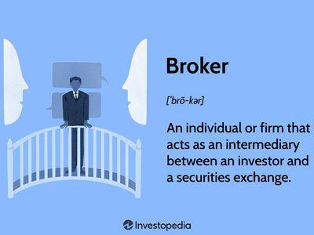

In the ever-evolving landscape of financial markets, choosing the right type of brokerage service can significantly impact your investment experience. Full-service brokers and algorithmic trading represent two ends of the spectrum in the modern financial services industry. Full-service brokers are characterized by their comprehensive offerings, such as personalized investment advice, retirement planning, and tax optimization strategies. These brokers establish direct relationships with their clients, tailoring financial strategies to individual goals and risk appetites.

On the other hand, algorithmic trading leverages computer algorithms to execute trades at high speeds and volumes, often minimizing human intervention. This method is predominantly used by institutional investors due to its efficiency in managing large scale trades while reducing transaction costs. Though it lacks personal interaction, it is favored for its precision and ability to handle complex market conditions using predefined criteria.

This article explores the nuances of both full-service brokers and algorithmic trading, providing insights into their respective advantages and limitations. By examining these facets, you can make a more informed decision on which approach better aligns with your financial goals and investment strategy. Whether you prefer the hands-on guidance of a broker or the technical efficiency of algorithms, understanding your options is key to optimizing your financial outcomes.

## Table of Contents

## Understanding Full-Service Brokers

A full-service broker offers a comprehensive suite of financial services designed to assist clients with various aspects of their financial management. These services encompass more than just the execution of trades. They include investment advice, retirement planning, tax guidance, and estate planning. Such brokers aim to build long-term relationships with their clients, providing a personalized experience tailored to the individual financial goals and needs of each investor.

Clients working with full-service brokers typically enjoy the benefit of having a dedicated professional who takes an active role in managing their portfolios. This involves continual monitoring of the client's investment performance and making necessary adjustments to align with changes in market conditions or client objectives. The broker acts as a financial advisor, providing recommendations based on thorough research and analysis.

The broker-client relationship can be highly beneficial for those who prefer having hands-on guidance from a knowledgeable expert. This personal interaction not only aids in decision-making but also offers a level of reassurance and confidence, particularly for those navigating complex financial landscapes. Full-service brokers have access to a wide array of resources, including research reports, market analysis, and exclusive investment opportunities that may not be available to individual investors.

However, these extensive services come at a cost. Full-service brokers charge higher fees compared to discount or online brokers. They may charge a percentage of assets under management, commissions on trades, or even a combination of both. Despite the cost, many investors find value in the comprehensive support and strategic insight offered by full-service brokers, especially when dealing with intricate financial portfolios or requiring sophisticated investment strategies.

In summary, full-service brokers cater to clients who value personalized attention and are willing to invest in a higher cost structure for the benefit of customized service offerings. This model is particularly advantageous for individuals with substantial or complex financial needs, who are seeking a partner to help navigate the intricacies of investment management while maximizing potential returns.

## Pros and Cons of Full-Service Brokers

Full-service brokers offer several advantages that appeal to certain investors. These brokers provide personalized investment advice tailored to individual financial goals and risk tolerances. This personalized service can be invaluable for investors who prefer human interaction and bespoke solutions. Additionally, full-service brokers often have access to exclusive investment opportunities, such as initial public offerings (IPOs) and sophisticated investment products not widely available to retail investors.

The comprehensive range of services offered by full-service brokers extends beyond mere trading execution. These brokers assist in retirement planning, tax advice, estate planning, and other complex financial needs, creating a holistic financial management experience. This can be particularly beneficial for investors seeking a one-stop-shop for their financial affairs.

However, these benefits come at a cost. Full-service brokers typically charge higher fees than their discount or online counterparts. These fees can take the form of commissions on trades, account maintenance fees, or a percentage of assets under management (AUM). For investors with smaller portfolios, these fees can significantly erode investment returns over time.

A potential downside of full-service brokers is the possibility of conflicts of interest. Brokers working on commission might be tempted to recommend products or strategies that generate higher fees, rather than those best suited to the client’s needs. This conflict can sometimes lead to 'churning,' where excessive trading is conducted to boost commissions, potentially harming the client's financial interests.

In summary, choosing between full-service brokers and other types of brokerage services requires a careful assessment of one's financial goals, investment style, and tolerance for fees. A balance between comprehensive service and cost-effectiveness can ultimately guide investors in making the right choice for their unique circumstances.

## An Overview of Algorithmic Trading

Algorithmic trading is a method of executing orders using automated and pre-programmed trading instructions, accounting for variables such as time, price, and [volume](/wiki/volume-trading-strategy). This technology-driven approach allows traders to execute trades at exceptional speeds and frequencies far beyond the capabilities of human traders. The primary aim of [algorithmic trading](/wiki/algorithmic-trading) is to profit from even small price discrepancies across large volumes, leveraging the precision and speed of contemporary computing.

Institutional investors, such as hedge funds and investment banks, are frequent users of algorithmic trading. They employ these algorithms to efficiently manage and process substantial trading volumes. By minimizing the market impact, algorithmic trading provides an efficient mechanism for executing large orders without significantly affecting the stock price. This process is notably beneficial in high-frequency trading ([HFT](/wiki/high-frequency-trading-strategies)), where the speed of execution can mean the difference between profit and loss.

There are several key strategies within algorithmic trading, including statistical [arbitrage](/wiki/arbitrage), [trend following](/wiki/trend-following), and [market making](/wiki/market-making). Statistical arbitrage, for example, involves complex mathematical models to identify and exploit relative mispricings between financial instruments. 

While algorithmic trading offers the advantages of cost savings and execution precision, it inherently lacks the personalized guidance that full-service brokers provide. Computers operate based on logic and quantitative strategies, which, while effective, cannot replace the nuanced advice generated from years of human experience and client interaction. Despite this, the cost-effectiveness and high-speed execution advantages of algorithmic trading continue to make it an attractive option for many investors. 

Overall, algorithmic trading represents a sophisticated toolset for modern investors seeking efficiency and scale in their trading activities. It significantly reshapes how financial markets operate, providing new opportunities and challenges in equal measure.

## Pros and Cons of Algorithmic Trading

Algorithmic trading leverages computer algorithms to execute trading strategies with minimal human intervention, offering numerous advantages for both institutional and retail investors. One of the primary benefits of algorithmic trading is the potential for reduced transaction costs. By automating the trading process, the need for manual intervention is decreased, thus mitigating costs associated with human errors and delays. The algorithms can analyze vast amounts of market data at high speeds, allowing traders to execute trades at the most opportune moments, often resulting in better pricing and execution than traditional methods.

Another significant advantage is the capacity to handle large trading volumes efficiently. Algorithms can execute complex strategies across multiple markets simultaneously, making them particularly appealing for institutional investors who deal with substantial volumes. This scalability ensures that large orders do not adversely impact the market, as the algorithms can fragment these orders into smaller, more manageable units to avoid detection and reduce market impact.

Moreover, algorithmic trading minimizes human error, which can often result from emotional decision-making or fatigue. By adhering strictly to pre-determined algorithms, trades are executed based on logic and data rather than intuition and emotion. This objectivity can lead to more consistent and reliable trading outcomes.

However, algorithmic trading is not without its challenges and drawbacks. A critical disadvantage is the requirement for a high level of technical expertise. Developing, maintaining, and optimizing algorithms require comprehensive knowledge of both trading strategies and programming, representing a significant barrier for less tech-savvy investors. Consequently, those interested in algorithmic trading must invest time and resources in acquiring relevant skills or seek professional assistance.

Additionally, algorithmic trading lacks the personalized advice provided by human brokers. While algorithms can offer efficiency and speed, they do not consider the nuances of an investor’s personal financial situation and long-term goals. This absence of personalized guidance may lead to strategies that do not fully align with an investor's objectives or risk tolerance.

Lastly, the reliance on technology introduces potential risks such as system glitches, connectivity issues, or unexpected market anomalies. These technological vulnerabilities can result in substantial financial losses if not properly managed. Continuous monitoring and robust risk management protocols are essential to mitigate such risks.

Investors should carefully assess their financial objectives, technological competency, and risk tolerance to determine whether the advantages of speed and efficiency offered by algorithmic trading align with their strategy. Evaluating these factors is crucial in making informed decisions about their investment approach.

## Choosing Between Full-Service Brokers and Algorithmic Trading

Selecting between full-service brokers and algorithmic trading is a decision deeply rooted in individual financial goals, investment size, and technological comfort. To make an informed choice, investors should consider several factors that distinguish these two approaches to trading and investment management.

Full-service brokers cater to individuals who value personalized service and expert guidance. These professionals offer tailored advice that encompasses investment strategies, retirement planning, and tax-related decisions. This approach is particularly beneficial for those with complex financial needs, such as high-net-worth individuals or those requiring specialized financial planning. The personal relationship with a broker can provide reassurance and a sense of trust, especially for investors who prefer a hands-on approach and are willing to pay higher fees for the breadth of services provided.

On the other hand, algorithmic trading suits investors who are comfortable with technology and prioritize cost-efficiency and speed over customization. By leveraging sophisticated computer algorithms, this method facilitates high-frequency trading and effective management of large trading volumes. Its appeal lies in the lower transaction costs and precision in execution, which is ideal for tech-savvy investors or institutional players who operate on tight margins and require fast-paced trading environments.

The decision largely depends on the investor's comfort with technology and the complexity of their financial goals. If an investor seeks comprehensive advice and values a personalized approach, a full-service broker may be the right choice. Conversely, if an investor leans toward efficiency, lower costs, and is comfortable navigating technology-driven platforms, algorithmic trading may be more suitable. Investors should carefully assess their priorities and select the approach that aligns best with their financial objectives and personal preferences.

## Conclusion

Investors must align their choice of brokerage or trading strategy with their financial objectives and personal preferences. This alignment ensures that their selected approach adequately addresses their specific needs and expectations, contributing to more effective and satisfying investment experiences. Full-service brokers and algorithmic trading each present their own set of distinct advantages and drawbacks. Full-service brokers offer personal relationships and individualized financial advice, which can be invaluable for investors seeking comprehensive support and expertise in managing their portfolios. However, they come at a higher cost and may sometimes involve conflicts of interest.

In contrast, algorithmic trading provides efficiency, cost savings, and precision, appealing particularly to tech-savvy investors comfortable with automated processes. Yet, this approach may lack the personal guidance and advice that some investors value.

Ultimately, finding the right balance between service, cost, and personal involvement is crucial for successful investing. Investors should assess the comparative benefits of each option based on their financial goals, investment scale, and familiarity with technology. A considered evaluation can help them choose a strategy that not only aligns with their objectives but also supports their long-term financial success, whether through personalized attention or streamlined execution.

## FAQs

### FAQs

**What are the typical fees associated with full-service brokers?**

Full-service brokers generally charge higher fees than discount brokers or algorithmic platforms due to the breadth of services they offer. These fees may include a percentage of assets under management (AUM), which typically ranges from 1% to 2% annually. Additionally, clients might incur trading commissions, administrative fees, and charges for additional services such as financial planning or retirement advice. The exact fee structure can vary significantly between brokerage firms, so it's essential for investors to inquire about all possible charges beforehand.

**How does one get started with algorithmic trading?**

To start with algorithmic trading, an individual should have a foundational understanding of trading principles and proficiency in programming languages like Python. Here is a step-by-step guide:

1. **Learn the Basics**: Study the core concepts of financial markets, trading strategies, and algorithmic principles.

2. **Develop Programming Skills**: Gain proficiency in Python or another language commonly used in algorithmic trading. Python libraries such as Pandas for data manipulation and Backtrader for strategy backtesting are particularly useful.

3. **Select a Trading Platform**: Choose a platform that supports algorithmic trading, such as MetaTrader, Interactive Brokers, or QuantConnect.

4. **Create a Strategy**: Develop a trading strategy based on quantitative data and backtest it using historical market data to assess its effectiveness.

5. **Simulate and Test**: Use a simulated trading environment to test your strategy in real-time market conditions without financial risk.

6. **Monitor and Optimize**: Continuously monitor the performance of your algorithm and make adjustments to optimize its efficiency and effectiveness.

**Are there hybrid approaches that combine personalized advice with algorithmic tools?**

Yes, hybrid approaches that integrate personalized financial advice with algorithmic tools are increasingly popular. These services combine the benefits of human advisors with advanced algorithms to enhance investment strategies. For example, robo-advisors like Betterment and Wealthfront offer automated portfolio management while still providing access to financial planners for more personalized guidance. This approach allows investors to benefit from low-cost, efficient trading and investment management while having the option to seek personalized advice for particular financial goals or when market conditions change.

## References & Further Reading

[1]: ["Advances in Financial Machine Learning"](https://www.amazon.com/Advances-Financial-Machine-Learning-Marcos/dp/1119482089) by Marcos Lopez de Prado.

[2]: ["Quantitative Trading: How to Build Your Own Algorithmic Trading Business"](https://books.google.com/books/about/Quantitative_Trading.html?id=j70yEAAAQBAJ) by Ernest P. Chan.

[3]: ["Evidence-Based Technical Analysis: Applying the Scientific Method and Statistical Inference to Trading Signals"](https://www.amazon.com/Evidence-Based-Technical-Analysis-Scientific-Statistical/dp/0470008741) by David Aronson.

[4]: ["Machine Learning for Algorithmic Trading"](https://github.com/PacktPublishing/Machine-Learning-for-Algorithmic-Trading-Second-Edition) by Stefan Jansen.

[5]: Bergstra, J., Bardenet, R., Bengio, Y., & Kégl, B. (2011). ["Algorithms for Hyper-Parameter Optimization."](https://proceedings.neurips.cc/paper/2011/file/86e8f7ab32cfd12577bc2619bc635690-Paper.pdf) Advances in Neural Information Processing Systems 24.

[6]: Aldridge, I. (2013). ["High-Frequency Trading: A Practical Guide to Algorithmic Strategies and Trading Systems"](https://books.google.com/books/about/High_Frequency_Trading.html?id=8QpIsVUMhmEC). Wiley.