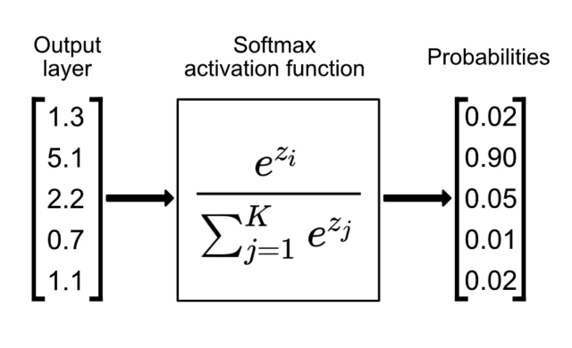

## Table of Contents

## What is Full Softmax in machine learning?

Full Softmax is a function used in machine learning, especially in classification problems. It turns a set of numbers into probabilities that add up to 1. Imagine you have a bunch of scores for different classes. Full Softmax takes these scores and makes them into a nicer format where you can see how likely each class is. The formula for Full Softmax is $$ \text{Softmax}(x_i) = \frac{e^{x_i}}{\sum_{j=1}^K e^{x_j}} $$, where $x_i$ is a score for class $i$, and $K$ is the total number of classes.

When you use Full Softmax, you get a clear picture of which class is most likely. For example, if you're trying to guess what animal is in a picture, Full Softmax can tell you the probabilities for it being a dog, cat, or bird. This is very useful in training models because it helps the model learn from its mistakes and improve over time. By comparing the predicted probabilities to the actual class, the model can adjust its weights to make better guesses in the future.

## How does Full Softmax differ from other softmax techniques?

Full Softmax is the standard way of turning raw scores into probabilities. It looks at all the scores at once and makes sure the final probabilities add up to 1. This is different from other softmax techniques that might only look at some of the scores or use different methods to calculate the probabilities. For example, Full Softmax uses the formula $$ \text{Softmax}(x_i) = \frac{e^{x_i}}{\sum_{j=1}^K e^{x_j}} $$ to calculate the probability for each class $i$ out of $K$ total classes.

One common alternative to Full Softmax is Sparsemax, which can set some probabilities to zero, making the output more focused. Sparsemax can be useful when you want to ignore less likely options completely. Another technique is the Hierarchical Softmax, which breaks down the classification into steps, making it faster for problems with many classes. Each of these methods has its own use, but Full Softmax is the most straightforward and widely used because it gives a complete probability distribution over all classes.

## What is the mathematical formula for Full Softmax?

Full Softmax is a way to turn a bunch of numbers into probabilities that add up to 1. It's used a lot in [machine learning](/wiki/machine-learning), especially when you want to figure out which class something belongs to. The formula for Full Softmax is $$ \text{Softmax}(x_i) = \frac{e^{x_i}}{\sum_{j=1}^K e^{x_j}} $$. Here, $x_i$ is the score for class $i$, and $K$ is the total number of classes. The formula takes each score, puts it through the exponential function, and then divides it by the sum of all the exponentials. This makes sure all the probabilities add up to 1.

Let's say you have scores for three classes: a dog, a cat, and a bird. If the scores are 2, 1, and 0, Full Softmax would turn these into probabilities. You would calculate $e^2$, $e^1$, and $e^0$, which are about 7.39, 2.72, and 1. Then, you'd add these up to get about 11.11. The probability for the dog would be $\frac{7.39}{11.11} \approx 0.67$, for the cat $\frac{2.72}{11.11} \approx 0.24$, and for the bird $\frac{1}{11.11} \approx 0.09$. These probabilities add up to 1, showing how likely each class is.

## Can you explain the concept of normalization in Full Softmax?

Normalization in Full Softmax is a way to make sure all the probabilities add up to 1. When you have scores for different classes, like guessing if a picture shows a dog, cat, or bird, Full Softmax takes these scores and turns them into nice, neat probabilities. It does this by using the exponential function to make all the scores positive and then dividing each score by the total of all the exponentials. This way, no matter what the original scores were, the final probabilities will always add up to 1.

The formula for Full Softmax is $$ \text{Softmax}(x_i) = \frac{e^{x_i}}{\sum_{j=1}^K e^{x_j}} $$. Here, $x_i$ is the score for class $i$, and $K$ is the total number of classes. The exponential function $e^{x_i}$ makes sure all the scores are positive, and the denominator, which is the sum of all the exponentials $\sum_{j=1}^K e^{x_j}$, normalizes the scores so they add up to 1. This normalization step is what makes Full Softmax so useful in machine learning, because it gives a clear picture of how likely each class is.

## What are the typical applications of Full Softmax in machine learning?

Full Softmax is a common tool in machine learning, especially when you want to guess which class something belongs to. It turns raw scores into probabilities that add up to 1, making it easy to see which class is most likely. For example, if you're trying to figure out what animal is in a picture, Full Softmax can tell you the chances it's a dog, cat, or bird. This is super helpful in training models because it helps the model learn from its mistakes and get better over time. By comparing the predicted probabilities to the actual class, the model can adjust its weights to make better guesses in the future.

Another big use of Full Softmax is in neural networks, where it's often used in the last layer to turn the network's output into probabilities. This is important for things like image recognition, where you want to know the probability that an image shows a certain object. Full Softmax makes it easier to understand the network's output and use it for making decisions. The formula for Full Softmax is $$ \text{Softmax}(x_i) = \frac{e^{x_i}}{\sum_{j=1}^K e^{x_j}} $$, where $x_i$ is the score for class $i$, and $K$ is the total number of classes. This simple yet powerful formula is why Full Softmax is so widely used in machine learning.

## How does Full Softmax handle multi-class classification problems?

Full Softmax is a great tool for multi-class classification problems because it turns raw scores into probabilities that add up to 1. Imagine you have a bunch of scores for different classes, like trying to guess what animal is in a picture. Full Softmax takes these scores and makes them into a nice format where you can see how likely each class is. The formula for Full Softmax is $$ \text{Softmax}(x_i) = \frac{e^{x_i}}{\sum_{j=1}^K e^{x_j}} $$, where $x_i$ is a score for class $i$, and $K$ is the total number of classes. This way, if you have scores for a dog, cat, and bird, Full Softmax can tell you the chances it's each one, making it easier to pick the most likely class.

In machine learning, Full Softmax is often used in the last layer of neural networks for multi-class classification. When the network gives you scores for each class, Full Softmax turns these scores into probabilities. This helps the model learn better because it can compare the predicted probabilities to the actual class and adjust its weights to make better guesses in the future. For example, if the model thinks there's a 70% chance it's a dog, a 20% chance it's a cat, and a 10% chance it's a bird, but it's actually a cat, the model can see it made a mistake and learn from it. This makes Full Softmax a key part of many machine learning models that need to classify things into multiple categories.

## What are the computational challenges associated with Full Softmax?

Full Softmax can be a bit tricky to use because it needs to look at all the scores at once to figure out the probabilities. This means if you have a lot of classes, like trying to guess what kind of flower is in a picture out of thousands of types, it can take a lot of time and computer power. The formula for Full Softmax is $$ \text{Softmax}(x_i) = \frac{e^{x_i}}{\sum_{j=1}^K e^{x_j}} $$, and you have to do this for every class $i$ out of $K$ total classes. The more classes you have, the more calculations you need to do, which can slow things down.

Another challenge is that Full Softmax can run into problems with very big or very small numbers. When you use the exponential function $e^{x_i}$, if the scores are really big or really small, the computer might have trouble keeping track of them accurately. This can lead to mistakes in the calculations, making the probabilities less reliable. To deal with this, people sometimes use tricks like subtracting the biggest score from all the scores before doing the exponential part, which helps keep the numbers manageable.

## How can Full Softmax be implemented in popular machine learning frameworks like TensorFlow or PyTorch?

In TensorFlow, Full Softmax can be easily implemented using the `tf.nn.softmax` function. This function takes a tensor of scores and turns them into probabilities that add up to 1. For example, if you have a tensor of scores for different classes, you can use `tf.nn.softmax` to get the probabilities for each class. The formula for Full Softmax is $$ \text{Softmax}(x_i) = \frac{e^{x_i}}{\sum_{j=1}^K e^{x_j}} $$, where $x_i$ is the score for class $i$, and $K$ is the total number of classes. Here's a simple example of how to use it in TensorFlow:

```python
import tensorflow as tf

# Assume 'scores' is a tensor of shape [batch_size, num_classes]
scores = tf.random.normal([32, 10])  # Example tensor with 32 samples and 10 classes
probabilities = tf.nn.softmax(scores)
```

In PyTorch, Full Softmax can be implemented using the `torch.nn.functional.softmax` function. Similar to TensorFlow, this function takes a tensor of scores and converts them into probabilities. You just need to specify the dimension along which the softmax should be applied. The formula for Full Softmax remains the same: $$ \text{Softmax}(x_i) = \frac{e^{x_i}}{\sum_{j=1}^K e^{x_j}} $$. Here's how you can use it in PyTorch:

```python
import torch
import torch.nn.functional as F

# Assume 'scores' is a tensor of shape [batch_size, num_classes]
scores = torch.randn(32, 10)  # Example tensor with 32 samples and 10 classes
probabilities = F.softmax(scores, dim=1)  # Apply softmax along the second dimension (num_classes)
```

## What are the advantages of using Full Softmax over other softmax variants?

Full Softmax is great because it looks at all the scores at once and turns them into probabilities that add up to 1. This is really helpful in machine learning, especially when you want to guess which class something belongs to. For example, if you're trying to figure out what animal is in a picture, Full Softmax can tell you the chances it's a dog, cat, or bird. The formula for Full Softmax is $$ \text{Softmax}(x_i) = \frac{e^{x_i}}{\sum_{j=1}^K e^{x_j}} $$, where $x_i$ is the score for class $i$, and $K$ is the total number of classes. This simple formula makes it easy to understand and use in many different kinds of problems.

Compared to other softmax variants, Full Softmax gives you a complete picture of all the possibilities. Other methods like Sparsemax might set some probabilities to zero, which can be useful but also means you might miss out on some information. Hierarchical Softmax breaks down the problem into steps, which can be faster for problems with many classes, but it's more complicated to set up. Full Softmax is straightforward and widely used because it gives a clear and complete probability distribution over all classes, making it easier to train models and make decisions based on the probabilities.

## Can Full Softmax be used effectively in deep learning models, and if so, how?

Full Softmax is a great tool for [deep learning](/wiki/deep-learning) models, especially when you want to guess which class something belongs to. In deep learning, it's often used in the last layer of a [neural network](/wiki/neural-network) to turn the network's output into probabilities. For example, if you're trying to figure out what animal is in a picture, Full Softmax can tell you the chances it's a dog, cat, or bird. The formula for Full Softmax is $$ \text{Softmax}(x_i) = \frac{e^{x_i}}{\sum_{j=1}^K e^{x_j}} $$, where $x_i$ is the score for class $i$, and $K$ is the total number of classes. This makes it easy for the model to learn from its mistakes and get better over time by comparing the predicted probabilities to the actual class.

In practice, using Full Softmax in deep learning models is straightforward. For instance, in TensorFlow, you can use `tf.nn.softmax` to apply Full Softmax to the output of your model. Here's a simple example:

```python
import tensorflow as tf

# Assume 'scores' is a tensor of shape [batch_size, num_classes]
scores = tf.random.normal([32, 10])  # Example tensor with 32 samples and 10 classes
probabilities = tf.nn.softmax(scores)
```

Similarly, in PyTorch, you can use `torch.nn.functional.softmax` to achieve the same result. This helps the model make better guesses in the future by adjusting its weights based on the difference between the predicted probabilities and the true class labels.

## How does the choice of loss function affect the performance of Full Softmax?

The choice of loss function can really change how well Full Softmax works in a machine learning model. Full Softmax turns scores into probabilities that add up to 1, which is great for figuring out which class something belongs to. The formula for Full Softmax is $$ \text{Softmax}(x_i) = \frac{e^{x_i}}{\sum_{j=1}^K e^{x_j}} $$, where $x_i$ is the score for class $i$, and $K$ is the total number of classes. When you use a loss function like cross-entropy, it helps the model learn by comparing the predicted probabilities to the actual class. Cross-entropy is good because it punishes the model more for being very wrong, which can make the model learn faster and get better results.

But, not all loss functions work the same way with Full Softmax. For example, if you use a loss function that doesn't care about how sure the model is, like mean squared error, it might not help the model learn as well with Full Softmax. Mean squared error looks at the difference between the predicted probabilities and the actual class, but it doesn't push the model to be more confident in its guesses like cross-entropy does. So, choosing the right loss function is important to make sure Full Softmax helps the model learn and perform its best.

## What are some advanced optimization techniques that can be applied to improve Full Softmax performance?

One way to make Full Softmax work better is by using a technique called "numerical stability." Full Softmax can run into problems with very big or very small numbers because it uses the exponential function $e^{x_i}$. To fix this, you can subtract the biggest score from all the scores before doing the exponential part. This keeps the numbers manageable and helps the computer do the calculations more accurately. The formula for this trick is $$ \text{Softmax}(x_i) = \frac{e^{x_i - \text{max}(x)}}{\sum_{j=1}^K e^{x_j - \text{max}(x)}} $$, where $\text{max}(x)$ is the biggest score in the set. This small change can make a big difference in how well Full Softmax works.

Another advanced technique is to use "adaptive learning rates" in the training process. When you train a model with Full Softmax, you can use methods like Adam or RMSprop to change the learning rate as the model learns. These methods help the model learn faster and more smoothly by adjusting how big the steps are that the model takes to improve. This can lead to better performance because the model can find the best weights more efficiently. By combining these techniques, you can make Full Softmax even more effective in your machine learning models.