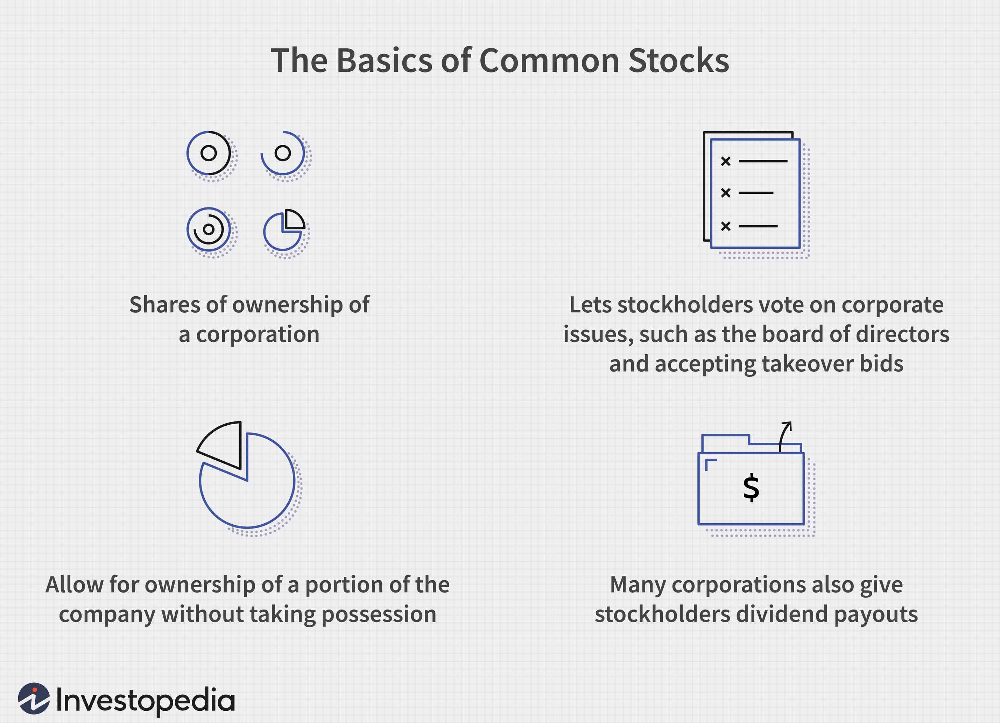

In today's rapidly evolving financial landscape, inventory management and algorithmic trading have become crucial components for business success. As businesses strive to increase efficiency and maintain competitiveness, these two areas have gained prominence due to their ability to leverage data-driven approaches for managing resources and making informed decisions.

Inventory management focuses on the coordination and control of ordering, storing, and utilizing a company's inventory, ensuring adequate supply while minimizing costs and waste. With the advancement of technology, inventory management has increasingly moved towards automation through sophisticated algorithms. These algorithms provide the means to optimize inventory levels, streamline operations, and reduce human errors, thus enhancing overall operational efficiency.



On the other hand, algorithmic trading involves using automated systems to make trading decisions based on pre-determined criteria and mathematical models. This method has surged in popularity within the financial industry due to its effectiveness in executing trades with precision and speed, while eliminating human emotion from the trading process. Algorithmic trading strategies are designed to exploit various market conditions and trends, thus optimizing trading performance and maximizing returns.

This article will explore the integration of inventory management algorithms with algorithmic trading strategies, demonstrating how these systems enhance operational outcomes and strategic decision-making. By examining full stock examples, we illustrate the practical applications and benefits of these technologies in streamlining business processes and achieving trading efficiency. As organizations continue to navigate an increasingly complex financial environment, the role of inventory management and algorithmic trading remains vital for sustaining success and fostering innovation.

## Table of Contents

## Understanding Inventory Management and Its Algorithms

Inventory management is a critical facet of operations for any business dealing with tangible products. It involves the efficient oversight of ordering, storing, and utilizing a company's inventory, which includes raw materials, components, and finished goods. The primary goal of inventory management is to ensure that a company maintains optimal stock levels to meet customer demand without incurring unnecessary costs or compromising cash flow.

In recent years, the integration of advanced technology has significantly transformed inventory management processes. The shift towards automated systems has facilitated more streamlined and accurate operations. Traditional manual practices are increasingly replaced by sophisticated algorithms that aid in decision-making, reduce human errors, and enhance overall efficiency.

Among the notable methodologies in inventory management are Just-In-Time (JIT), Economic Order Quantity (EOQ), and ABC Analysis:

1. **Just-In-Time (JIT)**: This inventory strategy aligns raw-material orders directly with production schedules. Companies that implement JIT can minimize inventory costs and improve cash flow, as products are received only when they are needed in the production process. This approach demands accurate forecasting and robust supplier relationships to prevent stockouts.

2. **Economic Order Quantity (EOQ)**: The EOQ model determines the optimal order quantity by balancing ordering costs with holding costs. The formula for EOQ is given by:
$$
   EOQ = \sqrt{\frac{{2DS}}{H}}

$$

   where $D$ is the demand rate, $S$ is the order cost per order, and $H$ is the holding cost per unit per year. EOQ ensures that companies make cost-effective inventory decisions, minimizing the total cost of inventory management.

3. **ABC Analysis**: ABC analysis classifies inventory items into three categories, A, B, and C, based on their significance to the business. Category A represents the most valuable items, while category C consists of the least valuable. This method helps businesses concentrate efforts on the most critical items, optimizing inventory management practices.

Modern inventory management systems utilize algorithms to automate several key tasks. These algorithms can forecast demand, calculate optimal stock levels, and even predict inventory depletions. Some of the commonly used algorithms in inventory management include:

- **Demand Forecasting Algorithms**: These algorithms analyze historical data and trends to predict future demand. Techniques such as time series analysis and machine learning models, like ARIMA or LSTM, are often used.

- **Reorder Point Calculation**: This involves the calculation of the inventory level at which a new order should be placed to avoid stockouts. The reorder point is calculated as:
$$
  Reorder\ Point = (Average\ Daily\ Usage \times Lead\ Time) + Safety\ Stock

$$

- **Inventory Optimization Algorithms**: By integrating advanced analytics and machine learning, these algorithms suggest optimal stock levels and replenish inventory accordingly. They take into account various factors, including demand variability, lead times, and cost constraints.

Incorporating these algorithms into inventory management systems not only streamlines operations but also supports more data-driven decisions, ultimately leading to improved efficiency and cost savings for businesses. As technology continues to evolve, the role of algorithms in inventory management is expected to become even more integral, driving innovation and operational excellence.

## Full Stock: Definition and Application

Full stock refers to a type of stock that has a par value of $100 per share, commonly associated with preferred shares. In the context of financial management and investment strategy, understanding full stock is crucial for both companies and investors. Preferred shares that embody full stock typically offer fixed dividends and possess a higher claim on assets compared to common stocks. This makes them appealing to investors seeking stability and a consistent income stream.

For companies, issuing full stock can serve as a strategic move to capitalize without diluting control, as preferred shareholders typically do not have voting rights. This can provide companies with a stable financial base while maintaining governance control.

Interest rates play a significant role in the valuation and attractiveness of full stock. For instance, if market interest rates rise, the fixed dividend yield of preferred shares becomes less attractive compared to newly issued bonds or alternative investments offering higher returns. This inverse relationship affects the market price of full stocks, as their capital appreciation potential may be limited compared to other investments. Consider the formula for calculating the intrinsic value of a preferred stock, which can be expressed as:

$$
P = \frac{D}{r}
$$

where:
- $P$ is the price of the preferred stock,
- $D$ is the fixed dividend,
- $r$ is the required rate of return.

If $r$ increases due to rising interest rates, $P$ decreases, indicating a drop in market price.

An example scenario can further illustrate this principle: Suppose a preferred share with a full stock value of $100 offers an annual dividend of $5. If the required rate of return is 5%, the intrinsic value of the stock remains at $100. However, if the [interest rate](/wiki/interest-rate-trading-strategies) rises, increasing the required rate of return to 6%, the intrinsic value decreases to approximately $83.33, reflecting the new balance between price and yield. 

This understanding of full stock and interest rates is fundamental for investors who must assess potential risks and returns, adjusting their portfolios accordingly. Companies also utilize inventory management data to predict how interest rate fluctuations could impact their stock valuations and devise strategies to mitigate financial risks.

## Algorithmic Trading: Basics and Benefits

Algorithmic trading, commonly referred to as algo-trading, employs pre-programmed instructions to analyze markets and execute trades. This method leverages computing power to act upon trading opportunities much faster than a human could, ensuring enhanced market efficiency. The rise of [algorithmic trading](/wiki/algorithmic-trading) is largely attributed to its capability to mitigate emotional biases in decision-making, thereby yielding more rational and consistent trading outcomes.

One key advantage of algorithmic trading is the reduction in transaction costs. By utilizing advanced algorithms, trades can be executed at optimal prices, which significantly lowers the costs associated with slippage and bid-ask spreads. This precision in trade execution also aids in minimizing market impact and adverse price movements.

Algo-trading strategies encompass a wide array of approaches, including trend-following, [arbitrage](/wiki/arbitrage), and index fund rebalancing. Trend-following strategies aim to capitalize on current market trends by predicting the continuation of price movements. Arbitrage strategies exploit price discrepancies between different markets or financial instruments. For instance, [statistical arbitrage](/wiki/statistical-arbitrage) or pairs trading involves a combination of short and long positions in closely related stocks. Index fund rebalancing algorithms ensure that investment portfolios maintain the desired allocation of assets, often aligning with benchmark indices.

In addition to cost-efficiency, algorithmic trading offers accurate order placement. Algorithms process vast amounts of data to determine optimum trade timings and quantities, which leads to more precise execution. Machine learning models, for example, can predict short-term price movements by analyzing historical data patterns, allowing for timely and strategic market entries and exits.

Algorithmic trading also promotes improved operational efficiency. By automating the trading process, algorithms handle multiple trades simultaneously, ensuring a rapid response to changing market conditions. This multi-tasking ability means that traders can pursue opportunities across different markets without sacrificing speed or accuracy.

In conclusion, algo-trading exemplifies the convergence of finance and technology, providing traders with a powerful tool to navigate modern financial markets. Its advantages, including lower transaction costs, precise order placement, and operational efficiency, underscore its growing prevalence in today's trading environments.

## Examples of Algorithmic Trading Strategies

Algorithmic trading strategies have become a cornerstone of modern financial markets, capitalizing on speed, precision, and the ability to analyze vast amounts of data instantaneously. Two widely used strategies are [momentum](/wiki/momentum) trading and [trend following](/wiki/trend-following).

Momentum trading is predicated on the notion that securities that have performed well in the past will continue to do so in the near future. The strategy relies on identifying the velocity of price movements, assuming that trends persist rather than reverse. For instance, let's consider a typical momentum trading scenario where a trader sets up an algorithm to buy stocks that have shown a 20% increase in the past month. The algorithm continuously scans the market, automatically executing trades when the specified criteria are met. Python libraries like NumPy and pandas, coupled with technical indicators such as the Relative Strength Index (RSI) or Moving Average Convergence Divergence (MACD), are often employed for developing momentum-based strategies.

```python
import numpy as np
import pandas as pd

# Example of a simple momentum strategy using Moving Average
def momentum_strategy(prices, short_window=20, long_window=50):
    signals = pd.DataFrame(index=prices.index)
    signals['price'] = prices
    signals['short_mavg'] = prices.rolling(window=short_window, min_periods=1).mean()
    signals['long_mavg'] = prices.rolling(window=long_window, min_periods=1).mean()
    signals['signal'] = 0.0

    # Create signals
    signals['signal'][short_window:] = np.where(
        signals['short_mavg'][short_window:] > signals['long_mavg'][short_window:], 1.0, 0.0
    )

    # Generate trading orders
    signals['positions'] = signals['signal'].diff()
    return signals
```

Trend following strategies, on the other hand, involve identifying the general direction of market prices and making trading decisions based on this trajectory. Unlike momentum trading, trend following is less concerned with the speed of price changes and more focused on the overall direction. A typical trend-following method could involve employing longer-term moving averages, using them as indicators to enter and [exit](/wiki/exit-strategy) positions. For example, a 200-day moving average might be calculated to determine a long-term trend, while a 50-day moving average is used for shorter-term signals.

Trend-following algorithms are particularly adept at executing high-frequency trades, ensuring continuous market engagement, and mitigating the emotional biases of human traders. These algorithms scrutinize historical price data to predict future movements, capitalizing on the persistence of trends over time.

Both momentum and trend-following strategies can be adapted to current market conditions, demonstrating flexibility and robustness. High-frequency trading ([HFT](/wiki/high-frequency-trading-strategies)) further exemplifies the use of algorithmic strategies to achieve superior execution speeds, employing complex mathematical models to seize fleeting market opportunities.

Real-world applications of these strategies are evident in the trading practices of hedge funds, proprietary trading firms, and institutional investors. By systematically analyzing price data, these entities utilize algorithms to optimize their trading performance, reduce transaction costs, and enhance returns. The integration of such strategies into trading operations exemplifies the profound impact of technology on financial markets, fostering efficiency and strategic precision.

## Integration of Inventory Management and Algorithmic Trading

The integration of inventory management and algorithmic trading represents a progressive stride for companies seeking to optimize their operations. The synergy lies in the mutual enhancement of decision-making processes through the seamless exchange of data between these systems.

One practical application is the utilization of inventory data to refine trading decisions. Inventory levels can provide insight into supply chain logistics that directly impact market prices. For instance, a company with an advanced inventory management system may automatically adjust its trading strategies based on real-time stock levels, influencing market behaviors and pricing strategies. Such an approach allows companies to react dynamically to changes in demand and supply, enhancing their trading outcomes.

Conversely, algorithmic trading can influence inventory management. Trading algorithms can predict market trends that inform inventory stocking levels, thus ensuring the optimal availability of products to meet consumer demand. By aligning inventory management with trading insights, companies can preemptively adjust their inventory to match expected market conditions, reducing holding costs and minimizing stockouts.

Real-world examples illustrate this integration. Companies like Amazon have leveraged their vast inventory data to enhance their trading strategies. By analyzing purchasing trends and inventory turnover, Amazon can forecast stock needs and adjust their buying decisions with precision, maintaining lean inventories while maximizing sales. Similarly, Walmart employs sophisticated inventory and trading algorithms to drive cost efficiencies and responsiveness to market demand.

Overall, the integration of inventory management and algorithmic trading offers a pathway to improved operational efficiency and increased return on investment (ROI). Companies that effectively blend these systems can maintain a competitive edge by enhancing their ability to adapt to market fluctuations, securing a robust foundation for sustainable growth.

## Conclusion

Technological advancements have significantly transformed inventory management and trading strategies, enhancing both efficiency and effectiveness. The integration of inventory management with algorithmic trading provides a holistic approach to optimizing business operations. By employing sophisticated algorithms, companies can manage their inventories more accurately while simultaneously executing trades with greater precision and speed. This integration not only improves resource utilization but also facilitates more informed decision-making processes.

Incorporating both inventory management and algorithmic trading allows businesses to adapt swiftly to market dynamics. For instance, real-time inventory data can inform trading algorithms, enabling companies to align their stock levels with anticipated demand and market fluctuations. This synergy leads to optimized supply chains and improved financial outcomes. Moreover, algorithmic trading devoid of human emotion can capitalize on market opportunities more swiftly, thus enhancing a company's competitive edge.

Staying abreast of cutting-edge technologies and applications in these areas is crucial for sustained success. Businesses that embrace these advancements tend to demonstrate enhanced resilience and adaptivity in an ever-competitive landscape. By integrating these strategies, companies not only improve their operational efficiency but also fortify their market positions, ensuring long-term growth and sustainability. As technology continues to evolve, so too should the strategies adopted by enterprises to remain competitive and responsive to market demands.

## References & Further Reading

[1]: ["Advances in Financial Machine Learning"](https://www.amazon.com/Advances-Financial-Machine-Learning-Marcos/dp/1119482089) by Marcos Lopez de Prado

[2]: Bergstra, J., Bardenet, R., Bengio, Y., & Kégl, B. (2011). ["Algorithms for Hyper-Parameter Optimization."](https://proceedings.neurips.cc/paper/2011/file/86e8f7ab32cfd12577bc2619bc635690-Paper.pdf) Advances in Neural Information Processing Systems 24.

[3]: ["Machine Learning for Algorithmic Trading"](https://github.com/stefan-jansen/machine-learning-for-trading) by Stefan Jansen

[4]: ["Quantitative Trading: How to Build Your Own Algorithmic Trading Business"](https://www.amazon.com/Quantitative-Trading-Build-Algorithmic-Business/dp/1119800064) by Ernest P. Chan

[5]: ["Evidence-Based Technical Analysis: Applying the Scientific Method and Statistical Inference to Trading Signals"](https://www.amazon.com/Evidence-Based-Technical-Analysis-Scientific-Statistical/dp/0470008741) by David Aronson

[6]: Silver, E. A., Pyke, D. F., & Thomas, D. J. (2016). ["Inventory and Production Management in Supply Chains."](https://www.taylorfrancis.com/books/mono/10.1201/9781315374406/inventory-production-management-supply-chains-edward-silver-david-pyke-douglas-thomas) CRC Press. 

[7]: Shapiro, J. F. (2007). ["Modeling the Supply Chain."](https://www.amazon.com/Modeling-Supply-Chain-Duxbury-Applied/dp/0495126098) Duxbury.