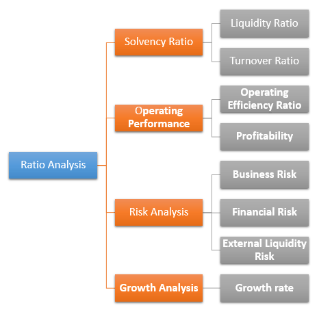

In the rapidly evolving world of finance, algorithmic trading—commonly known as algo trading—has become a critical tool for traders. This technological advancement involves the use of computer algorithms and programs to automate trading decisions based on predefined criteria, allowing for seamless and efficient market participation. The essence of algo trading lies in its ability to eliminate emotional bias, facilitate unparalleled speed, and ensure consistency in executing trades.

As markets grow increasingly complex, traders are leveraging algorithmic strategies to maximize their potential gains. This article will provide an in-depth examination of the mechanisms that drive the value of algo trading. We will explore how these algorithms utilize historical market data and statistical models to swiftly execute trades, potentially leading to rapid financial gains, especially in volatile market conditions.



Despite its advantages, algo trading is not without its challenges. Technical glitches, such as software bugs and system failures, can result in significant financial losses. Moreover, regulatory issues pose several constraints that traders must navigate carefully to remain compliant and avoid penalties. Understanding these limitations is crucial for traders aiming to fully capitalize on algorithmic strategies.

Our goal is to provide a comprehensive look at how traders can navigate these challenges while optimizing the full value of algorithmic strategies. This will involve examining the frameworks within which algo trading operates and addressing ethical concerns associated with this trading method. Whether you are an experienced trader or new to the field, this article is an essential read for anyone involved in the world of automated trading.

## Table of Contents

## Understanding the Mechanisms of Algo Trading

Algorithmic trading, commonly referred to as algo trading, revolutionizes financial markets by leveraging computer algorithms to automate trading decisions. These algorithms execute trades based on predefined criteria, offering traders a competitive edge by enabling transactions to occur at optimal prices. This process often involves the use of historic market data and sophisticated statistical models, which are designed to identify and act on favorable trading opportunities.

A fundamental aspect of algo trading is its popular strategies, which include Volume Weighted Average Price (VWAP), Time Weighted Average Price (TWAP), and Percentage of Volume (POV). Each of these strategies presents unique advantages:

1. **VWAP**: This strategy calculates the average price a security has traded at throughout the day, based on both volume and price. The goal is to execute orders in line with market volume, reducing the market impact of large trades.

2. **TWAP**: This time-averaging strategy focuses on executing orders evenly over a specified time period, minimizing the influence of time-based market fluctuations on trade prices.

3. **POV**: This strategy executes trades as a percentage of the total market volume, ensuring that large orders do not disrupt normal market activity.

These algorithmic strategies are designed to outperform human traders primarily by reducing decision-making times to mere milliseconds. This high-speed execution capability is pivotal in fast-moving markets where quick response times can be the difference between profit and loss.

Furthermore, algo trading's efficiency can precipitate rapid gains, particularly in volatile market environments. However, to harness these gains effectively, a thorough understanding of the underlying mechanisms is essential. This involves a keen awareness of how algorithmic trades influence critical market conditions, such as [liquidity](/wiki/liquidity-risk-premium) and price formation. Algorithmic trading can substantially alter market dynamics by increasing liquidity, splitting large orders into smaller, more manageable pieces, and supporting continuous price discovery processes.

The integration of algorithms in trading not only enhances speed and reduces human errors but also introduces intricacies in market interactions, urging traders to constantly refine algorithms to adapt to ongoing market evolutions. Understanding these mechanics is not merely advantageous but crucial for capitalizing on the full potential that [algorithmic trading](/wiki/algorithmic-trading) offers.

## Exploring the Full Value Potential

The concept of full value in trading represents a scenario where assets are exchanged at a price reflecting both their intrinsic worth and current market conditions. In algorithmic trading, achieving full value necessitates the fine-tuning of algorithms to identify and capitalize on market inefficiencies while concurrently managing threats such as system breakdowns and volatile market dynamics.

Algorithms in trading are engineered to respond swiftly to market conditions, allowing traders to optimize returns by precisely timing entry and [exit](/wiki/exit-strategy) points across diverse trading environments. By analyzing historical data, algorithmic trading facilitates [backtesting](/wiki/backtesting), which aids traders in perfecting their strategies before they are applied to live markets. This rigorous testing approach helps in understanding the potential performance of a trading strategy under various scenarios, thereby reducing risks associated with unforeseen market shifts.

Moreover, diversification is a critical component of achieving full value. By spreading investments across different asset classes and geographical regions, traders can mitigate risks associated with a single market downturn or geopolitical event. Diversification acts as a risk management tool by reducing the impact of [volatility](/wiki/volatility-trading-strategies) and ensuring a more balanced portfolio.

Python is frequently employed for developing and backtesting trading algorithms due to its extensive range of financial libraries and vast community support. Here is a simple example of a backtesting framework in Python using historical data:

```python
import pandas as pd
import numpy as np

# Load historical data
data = pd.read_csv('historical_data.csv')

# Define a simple moving average strategy
def moving_average_strategy(data, window=20):
    data['SMA'] = data['Close'].rolling(window=window).mean()
    data['signal'] = np.where(data['Close'] > data['SMA'], 1, 0)  # Buy signal
    return data

# Backtest the strategy
def backtest_strategy(data):
    data['returns'] = data['Close'].pct_change()
    data['strategy_returns'] = data['returns'] * data['signal'].shift(1)
    cumulative_returns = (1 + data['strategy_returns']).cumprod()
    return cumulative_returns

# Execute strategy
data = moving_average_strategy(data)
cumulative_returns = backtest_strategy(data)
print(cumulative_returns)
```

By incorporating such quantitative methods and ensuring robust risk management techniques, algorithmic trading endeavors to maximize its full value potential. However, this also involves the continuous monitoring and adjustment of algorithms to adapt to ever-evolving market conditions, reinforcing the need for a dynamic approach to trading strategy development.

## Limitations in Algorithmic Trading

Algorithmic trading, while advantageous in many respects, faces several limitations that traders must manage to achieve desired outcomes. One of the primary concerns in this field is the technical risks associated with the software and systems employed. Bugs and system failures can occur, potentially resulting in significant financial losses. Ensuring the reliability and stability of these systems is paramount to maintaining operational efficiency.

Latency issues present another challenge, particularly in the context of high-frequency trading ([HFT](/wiki/high-frequency-trading-strategies)). In such scenarios, the speed of trade execution is crucial, with delays as minor as milliseconds making a significant difference. Network latency, or the time taken for data to travel between the trading platform and the exchange, can impact the timing of trades and their accuracy. Similarly, the quality of data feeds can affect decision-making processes, with corrupted or delayed data leading to suboptimal trading outcomes.

Market factors, including volatility and sudden events like flash crashes, can also hinder the effectiveness of algorithmic strategies. Algorithms designed without accounting for such dynamics may struggle to respond appropriately to real-time market conditions, ultimately resulting in poor trading performance.

Over-optimization is a pitfall for many traders who rely heavily on historical data to calibrate their algorithms. While backtesting against past market conditions can refine strategies, it may also lead to rigidity. An over-optimized algorithm may perform exceptionally well under conditions identical to the historical data but fail when facing new or unexpected market events. This phenomenon arises due to fitting models too closely to past data without allowing for adaptability and robustness in varying scenarios.

Finally, navigating the regulatory landscape is a significant consideration. Various jurisdictions impose rules on trading practices to prevent market manipulation and ensure transparency. Compliance with these regulations is essential, yet can be complex and resource-intensive. The necessity of adhering to evolving laws adds an additional layer of complexity to the development and deployment of algorithms, necessitating ongoing adjustments and oversight.

In summary, while algorithmic trading offers substantial benefits in speed and efficiency, addressing its limitations requires a comprehensive understanding of both technical and market factors. Traders need to employ robust systems with high data quality, ensure flexibility in strategies, and remain vigilant in regulatory compliance to mitigate risks and optimize their trading performance.

## Mitigating Risks and Enhancing Value

Effective risk management is essential for realizing the full potential of algorithmic trading. A multifaceted approach is necessary, starting with diversification strategies and the implementation of stop-loss orders, which serve as pivotal tools to curtail potential losses. Diversification involves spreading investments across a range of asset classes and geographic locations, thereby reducing risks associated with market-specific volatilities. Stop-loss orders, on the other hand, act as automated mechanisms to sell securities when they reach a predetermined price, minimizing the impact of adverse price movements.

Continuous monitoring and timely updates are imperative to ensure that algorithms operate efficiently under varying market conditions. This ongoing adjustment process helps in fine-tuning the algorithms to respond aptly to market changes, thereby maintaining their effectiveness over time. Algorithmic strategies that adapt through predictive analytics often incorporate [machine learning](/wiki/machine-learning) models, which evolve with new data inputs, enhancing their predictive accuracy. For example, using Python libraries such as scikit-learn, traders can develop and refine models that predict market trends based on historical data:

```python
from sklearn.ensemble import RandomForestRegressor
from sklearn.model_selection import train_test_split
from sklearn.metrics import mean_squared_error
import numpy as np

# Assume features and target are predefined
features_train, features_test, target_train, target_test = train_test_split(features, target, test_size=0.2)

model = RandomForestRegressor(n_estimators=100, random_state=42)
model.fit(features_train, target_train)
predictions = model.predict(features_test)

mse = mean_squared_error(target_test, predictions)
print(f"Mean Squared Error: {mse}")
```

Investing in robust IT infrastructure is vital to minimizing issues like latency and system failures. Given the rapid execution speeds required in algorithmic trading, even microsecond delays can lead to significant financial discrepancies. A resilient infrastructure, equipped with high-speed data processing capabilities and redundant systems, ensures optimal performance, reducing downtime and enhancing trade execution accuracy.

Regulatory compliance remains a cornerstone in algorithmic trading, not only to avoid potential penalties but also to reinforce trust and credibility among market participants. The financial industry is governed by stringent regulations designed to ensure market integrity and prevent manipulative practices. Keeping abreast of regulatory requirements and integrating compliance measures within trading systems is crucial. For instance, algorithms must be designed to prevent market manipulation tactics such as spoofing or layering, which could attract regulatory scrutiny.

Lastly, the importance of human oversight cannot be overstated. While algorithms excel in processing vast amounts of data at remarkable speeds, they lack the intuition and strategic judgment that experienced traders provide. Human intervention is important for interpreting complex market signals and making discretionary decisions that algorithms might not capture. This collaborative approach, blending human insight with computational efficiency, enhances the strategic deployment of algorithmic trading systems, ensuring both adaptability and robustness in fluctuating markets.

## Conclusion

Algorithmic trading provides notable advantages in terms of speed, efficiency, and consistency. These characteristics enable traders to execute large volumes of trades in fractions of a second, capturing profit opportunities that may be invisible to human traders. However, to fully harness the potential of algorithmic trading, it is essential to recognize and address its inherent limitations.

One key [factor](/wiki/factor-investing) in maximizing the value of algorithmic trading lies in balancing automated decision-making with strategic human oversight. While algorithms are excellent at processing large datasets and executing trades with precision, they may lack the intuition and flexibility that human judgment provides. Human traders can oversee complex market anomalies and make qualitative decisions that algorithms may not handle effectively, especially in unpredictable market conditions.

Staying informed about technological advancements and regulatory changes is another critical aspect for maintaining a competitive edge in this fast-paced environment. The world of finance and technology is continually evolving, with new tools and platforms that can offer enhanced capabilities for algorithmic trading. Additionally, regulatory bodies periodically update rules and guidelines to ensure market integrity and protect investors. Traders must continually adapt their strategies and systems to comply with these regulations, avoiding potential penalties while preserving trust and credibility in the market.

Conclusively, while algorithmic trading is undoubtedly a powerful instrument in modern finance, optimizing its full potential remains a sophisticated challenge. It requires a nuanced approach that integrates advanced technology with a thorough understanding of strategic trading principles and human oversight. By acknowledging both the strengths and constraints of algorithmic systems, traders can position themselves to navigate and succeed in the dynamic financial landscape.

## References & Further Reading

[1]: Bergstra, J., Bardenet, R., Bengio, Y., & Kégl, B. (2011). ["Algorithms for Hyper-Parameter Optimization."](https://dl.acm.org/doi/10.5555/2986459.2986743) Advances in Neural Information Processing Systems 24.

[2]: ["Advances in Financial Machine Learning"](https://www.amazon.com/Advances-Financial-Machine-Learning-Marcos/dp/1119482089) by Marcos Lopez de Prado

[3]: ["Evidence-Based Technical Analysis: Applying the Scientific Method and Statistical Inference to Trading Signals"](https://www.amazon.com/Evidence-Based-Technical-Analysis-Scientific-Statistical/dp/0470008741) by David Aronson

[4]: ["Machine Learning for Algorithmic Trading"](https://github.com/stefan-jansen/machine-learning-for-trading) by Stefan Jansen

[5]: ["Quantitative Trading: How to Build Your Own Algorithmic Trading Business"](https://www.amazon.com/Quantitative-Trading-Build-Algorithmic-Business/dp/1119800064) by Ernest P. Chan