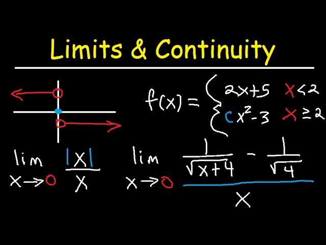

## Table of Contents

## What is the concept of full value?

The concept of full value is about understanding and appreciating the complete worth of something. It means looking at all parts of an item, experience, or person to see its total value. This includes not just the price or obvious benefits, but also the emotional, social, and long-term effects it might have.

For example, when buying a car, full value would consider not only the cost and features but also how it makes you feel, its impact on the environment, and its reliability over time. By thinking about full value, people can make better choices that go beyond just the immediate or surface-level benefits. This approach helps in making decisions that are more satisfying and beneficial in the long run.

## How does full value differ from other valuation methods?

Full value is different from other valuation methods because it looks at everything about something, not just the money part. Other methods, like market value, only focus on what people are willing to pay for something right now. For example, the market value of a house is what someone would pay for it today. But full value would also think about how happy the house makes the people living in it, how it fits their needs, and even how it might be worth more or less in the future.

Another way full value is different is that it includes things you can't easily put a price on, like feelings and relationships. Methods like cost valuation just add up how much it cost to make something. For instance, the cost to build a community center might be clear, but full value would also consider how the center brings people together and improves their lives. This makes full value a more complete way to understand the worth of something, taking into account both the seen and unseen benefits.

## What are the key components of the full value mechanism?

The key components of the full value mechanism include looking at the money part, like how much something costs or is worth on the market. But it goes beyond that by also considering things you can't easily measure with money, like how happy or satisfied something makes you feel. For example, when thinking about the full value of a job, you look at the salary but also how much you enjoy the work and the people you work with.

Another important part of full value is thinking about the long-term effects and the impact on others. This means looking at how something might change over time and how it affects people around you or the world. For instance, buying a car might seem expensive, but if it lasts a long time and uses less gas, its full value could be higher because it saves money and helps the environment in the long run.

In summary, the full value mechanism is about seeing the whole picture. It combines the price, the feelings it brings, the long-term benefits, and the impact on others to understand the true worth of something. This helps people make choices that are not just good for now, but also good for the future and for everyone involved.

## Can you explain the process of calculating full value?

Calculating full value starts with looking at the price of something, like how much it costs to buy or how much someone would pay for it. This is the easy part because it's a number we can see. But then, you need to think about the feelings and happiness it brings. For example, if you're buying a toy, you don't just think about the price; you also think about how much fun it will be to play with. This part is harder to measure because it's about how you feel, but it's really important.

Next, you need to consider the long-term effects and the impact on others. This means thinking about how the thing you're valuing will change over time and how it might help or hurt people around you. For instance, if you're thinking about the full value of a bike, you consider not just the cost and the fun of riding it, but also how it might save you money on gas and help the environment by reducing pollution. By putting all these parts together - the price, the feelings, and the long-term effects - you get a better idea of the full value, which helps you make smarter choices.

## What industries commonly use the full value approach?

Many industries use the full value approach to make better decisions. In the healthcare industry, doctors and hospitals think about more than just the cost of treatments. They also look at how treatments make patients feel, how they improve their lives, and how they affect the community. For example, a new medicine might be expensive, but if it helps people live longer and happier lives, its full value could be very high.

The education sector also uses full value to understand the worth of different programs and schools. It's not just about how much tuition costs, but also about how much students learn, how happy they are, and how their education helps them in the future. A school might be more expensive, but if it gives students great skills and a good job after graduation, its full value is higher.

In the environmental industry, full value is used to assess the impact of projects on nature. Companies and governments look at the cost of a project, but also at how it affects the environment and the people living nearby. A new factory might bring jobs and money, but if it pollutes the air and water, its full value could be lower because of the harm it causes.

## What are the advantages of using full value in valuation?

Using full value in valuation helps people make better choices because it looks at everything about something, not just the price. It includes how happy or satisfied something makes you feel, which is important because money isn't the only thing that matters. For example, when choosing a job, full value helps you think about the salary but also how much you enjoy the work and the people you work with. This way, you can pick a job that makes you happy and fulfilled, not just one that pays well.

Another advantage of full value is that it thinks about the long-term effects and the impact on others. This means you consider how something might change over time and how it affects the people around you or the world. For instance, if you're buying a car, full value helps you see that even if it's expensive, it might save you money on gas and help the environment in the long run. By looking at the whole picture, full value helps you make decisions that are good for now and good for the future.

## What are the potential limitations of the full value method?

One limitation of the full value method is that it can be hard to measure everything. While the price of something is easy to see, feelings and long-term effects are not. For example, how do you put a number on how happy a new toy makes a child? It's tricky because happiness is different for everyone. This makes it tough to compare the full value of different things because some parts are hard to measure.

Another challenge is that full value can take a lot of time and effort. You need to think about many different things, like the cost, the feelings, and the future effects. This can be overwhelming, especially if you're trying to make a quick decision. For instance, if you're buying a car, you might not have time to think about all the ways it could affect your life and the environment over the next ten years. So, while full value can help you make better choices, it can also make decision-making more complicated and time-consuming.

## How does full value impact financial decision-making?

Full value helps people make better financial decisions by looking at more than just the price of something. It includes thinking about how happy or satisfied something makes you feel, which is important because money isn't the only thing that matters. For example, when choosing between two jobs, full value helps you think about the salary but also how much you enjoy the work and the people you work with. This way, you can pick a job that makes you happy and fulfilled, not just one that pays well.

Another way full value impacts financial decision-making is by considering the long-term effects and the impact on others. This means you think about how something might change over time and how it affects the people around you or the world. For instance, if you're buying a car, full value helps you see that even if it's expensive, it might save you money on gas and help the environment in the long run. By looking at the whole picture, full value helps you make decisions that are good for now and good for the future.

## Are there any specific tools or software recommended for full value analysis?

There are not many specific tools or software just for full value analysis because it's a way of thinking that looks at everything about something. But some general tools can help. For example, spreadsheet software like Microsoft Excel or Google Sheets can be used to list and add up all the different parts of full value, like the cost, the happiness it brings, and the long-term effects. These tools let you put numbers next to each part and see the total value.

Another helpful tool is decision-making software like Decision Lens or 1000Minds, which can help you weigh different factors and see how they affect your choices. These programs let you enter different pieces of information and see how changing one part, like the cost, changes the overall value. They can make it easier to think about all the parts of full value and make better decisions.

## How can full value be integrated with other financial metrics for better analysis?

Full value can be used with other financial metrics to give a better picture of something's worth. For example, you can use full value with net present value (NPV) to look at both the money part and the long-term effects of a project. NPV helps you see how much money a project will make over time, but full value adds in how it makes people feel and its impact on the world. By combining these, you get a fuller view of whether the project is really worth doing.

Another way to use full value is with return on investment (ROI). ROI tells you how much money you get back from what you spend, but full value looks at the happiness and satisfaction it brings too. So, when you're deciding on an investment, you can look at the ROI to see the money part, but also think about the full value to see if it's good for your happiness and the people around you. This way, you make choices that are smart with money and good for your life.

## What are some case studies where full value was effectively applied?

In a small town, the local government wanted to build a new community center. They used full value to decide if it was a good idea. They looked at the cost to build it, but also thought about how it would make people feel. The center would be a place for people to meet, have fun, and learn new things. They also thought about the long-term effects, like how it could help kids stay out of trouble and bring the community together. In the end, they decided to build it because the full value showed it would be worth it, even though it was expensive.

Another case was a company thinking about switching to green energy. They used full value to see if it was a good choice. The cost of solar panels was high, but they also thought about how it would make their workers feel proud to work for a green company. They looked at the long-term effects too, like how it would save money on energy bills and help the environment. After looking at the full value, they decided to switch to solar power because it was good for the company, the workers, and the planet.

## What future trends might affect the use of full value in valuation?

In the future, more and more people might start using full value to make choices because they want to think about everything that matters, not just money. As people care more about the environment and their happiness, they will want to know how their choices affect these things. For example, companies might start using full value to decide on new projects, looking at how they affect the world and their workers' happiness, not just how much money they will make.

Technology will also play a big part in how full value is used. New tools and software might be made to help people think about all the parts of full value more easily. These tools could help show how something's cost, the happiness it brings, and its long-term effects all fit together. This way, making decisions using full value could become easier and more common, helping people and businesses make choices that are good for now and the future.

## References & Further Reading

[1]: Bergstra, J., Bardenet, R., Bengio, Y., & Kégl, B. (2011). ["Algorithms for Hyper-Parameter Optimization."](https://dl.acm.org/doi/10.5555/2986459.2986743) Advances in Neural Information Processing Systems 24.

[2]: ["Advances in Financial Machine Learning"](https://www.amazon.com/Advances-Financial-Machine-Learning-Marcos/dp/1119482089) by Marcos Lopez de Prado

[3]: ["Evidence-Based Technical Analysis: Applying the Scientific Method and Statistical Inference to Trading Signals"](https://www.amazon.com/Evidence-Based-Technical-Analysis-Scientific-Statistical/dp/0470008741) by David Aronson

[4]: ["Machine Learning for Algorithmic Trading"](https://github.com/stefan-jansen/machine-learning-for-trading) by Stefan Jansen

[5]: ["Quantitative Trading: How to Build Your Own Algorithmic Trading Business"](https://www.amazon.com/Quantitative-Trading-Build-Algorithmic-Business/dp/1119800064) by Ernest P. Chan