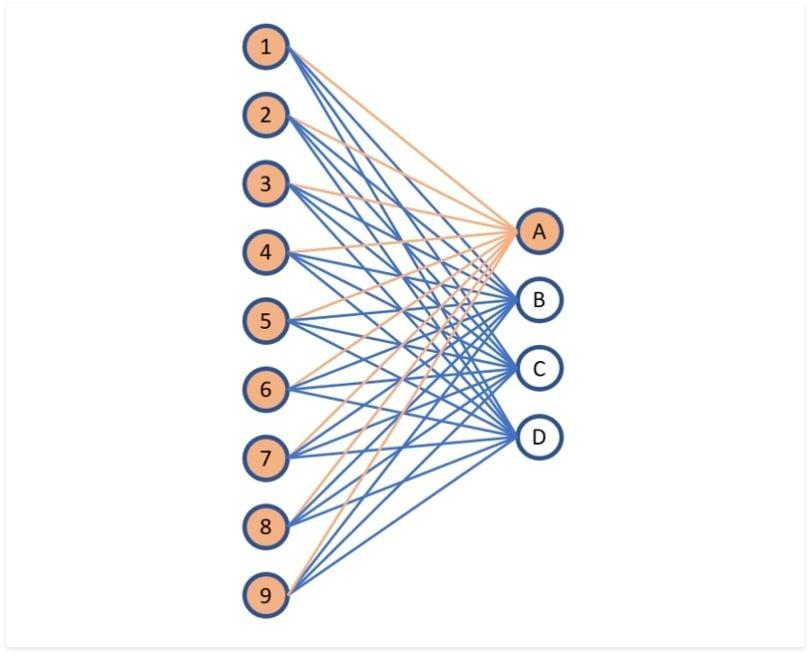

## Table of Contents

## What is a Fully Connected Layer in machine learning?

A Fully Connected Layer, often called a dense layer, is a type of layer used in neural networks where each neuron in the layer is connected to every neuron in the previous layer. This means that the output of every neuron in the previous layer becomes the input for every neuron in the fully connected layer. This type of layer is typically used at the end of a neural network to help in making final predictions or classifications. For example, if you are using a neural network to recognize handwritten digits, the fully connected layer would take the features extracted by earlier layers and use them to decide which digit is most likely being shown.

The way a fully connected layer works can be explained with a simple formula. If we have a layer with $$n$$ inputs and $$m$$ neurons, each neuron in the fully connected layer will have a weight associated with each input, and these weights are used along with a bias to compute the output of the neuron. Mathematically, if $$x_1, x_2, ..., x_n$$ are the inputs, the output $$y_j$$ of the $$j$$-th neuron can be expressed as $$y_j = f(\sum_{i=1}^n w_{ij} x_i + b_j)$$, where $$w_{ij}$$ are the weights, $$b_j$$ is the bias, and $$f$$ is an activation function like ReLU or sigmoid. This setup allows the neural network to learn complex patterns by adjusting these weights and biases during training.

## How does a Fully Connected Layer differ from other types of layers in neural networks?

A Fully Connected Layer, also known as a dense layer, is different from other types of layers in neural networks because every neuron in this layer is connected to every neuron in the previous layer. This means that if you have a layer with 100 neurons and the next layer is a fully connected layer with 50 neurons, each of the 50 neurons will receive input from all 100 neurons in the previous layer. This is different from, for example, a Convolutional Layer, where neurons are only connected to a small region of the input, not the entire thing. This full connectivity allows the fully connected layer to learn complex patterns and relationships across the entire input.

Other types of layers, like Convolutional Layers or Recurrent Layers, have different structures and purposes. A Convolutional Layer, often used in image processing, applies filters to the input to detect features like edges or textures. It does this by sliding a small window over the input and computing a weighted sum within that window. On the other hand, a Recurrent Layer, used in sequence data like text or time series, has connections that loop back, allowing information to persist over time. These layers are designed to capture local patterns or temporal dependencies, whereas a Fully Connected Layer aims to integrate information from all parts of the input to make final decisions or predictions.

## What is the role of a Fully Connected Layer in a neural network?

A Fully Connected Layer, also called a dense layer, plays a key role in neural networks by connecting every neuron from one layer to every neuron in the next layer. This means that each neuron in the Fully Connected Layer gets information from all the neurons in the layer before it. This setup helps the [neural network](/wiki/neural-network) to understand and use all the information it has gathered so far to make its final decision or prediction. For example, if you're using a neural network to tell if a picture is of a cat or a dog, the Fully Connected Layer would take all the features the network has found, like the shape of the ears or the texture of the fur, and use them to decide if it's more likely a cat or a dog.

The way a Fully Connected Layer works can be explained with a simple formula. If we have a layer with $$n$$ inputs and $$m$$ neurons, each neuron in the Fully Connected Layer will have a weight for each input. These weights, along with a bias, are used to compute the output of the neuron. Mathematically, if $$x_1, x_2, ..., x_n$$ are the inputs, the output $$y_j$$ of the $$j$$-th neuron can be expressed as $$y_j = f(\sum_{i=1}^n w_{ij} x_i + b_j)$$, where $$w_{ij}$$ are the weights, $$b_j$$ is the bias, and $$f$$ is an activation function like ReLU or sigmoid. This setup allows the neural network to learn complex patterns by adjusting these weights and biases during training.

## How do you calculate the number of parameters in a Fully Connected Layer?

To calculate the number of parameters in a Fully Connected Layer, you need to consider the weights and biases. If the layer has n inputs and m neurons, each neuron will have n weights (one for each input) and one bias. So, for each neuron, you have n+1 parameters. Since there are m neurons in the layer, the total number of parameters is the number of parameters per neuron times the number of neurons. This can be written as $$m \times (n + 1)$$.

Let's break this down with an example. Imagine a Fully Connected Layer with 100 inputs and 50 neurons. Each of the 50 neurons will have 100 weights and 1 bias, making 101 parameters per neuron. Multiply this by the 50 neurons, and you get $$50 \times 101 = 5050$$ parameters. This calculation helps you understand how the size of the layer affects the total number of parameters, which is important for managing the complexity of your neural network.

## What are the common activation functions used in Fully Connected Layers?

Common activation functions used in Fully Connected Layers include ReLU (Rectified Linear Unit), sigmoid, and tanh (hyperbolic tangent). ReLU is very popular because it's simple and helps the network learn faster. It works by setting all negative values to zero and keeping positive values as they are. You can write the ReLU function as $$f(x) = \max(0, x)$$. Sigmoid, on the other hand, squashes its input into a range between 0 and 1, which is useful for binary classification problems. The sigmoid function is defined as $$f(x) = \frac{1}{1 + e^{-x}}$$. Tanh is similar to sigmoid but squashes the input into a range between -1 and 1, and it's often used in the hidden layers of a neural network. The tanh function is $$f(x) = \frac{e^x - e^{-x}}{e^x + e^{-x}}$$.

Each of these activation functions has its own advantages and use cases. ReLU is widely used because it helps avoid the vanishing gradient problem, which can slow down or stop the learning process in deep networks. However, ReLU can sometimes cause neurons to die if they always output zero, a problem known as the "dying ReLU" issue. Sigmoid and tanh are useful in certain contexts, like when you need outputs in a specific range, but they can suffer from the vanishing gradient problem in deep networks. Choosing the right activation function depends on the specific problem you're trying to solve and the architecture of your neural network.

## How does backpropagation work in Fully Connected Layers?

Backpropagation in Fully Connected Layers is a way to help the neural network learn by adjusting the weights and biases. It starts by calculating the error at the output layer, which is the difference between what the network predicted and the actual correct answer. This error is then used to figure out how much each neuron in the last Fully Connected Layer contributed to the mistake. By using the chain rule from calculus, the error is sent back through the network, layer by layer, to see how much each weight and bias affected the final error. The weights and biases are then updated to reduce the error, helping the network make better predictions next time.

The math behind backpropagation in a Fully Connected Layer can be explained with a simple example. If we have a neuron with an input $$x$$ and a weight $$w$$, the output of the neuron after applying an activation function $$f$$ is $$y = f(wx + b)$$, where $$b$$ is the bias. During backpropagation, we calculate the gradient of the loss function with respect to the weight and bias. If the loss function is $$L$$, the gradients are $$\frac{\partial L}{\partial w} = \frac{\partial L}{\partial y} \cdot \frac{\partial y}{\partial wx} \cdot x$$ and $$\frac{\partial L}{\partial b} = \frac{\partial L}{\partial y} \cdot \frac{\partial y}{\partial wx}$$. These gradients tell us how to adjust $$w$$ and $$b$$ to minimize the loss. By updating the weights and biases using these gradients, the network learns to make better predictions over time.

## What are the advantages of using Fully Connected Layers in neural networks?

Fully Connected Layers are great because they help neural networks understand and use all the information they have gathered. Each neuron in a Fully Connected Layer gets input from every neuron in the layer before it. This means the layer can see the big picture and make decisions based on all the data it has. For example, if you're trying to recognize a picture of a cat or a dog, the Fully Connected Layer can look at all the features, like the shape of the ears or the texture of the fur, and use them to decide if it's more likely a cat or a dog. This ability to integrate information from all parts of the input is what makes Fully Connected Layers so useful for making final predictions or classifications.

Another advantage of Fully Connected Layers is their flexibility. They can be used in many different kinds of neural networks and for many different tasks. Whether you're working on image recognition, natural language processing, or any other type of [machine learning](/wiki/machine-learning) problem, you can add Fully Connected Layers to help the network learn and make better predictions. The way they work, with each neuron having its own set of weights and a bias, allows the network to learn complex patterns by adjusting these values during training. This flexibility makes Fully Connected Layers a key part of many successful neural network models.

## What are the potential drawbacks or limitations of Fully Connected Layers?

One big problem with Fully Connected Layers is that they can make neural networks very big and slow. If you have a lot of inputs and a lot of neurons in the layer, each neuron will need a weight for every input. This can mean a lot of parameters to keep track of. For example, if you have 1000 inputs and 500 neurons, you'll need $$500 \times (1000 + 1) = 500500$$ parameters. This can make the network take a long time to train and use a lot of computer memory. It can also make the network overfit, which means it learns the training data too well and doesn't do as well on new data.

Another issue is that Fully Connected Layers don't always use the structure of the data in the best way. For example, in image data, pixels close to each other are often related, but a Fully Connected Layer treats all inputs the same. This can make the network miss out on important patterns that other types of layers, like Convolutional Layers, are better at finding. Also, Fully Connected Layers can be less good at handling data that comes in sequences, like text or time series data, where Recurrent Layers might work better. So, while Fully Connected Layers are very useful, they might not always be the best choice for every kind of problem.

## How can overfitting be prevented when using Fully Connected Layers?

Overfitting in Fully Connected Layers can be prevented by using a technique called regularization. One common type of regularization is called L2 regularization, where you add a penalty to the loss function based on the size of the weights. This penalty, often called the "weight decay," makes the network prefer smaller weights, which can help it generalize better to new data. The L2 regularization term can be written as $$\lambda \sum_{i} w_i^2$$, where $$\lambda$$ is a hyperparameter that controls how strong the regularization is, and $$w_i$$ are the weights of the network.

Another way to prevent overfitting is by using dropout. Dropout works by randomly turning off some of the neurons during training. This means the network can't rely too much on any single neuron, which helps it learn more robust features. During training, you might turn off about half of the neurons in a Fully Connected Layer. When it's time to use the network to make predictions, all the neurons are used, but their outputs are scaled down to account for the fact that they were only active half the time during training. Dropout helps the network learn to work well even if some information is missing, which makes it better at handling new data.

A third method to avoid overfitting is to use early stopping. This means you keep an eye on how well the network is doing on a separate set of data, called the validation set, while it's training. If the performance on the validation set starts to get worse, even if the performance on the training data is still getting better, you stop the training. This helps prevent the network from learning the training data too well and not being able to handle new data. Early stopping is a simple but effective way to make sure your Fully Connected Layers don't overfit.

## What are some advanced techniques for optimizing Fully Connected Layers?

One advanced technique for optimizing Fully Connected Layers is to use batch normalization. Batch normalization helps the network learn faster and makes it less sensitive to the initial random weights. It works by normalizing the inputs to each layer so that they have a mean of zero and a standard deviation of one. This helps the network handle different scales of input data better. During training, batch normalization calculates the mean and variance of the current batch of data and uses these to normalize the inputs. When you use the network to make predictions, it uses the overall mean and variance calculated during training. Batch normalization can be a big help in making Fully Connected Layers work better and train faster.

Another technique is to use pruning to make Fully Connected Layers smaller and more efficient. Pruning works by removing weights that are close to zero because they don't contribute much to the output. After training a network, you can go through and set very small weights to zero. This makes the network smaller and can help it run faster without losing much accuracy. You can also retrain the network after pruning to let it adjust to the changes. Pruning is a good way to make Fully Connected Layers more efficient, especially when you need to use them on devices with limited memory or processing power.

## How do Fully Connected Layers contribute to the interpretability of neural networks?

Fully Connected Layers can help make neural networks easier to understand because they connect every neuron from one layer to every neuron in the next layer. This means each neuron in a Fully Connected Layer can see all the information from the previous layer. For example, if you're using a neural network to recognize pictures, the Fully Connected Layer at the end can look at all the features the network has found, like the shape of the ears or the texture of the fur, and use them to decide if it's more likely a cat or a dog. By looking at the weights and biases in the Fully Connected Layer, you can see which features the network thinks are important for making its decision.

However, even though Fully Connected Layers can help with understanding, they can also make things more complicated. If you have a lot of neurons and inputs, there will be a lot of weights to look at. For example, if you have 1000 inputs and 500 neurons, you'll need $$500 \times (1000 + 1) = 500500$$ parameters. This can make it hard to figure out which weights and biases are the most important. To help with this, techniques like feature importance and visualization can be used. These methods can show which inputs and features the Fully Connected Layer is paying the most attention to, making it easier to understand how the network is making its decisions.

## What are the current research trends and developments related to Fully Connected Layers?

Researchers are always trying to make Fully Connected Layers work better and faster. One big trend is using techniques like pruning to make these layers smaller. Pruning removes weights that are close to zero because they don't help much with the output. This makes the network smaller and faster without losing much accuracy. Another trend is using batch normalization, which helps the network learn faster by normalizing the inputs to each layer. This means the network can handle different scales of input data better. These techniques help make Fully Connected Layers more efficient and useful in many kinds of neural networks.

Another important area of research is making Fully Connected Layers easier to understand. Researchers are working on ways to see which features the network thinks are important. For example, they use methods like feature importance and visualization to show which inputs the Fully Connected Layer is paying attention to. This helps people understand how the network makes its decisions. Also, researchers are looking at how to combine Fully Connected Layers with other types of layers, like Convolutional Layers or Recurrent Layers, to make the network even better at understanding and using different kinds of data.