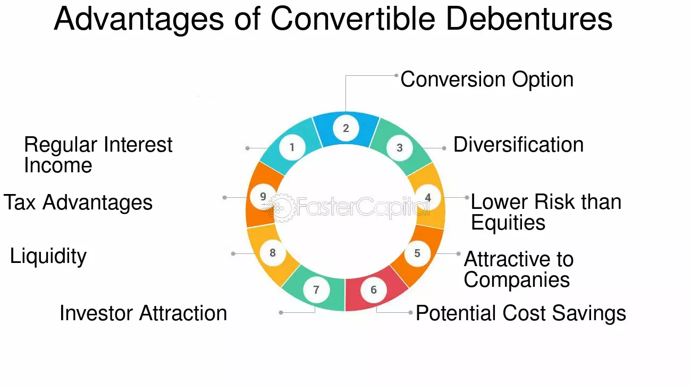

## Table of Contents

## What is a Fully Convertible Debenture (FCD)?

A Fully Convertible Debenture (FCD) is a type of debt instrument that a company issues to raise money. Unlike regular debentures, which you have to pay back, FCDs can be turned into shares of the company after a certain period. This means that instead of getting your money back with interest, you get shares in the company. This can be good for the company because it doesn't have to pay back the money, and it can be good for you if the company does well and the value of the shares goes up.

When you buy an FCD, you start off as a lender to the company. You get interest payments until the conversion date. On the conversion date, your FCDs automatically turn into shares. The number of shares you get depends on the conversion ratio set when you bought the FCD. If the company's stock price goes up, the value of your shares could be worth more than the money you lent. But if the stock price goes down, your shares might be worth less than what you lent. So, FCDs can be a bit risky, but they also offer the chance for bigger rewards.

## How does a Fully Convertible Debenture work?

A Fully Convertible Debenture (FCD) is like a loan you give to a company, but instead of getting your money back with interest, it turns into shares of the company after a certain time. When you buy an FCD, you start as a lender and get regular interest payments until the conversion date. This date is set when you buy the FCD, and it's when your debentures automatically turn into shares. The number of shares you get depends on the conversion ratio, which is also set at the beginning.

For example, if you buy an FCD with a conversion ratio of 10:1, you will get 10 shares for every FCD you own on the conversion date. This can be good for you if the company's stock price goes up, because the value of your shares could be more than the money you lent. But if the stock price goes down, your shares might be worth less than what you lent. So, FCDs can be risky, but they also offer the chance for bigger rewards if the company does well.

## What are the key features of a Fully Convertible Debenture?

A Fully Convertible Debenture (FCD) is a type of loan that you give to a company, but instead of getting your money back with interest, it turns into shares of the company after a certain time. This means you start as a lender and get regular interest payments until the conversion date, which is set when you buy the FCD. On this date, your debentures automatically turn into shares based on a conversion ratio, which is also set at the beginning.

For example, if you buy an FCD with a conversion ratio of 10:1, you will get 10 shares for every FCD you own on the conversion date. This can be good for you if the company's stock price goes up, because the value of your shares could be more than the money you lent. But if the stock price goes down, your shares might be worth less than what you lent. So, FCDs can be a bit risky, but they also offer the chance for bigger rewards if the company does well.

In simple terms, FCDs are a way for companies to raise money without having to pay it back directly. Instead, they give you a piece of the company in the form of shares. This can be a good deal for both the company and the investor, depending on how well the company performs in the future.

## Who typically issues Fully Convertible Debentures?

Fully Convertible Debentures (FCDs) are usually issued by companies that need money to grow or start new projects. These companies might be smaller and newer, or they might be bigger companies looking to expand. They choose FCDs because it's a way to raise money without having to pay it back directly. Instead, they give investors shares in the company, which can help the company grow without adding debt.

Investors who buy FCDs are often looking for a chance to own part of a growing company. They might be willing to take on more risk because they believe the company will do well and the value of their shares will go up. FCDs are popular with investors who want to support new or expanding businesses and are okay with waiting for the company to turn their investment into shares.

## What are the advantages of investing in Fully Convertible Debentures for investors?

Investing in Fully Convertible Debentures (FCDs) can be good for investors because it gives them a chance to own part of a growing company. When you buy an FCD, you start off getting regular interest payments, which is nice because it's like [earning](/wiki/earning-announcement) money while you wait. Then, after a set time, your FCD turns into shares of the company. If the company does well and the stock price goes up, your shares could be worth a lot more than what you paid for the FCD. This means you could make a big profit if the company succeeds.

Another advantage is that FCDs can be a way to support new or expanding businesses without the company having to pay back a loan. This can be good for the company, and if the company grows, it's good for you too. But remember, FCDs can be risky. If the company doesn't do well, the value of your shares might go down, and you could lose money. So, it's important to believe in the company's future before you invest in FCDs.

## How do Fully Convertible Debentures benefit the issuing company?

Fully Convertible Debentures (FCDs) help companies raise money without having to pay it back directly. When a company issues FCDs, it gets cash from investors right away. Instead of paying back this money with interest, the company gives investors shares after a certain time. This means the company doesn't have to worry about repaying a loan, which can be a big relief, especially for smaller or growing companies that need money to expand but don't want to add more debt.

Another benefit for the company is that issuing FCDs can attract investors who believe in the company's future. These investors are willing to wait for their FCDs to turn into shares, hoping that the company will do well and the value of their shares will go up. This can be a good way for the company to build a base of supportive shareholders who are invested in the company's success. Plus, by turning debt into equity, the company can improve its financial health and focus on growth without the pressure of immediate debt repayment.

## What are the risks associated with Fully Convertible Debentures?

Investing in Fully Convertible Debentures (FCDs) can be risky because there's no guarantee that the company will do well. If the company's stock price goes down, the shares you get from converting your FCDs might be worth less than what you paid for them. This means you could lose money if the company doesn't perform as expected. Also, since FCDs are often issued by smaller or newer companies, there's a higher chance that the company might fail or struggle, which adds to the risk.

Another risk is that you might miss out on other investment opportunities while waiting for your FCDs to convert into shares. The money you put into FCDs is tied up until the conversion date, and if the stock market or other investments do better during that time, you could be missing out on those gains. It's important to think about these risks and make sure you believe in the company's future before you decide to invest in FCDs.

## How do Fully Convertible Debentures compare to other types of debentures?

Fully Convertible Debentures (FCDs) are different from other types of debentures because they turn into shares of the company after a set time. With regular debentures, you get your money back with interest, but with FCDs, you become a shareholder. This means you don't get your money back directly, but you own part of the company. FCDs are good for companies because they don't have to pay back the money, and they can attract investors who believe in the company's future.

Other types of debentures, like Partly Convertible Debentures (PCDs) and Non-Convertible Debentures (NCDs), work differently. PCDs let you convert only part of your investment into shares, while the rest is paid back with interest. NCDs don't turn into shares at all; you just get your money back with interest at the end. FCDs can be riskier than NCDs because you might lose money if the company's stock price goes down, but they also offer the chance for bigger rewards if the company does well.

## What are the tax implications of investing in Fully Convertible Debentures?

When you invest in Fully Convertible Debentures (FCDs), you need to think about taxes. While you hold the FCDs, the interest you get is usually taxed as regular income. This means you have to pay tax on the interest every year, just like you would with a normal job. But when your FCDs turn into shares, things change. You don't have to pay tax right away on the value of the shares you get. Instead, you only pay tax when you sell those shares, and the tax depends on how long you held the shares and how much profit you made.

If you sell the shares you got from FCDs within a year, any profit you make is considered short-term capital gain, and it's taxed at your regular income tax rate. But if you hold onto the shares for more than a year before selling, the profit is a long-term capital gain, and it's taxed at a lower rate. This can be a good thing because it might save you money on taxes if you're willing to wait. Just remember, tax rules can change, so it's always a good idea to talk to a tax advisor to make sure you understand how FCDs will affect your taxes.

## How does the conversion process of a Fully Convertible Debenture work?

When you buy a Fully Convertible Debenture (FCD), you start off as a lender to the company. You get regular interest payments until a specific date, which is called the conversion date. This date is set when you buy the FCD, and it's when your debentures automatically turn into shares of the company. The number of shares you get depends on the conversion ratio, which is also set at the beginning. For example, if the conversion ratio is 10:1, you will get 10 shares for every FCD you own on the conversion date.

The conversion process is automatic, so you don't have to do anything on the conversion date. Once your FCDs turn into shares, you become a shareholder in the company. This means you no longer get interest payments, but you own part of the company. If the company does well and the stock price goes up, the value of your shares could be worth more than what you paid for the FCD. But if the stock price goes down, your shares might be worth less than what you paid. So, it's important to believe in the company's future before you invest in FCDs.

## What are some criticisms of Fully Convertible Debentures?

Some people don't like Fully Convertible Debentures (FCDs) because they can be risky. When you buy an FCD, you're betting that the company will do well. If the company's stock price goes down, the shares you get from your FCD might be worth less than what you paid. This means you could lose money. Also, FCDs are often issued by smaller or newer companies, which can be more likely to fail or struggle. So, there's a higher chance that things might not go as planned.

Another criticism is that FCDs tie up your money until the conversion date. While you're waiting for your FCDs to turn into shares, you might miss out on other good investment opportunities. If the stock market or other investments do better during that time, you could be missing out on those gains. Plus, the tax rules for FCDs can be complicated. You have to pay tax on the interest you get while you hold the FCD, and then you have to think about capital gains tax when you sell the shares you get. This can make things more confusing and might not be worth it for some investors.

## Can you provide a case study or example of a successful use of Fully Convertible Debentures?

A good example of a successful use of Fully Convertible Debentures (FCDs) is the case of a tech startup called "TechGrow Inc." A few years ago, TechGrow Inc. needed money to expand its operations and develop new products. They decided to issue FCDs to raise the funds they needed. Investors bought the FCDs because they believed in the future of the company. TechGrow Inc. used the money to grow quickly, and as a result, their stock price went up a lot. When the FCDs turned into shares, the investors found that their shares were worth much more than what they had paid for the FCDs. This was a win-win situation: TechGrow Inc. got the money it needed to grow without having to pay back a loan, and the investors made a good profit.

Another example is "GreenEnergy Solutions," a company focused on renewable energy. They issued FCDs to fund a new project that aimed to develop more efficient solar panels. Investors were attracted to the idea of supporting a company working on green technology. GreenEnergy Solutions successfully completed the project and started selling their new solar panels, which were well-received in the market. As the company's stock price increased, the FCDs converted into shares that were worth significantly more than the initial investment. This not only helped GreenEnergy Solutions expand their business but also provided investors with a substantial return on their investment.

## References & Further Reading

[1]: ["Advances in Financial Machine Learning"](https://www.amazon.com/Advances-Financial-Machine-Learning-Marcos/dp/1119482089) by Marcos Lopez de Prado

[2]: ["Machine Learning for Algorithmic Trading"](https://github.com/stefan-jansen/machine-learning-for-trading) by Stefan Jansen

[3]: ["Quantitative Trading: How to Build Your Own Algorithmic Trading Business"](https://github.com/LucindaYa/quant-resources/blob/master/Quantitative%20Trading%20How%20to%20Build%20Your%20Own%20Algorithmic%20Trading%20Business.pdf) by Ernest P. Chan

[4]: ["Convertible Bond Markets: Structure, Valuation, and Strategies"](https://www.financestrategists.com/wealth-management/bonds/convertible-bonds/) by Kevin B. Connolly

[5]: ["Corporate Finance and Convertible Bonds"](https://www.financestrategists.com/wealth-management/bonds/convertible-bonds/) by Alessandro Prandini