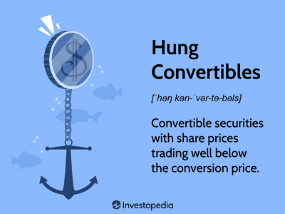

Fully Convertible Debentures (FCDs) are a unique financial instrument that offers a blend of debt and potential equity, positioning them as a compelling option for investors. These instruments start as traditional debt obligations, providing holders with fixed interest payments. However, they possess a transformative feature: the ability to convert into equity shares at a future date, typically at the discretion of the issuer. This dual nature endows FCDs with versatility, appealing to investors seeking the stability of debt alongside the growth potential of equity.

The significance of FCDs in the investment landscape cannot be overstated. They provide companies with an avenue to raise capital without immediately diluting ownership, as might occur with an equity-only issuance. In return, investors benefit from the initial fixed income and the opportunity for equity participation if a company's value appreciates over time. This characteristic makes FCDs particularly attractive during periods of anticipated company growth or favorable economic conditions.



Understanding the criticisms and benefits of fully convertible debentures is crucial for any investor considering them as part of their portfolio. On the one hand, FCDs can offer compelling returns but, on the other, they may also pose certain risks. The potential for forced conversion by the issuer and lower interest rates compared to non-convertible debentures are among the concerns investors must weigh. These factors highlight the importance of understanding the associated risks and rewards before making investment decisions.

In recent years, the advent of algorithmic trading (algo trading) has offered a new dimension in managing investments in FCDs. Algo trading involves using complex algorithms to make trading decisions, enabling timely and precise management of convertible securities. These algorithms can analyze vast datasets to optimize the timing of conversions and manage interest rate fluctuations. By integrating data-driven strategies, investors can potentially enhance returns and mitigate risks, making algo trading a valuable tool in the management of fully convertible debentures.

In conclusion, fully convertible debentures represent a sophisticated financial instrument that balances the safety of debt with the potential upside of equity. Their strategic utilization, especially when augmented by cutting-edge algo trading, can provide investors with opportunities to optimize their investment outcomes effectively. As with any investment, a clear understanding of personal risk tolerance and financial goals is essential when considering FCDs.

## Table of Contents

## What is a Fully Convertible Debenture?

Fully convertible debentures (FCDs) are a specific type of financial instrument that initially function as debt securities with the option to convert into equity shares at a later stage. These securities serve as a bridge between traditional debt and potential equity, providing flexibility both to the issuer and the investor. The defining characteristic of FCDs is their convertibility, which allows the holder of the debenture to exchange it for a predetermined number of equity shares in the issuing company.

The conversion aspect is typically governed by terms set forth at the issuance of the debenture. This includes details such as the conversion ratio, conversion period, and any conditions that must be met for conversion to occur. Notably, FCDs can be distinguished from partially convertible debentures (PCDs) in that the entire principal amount of FCDs is eligible for conversion into equity, whereas PCDs only allow for a portion of the principal to be converted.

Issuers of FCDs often retain the ability to enforce conversion, which means that they have the right to compel debenture holders to convert their debt holdings into equity. This can occur under specific circumstances, such as the fulfillment of predefined financial metrics, the crossing of a particular date, or strategic objectives aimed at reducing debt burden or leveraging equity capital.

FCDs are typically issued by companies looking to optimize their capital structure, manage leverage, or hedge future financing requirements. Common features of FCDs include a specified [interest rate](/wiki/interest-rate-trading-strategies), which may be lower than that of conventional non-convertible debt, reflecting the added value and potential upside of equity conversion. Additionally, FCDs usually have a fixed maturity date if conversion does not take place within the agreed period.

Key conditions for issuing FCDs involve regulatory compliance, particularly with securities laws governing convertible instruments, and market conditions that favor equity issuance. Companies in growth phases or those requiring substantial capital investments may resort to issuing FCDs to mitigate immediate financial pressure while providing a pathway to strengthen equity capital based on future performance improvements or market confidence.

## Benefits of Fully Convertible Debentures

Fully Convertible Debentures (FCDs) offer a unique blend of fixed interest income and potential equity participation, making them an attractive investment for those looking to balance risk and reward. One of the primary benefits of FCDs is their provision of fixed interest payments. This feature ensures that investors receive a steady income stream until the conversion of the debentures into equity occurs. The predictability of these payments makes FCDs a lower-risk option in the short term, as investors are assured of returns regardless of the company's immediate financial performance.

For companies experiencing growth, the conversion feature of FCDs can be particularly advantageous. As the issuing company expands and becomes more profitable, shareholders stand to gain from an increase in share value. Investors who convert their debentures into equity during periods of growth can thus benefit from capital appreciation. For instance, if a tech startup issues FCDs to fund its expansion and subsequently experiences a surge in market share and profitability, debenture holders who convert into equity can share in the company's success.

Moreover, FCDs can serve as a financial buffer for companies during challenging economic times. When a company faces financial difficulties, the option to convert debt to equity can alleviate immediate cash flow pressures by eliminating the need to service debt in cash. Consequently, the company can preserve [liquidity](/wiki/liquidity-risk-premium) and redirect resources towards stabilizing or growing its operations. For example, a manufacturing firm experiencing a downturn might issue FCDs to retain necessary capital within the business, thereby avoiding bankruptcy while allowing investors the opportunity to partake in equity if the business rebounds. This potential flexibility underscores the strategic advantage of FCDs both for issuing companies and investors.

## Criticism of Fully Convertible Debentures

Fully convertible debentures (FCDs) are often viewed as appealing instruments due to their dual nature of offering both fixed interest payments and the potential for equity conversion. However, they also come with several criticisms and potential downsides that investors need to consider carefully.

One significant drawback of FCDs is the risk of forced conversion by the issuer. Issuers may mandate the conversion of debentures into equity shares at a time that is most beneficial to their interests, which might not align with the debenture holders' preferences. This conversion might be enforced when the company's share prices are low, thereby disadvantaging debenture holders who receive equity at less favorable valuations. Such a move tends to benefit existing shareholders more than the debenture holders, as the influx of additional equity can dilute the value of shares, yet stabilize the company's equity base in turbulent times.

Moreover, FCDs typically offer lower interest rates compared to non-convertible debentures (NCDs). This lower yield is a trade-off for the potential of equity conversion. However, for investors primarily seeking income through interest payments, this lower rate may not be attractive, especially when compared to alternatives like NCDs that provide fixed, higher interest rates throughout their tenure. 

Another criticism of FCDs is their susceptibility to risks in weak economic conditions or during company performance downturns. During such periods, the prospects of conversion into equity may become less appealing due to falling share prices, potentially resulting in significant financial losses for investors who convert their holdings. In adverse economic scenarios, the anticipated growth that may make equity conversion attractive can stagnate, rendering the FCDs less lucrative. 

Overall, while FCDs can offer attractive options for investment, the risks of forced conversion, lower interest yields, and vulnerability to economic downturns need to be critically assessed by potential investors.

## Investment Strategies and Algo Trading

Algorithmic trading, or algo trading, plays a significant role in managing fully convertible debenture (FCD) investments. By employing advanced algorithms and high-frequency data analysis, investors can optimize their strategies, particularly in relation to the timing of conversion and handling interest rate fluctuations.

**Managing Timing and Conversion**

One of the central challenges in FCD investments is deciding when to convert debt into equity. The decision hinges on several factors, including market conditions, stock price trajectories, and company performance metrics. Algorithmic models can assess vast datasets in real-time, offering predictive insights and optimizing conversion timing to enhance potential gains. A common technique utilized is the Black-Scholes model, which, although traditionally used for pricing options, can be adapted to evaluate the optimal conversion point by assessing the [volatility](/wiki/volatility-trading-strategies) and expected return of the underlying shares.

**Geopolitical Risk and Interest Rates**

Interest rate changes pose a significant risk, potentially affecting the perceived value of FCDs. Algorithmic trading systems use macroeconomic indicators and market sentiment analysis to predict interest rate trends, allowing investors to adjust their positions accordingly. Algorithms may employ [machine learning](/wiki/machine-learning) models, such as regression analysis or time-series forecasting, enabling dynamic adjustments in the portfolio to hedge against rapid interest rate changes.

For example, consider the simplified Python code snippet that leverages historical data to predict interest rate movements:

```python
import pandas as pd
from sklearn.linear_model import LinearRegression
from sklearn.model_selection import train_test_split

# Load historical interest data
data = pd.read_csv('interest_rates.csv')
X = data[['economic_indicator_1', 'economic_indicator_2', 'market_sentiment']]
y = data['interest_rate']

X_train, X_test, y_train, y_test = train_test_split(X, y, test_size=0.2, random_state=42)

# Train a linear regression model
model = LinearRegression()
model.fit(X_train, y_train)

# Predict future interest rates
future_indicators = [[value1, value2, value3]]
predicted_rate = model.predict(future_indicators)
print(f'Predicted Interest Rate: {predicted_rate}')
```

**Data-Driven Decision Making**

Data-driven decision-making is at the core of algo trading. By analyzing historical trends and real-time data, investors can deduce patterns that may not be immediately evident. This approach reduces reliance on human intuition, thereby mitigating emotional biases and errors. Additionally, algorithms can execute trades at speeds far beyond human capabilities, ensuring investors act on opportunities as they arise.

In conclusion, [algorithmic trading](/wiki/algorithmic-trading), with its emphasis on data manipulation and mathematical modeling, offers strategic advantages for investments in fully convertible debentures. By optimizing timing, managing interest risks, and ensuring informed decisions, algo trading not only maximizes returns but also significantly mitigates associated investment risks.

## Conclusion

Fully convertible debentures (FCDs) embody a unique blend of debt and potential equity, offering their holders both fixed interest payments and the opportunity to convert these securities into equity shares. This dual characteristic makes FCDs an attractive option for investors looking to diversify their portfolios and potentially benefit from the issuing company's growth. The fixed interest in the short term provides a level of security and predictability, supporting steady income streams even as the option for conversion presents an avenue for capital appreciation.

However, the inherent advantages of FCDs must be carefully weighed against their criticisms. One of the primary concerns is the potential for forced conversion by issuers, which might prioritize the interests of existing shareholders over debenture holders. This can lead to unfavorable conditions for those investing in debentures, particularly when compared to non-convertible debentures that typically offer higher interest rates. Furthermore, during economic downturns or periods of poor company performance, the risks associated with holding FCDs may outweigh the benefits.

Algorithmic trading presents a modern approach to maximizing the potential of fully convertible debentures. By utilizing data-driven decision-making, algorithms can effectively manage the timing of conversion and navigate interest rate fluctuations. This strategic use of technology can enhance investment outcomes by optimizing returns and mitigating associated risks.

Investors considering FCDs should carefully assess their personal risk tolerance and financial objectives. While FCDs can serve as a versatile investment vehicle with significant upside potential, they are not without risk. A clear understanding of both the benefits and the challenges of FCDs, coupled with astute use of algo trading, can position investors to make informed decisions in aligning with their financial goals.

## References & Further Reading

[1]: ["Advances in Financial Machine Learning"](https://www.amazon.com/Advances-Financial-Machine-Learning-Marcos/dp/1119482089) by Marcos Lopez de Prado

[2]: ["Machine Learning for Algorithmic Trading"](https://github.com/stefan-jansen/machine-learning-for-trading) by Stefan Jansen

[3]: ["Quantitative Trading: How to Build Your Own Algorithmic Trading Business"](https://github.com/LucindaYa/quant-resources/blob/master/Quantitative%20Trading%20How%20to%20Build%20Your%20Own%20Algorithmic%20Trading%20Business.pdf) by Ernest P. Chan

[4]: ["Convertible Bond Markets: Structure, Valuation, and Strategies"](https://www.financestrategists.com/wealth-management/bonds/convertible-bonds/) by Kevin B. Connolly

[5]: ["Corporate Finance and Convertible Bonds"](https://www.financestrategists.com/wealth-management/bonds/convertible-bonds/) by Alessandro Prandini