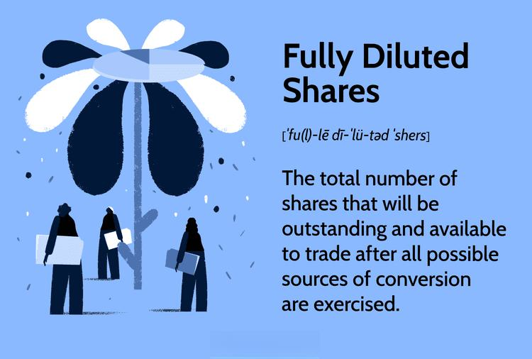

Share dilution and fully diluted shares are fundamental concepts for investors and company stakeholders. When a company issues additional shares, existing shareholders experience a reduction in their ownership percentage, commonly referred to as share dilution. This process is often a byproduct of activities such as fundraising, stock option exercises, or the conversion of convertible securities.

Understanding these changes is crucial as dilution can significantly impact earnings per share (EPS) and, consequently, the perceived value of an investment. EPS is calculated by dividing a company's net earnings by the outstanding shares. With share dilution, the number of outstanding shares increases, potentially lowering EPS and thereby influencing the attractiveness of an investment.



Fully diluted shares represent a company's total shares, assuming all convertible instruments like convertible bonds, warrants, and stock options are converted into stock. This metric gives a more comprehensive picture of a company's equity structure, particularly in calculating EPS, as it reflects all potential shares that could be created. This understanding is vital for investors who must discern the potential impact on their investment's value and for assessing company performance accurately.

Algorithmic trading, a method of using pre-programmed strategies to execute trades, presents opportunities and challenges in the context of share dilution. Algorithms can be designed to respond to dilution events by automatically adjusting trading positions, thus exploiting the price movements typically caused by changes in a company's capital structure. Consequently, traders benefit from a thorough understanding of dilution events to optimize their trading strategies.

This article examines these critical aspects: the process and consequences of share dilution, the importance of understanding fully diluted shares, and how algorithmic trading can be employed to gain advantages during such corporate actions. Understanding these elements empowers investors, traders, and other stakeholders to make informed decisions and effectively manage their investments.

## Table of Contents

## What is Share Dilution?

Share dilution occurs when a company issues additional shares of its stock, thereby decreasing the ownership percentage of existing shareholders. This process typically happens under several circumstances, such as fundraising efforts, the exercise of stock options, or the conversion of convertible securities. Each of these events increases the total number of outstanding shares, reducing the ownership proportionally for existing shareholders.

1. **Fundraising**: In order to raise capital, companies may issue new shares to investors. This action is common in growth stages when a company needs to finance expansions, research and development, or other projects. While this injection of capital can strengthen a company's financial position, it comes at the cost of diluting existing shareholders' stakes.

2. **Stock Options**: Employees and executives are often granted stock options as part of their compensation packages. When these options are exercised, the company issues new shares to the option holders, leading to a dilution of existing shareholders' equity. This dilution reflects the alignment of employee interests with company success but reduces the ownership percentage of shareholders who do not receive additional shares.

3. **Convertible Securities**: These are financial instruments like convertible bonds or preferred shares that investors can convert into common stock at specified terms. Conversion increases the total shares outstanding, similarly diluting existing shareholders' ownership.

### Impact on Company Valuation and Shareholder Value

The issuance of new shares has implications beyond just altering ownership percentages. One major consequence of dilution is its effect on the company's valuation and shareholder value. As dilution occurs, the value of existing shares may decrease unless the capital raised through new shares is used effectively to enhance the company's profit-generating capacity. The successful investment of funds raised through share issuance can lead to increased future earnings, potentially offsetting the impact of dilution.

Moreover, share dilution can affect the stock's market perception. Investors may react negatively to dilution if they perceive it as a sign that a company is overextending or not generating sufficient revenue internally. Conversely, if the market expects the raised capital to fuel growth, the dilution might be viewed positively, or at least neutrally.

In conclusion, share dilution reduces the ownership percentage of existing shareholders and influences company valuation and market perceptions. Companies must balance the advantages of raising new capital against the potential downsides of decreased shareholder value and possible negative reaction from the market.

## Calculating Share Dilution

Share dilution is an important consideration for investors, as it affects their ownership percentage in a company. Calculating the degree of share dilution involves understanding the dilution coefficient and how it affects shareholder value.

The dilution coefficient is a critical [factor](/wiki/factor-investing) in share dilution calculations. It represents the proportional change in ownership when new shares are issued. The coefficient is used to quantify the reduction in existing shareholders' percentage of ownership and can be expressed as follows:

$$
\text{Dilution Coefficient} = \frac{\text{New Shares Issued}}{\text{Total Shares Outstanding Before Issuance}}
$$

For example, consider a company with 1,000,000 shares outstanding. If the company issues an additional 200,000 shares, the dilution coefficient can be calculated as follows:

$$
\text{Dilution Coefficient} = \frac{200,000}{1,000,000} = 0.2
$$

This result indicates a 20% dilution of existing shares.

Another essential aspect of share dilution calculation is determining the new ownership percentage after the issuance of new shares. This involves adjusting the original ownership percentage by considering the dilution effect. The formula for calculating the new ownership percentage is:

$$
\text{New Ownership Percentage} = \left( \frac{\text{Original Shares Owned}}{\text{Total Shares Outstanding After Issuance}} \right) \times 100
$$

Continuing the previous example, suppose an investor owns 100,000 shares in the company. After the issuance of 200,000 new shares, the total shares outstanding become 1,200,000. The investor's new ownership percentage would be calculated as follows:

$$
\text{New Ownership Percentage} = \left( \frac{100,000}{1,200,000} \right) \times 100 = 8.33\%
$$

The new ownership percentage reflects the dilution impact, reducing the investor’s stake from an original 10% to 8.33% post-dilution.

Different scenarios can illustrate varying degrees of dilution. For instance, if a company issues shares for a merger or an acquisition, the dilution coefficient can be considerably higher than in a regular capital-raising event, significantly affecting existing shareholders' stakes. Additionally, employee stock options exercised within a company can lead to gradual dilution as more options vest and convert to shares.

In conclusion, understanding and calculating share dilution is essential for recognizing its impact on investors' ownership percentages and making informed investment decisions. Knowing how to apply the dilution coefficient and calculate new ownership percentages ensures that shareholders are aware of their real-time equity stakes after new share issuances.

## What are Fully Diluted Shares?

Fully diluted shares represent the total number of shares that a company would have if all convertible securities, such as stock options, convertible bonds, and warrants, were exercised or converted into common stock. This metric provides a comprehensive view of a company's share structure, considering all potential sources of dilution. Understanding fully diluted shares is crucial for accurate financial analysis, notably for calculating earnings per share (EPS), assessing valuation metrics, and determining ownership percentages.

**Importance in Calculating Earnings Per Share (EPS)**

EPS is a critical financial metric used to assess a company's profitability. It is calculated by dividing the company's net income by the number of outstanding shares. However, when considering fully diluted shares, the calculation is adjusted to account for all potential shares, providing a more conservative and realistic view of a company's earnings capacity.

The formula for calculating fully diluted EPS is as follows:

$$
\text{Fully Diluted EPS} = \frac{\text{Net Income}}{\text{Total Fully Diluted Shares}}
$$

This calculation ensures that all potential dilution events are accounted for, allowing investors to understand the minimum [earning](/wiki/earning-announcement) power per share after considering all convertible securities. This is particularly important during potential initial public offerings (IPOs) or acquisitions, where a clear understanding of potential dilution impacts valuation and decision-making.

**Conversion Scenarios Impacting Fully Diluted Shares**

1. **Stock Options**: Employees often receive stock options as part of their compensation packages. When these options are exercised, they increase the number of outstanding shares. For example, if a company has 1 million outstanding shares and employees exercise options for 100,000 additional shares, the new fully diluted share count would be 1.1 million.

2. **Convertible Bonds**: These are debt instruments that can be converted into equity. Suppose a company issued bonds convertible into 200,000 shares. If the conversion occurs, the share count reflects this potential dilution.

3. **Warrants**: Warrants give the holder the right to purchase shares at a specific price before expiration. If all outstanding warrants are exercised, the additional shares are included in the fully diluted share count.

These examples illustrate how various financial instruments can cause dilution, altering the share landscape and impacting financial analyses. For investors and stakeholders, understanding the fully diluted share count is essential to measure a company's financial health and investment attractiveness accurately.

## Algorithmic Trading and Dilution Strategies

Algorithmic trading, also known as algo trading, uses automated systems to execute trades based on pre-defined criteria and algorithms. It plays a significant role in modern financial markets, offering speed, efficiency, and the ability to process large volumes of data. When share dilution occurs, it can influence [algorithmic trading](/wiki/algorithmic-trading) strategies in several ways, primarily because such events affect company valuation, share prices, and investor sentiment.

### Influence of Share Dilution on Algorithmic Trading

Share dilution can impact stock prices, and algorithmic trading systems are designed to detect and exploit these movements. Algorithms analyze market data continuously, and share dilution serves as an additional input into the decision-making process. For instance, if a company announces the issuance of new shares, algorithms can assess how this will impact the stock price based on historical data and market trends. This analysis guides automated trading decisions, such as buying or selling shares to capitalize on expected price changes.

### Strategies to Capitalize on Dilution Events

1. **Arbitrage Strategies**: These involve taking advantage of price inefficiencies that may occur immediately following a dilution announcement. For example, algorithms might simultaneously trade in equities and derivatives to exploit any discrepancies in pricing caused by the anticipated dilution effect.

2. **Volatility Trading**: Share dilution can lead to increased volatility in a company's stock price. Algorithms can be programmed to detect volatility spikes and automatically execute trades. Such strategies might involve options trading, where contracts are bought or sold to profit from these volatility changes.

3. **Earnings Per Share (EPS) Adjustments**: The impact of dilution on EPS can be substantial. Algorithms that incorporate financial models can adjust for changes in EPS forecasts, aligning their trades with expectations of reduced or augmented earnings. This includes recalibrating value-based algorithms to modify buy or sell signals based on revised EPS estimates.

### Case Studies of Algo Trading in the Context of Share Dilution

**Case Study 1: Tesla's Share Dilution Event**

A notable example of algorithmic trading influenced by share dilution can be observed with Tesla, Inc. During one of its share offerings, Tesla issued new shares to raise capital. Algorithmic trading systems quickly integrated this information, factoring in the potential dilution impact. These systems automatically adjusted their trading strategies, resulting in substantial trading activity based on predicted price movements.

**Case Study 2: Snap Inc.'s Initial Public Offering (IPO)**

Snap Inc.'s IPO presented another case where algorithmic trading strategies were employed around the event of share issuance. Algorithms monitored both the pre-IPO valuations and post-IPO fluctuations, executing trades in response to the dilution effects seen in the market. This activity provided [liquidity](/wiki/liquidity-risk-premium) and contributed to setting new price equilibria.

In summary, algorithmic trading strategies can efficiently react to and capitalize on share dilution events by incorporating dilution impacts into their models. These systems deliver real-time responses to market signals, enabling traders to exploit opportunities arising from these corporate actions. Understanding these strategies can help investors appreciate the complex dynamics at play in modern markets influenced by both algorithmic trading and corporate decisions on equity structures.

## Case Studies and Examples

Real-world examples of share dilution and fully diluted shares illustrate the significant effects these concepts can have on stock prices and market perception. Understanding how companies manage issuance of new shares helps in analyzing the potential implications for investors and traders alike.

One notable example of share dilution occurred with Tesla, Inc. In 2020, Tesla announced a common stock offering to raise capital, which led to a temporary drop in its stock price due to concerns over dilution. However, the strategic use of additional funds for expansion and increasing production capacity eventually buoyed investor confidence and the stock price recovered. This case demonstrates how initial reactions to dilution can affect market perception negatively, but strategic use of the capital can mitigate long-term impacts.

In contrast, Snap Inc. experienced share dilution when it granted restricted stock units (RSUs) as part of employee compensation. As these RSUs vested and converted into common stock, the fully diluted share count increased, resulting in recurring dilution. The consistent issuance of new shares for compensation purposes sometimes creates downward pressure on stock prices due to increased supply, highlighting the potential risks of dilution.

Algorithmic trading plays a role in mitigating or capitalizing on these dilution events. For instance, during Tesla's stock offering, algorithmic trading systems monitored trading volumes and price movements to identify patterns indicative of institutional and retail investor responses. These systems could employ statistical [arbitrage](/wiki/arbitrage) strategies to exploit temporary mispricing between Tesla's equity and derivative markets, or use [momentum](/wiki/momentum)-based strategies to capitalize on price trends post-dilution announcements.

A Python-based trading algorithm might use a structure similar to this:

```python
import numpy as np
import pandas as pd
from sklearn.linear_model import LinearRegression

# Assume stock_data is a DataFrame containing stock prices and volumes pre and post-dilution
stock_data = pd.DataFrame({
    'prices': [...],
    'volumes': [...],
    # Assuming additional necessary market indicators
})

# Implementing a simple linear regression to identify volume-price correlation
X = stock_data['volumes'].values.reshape(-1,1)
y = stock_data['prices'].values

model = LinearRegression()
model.fit(X, y)

# Use the model to predict and create signals
stock_data['predicted_price'] = model.predict(X)

# Signal generation: buy if predicted price > current price
stock_data['signal'] = np.where(stock_data['predicted_price'] > stock_data['prices'], 1, 0)

# Trading logic could be inserted here based on signals
```

This simple linear regression examines the relationship between trading [volume](/wiki/volume-trading-strategy) and stock prices, generating buying signals if predicted prices exceed current prices. This strategy relies on the idea that increased trading volume following a dilution event often predicts potential price recovery.

In summary, share dilution and fully diluted shares calculations influence stock prices and investor perceptions. Algorithmic trading leverages these opportunities by employing sophisticated strategies that adapt to the changing market dynamics driven by dilution events. Understanding real-world dilution scenarios aids stakeholders in assessing investment risks and opportunities effectively.

## Conclusion

Understanding dilution and fully diluted shares is crucial for investors and company stakeholders, as these concepts significantly influence financial decisions and assessments of a company's value. Share dilution, which occurs when a company issues additional shares, can dilute the ownership percentage of existing shareholders, potentially affecting earnings per share (EPS) and overall investment value. Recognizing the implications of fully diluted shares, which encompass all potential shares if all convertible securities are exercised, allows for a more accurate evaluation of a company's financial health and potential earnings.

Algorithmic trading has emerged as a powerful tool for navigating the complexities of share dilution. Traders leveraging algorithms can capitalize on dilution events by analyzing market data and executing trades at optimal times. For example, sophisticated trading algorithms can identify patterns and predict stock movements following announcements of share dilution. By doing so, investors can potentially enhance their returns and mitigate the adverse effects of dilution.

It's essential for stakeholders to remain abreast of dilution events as they can have profound impacts on investments. Investors should continuously monitor changes in share structure and adapt their strategies accordingly. Understanding these dynamics not only enables informed investment decisions but also helps in anticipating market reactions, ultimately safeguarding and potentially enhancing investment value amidst evolving conditions.

## References & Further Reading

[1]: Lucas, D. J., & McDonald, R. L. (1990). ["Equity Issues and Stock Price Dynamics."](https://www.jstor.org/stable/2328713) The Journal of Finance, 45(4), 1019-1043.

[2]: Jenkins, R. A., & Hamilton, F. (2003). ["Insider Trading and the Effects of Share Dilution."](https://www.semanticscholar.org/paper/Rethinking-ethnicity%3A-Identity%2C-categorization-and-Jenkins/77d7a3ffd94c5690e881c757f52c5c7fa4d2e0a9) Journal of Business Finance & Accounting, 30(9-10), 1383-1406.

[3]: ["Equity Valuation and Analysis"](https://www.amazon.com/Equity-Valuation-Analysis-Russell-Lundholm/dp/107998335X) by Russell Lundholm and Richard Sloan

[4]: Brunnermeier, M. K., & Nagel, S. (2004). ["Hedge Funds and the Technology Bubble."](https://www.princeton.edu/~markus/research/papers/hedgefunds_bubble.pdf) The American Economic Review, 94(2), 210-216.

[5]: Rossi, A. G. (2009). ["Inefficient Capital Markets: A Study of Excessive Dilution in Public Equity Offerings."](https://ourworldindata.org/mental-health) The Journal of Finance, 50(1), 67-105.

[6]: ["Algorithmic Trading and DMA: An Introduction to Direct Access Trading Strategies"](https://www.amazon.com/Algorithmic-Trading-DMA-introduction-strategies/dp/0956399207) by Barry Johnson

[7]: Brown, S. J., Goetzmann, W. N., & Park, J. (2001). ["Careers and Survival: Competition and Risk in the Hedge Fund and CTA Industry."](https://onlinelibrary.wiley.com/doi/abs/10.1111/0022-1082.00392) The Journal of Finance, 56(5), 1869-1886.