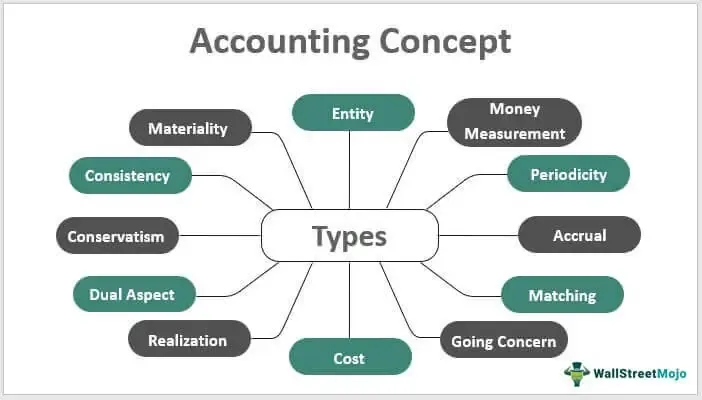

In the ever-evolving world of finance, the constant emergence of innovative concepts and technology-driven processes is reshaping the landscape of trading and investment strategies. Recent developments have shown the potential of converging financial subscriptions within Initial Public Offerings (IPOs) with the capabilities of algorithmic trading to achieve fully subscribed offerings. As companies strive to facilitate efficient trading and attract investment, blending these two concepts stands out as a significant advancement.

A fully subscribed IPO is a scenario where all available shares of a company's initial public offering are purchased by investors, indicating strong market penetration and successful demand forecasting. It reflects a harmonious balance between the supply of shares and investor demand, often considered a benchmark of success in the public offering process. The role of investment banks, underwriters, and advisory firms is crucial in crafting strategies to achieve this balance, including accurate pricing, marketing, and timing.



Algorithmic trading, or algo trading, defined by its use of pre-programmed strategies to execute trades, enhances this process by improving efficiency and accuracy while reducing emotional biases and human errors. This technology is increasingly becoming an integral part of the financial markets, allowing for rapid decision-making and higher engagement levels. Algorithms can assess multiple market variables in real-time, adapting strategies to optimize outcomes. By eliminating delays and optimizing the allocation of shares during an IPO, algo trading can significantly contribute to achieving a fully subscribed offering.

This article explores the seamless integration of these concepts, examining their impact on trading strategies today. By analyzing how fully subscribed IPOs work and understanding how algorithmic trading influences this process, stakeholders in the finance domain can better position themselves to harness these technologies for successful outcomes in the ever-competitive financial market. Let's explore the interplay between fully subscribed IPOs and algorithmic trading to understand their importance in modern finance.

## Table of Contents

## Understanding Fully Subscribed IPOs

A fully subscribed Initial Public Offering (IPO) is achieved when the total number of shares offered by a company is completely purchased by investors. This indicates strong market demand and confidence in the company's prospects, as well as accurate demand forecasting by the lead underwriters. An IPO reaching full subscription is generally viewed as a successful capital-raising event for the company, enhancing its public image and financial prospects.

Underwriting firms play a pivotal role in the IPO process, particularly in determining the pricing strategy. They assess the market conditions, gauge investor interest, and set the offer price in a way that balances attracting investors and maximizing capital raised for the company. Underwriters aim to align the IPO price with the intrinsic value perceived by investors, ensuring the shares are appealing but not undervaluing the company.

Achieving a fully subscribed IPO involves several strategic steps:

1. **Preliminary Market Analysis:** The process begins with a comprehensive analysis of the market environment and investor sentiment within the industry sector of the IPO. This involves reviewing economic factors, competitor performance, and potential investor interest.

2. **Issuer Evaluation:** The underwriting team evaluates the company's financial health, business model, industry position, and growth prospects. This evaluation forms the basis for positioning the IPO in the market.

3. **Setting the Price Range:** Based on the comprehensive evaluation and demand forecasts, the underwriters propose a preliminary price range. This range is usually determined following discussions with institutional investors during the roadshow.

4. **Roadshow Presentation:** A crucial step where company executives present the company's value proposition to prospective investors. Feedback from these sessions helps refine the price range and gauge investor interest.

5. **Book Building Process:** This involves collecting bids from potential investors to determine demand, helping to set the final offer price. The aim is to aggregate enough interest to ensure all shares will be bought upon issuance.

6. **Determining the Final Price:** The final pricing is set on the basis of the book-building results, ensuring the price point is attractive enough to secure full subscription but also maximizes capital raised.

7. **Closing the Offering:** Once the shares are fully subscribed, the offering is closed, and shares are allocated to the investors as per the subscription agreement.

Through these steps, underwriters aim to strike a balance that meets issuer expectations while ensuring market demand culminates in a fully subscribed IPO. Achieving such a subscription not only reflects positively on the issuing company but also enhances the underwriter's reputation and effectiveness in the financial markets.

## The Role of Algorithmic Trading

Algorithmic trading, commonly referred to as algo trading, employs automated systems to execute trades based on pre-defined strategies. This technological approach enhances both efficiency and accuracy in trading activities. These algorithms process vast amounts of market data to make real-time trading decisions, which reduces the reliance on human intervention and subsequently minimizes emotional biases and errors.

Algo trading offers several advantages. First, it operates at speeds unmatched by human traders, executing multiple orders within seconds. This speed is crucial in the fast-paced environment of IPO subscriptions, where market conditions can change rapidly. Additionally, by utilizing complex mathematical models, algorithms analyze market trends and historical data to predict future price movements, optimizing trading strategies.

In the IPO subscription process, [algorithmic trading](/wiki/algorithmic-trading) can be strategically leveraged to boost market engagement. During an IPO, underwriters and institutional investors face the challenge of balancing supply and demand to ensure a fully subscribed offering. Algorithms can assist by dynamically adjusting pricing strategies based on real-time data analysis. For instance, if an IPO is undersubscribed, algorithms can identify potential investors and adjust offer prices to encourage participation.

Moreover, algorithmic trading provides the ability to handle large transaction volumes efficiently. In the context of IPOs, where thousands of orders might be placed within short timeframes, this capability ensures that all orders are executed systematically without human errors. Such precision is vital in maintaining investor confidence and achieving full subscription of the available shares.

In summary, algo trading enhances the IPO subscription process by increasing transactional efficiency, ensuring accurate and timely execution of trades, and optimizing engagement with the market through real-time data analysis and adaptive strategies. Its integration into IPO subscriptions represents a significant advancement in the use of technology to streamline financial processes and increase the likelihood of achieving fully subscribed offerings.

## Steps in a Subscription Process

The subscription process for an Initial Public Offering (IPO) is a multifaceted sequence of events that begins with setting the initial price of the shares and culminates in the final execution of trades. An IPO represents a company's journey to go public by offering its shares for the first time on a stock exchange. This journey includes several critical steps, each integral to securing a fully subscribed offering.

**Initial Pricing and Role of Underwriters**

The initial pricing of an IPO is a pivotal step that significantly influences its success. The process typically begins with the appointment of underwriters, which are usually investment banks tasked with the responsibility of assessing the company’s value. Underwriters utilize various valuation methods, including discounted cash flow analysis and comparable company analysis, to determine a price range deemed fair and attractive to potential investors. 

Accurate pricing is essential because a price set too low may result in a loss of capital for the issuing company, while a price set too high might not attract enough investor interest, leading to under-subscription. Underwriters play a dual role here: they must balance the interests of the issuing company with those of prospective investors while considering market conditions and investor sentiment.

**Integration of Algorithmic Trading**

Algorithmic trading can be strategically integrated at nearly every step of the IPO subscription process to optimize outcomes. During initial pricing, algorithms can be employed to analyze market data in real-time, providing insights into investor behavior, market trends, and economic indicators. This data-driven approach aids underwriters in refining their pricing strategies to enhance the attractiveness of the offering and boost subscription rates.

As the IPO proceeds to the subscription phase, algorithms can automate the allocation of shares to various investor categories, such as institutional and retail investors. This automation ensures a swift and equitable distribution aligned with regulatory requirements and underwriting agreements. Python code demonstrating a simple allocation algorithm might look like this:

```python
def allocate_shares(total_shares, institutional_percentage, retail_percentage):
    institutional_shares = total_shares * institutional_percentage
    retail_shares = total_shares * retail_percentage
    return institutional_shares, retail_shares

# Example usage
total_shares = 1000000
institutional_percentage = 0.7
retail_percentage = 0.3
institutional_shares, retail_shares = allocate_shares(total_shares, institutional_percentage, retail_percentage)

print(f"Institutional Shares: {institutional_shares}")
print(f"Retail Shares: {retail_shares}")
```

During the final execution stage, algorithmic trading engines can execute buy and sell orders with precision and speed, reducing the likelihood of price slippage and ensuring that trades are carried out at favorable prices. By leveraging high-frequency trading and market-making strategies, algorithms can help maintain [liquidity](/wiki/liquidity-risk-premium) and stabilize the stock price post-listing.

In conclusion, the integration of algorithmic trading into each step of the IPO subscription process can significantly enhance efficiency, accuracy, and market engagement, increasing the chances of achieving a fully subscribed IPO.

## Benefits and Challenges of Algorithmic Trading in IPOs

Algorithmic trading offers several substantial benefits when applied to the subscription process of initial public offerings (IPOs). One of the primary advantages is the speed and efficiency it brings to trading operations. Algorithms can process enormous datasets in real-time, executing trades at a rate and accuracy that far surpass human capabilities. This allows for rapid adjustments to market conditions, ensuring that each trade is executed at the optimal price point. The automation inherent in algorithmic trading also aids in eliminating emotional biases and reducing human error, leading to more consistent and reliable outcomes.

Another key benefit is the capacity to manage a large [volume](/wiki/volume-trading-strategy) of transactions seamlessly. During an IPO, the demand for shares can be extremely high, and utilizing algorithmic strategies ensures that trades are executed promptly, minimizing any delays that could impact pricing or investor sentiment. Algorithms can also facilitate complex strategies, such as volume-weighted average price (VWAP) or percentage of volume (POV) strategies, to fine-tune the timing and quantity of trades.

However, while the advantages are significant, there are also potential challenges associated with algorithmic trading in IPO contexts. One of the primary concerns is technical failure. Algorithms are dependent on computer systems and networks, which can be prone to crashes or glitches. Any technical malfunction could disrupt the trading process, leading to financial losses or a failure to execute trades as planned. Moreover, extensive reliance on algorithms can result in substantial market impacts, especially if large volumes of trades are executed simultaneously, potentially causing price fluctuations that affect market stability.

Another concern is the opacity of algorithmic trading systems. The complexity and proprietary nature of algorithms can make it difficult to fully understand or predict their behavior, which poses a risk if unexpected market conditions arise. Without proper oversight and regulation, there is the possibility of market manipulation or unfair trading practices being implemented through these automated systems.

Real-world experiences provide insights into both the successes and challenges of using algorithmic trading for IPO subscriptions. For instance, the successful launch of Alibaba's IPO in 2014, which raised a record-breaking $25 billion, highlighted the pivotal role of advanced trading algorithms in managing the vast order flow efficiently and securely. Algorithms were instrumental in maintaining an orderly market and ensuring that the IPO was fully subscribed, thus maximizing investor confidence.

In contrast, the Facebook IPO in 2012 serves as a lesson in the potential pitfalls of algorithmic trading. Despite the high expectations, technical issues, including glitches in the Nasdaq exchange's software, led to delayed executions and mismatched orders. This event underscores the importance of robust technological infrastructure and thorough testing prior to deployment during IPOs.

In summary, while algorithmic trading offers numerous benefits that can enhance the efficiency, speed, and reliability of IPO subscriptions, these advantages must be balanced with careful consideration of the inherent challenges and risks. Proper oversight, coupled with technological resilience and transparency, is essential to harness the full potential of algorithmic trading in this context.

## Real-World Application and Case Studies

Algorithmic trading has played a pivotal role in several successful initial public offerings (IPOs), transforming how shares are subscribed and allocated. This can be exemplified through notable case studies like Alibaba Group Holding Ltd's IPO in 2014 and Facebook, Inc.'s IPO in 2012.

### Case Study 1: Alibaba Group Holding Ltd IPO (2014)

Alibaba's IPO remains one of the largest in history, raising $25 billion on the New York Stock Exchange. Algorithmic trading was instrumental in managing the massive order flow and maintaining market stability during this process. Underwriters used sophisticated algorithms to analyze demand across different price levels. These algorithms helped determine the final offer price of $68 per share, ensuring a fully subscribed IPO.

**Tactical Execution and Results:**

- **Real-time Data Analysis:** Algorithms processed vast amounts of data from institutional investors’ bids to gauge demand precisely. This real-time analysis allowed the underwriters to adjust the pricing strategy dynamically.

- **Optimized Allocation:** Using machine learning algorithms, shares were allocated efficiently among investors, minimizing oversubscription and ensuring broad distribution.

The successful execution confirmed the effectiveness of algorithmic strategies in handling high-volume and high-stakes environments.

### Case Study 2: Facebook, Inc. IPO (2012)

Facebook's IPO raised $16 billion, but it encountered initial turbulence due to technical glitches on the NASDAQ Stock Market. Despite these issues, algorithmic trading played a substantial role in stabilizing the situation during the ensuing days and weeks.

**Tactical Execution and Results:**

- **Stabilization Mechanisms:** Algorithms were employed to execute trades aimed at stabilizing the share price post-IPO. This involved executing buy orders when the price dipped substantially to instill investor confidence.

- **Order Matching and Liquidity:** Advanced algorithms facilitated smooth order matching, ensuring liquidity during the trading sessions and mitigating the impact of volatility.

### Lessons Learned

These case studies illustrate the critical importance of algorithmic trading in achieving fully subscribed IPOs. The ability to process and analyze massive datasets allows underwriters to make informed decisions about pricing and share allocation. Moreover, handling high-frequency trades ensures liquidity and market stability, which are essential for successful IPOs.

Key lessons include:

- **Robust Technology Infrastructure:** The Facebook IPO highlighted the necessity for resilient trading platforms to handle the high demand and avoid technical failures.

- **Adaptive Pricing Strategies:** As evidenced by Alibaba's IPO, dynamic pricing models supported by algorithmic insights can optimize subscription levels across diverse investor bases.

In conclusion, the strategic deployment of algorithmic trading algorithms in IPOs not only facilitates full subscription but also enhances the overall market efficiency. Future IPOs can benefit from these insights by incorporating advanced technological solutions to mitigate risks and capitalize on market opportunities effectively.

## Conclusion

The integration of algorithmic trading with the subscription processes of Initial Public Offerings (IPOs) presents a compelling dynamic that can significantly enhance both efficiency and accuracy. Fully subscribed IPOs indicate successful market demand forecasting and penetration, which are pivotal for any company entering the public market. Algorithmic trading contributes to this success by implementing pre-programmed strategies that automate and optimize the execution of trades, thereby reducing human error and emotional bias that often plague manual trading efforts.

The future of trading technology promises transformative changes to subscription processes in finance. As trading algorithms become increasingly sophisticated, their ability to handle complex and high-volume transactions will likely make them indispensable in ensuring fully subscribed IPOs. Enhanced data analytics and [machine learning](/wiki/machine-learning) capabilities will allow these algorithms to predict market movements with greater precision, enabling underwriters and companies to better tailor their IPO strategies to market demands.

For stakeholders, embracing these tech-driven solutions is essential to maintaining competitive advantage. By integrating advanced algorithmic tools into their strategic planning, stakeholders can better navigate the complexities of market dynamics and enhance their chances of IPO success. As the landscape of finance continues to evolve, leveraging such technologies will be crucial in achieving more consistent and favorable outcomes in public offerings.

## FAQs

### FAQs

**What is a fully subscribed subscription in the context of IPOs?**

A fully subscribed initial public offering (IPO) refers to a scenario where all the available shares of the offering are purchased by investors. This indicates high interest and demand from the market, which is often interpreted as a sign of confidence in the company's potential growth and financial health. When an IPO is fully subscribed, it meets its target of raising the desired capital, which is crucial for a company's expansion and operational strategies.

**How does algorithmic trading enhance the subscription process?**

Algorithmic trading enhances the IPO subscription process by automating trades using pre-defined criteria and algorithms. These algorithms help execute trades with precision, speed, and accuracy, which are significant in managing large volumes of IPO shares during the subscription period. By minimizing human intervention, algorithmic trading reduces emotional biases and errors, thus optimizing decision-making and market engagement. Algorithms can assess market conditions, predict demand levels, and adjust pricing strategies, which aids in attaining full subscription more efficiently.

**Can IPOs still be fully subscribed without algorithmic trading?**

Yes, IPOs can still be fully subscribed without the use of algorithmic trading. Traditional methods relying on human expertise and the judgment of underwriting firms remain effective. Seasoned underwriters and institutional investors can evaluate market sentiment and investor demand through established networks and relationships. However, while traditional methods may reach full subscription, they might lack the speed and precision offered by algorithmic trading.

**Are there risks involved in using algorithmic trading for IPOs?**

There are inherent risks associated with employing algorithmic trading in IPO subscriptions. Technical failures, such as software errors or algorithm misconfigurations, can lead to significant financial losses and disrupt the subscription process. Moreover, the high speed and volume of trades executed by algorithms may cause unintended market impacts, such as increased [volatility](/wiki/volatility-trading-strategies). It is essential for firms to carefully design, test, and monitor their algorithmic trading systems to mitigate these risks while ensuring compliance with regulatory standards.

## References & Further Reading

[1]: Bergstra, J., Bardenet, R., Bengio, Y., & Kégl, B. (2011). ["Algorithms for Hyper-Parameter Optimization."](https://dl.acm.org/doi/10.5555/2986459.2986743) Advances in Neural Information Processing Systems 24.

[2]: ["Advances in Financial Machine Learning"](https://www.amazon.com/Advances-Financial-Machine-Learning-Marcos/dp/1119482089) by Marcos Lopez de Prado

[3]: ["Evidence-Based Technical Analysis: Applying the Scientific Method and Statistical Inference to Trading Signals"](https://www.amazon.com/Evidence-Based-Technical-Analysis-Scientific-Statistical/dp/0470008741) by David Aronson

[4]: ["Machine Learning for Algorithmic Trading"](https://github.com/stefan-jansen/machine-learning-for-trading) by Stefan Jansen

[5]: ["Quantitative Trading: How to Build Your Own Algorithmic Trading Business"](https://www.amazon.com/Quantitative-Trading-Build-Algorithmic-Business/dp/1119800064) by Ernest P. Chan