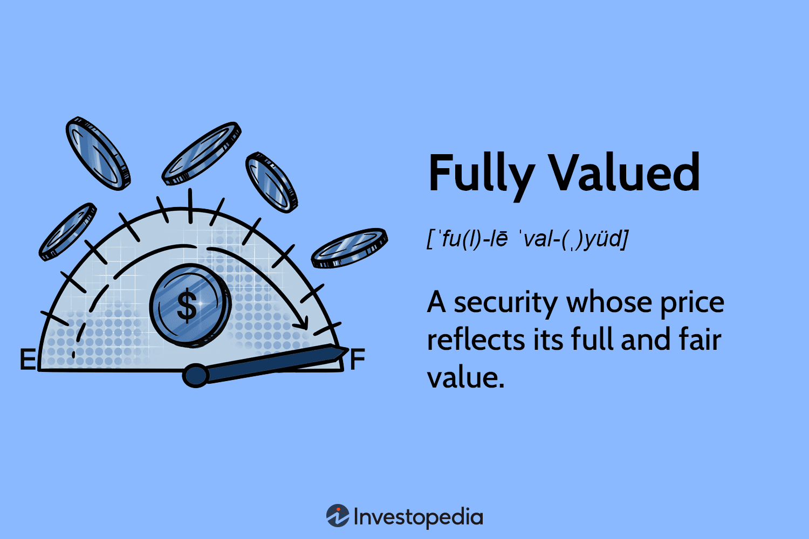

In the world of finance, the intersection of investing, valuation, finance, and algorithmic trading is creating dynamic opportunities for both traditional and modern investors. As technological advancements continue to reshape financial markets, algorithmic trading has emerged as a revolutionary approach, offering unparalleled precision, speed, and innovative strategies. This shift has fundamentally transformed the investor’s methodology by allowing for automated decision-making and the execution of complex trading strategies that were previously unimaginable.

The rapid evolution of algorithmic trading has not only changed how trades are executed but has also refined the processes associated with investment valuation and financial analysis. Valuation methodology plays a crucial role in investment decisions, helping investors to assess the intrinsic value of assets, compare it with market pricing, and determine the potential for profitable returns. This involves various techniques, ranging from fundamental analysis which evaluates a security's inherent value to comparative valuation that analyzes peer performance and market comparables.



Finance, as a discipline, forms the backbone of all investment decisions. It provides a framework for analyzing market dynamics, evaluating economic indicators, and understanding the broader implications of fiscal and monetary policies. Investors must navigate these factors to align their strategies with current market trends and future forecasts, balancing risk and reward to achieve their investment objectives.

Algorithmic trading represents a significant evolution in financial markets, leveraging advanced algorithms and computational power to execute trades at optimized speeds and with high precision. This automation facilitates the implementation of sophisticated strategies such as high-frequency trading (HFT), trend-following, and arbitrage, which are designed to exploit small price discrepancies and realize returns at a scale and speed unattainable by human traders alone.

This article explores these key concepts – the methodologies of investment valuation, the critical role of finance in shaping investment decisions, and the transformative impact of algorithmic trading. By understanding how these elements intertwine, investors can better adapt to the evolving landscape of financial markets and strategically position themselves for future opportunities. The integration of AI and machine learning further enhances these capabilities, offering predictive insights and personalized investment solutions that redefine how markets are navigated. As these technologies continue to develop, staying informed and adaptable will be crucial for investors seeking to maintain a competitive edge in this rapidly progressing domain.

## Table of Contents

## Understanding Investment Valuation

Investment valuation is a key component in the financial decision-making process, enabling investors to assess the potential worth of assets and securities. Accurately valuing investments involves various methodologies that help to ascertain an asset's fair value, guiding informed investment decisions.

Valuation methods primarily include fundamental and comparative analysis. Fundamental analysis focuses on evaluating an asset's intrinsic value by considering its future cash flows, revenue growth, profit margins, and other financial metrics. This approach often involves using discounted cash flow (DCF) models, where the present value of expected future cash flows is calculated using a discount rate. The formula for a basic DCF model is:

$$

PV = \frac{CF_1}{(1+r)^1} + \frac{CF_2}{(1+r)^2} + ... + \frac{CF_n}{(1+r)^n} 
$$

where $PV$ is the present value, $CF_n$ are the cash flows at time $n$, and $r$ is the discount rate.

Comparative valuation, on the other hand, involves analyzing an asset in relation to its peers by using valuation multiples such as the Price-to-Earnings (P/E) ratio, Enterprise Value-to-EBITDA (EV/EBITDA), and Price-to-Book (P/B) ratio. These multiples help investors gauge whether an asset is overvalued or undervalued compared to similar entities.

An asset that is fully valued is typically aligned with its fair market value, implying a balance between supply and demand, offering potential stability but little short-term growth opportunity. In contrast, overvaluation occurs when an asset's market price exceeds its intrinsic value, raising caution against purchasing due to the risk of price corrections. Conversely, undervaluation presents opportunities for investors to buy assets at prices lower than their intrinsic worth, potentially yielding significant returns when the market corrects the price disparity.

The dynamics of overvaluation and undervaluation are integral to strategic investment practices. Investors leverage these conditions to optimize portfolio returns by actively seeking undervalued assets while divesting from overvalued ones. Understanding these valuation principles allows investors to develop informed strategies that maximize potential gains while mitigating risks within volatile markets.

## Role of Finance in Investment Decisions

Finance plays a crucial role in shaping investment decisions by influencing the way investments are structured, analyzed, and executed. Key financial elements such as interest rates, fiscal policy, and economic indicators weigh heavily on market movements and investor behavior.

Interest rates are a fundamental aspect to consider when making investment decisions. Typically set by central banks, these rates dictate the cost of borrowing money and incentivize or discourage spending and investment. Lower interest rates generally encourage borrowing, stimulating economic activity and potentially elevating asset prices. Conversely, higher interest rates lead to increased borrowing costs, which can dampen economic growth and apply downward pressure on asset prices. 

Fiscal policy, encompassing government spending and tax policies, also significantly impacts financial markets. Expansionary fiscal policies, which involve increased government spending and tax cuts, typically result in higher disposable incomes for consumers, driving up demand and potentially increasing investment in equities. On the other hand, contractionary policies, marked by reduced spending and increased taxes, can decrease disposable incomes and curb investment activities. This interplay between fiscal measures and market outcomes underscores the necessity for investors to closely follow government policy announcements and legislative changes.

Economic indicators such as GDP growth rates, unemployment figures, and inflation levels provide insights into the health of an economy and are pivotal in guiding investment choices. For instance, a growing GDP indicates a thriving economy, often leading to increased investor confidence and heightened equity investments. High inflation rates, however, can erode purchasing power and may prompt central banks to raise interest rates, affecting market sentiment and altering investment portfolios.

Understanding these financial principles allows investors to align their investments with their risk tolerance and financial objectives. By comprehending how these factors interact with market dynamics, investors can make informed decisions to optimize their investment strategies. This alignment often involves identifying the trade-off between risk and return that best suits their financial goals. For instance, risk-averse investors might lean towards more stable, fixed-income securities, while those with higher risk tolerance may pursue equities or high-yield bonds.

To illustrate using a simplified financial model, consider the Capital Asset Pricing Model (CAPM), which is used to determine the expected return on an investment:
$$

E(R_i) = R_f + \beta_i (E(R_m) - R_f)
$$
where:
- $E(R_i)$ is the expected return on the investment,
- $R_f$ is the risk-free rate of return (often linked to government bond yields),
- $\beta_i$ is the beta coefficient representing the investment’s sensitivity to market movements,
- $E(R_m)$ is the expected return of the market.

Through CAPM, investors can assess the expected return relative to risk, influenced by market conditions and the risk-free rate, which is in turn affected by central bank policies and broader fiscal measures.

In conclusion, finance provides the foundational framework upon which investment decisions are formed, shaped by an array of economic forces and tools that investors must understand and navigate to achieve desired financial outcomes.

## The Rise of Algorithmic Trading

Algorithmic trading, commonly referred to as algo-trading, utilizes sophisticated algorithms and computer programs to execute trades at speeds and efficiencies unattainable by human traders. At its core, [algorithmic trading](/wiki/algorithmic-trading) is designed to exploit pricing inefficiencies in the market, allowing for large volumes of transactions to be executed with precision and minimal delay. This is achieved through pre-programmed instructions that consider a multitude of factors, such as time, price, and [volume](/wiki/volume-trading-strategy).

One of the primary advantages of algorithmic trading is its ability to eliminate the emotional biases that often affect human traders. By automating the trading process, algorithms can consistently adhere to predefined strategies without deviation due to emotional responses such as fear or greed. Moreover, the high-speed processing capabilities of computers enable the implementation of high-frequency trading ([HFT](/wiki/high-frequency-trading-strategies)) strategies, which involve executing thousands of trades in fractions of a second.

Common algorithmic trading strategies include trend-following, [arbitrage](/wiki/arbitrage), and the execution of large orders in a method that minimizes their impact on the market price. Trend-following algorithms analyze historical data to identify price patterns and trends, making trades based on the anticipated continuation of these trends. Arbitrage strategies, on the other hand, capitalize on price discrepancies between markets or instruments, buying low in one and selling high in another to lock in profits. Algorithms designed to execute large trades often employ techniques such as "iceberg" orders, which break a large trade into smaller lots to avoid rattling the market.

Despite these advantages, algorithmic trading poses several challenges. The technology demands sophisticated infrastructure and expertise to ensure that trading systems are reliable and resilient. The risk of market [volatility](/wiki/volatility-trading-strategies) remains a significant concern, as unforeseen events can lead to rapid and unpredictable market movements. Traders must continuously refine and adapt their algorithms to accommodate new data and shifting market conditions. Additionally, regulatory compliance is crucial, as many jurisdictions have strict rules governing the use of automated trading systems to maintain market integrity and prevent disruptive trading practices. 

Overall, while algorithmic trading offers significant benefits in terms of efficiency and speed, it requires careful design and ongoing management to mitigate risks and leverage its full potential in financial markets.

## Integrating AI in Investment and Trading

Artificial intelligence (AI) is markedly transforming investment and trading landscapes through its advanced data processing capabilities and predictive analytics. By enabling more sophisticated investment strategies, AI is pushing the boundaries traditionally set by human intellect and computational power.

One significant application of AI in investment is its use in stock [picking](/wiki/asset-class-picking). Leveraging [machine learning](/wiki/machine-learning) algorithms, AI systems can analyze vast datasets far beyond human capability to identify patterns and correlations that might signal investment opportunities. These systems are not only faster but also enhance accuracy in analysis by minimizing human biases. For instance, AI-powered stock picking tools can assess historical price movements, market sentiment, and economic indicators collectively to forecast future stock performances.

In portfolio construction, AI assists by optimizing asset allocation to balance returns and risks in accordance with an investor’s goals. This optimization process involves evaluating potential investments across different asset classes and factors such as volatility, [liquidity](/wiki/liquidity-risk-premium), and expected returns. AI-driven models employ techniques like mean-variance optimization, where the goal is to construct a portfolio that offers the maximum expected return for a given level of risk. These AI models can account for complex, multi-variable scenarios, providing more robust portfolio recommendations.

AI also enhances risk management strategies. By using predictive analytics, AI can anticipate market risks and recommend preemptive measures. Techniques such as natural language processing (NLP) allow AI systems to assess news, reports, and social media trends that could affect market conditions, offering investors insights into potential risks. Additionally, AI models can simulate various market conditions using historical data to stress-test portfolio resilience, guiding the adjustment of investment strategies to mitigate identified risks.

Robo-advisors represent another facet of AI integration in investment, offering automated, personalized investment advice. By analyzing client data, these AI-driven platforms tailor investment strategies according to individual financial goals and risk appetites. Beyond just advisory, robo-advisors perform automatic portfolio rebalancing — the process of realigning the weightings of assets in a portfolio to maintain a desired level of asset allocation. This automation not only saves time but also ensures that portfolios remain aligned with investor objectives over time.

In summary, AI is playing an increasingly integral role in investment and trading by improving the precision, speed, and personalization of financial decision-making. Its ability to process and interpret large datasets translates into enhanced stock picking, optimized portfolio design, effective risk management, and personalized investment strategies through robo-advisors, paving the way for a more informed and efficient financial market environment.

## Challenges and Considerations in Algo Trading

Algorithmic trading, while advantageous for its speed and precision, brings with it several challenges and considerations. Central to these challenges is technology reliability. Trading algorithms depend on advanced computing systems that must operate with minimal downtime. Even minor technological glitches or system failures can result in significant financial losses. For example, a delay in trade execution due to a system lag could lead to missed market opportunities or result in trades being executed at less favorable prices.

Moreover, regulatory compliance plays a critical role in the ecosystem of algorithmic trading. As financial markets evolve, regulatory bodies frequently update rules to ensure market stability and prevent manipulative practices. Therefore, traders must ensure that their algorithms adhere to the latest compliance requirements across various jurisdictions. Failure to comply can result in hefty fines and penalties, impacting both financial standings and reputational capital.

Black swan events pose another significant challenge. Such events are unpredictable and can cause drastic market disruptions that even the most sophisticated AI models may not handle seamlessly. During these occurrences, traditional market behaviors can deviate wildly, rendering models based on historical data and trends less effective. As a safeguard, traders might incorporate risk management protocols within their algorithms. For instance:

```python
def risk_management(current_exposure, max_risk_limit):
    if current_exposure > max_risk_limit:
        # Apply risk mitigation strategies
        reduce_exposure()
    else:
        # Continue with planned trading strategy
        execute_strategy()
```

Additionally, continuous adaptation and enhancement of algorithms are crucial. Markets are dynamic, with continual changes in data patterns and trend shifts. Traders must frequently update their algorithms to incorporate real-time data and maintain their competitive edge. This process often involves the integration of machine learning techniques to refine predictive capabilities and improve decision-making processes. For example, traders might employ [reinforcement learning](/wiki/reinforcement-learning) to enable algorithms to learn and adapt autonomously to market changes.

In summary, while algorithmic trading provides significant advantages in terms of efficiency and strategy execution, it demands careful attention to technological robustness, regulatory compliance, and adaptive strategy development to effectively navigate financial markets.

## Conclusion

The convergence of investing, finance, valuation, and algorithmic trading marks a significant advancement in the financial markets, offering investors unprecedented opportunities to enhance their strategies and outcomes. These interconnected elements form the backbone of modern investment dynamics, providing the tools necessary for discerning investors to navigate the increasingly complex market landscapes.

Investors who adeptly utilize the combination of these elements can unlock novel opportunities and maintain a competitive edge. The analytical rigor of traditional valuation techniques complements the rapid execution and precision provided by algorithmic trading systems. Meanwhile, the foundational principles of finance inform decision-making processes and help in evaluating market trends and risks.

Algorithmic trading, with its ability to analyze vast datasets and execute trades at high speed, provides a tactical advantage by minimizing human errors and emotional biases. The incorporation of Artificial Intelligence (AI) into trading strategies further augments this advantage, offering enhanced predictive capabilities and more personalized investment advice through tools such as robo-advisors.

As technology and tools continue to evolve swiftly, the ability to stay informed and adaptable is crucial for success. Investors must remain vigilant, constantly updating their knowledge and strategies to accommodate emerging technologies and shifts in market conditions. A commitment to continuous learning and adaptation will empower investors to capitalize on the opportunities that this new frontier in financial markets presents, while also mitigating potential risks.

## References & Further Reading

[1]: Bergstra, J., Bardenet, R., Bengio, Y., & Kégl, B. (2011). ["Algorithms for Hyper-Parameter Optimization."](https://papers.nips.cc/paper/4443-algorithms-for-hyper-parameter-optimization) Advances in Neural Information Processing Systems 24.

[2]: ["Advances in Financial Machine Learning"](https://www.amazon.com/Advances-Financial-Machine-Learning-Marcos/dp/1119482089) by Marcos Lopez de Prado

[3]: ["Evidence-Based Technical Analysis: Applying the Scientific Method and Statistical Inference to Trading Signals"](https://books.google.com/books/about/Evidence_Based_Technical_Analysis.html?id=jbD47VkOHAEC) by David Aronson

[4]: ["Machine Learning for Algorithmic Trading"](https://github.com/stefan-jansen/machine-learning-for-trading) by Stefan Jansen

[5]: ["Quantitative Trading: How to Build Your Own Algorithmic Trading Business"](https://www.amazon.com/Quantitative-Trading-Build-Algorithmic-Business/dp/1119800064) by Ernest P. Chan