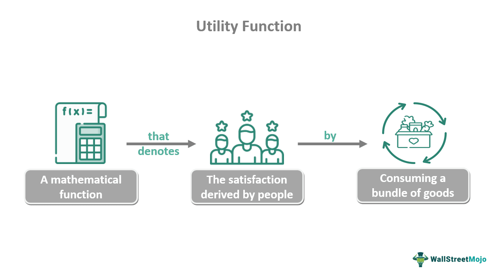

Algorithmic trading is a method of executing orders using automated pre-programmed trading instructions that account for variables such as price, timing, and volume. In this field, constructing efficient and adaptable code is crucial due to the necessity for rapid decision-making and execution in financial markets. The need for such efficiency is particularly pronounced in high-frequency trading (HFT), where trading systems must process large volumes of data and execute trades within microseconds.

C++ is often the language of choice for high-frequency trading systems due to its performance capabilities. It offers fine-grained control over system resources, enabling developers to write highly optimized code that can execute with minimal latency. This is essential in environments where the speed of execution can significantly impact profitability.



Functors in C++ represent a powerful concept that can aid in creating modular and reusable code structures suitable for algorithmic trading. Functors, or function objects, are objects that can be called as if they are ordinary functions but have the advantage of retaining state. This ability allows developers to encapsulate trading strategies within objects, preserving the necessary state information between function calls. Consequently, functors can facilitate the construction of clean, maintainable, and efficient trading systems.

This article aims to explore the role of functors in optimizing C++ code specifically for algorithmic trading strategies. By examining their application in this domain, we can understand how functors contribute to performance improvements and code modularity, which are critical for the success of trading algorithms in fast-paced market conditions.

## Table of Contents

## What are Functors in C++?

Functors in C++ are objects that can be treated like functions, achieved by overloading the `operator()`. These unique objects differentiate themselves by offering enhanced flexibility, such as the ability to maintain state across multiple invocations, a feature not typically available with standard functions or function pointers. This capability is particularly beneficial in environments that require retaining contextual information between calls, such as algorithmic trading.

### Using Functors as Regular Functions

A functor, in the simplest terms, acts like a function but is defined as a class or struct. By overloading the `operator()`, a functor can store data members, enabling it to maintain state across calls. This allows a single functor to not only perform operations but also remember data necessary to influence those operations.

**Example: Basic Functor Structure**

```cpp
#include <iostream>

// Define a functor
class SimpleFunctor {
public:
    int operator()(int x) const { 
        return x * x; // Example operation: square of the input
    }
};

int main() {
    SimpleFunctor func;
    // Use the functor like a regular function
    std::cout << "Square of 5 is: " << func(5) << std::endl;
    return 0;
}
```

In this example, `SimpleFunctor` acts as a square function, demonstrating how a functor can be employed just as a regular function would.

### Benefits Over Traditional Function Pointers

Traditionally, function pointers in C++ have been used to point to and invoke functions dynamically. However, they lack the ability to maintain state, which limits their applicability in more complex scenarios where data persistence is required. Functors overcome this limitation by encapsulating data within an object, thus marrying the behavior of functions with the data storage capability of objects.

Functors also benefit from type safety and the ability to use inlined code, which can yield performance improvements. Unlike function pointers, which necessitate caution regarding type mismatches, functors ensure type correctness through strong typing inherent in C++ classes.

By integrating state information and functionality, functors enable a cleaner design and better code encapsulation. This makes them an ideal choice for implementing modular code in performance-critical applications like [algorithmic trading](/wiki/algorithmic-trading), where quick access to both data (state) and operations is crucial.

Through these advantages, functors have become a staple construct in modern C++ programming, facilitating the development of sophisticated systems that require both flexible function-like behavior and data retention.

## Advantages of Functors in Algorithmic Trading

Functors aid in maintaining state information, which is particularly beneficial for trading algorithms that require tracking historical data or evolving strategy parameters. Unlike traditional function pointers, functors are objects with stored state and behavior, achieved by overloading the `operator()`. This state retention is crucial for algorithms that need to maintain data across function calls, such as moving averages or [momentum](/wiki/momentum) indicators. As objects, functors can encapsulate both state and functionality, making them superior to purely functional approaches when continuity or history is needed between executions.

By encapsulating trading strategy logic, functors promote code readability and maintenance. Instead of spreading logic across multiple functions or modules, functors consolidate the strategy within a single cohesive unit. This encapsulation makes the codebase simpler and more organized. Each functor represents a specific aspect of the trading strategy, clearly defining its purpose and interactions. Such organization reduces the complexity of code maintenance and debugging while facilitating the testing and validation of individual strategies. As trading systems evolve, having modular code components streamlines updates and adaptations.

Performance is critical in high-frequency trading applications, where execution speed impacts overall profitability. Functors can enhance performance compared to alternative methods by minimizing dynamic dispatch overhead typically associated with traditional function pointers or virtual functions. Instead of incurring the runtime cost associated with late binding, functors leverage early binding since the method resolved at compile-time, ensuring faster execution paths. This predictability and efficiency are crucial in environments where milliseconds make a difference.

In practical usage within algorithmic trading systems, functors can be employed effectively. Consider a trading algorithm that adjusts its behavior based on market [volatility](/wiki/volatility-trading-strategies). A functor can be designed to encapsulate volatility calculation logic, storing recent price data to compute indicators like the Relative Volatility Index (RVI) or Average True Range (ATR). As market conditions change, the functor adapts its output based on updated state information, maintaining efficiency since the logic remains contained and manageable. Such examples demonstrate the utility of functors in creating responsive and adaptive trading algorithms, showcasing their role in optimizing C++ code for high-speed trading environments.

## Implementing Functors in C++ for Trading Algorithms

Implementing functors in C++ for trading algorithms involves creating a structured framework that facilitates the flexible execution of trading strategies. A functor in C++ is essentially a class or struct that overloads the `operator()`, allowing it to be invoked with function-like syntax. This distinct capability makes functors particularly useful for encapsulating trading logic, which can be reused and optimized for performance.

### Step-by-Step Implementation

#### 1. Define the Functor

The first step is to define a functor that encapsulates the core logic of a trading algorithm. This involves creating a class that overloads the `operator()`:

```cpp
#include <iostream>

class TradingStrategy {
public:
    double operator()(double marketPrice, double threshold) {
        if (marketPrice > threshold) {
            return 1.0; // Signal to buy
        } else if (marketPrice < threshold) {
            return -1.0; // Signal to sell
        }
        return 0.0; // No action
    }
};
```

In this example, `TradingStrategy` is a functor that determines whether to buy, sell, or hold based on the market price and a specified threshold.

#### 2. Integrate with Trading System Components

Functors must be seamlessly integrated with trading system components such as order [books](/wiki/algo-trading-books) and market data feeds. This typically involves feeding live data into the functor and using its output to make trading decisions:

```cpp
class MarketDataFeed {
public:
    double getCurrentMarketPrice() {
        return 100.5; // Example market price
    }
};

class OrderBook {
public:
    void executeOrder(double signal) {
        if (signal == 1.0) {
            std::cout << "Executing Buy Order" << std::endl;
        } else if (signal == -1.0) {
            std::cout << "Executing Sell Order" << std::endl;
        } else {
            std::cout << "Hold Position" << std::endl;
        }
    }
};

int main() {
    TradingStrategy strategy;
    MarketDataFeed marketData;
    OrderBook orderBook;

    double marketPrice = marketData.getCurrentMarketPrice();
    double signal = strategy(marketPrice, 101.0);
    orderBook.executeOrder(signal);

    return 0;
}
```

In this implementation, the functor `strategy` processes market price data from `MarketDataFeed` and produces a trading signal used by `OrderBook` to execute trades.

#### 3. Testing and Validation

Testing and validating functors is crucial in algorithmic trading to ensure that they perform correctly and efficiently. A robust testing framework should verify both the logic of the functor and its interaction with other components of the trading system:

- **Unit Testing**: Isolate the functor and test its decision-making logic using various market scenarios to ensure predictable behavior.

- **Integration Testing**: Validate the entire workflow from data acquisition, functor processing, to order execution. This helps ensure that the functor interacts correctly with the order book and market data feed.

```cpp
#include <cassert>

void testStrategy() {
    TradingStrategy strategy;
    assert(strategy(102.5, 101.0) == 1.0); // Buy signal
    assert(strategy(99.5, 101.0) == -1.0); // Sell signal
    assert(strategy(101.0, 101.0) == 0.0); // Hold signal
}

int main() {
    testStrategy();
    // Existing main logic...
}
```

This test function uses assertions to validate the expected outcomes of the strategy functor under different conditions.

### Conclusion

By implementing functors in C++ for trading algorithms, developers can enhance the modularity and efficiency of their code. This approach not only optimizes performance but also simplifies integration with critical trading system components. Accurately testing functors ensures reliability and precision in executing trading strategies, making them a valuable tool for high-frequency trading applications.

## Comparing Functors with Other C++ Constructs

Functors in C++ are a versatile tool, particularly when compared with other language constructs like lambda expressions, classes, and polymorphism. Each of these alternatives offers distinct advantages and trade-offs, especially within the rigorous requirements of trading algorithms.

### Functors vs. Lambda Expressions

Lambda expressions in C++ are anonymous functions that can be defined and used within a function scope. They provide concise syntax and ease of use for quick, throwaway functions. In algorithmic trading, lambdas are useful when operations need to be performed quickly without necessitating reusable code. However, lambdas lack some of the advanced features of functors, like holding state beyond simple closures.

Functors, on the other hand, are instances of classes with an overloaded `operator()`. This allows them to have complex internal state management, benefiting trading strategies that require persistence between function calls. The flexibility of functors to encapsulate state can make them preferable in scenarios where maintaining an ongoing context is critical for trading decisions.

### Trade-offs with Classes and Polymorphism

In traditional object-oriented design, classes are used to encapsulate data and functions, with polymorphism offering method overriding to achieve different behaviors. Functors allow for similar encapsulation but in a more compact form. They can be instantiated with varying behaviors without the overhead of multiple classes or virtual functions.

Polymorphism introduces runtime overhead due to dynamic dispatch, which might be detrimental in high-frequency trading ([HFT](/wiki/high-frequency-trading-strategies)) where every microsecond counts. Functors, being statically resolved during compile time, avoid this overhead, rendering them more efficient for HFT implementations.

### Case Studies and Scenarios

Consider a trading strategy that needs to decide on buy/sell signals based on a predefined set of conditions and indicators. Utilizing functors, each trading condition or indicator can be encapsulated in a functor, improving modularity and reusability. This approach allows easy swapping or customization of trading strategies without altering the overall system design.

An example scenario where functors are preferred over other constructs is when strategies are frequently updated based on market dynamics. Functors enable these updates through efficient recompilation rather than runtime adjustments, offering performance gains necessary for HFT.

### Future Trends in C++ and Their Impact

The evolution of C++ standards brings continuous enhancements that could influence how functors are utilized in algorithmic trading. C++20, for example, introduces concepts and other conveniences that enhance template programming, providing clearer and more efficient code. Such advancements make functors even more powerful by simplifying their integration and extending their applicability.

Moreover, the growing focus on parallelism and concurrency in upcoming C++ standards could synergize with the state encapsulation capability of functors, enabling more efficient multi-threaded trading algorithms.

In conclusion, while lambda expressions, classes, and polymorphism have their uses, functors offer unique benefits in performance and design flexibility, especially for the demanding nature of trading systems. As C++ continues to evolve, the role of functors will likely expand, fostering more robust and efficient trading applications.

## Challenges and Considerations

When implementing functors in algorithmic trading systems, several challenges and considerations must be addressed to ensure optimal performance and reliability.

One major challenge is the initial complexity associated with setting up and understanding functors, especially for beginners. Functors require a solid understanding of object-oriented programming concepts and overloading operators in C++. Novice programmers might find it difficult to grasp how functors encapsulate both behavior and state, unlike simple function pointers or basic class methods. To mitigate this complexity, it's advisable to start with simple use cases and gradually incorporate functors into more complex scenarios. Clear documentation and structured training can also aid in building a foundational understanding.

Performance considerations are paramount in algorithmic trading, and functors can have both positive and negative impacts. On one hand, functors, when used appropriately, can lead to more efficient code due to their ability to maintain state and encapsulate algorithm logic, reducing overhead in trading strategies. However, if not optimized, functors can introduce inefficiencies. For instance, unnecessary state retention or excessive copying of functor objects can degrade performance. It’s crucial to judiciously manage memory and ensure that functors are designed to hold only the essential state required for the algorithm.

To overcome common pitfalls in functor implementation, developers should adhere to best practices such as avoiding over-complication of the functor’s responsibilities. Each functor should have a clear and single responsibility, which aligns with the Single Responsibility Principle in software design. Moreover, leveraging modern C++ features such as move semantics can help in optimizing performance by minimizing unnecessary copying of functor instances. Ensuring that functors are stateless where possible can also greatly enhance efficiency and make the code easier to understand and maintain.

Scalability is another key consideration when deploying functors across large trading frameworks. While functors can encapsulate trading strategies effectively for single-threaded applications, challenges arise when scaling to a multi-threaded environment. Careful management of shared states is crucial to prevent race conditions and ensure thread safety. Implementing thread-safe mechanisms or utilizing atomic operations where necessary can aid in overcoming these issues. Moreover, designing functors with scalability in mind, such as ensuring they are lightweight and can operate independently, will facilitate their deployment across distributed trading systems.

In summary, while functors offer a powerful mechanism for structuring code in algorithmic trading systems, they come with their own set of challenges. By focusing on efficient design practices, managing state carefully, and considering scalability from the onset, developers can leverage functors to create robust and high-performing trading algorithms.

## Conclusion

Functors play a critical role in enhancing C++ code for algorithmic trading by offering modularity and reusability, which are essential in developing efficient trading systems. Their ability to maintain state and encapsulate logic makes them a powerful tool for increasing code readability and maintenance while ensuring high performance—a crucial [factor](/wiki/factor-investing) in high-frequency trading (HFT) environments where microseconds matter. The state retention offered by functors allows trading algorithms to manage and apply complex rules without sacrificing execution speed, which sets them apart from traditional function pointers and other constructs.

The practical advantages of using functors in algorithmic trading are numerous. They provide flexibility in strategy implementation, facilitate cleaner code architecture, and can lead to enhanced execution performance—attributes that are highly valued in developing robust and responsive trading systems. By improving both the design and efficiency of C++ code, functors help in reducing latency and improving the throughput of trading applications, which are pivotal for success in competitive trading markets.

Developers in the trading domain are encouraged to explore and experiment with functors, as they offer a path to writing more sophisticated and optimized C++ algorithms. This exploration can lead to new strategies and improvements in existing systems, which are vital in a continuously evolving trading landscape.

For those interested in diving deeper into advanced C++ techniques suitable for algorithmic trading, several resources can be beneficial. Books like "Effective Modern C++" by Scott Meyers provide insights into newer C++ features and best practices. Online platforms like Coursera and Udacity offer courses on C++ programming tailored towards performance-critical applications. GitHub also hosts a variety of open-source projects and repositories where developers can contribute and learn from practical examples of algorithmic trading systems. Engaging with these learning opportunities can greatly enhance one's ability to develop efficient and innovative trading algorithms using functors and other advanced C++ features.

## References & Further Reading

[1]: Meyers, S. (2014). ["Effective Modern C++: 42 Specific Ways to Improve Your Use of C++11 and C++14"](https://www.amazon.com/Effective-Modern-Specific-Ways-Improve/dp/1491903996). O'Reilly Media.

[2]: Jansen, S. (2020). ["Machine Learning for Algorithmic Trading: Predictive models to extract signals from market and alternative data for systematic trading strategies with Python"](https://www.amazon.com/Machine-Learning-Algorithmic-Trading-alternative/dp/1839217715). Packt Publishing.

[3]: Chan, E. P. (2008). ["Quantitative Trading: How to Build Your Own Algorithmic Trading Business"](https://github.com/ftvision/quant_trading_echan_book). John Wiley & Sons.

[4]: LeVeque, R. J., Mitchell, I. M., & Strohmer, T. (Editors) (2020). ["Financial Mathematics, Derivatives, and Simulation"](https://tevza.org/home/course/modelling-II_2016/books/Leveque%20-%20Numerical%20Methods%20for%20Conservation%20Laws.pdf). Springer.

[5]: Lopez de Prado, M. (2018). ["Advances in Financial Machine Learning"](https://www.amazon.com/Advances-Financial-Machine-Learning-Marcos/dp/1119482089). Wiley.