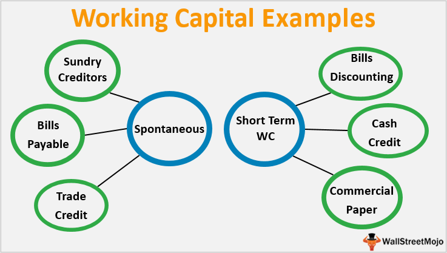

## Table of Contents

## What is working capital?

Working capital is the money a business has available to use for its day-to-day operations. It is calculated by subtracting a company's current liabilities from its current assets. Current assets include things like cash, inventory, and accounts receivable, while current liabilities are short-term debts and obligations that need to be paid within a year.

Having enough working capital is important because it helps a business run smoothly. If a company has enough working capital, it can pay its bills on time, buy inventory, and handle unexpected expenses. On the other hand, if a company doesn't have enough working capital, it might struggle to keep up with its daily operations and could face financial difficulties.

## Why is working capital important for a business?

Working capital is really important for a business because it helps keep things running smoothly every day. It's like the money a business uses to pay for things it needs right away, like buying supplies, paying workers, and covering other short-term costs. If a business has enough working capital, it can easily handle its daily expenses and keep everything going without any hiccups.

If a business doesn't have enough working capital, it can run into big problems. It might not be able to pay its bills on time, which can lead to late fees or even losing important suppliers. This can make it hard for the business to keep up with orders and could even cause it to lose customers. Having enough working capital is key to making sure a business can grow and stay strong, even when unexpected costs come up.

## How is working capital calculated?

Working capital is calculated by taking a company's current assets and subtracting its current liabilities. Current assets are things like cash, the stuff a business has in stock (inventory), and money that customers owe the business (accounts receivable). Current liabilities are the debts and bills that a business needs to pay soon, usually within a year.

So, if you want to find out a company's working capital, you just look at its balance sheet. You add up all the current assets and then subtract all the current liabilities. The number you get tells you how much money the business has to keep things running day to day. If it's a positive number, the business has enough money to cover its short-term needs. If it's negative, the business might have trouble paying its bills on time.

## What are the components of working capital?

The components of working capital are current assets and current liabilities. Current assets are things a business can turn into cash quickly, like the money it has in the bank, the products it has in stock, and the money customers owe it but haven't paid yet. These are important because they help the business keep running smoothly every day.

Current liabilities are the bills and debts a business needs to pay soon, usually within a year. This includes things like money owed to suppliers, short-term loans, and other immediate expenses. By managing these components well, a business can make sure it has enough money to cover its day-to-day costs and keep everything going without any problems.

## What is the difference between gross working capital and net working capital?

Gross working capital and net working capital are two different ways to look at how a business manages its money. Gross working capital is just the total amount of current assets a business has. This includes things like cash, inventory, and money that customers owe the business but haven't paid yet. It's a way to see how much money a business has available to use for its day-to-day operations.

Net working capital, on the other hand, is a bit more detailed. It's calculated by taking the total current assets and subtracting the total current liabilities. Current liabilities are the bills and debts that need to be paid soon, like money owed to suppliers or short-term loans. Net working capital shows whether a business has enough money to cover its short-term expenses. If it's positive, the business can pay its bills easily. If it's negative, the business might struggle to keep up with its costs.

## How does working capital management affect a company's liquidity?

Working capital management is really important for keeping a company's liquidity in good shape. Liquidity means how easily a company can turn its assets into cash to pay its bills. When a company manages its working capital well, it makes sure it has enough cash on hand to cover its short-term expenses. This means it can pay suppliers, employees, and other bills without any problems. Good working capital management helps a company stay ready for unexpected costs and keep everything running smoothly.

If a company doesn't manage its working capital well, it can run into liquidity problems. This happens when a company doesn't have enough cash to pay its bills on time. For example, if it has too much money tied up in inventory or if customers are slow to pay, the company might struggle to cover its costs. Poor working capital management can lead to late payments, which can hurt the company's relationships with suppliers and even cause it to lose business. So, managing working capital carefully is key to keeping a company's liquidity strong and avoiding financial trouble.

## What are the common strategies for managing working capital?

One common strategy for managing working capital is to keep a close eye on inventory. A business can do this by not keeping too much stock that just sits around and ties up money. Instead, it can use just-in-time inventory systems, where it orders products only when they're needed. This way, the business doesn't have a lot of money stuck in products that aren't selling yet. Another part of this strategy is to sell off old or slow-moving inventory at a discount to free up cash.

Another strategy is to manage accounts receivable and accounts payable carefully. A business can do this by making sure customers pay their bills quickly. It might offer discounts for early payments or use strict credit terms to encourage faster payment. On the other hand, the business can also try to pay its own bills a bit later, without upsetting suppliers. This helps keep more cash in the business for a longer time, which can be used for other needs.

A third strategy is to use short-term financing wisely. If a business needs a quick boost of cash, it can take out a short-term loan or use a line of credit. This can help cover any gaps in cash flow and keep the business running smoothly. But it's important to use this option carefully and only when needed, so the business doesn't end up with too much debt. By balancing these strategies, a business can make sure it always has enough working capital to stay liquid and keep operating without problems.

## How can a company optimize its working capital cycle?

A company can optimize its working capital cycle by managing its inventory more efficiently. This means not keeping too much stock that just sits around and ties up money. Instead, the company can use a just-in-time inventory system, where it orders products only when they're needed. This way, the company doesn't have a lot of money stuck in products that aren't selling yet. Another part of this is to sell off old or slow-moving inventory at a discount to free up cash. By doing this, the company can make sure it always has enough money to keep things running smoothly.

Another way to optimize the working capital cycle is by managing accounts receivable and accounts payable carefully. The company can make sure customers pay their bills quickly by offering discounts for early payments or using strict credit terms to encourage faster payment. On the other hand, the company can also try to pay its own bills a bit later, without upsetting suppliers. This helps keep more cash in the business for a longer time, which can be used for other needs. By balancing these strategies, the company can make sure it always has enough working capital to stay liquid and keep operating without problems.

## What are the signs of working capital deficiency?

A business might have a working capital deficiency if it often struggles to pay its bills on time. This can show up as late payments to suppliers, which might lead to strained relationships or even losing important suppliers. Another sign is when the business has to borrow money frequently just to cover everyday costs, like paying employees or buying inventory. If the business is always using short-term loans or lines of credit to keep going, it's a clear sign that it doesn't have enough working capital.

Another sign of working capital deficiency is when a business has too much money tied up in inventory that isn't selling quickly. If the shelves are full of products that are just sitting there, it means the business can't turn that inventory into cash fast enough to pay its bills. Also, if customers are slow to pay what they owe, the business might find itself short on cash. This can make it hard to keep up with day-to-day operations and can lead to bigger financial problems down the road.

## How does working capital impact a company's profitability?

Working capital has a big impact on a company's profitability because it helps the company run smoothly every day. If a company has enough working capital, it can easily pay its bills on time, buy the things it needs, and handle unexpected costs. This means the company can keep making and selling its products without any hiccups. When everything runs smoothly, the company can focus on making more money and growing, which leads to higher profits.

On the other hand, if a company doesn't have enough working capital, it can run into big problems that hurt its profitability. For example, if the company can't pay its bills on time, it might have to pay extra fees or lose important suppliers. This can make it hard to keep up with orders and could even cause the company to lose customers. When a company struggles to cover its day-to-day costs, it might have to borrow money, which adds more expenses and cuts into its profits. So, having enough working capital is really important for keeping a company profitable.

## What are the industry-specific considerations for working capital management?

Different industries have different needs when it comes to managing working capital. For example, in the retail industry, managing inventory is really important. Retail businesses need to make sure they have enough products on the shelves to meet customer demand, but not so much that money gets tied up in unsold goods. They also need to keep an eye on how quickly they can sell their products and turn them into cash. In the construction industry, managing working capital can be tricky because projects often take a long time to finish. Construction companies need to make sure they have enough cash to pay for materials and labor before they get paid by their clients, which can sometimes take months.

In the manufacturing industry, working capital management involves balancing the costs of raw materials, production, and inventory. Manufacturers need to have enough materials on hand to keep production going, but they also need to make sure they're not spending too much money on materials that sit around unused. They also need to manage their accounts receivable carefully, making sure they get paid by customers as quickly as possible. In the service industry, like restaurants or consulting firms, working capital management focuses more on managing cash flow. Service businesses need to make sure they have enough money coming in to cover their immediate costs, like paying employees and rent, while waiting for customers to pay their bills.

## How can advanced analytics and technology improve working capital management?

Advanced analytics and technology can really help businesses manage their working capital better. By using tools like data analytics, businesses can look at their past financial data to find patterns and make smart guesses about the future. For example, they can see how long it usually takes for customers to pay their bills and then come up with ways to make that happen faster. Technology can also help businesses keep track of their inventory in real-time, so they know exactly what they have and what they need to order. This way, they can avoid having too much money tied up in products that aren't selling yet.

Another way technology helps is by making it easier to manage cash flow. With software that automates things like billing and payments, businesses can make sure they're paying their bills on time and getting paid by their customers quickly. This keeps more cash in the business and helps it run smoothly. Plus, advanced analytics can help businesses see where they might be able to save money or make more money, like by finding suppliers who offer better deals or by figuring out which products are the most profitable. By using these tools, businesses can make sure they always have enough working capital to keep going and growing.

## What are the objectives and importance of financial management?

Financial management plays a pivotal role in ensuring a firm's financial health and long-term viability. It involves making strategic decisions that aim to maximize the return on investment (ROI), which is fundamentally critical for business growth and shareholder satisfaction. This process consists of setting clear financial goals, assessing current financial conditions, and implementing strategies that align with the organization's objectives.

The primary objectives of financial management can be categorized into maintaining [liquidity](/wiki/liquidity-risk-premium), optimizing capital structure, and enhancing profitability. Maintaining liquidity is essential for any firm to meet its short-term obligations, ensuring that it has enough cash or easily convertible to cash assets to cover liabilities as they come due. Effective liquidity management often involves careful monitoring of cash flows and financing operations through appropriate credit lines or cash reserves.

Optimizing capital structure involves balancing debt and equity to minimize the cost of capital and maximize value. A well-balanced capital structure ensures that the company is not over-leveraged, reducing the risk of insolvency, while also not overly reliant on equity, which can dilute earnings. The ideal capital structure will vary by industry and is often represented by the formula:

$$
\text{WACC} = \left( \frac{E}{V} \times Re \right) + \left( \frac{D}{V} \times Rd \times (1 - Tc) \right)
$$

where $WACC$ is the weighted average cost of capital, $E$ is market value of the equity, $V$ is total market value of the company’s financing (equity and debt), $Re$ is cost of equity, $D$ is market value of the debt, $Rd$ is cost of debt, and $Tc$ is corporate tax rate.

Enhancing profitability is achieved through meticulous budgeting and financial forecast analysis, ensuring that revenue streams are maximized and costs are controlled. By employing financial analysis tools, management can make data-driven decisions that improve profit margins and drive sustainable growth. Practices often include managing cash flows strategically, making prudent investment decisions, and implementing effective risk management strategies to mitigate adverse financial impacts.

Risk management is integral to financial management, involving the identification, assessment, and prioritization of financial risks, followed by coordinated efforts to minimize, monitor, and control the probability or impact of such events. Techniques such as diversification and hedging are employed to shield the firm from adverse price movements in the financial markets.

In conclusion, a robust financial management strategy is imperative for firms navigating economic and market fluctuations. By focusing on liquidity, capital structure, and profitability, financial management ensures informed decision-making and precise budgeting. This not only supports sustainable growth but also equips enterprises to adapt to changing market conditions, thereby fostering long-term success.

## What is Working Capital: Its Definition and Significance?

Working capital is a crucial metric that indicates a company's short-term financial health and operational efficiency. It is calculated as the difference between current assets and current liabilities, providing insight into a firm's ability to cover its short-term obligations and fund day-to-day operations. The formula for working capital is:

$$
\text{Working Capital} = \text{Current Assets} - \text{Current Liabilities}
$$

Effective management of working capital is vital for sustaining a company's financial stability and facilitating growth initiatives. This involves optimizing inventories, managing accounts receivable and payable, and maintaining adequate cash reserves.

### Key Components of Working Capital Management

1. **Inventories**: Efficient inventory management ensures that a company maintains optimal stock levels, reducing carrying costs while preventing stockouts. Techniques such as just-in-time inventory and inventory turnover ratios are used to fine-tune this balance.

2. **Accounts Receivable and Payable**: Managing accounts receivable involves implementing credit policies that ensure timely collection of payments, thus improving cash flow. Similarly, managing accounts payable requires negotiating favourable terms with suppliers to extend payment durations without incurring penalties, enhancing liquidity.

3. **Cash Reserves**: Maintaining adequate cash reserves is crucial for meeting unexpected expenses and investing in new opportunities without necessarily relying on external financing. This aspect of working capital management ensures that liquidity is safeguarded, providing a safety net for the business.

Proper working capital management minimizes the need for external financing, reducing interest costs and enhancing financial independence. Firms with well-managed working capital can swiftly respond to market changes and capitalize on growth opportunities, securing a competitive edge in their industry.

## References & Further Reading

Bergstra, J., Bardenet, R., Bengio, Y., & Kégl, B. (2011). "Algorithms for Hyper-Parameter Optimization." Advances in Neural Information Processing Systems 24. This paper discusses innovative algorithms for hyper-parameter optimization, offering insights that are crucial for enhancing [machine learning](/wiki/machine-learning) models used in [algorithmic trading](/wiki/algorithmic-trading). It focuses on techniques that can improve the accuracy and efficiency of trading algorithms.

"Advances in Financial Machine Learning" by Marcos Lopez de Prado is a comprehensive resource that integrates machine learning methodologies with financial data analysis. The book covers various machine learning techniques and their applications in financial markets, including the development of predictive models and trade execution strategies.

"Evidence-Based Technical Analysis: Applying the Scientific Method and Statistical Inference to Trading Signals" by David Aronson provides a robust understanding of how the scientific method can be applied to analyze trading signals and technical indicators. The book emphasizes the importance of using empirical data and statistical methods to evaluate the effectiveness of trading strategies.

"Machine Learning for Algorithmic Trading" by Stefan Jansen explores how machine learning can be used to develop sophisticated trading algorithms. The book covers topics such as data processing, feature engineering, and modeling trading strategies using Python, aiming to equip readers with practical skills for implementing machine learning in finance.

"Quantitative Trading: How to Build Your Own Algorithmic Trading Business" by Ernest P. Chan serves as a guide for traders and entrepreneurs looking to establish a quantitative trading business. It includes detailed discussions on building trading systems, risk management, and the application of statistical models to trading strategies, offering a practical approach to algorithmic trading.

