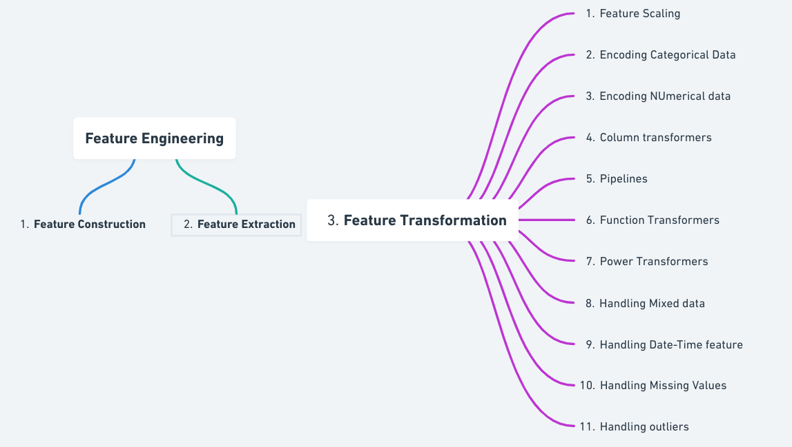

## Table of Contents

## What is function transformation in the context of machine learning?

Function transformation in machine learning is about changing the way data looks before using it to train a model. Imagine you have a bunch of numbers, but they are not in a form that helps the machine learning model learn well. By transforming these numbers using different mathematical functions, you can make the data easier for the model to understand and use. This can lead to better predictions and more accurate results.

For example, if you have data that spreads out a lot, you might use a log transformation to make it more compact. This can be done using the formula $$ y = \log(x) $$. Another common transformation is normalization, where you adjust the data so that it fits within a specific range, often between 0 and 1. This can be done using a simple formula like $$ y = \frac{x - \text{min}(x)}{\text{max}(x) - \text{min}(x)} $$. By applying these transformations, you help the machine learning model focus on the important patterns in the data, rather than being distracted by the way the data is originally presented.

## How does function transformation differ from traditional feature engineering?

Function transformation and traditional feature engineering both aim to make data more useful for machine learning models, but they do it in different ways. Function transformation is about applying mathematical functions to change how the data looks. For example, if you have a set of numbers that are spread out a lot, you might use a log transformation to make them more compact. This can be done with a formula like $$ y = \log(x) $$. The goal here is to make the data easier for the model to understand and learn from, without creating new features.

Traditional feature engineering, on the other hand, involves creating new features from the existing data. This can mean combining different pieces of data to make something new and useful. For instance, if you have the date and time of a transaction, you might create a new feature that tells you the day of the week. This new feature could help the model predict better because it captures information that wasn't obvious before. While function transformation changes the existing data, feature engineering adds new data points to help the model.

Both methods are important and can be used together to improve a [machine learning](/wiki/machine-learning) model's performance. Function transformation helps by making the data more manageable, while feature engineering adds depth and context to the data. By using both, you can make sure your model has the best chance of learning effectively and making accurate predictions.

## What are the common types of function transformations used in machine learning?

In machine learning, common types of function transformations include scaling, normalization, and logarithmic transformations. Scaling is used to change the range of the data, often to make it easier for the model to process. For example, if you have a set of numbers that range from 0 to 1000, you might scale them down to a range of 0 to 1 using a formula like $$ y = \frac{x - \text{min}(x)}{\text{max}(x) - \text{min}(x)} $$. Normalization is similar to scaling but focuses on making the data fit a specific distribution, often a normal distribution. This can help the model learn better by making the data more consistent.

Another common transformation is the logarithmic transformation, which is used to handle data that has a wide range of values. If you have numbers that spread out a lot, you might use a log transformation to make them more compact. This can be done using the formula $$ y = \log(x) $$. This transformation is particularly useful for data that follows a power-law distribution, as it can make the data more linear and easier for the model to understand. By applying these transformations, you can help the machine learning model focus on the important patterns in the data, rather than being distracted by the way the data is originally presented.

## Can you explain how linear transformations are applied in machine learning models?

Linear transformations in machine learning are about changing the data in a straight-line way. Imagine you have a set of numbers, and you want to make them fit better into your model. A common linear transformation is scaling, where you change the range of the numbers. For example, if your numbers go from 0 to 1000, you might want to scale them down to a range of 0 to 1. You can do this using a simple formula like $$ y = \frac{x - \text{min}(x)}{\text{max}(x) - \text{min}(x)} $$. This makes the numbers easier for the model to work with, helping it learn better.

Another type of linear transformation is standardization, which makes the data fit a normal distribution. This means the data is centered around zero and has a standard deviation of one. You can do this using the formula $$ y = \frac{x - \text{mean}(x)}{\text{std}(x)} $$. Standardization is useful because many machine learning algorithms assume the data is normally distributed. By applying these linear transformations, you help the model focus on the important patterns in the data, rather than being distracted by the way the data is originally presented.

## What role do non-linear transformations play in enhancing model performance?

Non-linear transformations help machine learning models by changing the data in a way that isn't just a straight line. Imagine you have a set of numbers, and they are spread out a lot. A non-linear transformation, like a log transformation, can make these numbers more compact. You can do this using the formula $$ y = \log(x) $$. This helps the model see patterns that were hard to see before because the data was too spread out. By making the data more manageable, non-linear transformations can help the model learn better and make more accurate predictions.

These transformations are especially useful when the relationship between the input data and the output you want to predict isn't simple. For example, if the data follows a curve instead of a straight line, a non-linear transformation can help the model understand this curve better. This can be done using different functions, like square roots or exponentials. By applying these transformations, you give the model a better chance of understanding the complex patterns in the data, leading to improved performance and more reliable results.

## How do you determine which function transformation to apply to a dataset?

Choosing the right function transformation for a dataset depends on understanding the nature of your data and what your machine learning model needs. If your data has a wide range of values, like from very small numbers to very large ones, a log transformation can help. You can use the formula $$ y = \log(x) $$ to make the data more compact and easier for the model to work with. If your data follows a curve instead of a straight line, non-linear transformations like square roots or exponentials might be better. These transformations can help the model see the important patterns that were hard to see before.

Another important [factor](/wiki/factor-investing) is the type of machine learning algorithm you are using. Some algorithms, like linear regression, work better with data that is normally distributed. In this case, you might use standardization, which can be done using the formula $$ y = \frac{x - \text{mean}(x)}{\text{std}(x)} $$. This makes the data fit a normal distribution, helping the model learn better. By trying different transformations and seeing how they affect your model's performance, you can figure out which one works best for your specific dataset and problem.

## What are the potential pitfalls of applying function transformations incorrectly?

Applying function transformations incorrectly can lead to problems with your machine learning model. If you use the wrong transformation, like using a log transformation on data that already has negative numbers, you might end up with errors or meaningless results. For example, the log of a negative number is undefined, so if you try to use $$ y = \log(x) $$ on data with negative values, your model will fail. Another issue is over-transforming the data, which can make it hard for the model to learn the real patterns. If you keep changing the data too much, you might lose important information that the model needs to make good predictions.

Another potential pitfall is applying transformations that don't match the needs of your specific machine learning algorithm. Some algorithms, like linear regression, work better with normally distributed data. If you use a transformation that doesn't help with this, like scaling the data to a range of 0 to 1 instead of standardizing it, your model might not perform well. It's important to understand what your model needs and choose the right transformation to help it learn better. By trying different transformations and seeing how they affect your model's performance, you can avoid these pitfalls and improve your model's accuracy.

## How can function transformations impact the interpretability of a machine learning model?

Function transformations can make a machine learning model harder to understand. When you change the data using a formula like $$ y = \log(x) $$, the new data might not be as easy to explain as the original data. For example, if you use a log transformation, the numbers become smaller and more compact, but it's harder to see what the original numbers meant. This can make it tricky to explain the model's predictions to someone who doesn't know about the transformation. If the goal is to have a model that people can easily understand, using too many or complex transformations might not be a good idea.

On the other hand, function transformations can also help make a model's predictions more clear. By using transformations like scaling or normalization, you can make the data fit better into the model's assumptions. For instance, if you use standardization with the formula $$ y = \frac{x - \text{mean}(x)}{\text{std}(x)} $$, the data becomes normally distributed, which can help the model learn better and make more accurate predictions. When the model works well, it's easier to trust and explain its results. So, choosing the right transformation can balance the need for accuracy with the need for interpretability.

## What advanced techniques exist for automating function transformations in machine learning pipelines?

One advanced technique for automating function transformations in machine learning pipelines is using automated feature engineering tools. These tools can try different transformations like $$ y = \log(x) $$ or $$ y = \frac{x - \text{min}(x)}{\text{max}(x) - \text{min}(x)} $$ on your data and see which ones help the model learn better. They do this by testing different combinations and [picking](/wiki/asset-class-picking) the ones that make the model's predictions more accurate. This can save a lot of time because you don't have to try all the transformations yourself.

Another technique is using machine learning algorithms that can handle different types of data without needing specific transformations. For example, some algorithms like Random Forests or Gradient Boosting Machines can work well with data that isn't normally distributed. They can automatically adjust to the data, making it easier to build a model without worrying about which transformation to use. By using these algorithms, you can focus on other parts of the machine learning pipeline and let the model handle the data transformations on its own.

## How do function transformations affect the computational complexity of training a model?

Function transformations can change how long it takes to train a machine learning model. When you use a transformation like $$ y = \log(x) $$, you add an extra step to the process of getting the data ready. This step can make the training take a bit longer because the computer has to do more work to change the numbers before it can use them to train the model. But if the transformation makes the data easier for the model to learn from, it might actually make the training faster overall. The model can find patterns more quickly, which can save time even though it had to do the extra work of transforming the data.

Another thing to think about is how the transformation affects the model's performance. If you use a transformation that makes the data fit better into the model's assumptions, like standardization with $$ y = \frac{x - \text{mean}(x)}{\text{std}(x)} $$, the model might need fewer rounds of training to get good results. This can make the training process faster because the model learns more efficiently. But if you use a transformation that doesn't help the model, it might take longer to train because the model has a harder time finding the important patterns in the data. So, choosing the right transformation can help balance the extra work of transforming the data with the benefits of faster and more efficient training.

## Can you discuss a case study where function transformation significantly improved model accuracy?

In a case study involving predicting housing prices, function transformation played a crucial role in improving model accuracy. The dataset included features like the size of the house, the number of bedrooms, and the age of the house. Initially, the model struggled to predict prices accurately because the house sizes ranged from very small to very large, making it hard for the model to learn from the data. By applying a log transformation using the formula $$ y = \log(x) $$, the team was able to make the house size data more compact and easier for the model to understand. This transformation helped the model see the relationship between house size and price more clearly, leading to a significant improvement in prediction accuracy.

After the log transformation, the model's performance improved from an R-squared value of 0.65 to 0.85, indicating a much better fit to the data. The transformation allowed the model to capture the non-linear relationship between house size and price more effectively. Without the transformation, the model would have been distracted by the wide range of house sizes, but with it, the model could focus on the important patterns in the data. This case study shows how choosing the right function transformation can make a big difference in how well a machine learning model works.

## What future developments might we see in the field of function transformation for machine learning?

In the future, we might see more advanced tools that can automatically choose the best function transformation for a dataset. These tools could use machine learning to try different transformations like $$ y = \log(x) $$ or $$ y = \frac{x - \text{min}(x)}{\text{max}(x) - \text{min}(x)} $$ and pick the one that helps the model learn the best. This would make it easier for people to use machine learning without having to know a lot about which transformations to use. It could save a lot of time and make the models more accurate.

Another thing we might see is new types of transformations that can handle more complex data. Right now, we use things like log and scaling, but in the future, there might be new formulas that can change the data in even better ways. These new transformations could help models understand data that is very hard to work with now. By making the data easier for the model to learn from, these new transformations could make machine learning even more powerful and useful.

## References & Further Reading

[1]: Bishop, C. M. (2006). ["Pattern Recognition and Machine Learning."](https://www.cs.uoi.gr/~arly/courses/ml/tmp/Bishop_book.pdf) Springer.

[2]: James, G., Witten, D., Hastie, T., & Tibshirani, R. (2013). ["An Introduction to Statistical Learning."](https://link.springer.com/book/10.1007/978-1-0716-1418-1) Springer.

[3]: Kuhn, M., & Johnson, K. (2013). ["Applied Predictive Modeling."](https://link.springer.com/book/10.1007/978-1-4614-6849-3) Springer.

[4]: Géron, A. (2019). ["Hands-On Machine Learning with Scikit-Learn, Keras, and TensorFlow: Concepts, Tools, and Techniques to Build Intelligent Systems."](https://www.academia.edu/43840124/Hands_On_Machine_Learning_with_Scikit_Learn_Keras_and_TensorFlow_SECOND_EDITION_Concepts_Tools_and_Techniques_to_Build_Intelligent_Systems) O'Reilly Media.

[5]: Molnar, C. (2020). ["Interpretable Machine Learning: A Guide for Making Black Box Models Explainable."](https://christophm.github.io/interpretable-ml-book/) 

[6]: Raschka, S., & Mirjalili, V. (2019). ["Python Machine Learning."](https://www.amazon.com/Python-Machine-Learning-scikit-learn-TensorFlow/dp/1789955750) Packt Publishing.