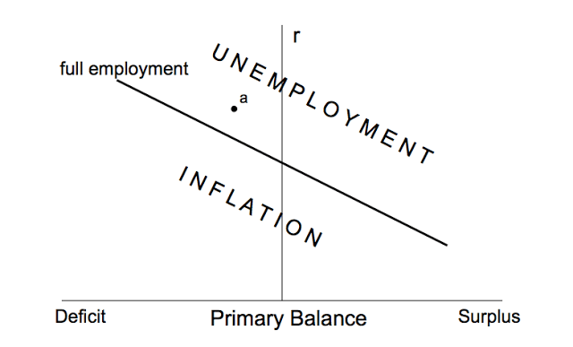

## Table of Contents

## What is functional finance?

Functional finance is an economic theory that says the government should use its power to spend, tax, and borrow money in a way that helps the economy work better. It was first talked about by an economist named Abba Lerner. The main idea is that the government should not worry too much about having a balanced budget. Instead, it should focus on keeping the economy stable and helping people. For example, if the economy is not doing well, the government can spend more money to help it grow. If the economy is growing too fast and causing inflation, the government can take in more money through taxes to slow it down.

This theory is different from traditional ideas about how governments should handle money. Traditional ideas often say that governments should always try to balance their budgets, like a household would. But functional finance says that the government is not like a household because it can create money and has more control over the economy. So, the government should use its powers to make sure the economy is working well for everyone, even if that means running a budget deficit or surplus for a while. The goal is to keep unemployment low, prices stable, and the economy growing at a healthy pace.

## Who developed the concept of functional finance?

The concept of functional finance was developed by an economist named Abba Lerner. He came up with this idea in the 1940s. Lerner believed that the government should focus on making the economy work well, rather than just trying to balance its budget.

Functional finance says that the government should use its powers to spend, tax, and borrow money in ways that help the economy. For example, if the economy is doing badly, the government can spend more money to help it grow. If the economy is growing too fast and causing prices to go up too much, the government can take in more money through taxes to slow it down. The main goal is to keep the economy stable and help people, even if that means the government's budget is not balanced.

## What are the main principles of functional finance?

Functional finance is all about how the government should use its money to help the economy. The main idea is that the government should not worry too much about having a balanced budget. Instead, it should focus on making sure the economy is working well. This means the government can spend more money when the economy is not doing well, to help it grow. If the economy is growing too fast and causing prices to go up too much, the government can take in more money through taxes to slow it down.

The key principle of functional finance is that the government should use its powers to keep unemployment low, prices stable, and the economy growing at a healthy pace. This is different from traditional ideas that say the government should always try to balance its budget, like a household would. But functional finance says the government is not like a household because it can create money and has more control over the economy. So, the government should use its powers to make sure the economy is working well for everyone, even if that means running a budget deficit or surplus for a while.

## How does functional finance differ from traditional finance?

Functional finance and traditional finance have different ideas about how the government should handle money. Traditional finance says the government should always try to balance its budget, just like a household does. This means the government should not spend more money than it takes in through taxes. The goal is to keep the budget balanced, even if that means cutting spending or raising taxes when the economy is not doing well.

Functional finance, on the other hand, says the government should focus on making the economy work well, not just on balancing the budget. It says the government can spend more money when the economy is doing badly to help it grow. If the economy is growing too fast and causing prices to go up too much, the government can take in more money through taxes to slow it down. The main goal is to keep unemployment low, prices stable, and the economy growing at a healthy pace, even if that means the government's budget is not balanced for a while.

## What is the role of government in functional finance?

In functional finance, the government's main job is to make sure the economy is working well for everyone. This means the government should spend money, collect taxes, and borrow money in ways that help the economy grow at a healthy pace, keep unemployment low, and keep prices stable. The government should not worry too much about having a balanced budget. Instead, it should focus on using its powers to help the economy when it needs it.

For example, if the economy is not doing well, the government can spend more money to help it grow. This might mean running a budget deficit, where the government spends more than it takes in through taxes. On the other hand, if the economy is growing too fast and causing prices to go up too much, the government can take in more money through taxes to slow it down. This might mean running a budget surplus, where the government takes in more money than it spends. The key is that the government should use its powers to keep the economy stable and help people, even if that means the budget is not balanced for a while.

## Can you explain the mechanism of functional finance in managing economic cycles?

Functional finance helps manage economic cycles by allowing the government to use its spending, taxes, and borrowing to keep the economy stable. When the economy is not doing well, like during a recession, the government can spend more money to help it grow. This extra spending can create jobs and boost people's income, which helps the economy recover. The government might run a budget deficit during these times, meaning it spends more than it collects in taxes. But that's okay because the goal is to get the economy back on track, not to keep the budget balanced.

On the other hand, if the economy is growing too fast and causing prices to go up too much, the government can use taxes to slow it down. By collecting more money through taxes, the government can take some money out of the economy, which helps to cool things down and keep prices from rising too quickly. This might mean running a budget surplus, where the government takes in more money than it spends. The main idea is that the government should use its powers to smooth out the ups and downs of the economy, making sure it grows at a healthy pace and works well for everyone.

## How does functional finance address issues like inflation and unemployment?

Functional finance helps with inflation by letting the government take more money out of the economy when prices are going up too fast. If the economy is growing too quickly and causing prices to rise, the government can raise taxes. This takes money out of people's pockets and slows down spending, which helps to cool down the economy and keep prices from going up too much. So, by using taxes, the government can control inflation and keep prices stable.

For unemployment, functional finance lets the government spend more money when the economy is not doing well. If there are a lot of people out of work, the government can start new projects or programs that create jobs. This extra spending puts money into the economy, which helps businesses grow and hire more people. By doing this, the government can lower unemployment and help the economy get back on its feet.

## What are the criticisms of functional finance?

Some people do not like functional finance because they think it can lead to big problems. They worry that if the government keeps spending more money than it takes in, it might cause too much inflation. This means prices could go up a lot, which would make things more expensive for everyone. Also, they think that if the government always runs a budget deficit, it might borrow too much money. This could make it hard for the government to pay back its debts later, and it might hurt the economy in the long run.

Another criticism is that functional finance might make the government less careful with money. If the government does not have to worry about balancing its budget, it might spend money on things that are not really needed. This could lead to waste and bad decisions. Some people also think that the government might use functional finance to spend money just to get more votes, instead of doing what is best for the economy. They believe that sticking to a balanced budget forces the government to be more responsible and think about the long-term health of the economy.

## How has functional finance been applied in real-world economic policies?

Functional finance has been used in real-world economic policies in different ways. During tough economic times, like the Great Recession in 2008, some countries used ideas from functional finance. They spent a lot of money on things like building roads, bridges, and helping people who lost their jobs. This was done to get the economy moving again, even though it meant the government had to borrow more money and run a budget deficit. The idea was to help the economy grow and get people back to work, rather than worrying about balancing the budget right away.

Another example is when countries face high inflation. Some governments have raised taxes to take money out of the economy and slow down spending. This helps to keep prices from going up too fast. By doing this, they follow the principles of functional finance, which say the government should use its powers to keep the economy stable. Even though these actions might not balance the budget perfectly, the goal is to make sure the economy works well for everyone.

## What are the potential long-term effects of implementing functional finance?

Using functional finance over a long time could lead to some good things and some challenges. On the good side, it could help keep the economy stable. By spending more money when the economy is doing badly, the government can help create jobs and get things moving again. And by raising taxes when prices are going up too fast, the government can keep inflation under control. This could mean fewer ups and downs in the economy, which is good for everyone.

But there are also some worries about using functional finance for a long time. One big worry is that if the government keeps spending more than it takes in, it might borrow too much money. This could lead to a lot of debt, which might be hard to pay back later. Also, if the government does not have to worry about balancing its budget, it might spend money on things that are not really needed. This could lead to waste and bad decisions. So, while functional finance can help in the short term, it's important to think about how it might affect the economy in the long run.

## How does functional finance integrate with modern monetary theory?

Functional finance and modern monetary theory (MMT) share some big ideas about how the government should handle money. Both say that the government does not need to worry too much about having a balanced budget. Instead, it should focus on making the economy work well for everyone. In functional finance, the government can spend more money when the economy is not doing well to help it grow, and it can raise taxes when prices are going up too fast to keep inflation under control. MMT goes a step further and says that because the government can create its own money, it can always pay for what it needs. The key is to use this power to keep unemployment low and prices stable.

Both functional finance and MMT believe that the government should use its powers to help the economy, even if that means running a budget deficit or surplus for a while. They both think that the government is different from a household because it can create money and has more control over the economy. So, instead of worrying about balancing the budget, the government should focus on making sure the economy is working well for everyone. This means using spending, taxes, and borrowing in ways that help keep the economy stable and growing at a healthy pace.

## What are the advanced tools and models used in the analysis of functional finance?

To study functional finance, economists use different tools and models to understand how government spending, taxes, and borrowing affect the economy. One important tool is macroeconomic modeling, which helps economists predict how changes in government policy might change things like unemployment, inflation, and economic growth. These models can be very detailed and include lots of different parts of the economy, like how people spend money, how businesses invest, and how the government's actions affect all of this. By using these models, economists can see what might happen if the government spends more money during a recession or raises taxes when prices are going up too fast.

Another tool used in the analysis of functional finance is econometric analysis. This involves looking at past data to see how the economy has reacted to different government policies in the past. By studying this data, economists can find patterns and make better guesses about what might happen in the future. For example, they might look at how unemployment changed after the government spent more money during a recession. This helps them understand how effective these policies might be and what the best way to use them is. Both macroeconomic modeling and econometric analysis help economists give good advice to the government about how to use functional finance to keep the economy stable and help people.

## References & Further Reading

[1]: Lerner, A. P. (1943). "Functional Finance and the Federal Debt." Social Research, 10(1), 38-51. [JSTOR](http://sarkoups.free.fr/lerner1943.pdf).

[2]: Keynes, J. M. (1936). "The General Theory of Employment, Interest, and Money." Macmillan.

[3]: Black, F., & Scholes, M. (1973). "The Pricing of Options and Corporate Liabilities." Journal of Political Economy, 81(3), 637-654. [University of Chicago Press](https://www.cs.princeton.edu/courses/archive/fall09/cos323/papers/black_scholes73.pdf).

[4]: Hull, J. C. (2012). "Options, Futures, and Other Derivatives." 8th Edition, Pearson.

[5]: Cartea, Á., Jaimungal, S., & Penalva, J. (2015). "Algorithmic and High-Frequency Trading." Cambridge University Press.

[6]: López de Prado, M. (2018). "Advances in Financial Machine Learning." Wiley.

[7]: Chan, E. P. (2009). "Quantitative Trading: How to Build Your Own Algorithmic Trading Business." Wiley.

[8]: Jansen, S. (2020). "Machine Learning for Algorithmic Trading: Predictive models to extract signals from market and alternative data for systematic trading strategies with Python." Packt Publishing.