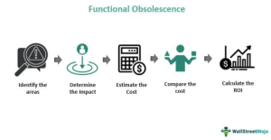

As technology continues to penetrate every industry, its influence on real estate and trading is significant and transformative. The integration of advanced real estate technology, or PropTech, functional obsolescence considerations, and algorithmic trading reshapes how these fields operate. These elements are interrelated, each affecting the other in ways that alter investment strategies, market behavior, and industry standards.

Real estate technology encompasses an array of innovative tools and platforms, from virtual reality tours that enhance the buyer experience to blockchain applications ensuring secure property transactions. These technologies drive greater efficiency and transparency, facilitating better decision-making processes for stakeholders. For instance, the availability of comprehensive data analytics provides deeper insights into market trends and property appraisals, which are essential for developing competitive strategies.



Functional obsolescence presents another dimension to this technological transformation. In real estate, this concept captures the decline in property value as designs and infrastructure fail to meet evolving consumer expectations. Similarly, in the context of technology and trading systems, obsolescence occurs when existing software or methodologies lose relevance due to advances in technology. Addressing functional obsolescence is crucial for maintaining asset value and ensuring market competitiveness.

Algorithmic trading further enhances this landscape by utilizing complex computer algorithms and large datasets to automatically execute trades, thereby maximizing profits and optimizing investment strategies. By leveraging machine learning, traders discern patterns not immediately visible to human analysts, enabling strategic decisions based on predictive modeling.

The interplay of these concepts necessitates a keen understanding for investors and industry professionals aiming to thrive in a fast-evolving market. Staying informed and adaptive to technological advancements and market changes ensures resilience and positions stakeholders to leverage opportunities effectively. As industries continue to evolve, grasping these dynamics becomes a vital component of competitive strategy, promoting sustainable growth and robust market engagement.

## Table of Contents

## Understanding Real Estate Technology

Real estate technology, commonly referred to as PropTech, represents a spectrum of innovations that are reshaping the management and transactional functions within the property sector. At its core, PropTech integrates modern technological advancements to enhance operational efficiency and transparency in real estate activities.

One of the principal innovations within PropTech is the use of virtual reality (VR) and augmented reality (AR) for property tours. These technologies enable potential buyers and renters to experience properties remotely, thus saving time and expanding the reach of real estate [agents](/wiki/agents) and marketers. A virtual tour can provide a realistic view of a property, allowing stakeholders to assess its features and layout without the constraints of physical presence.

Another significant component of PropTech is blockchain technology, which offers a secure and transparent method for conducting property transactions. Blockchain facilitates the creation of tamper-proof records and smart contracts, ensuring that all parties involved in a transaction can trust the integrity and security of the process. These features of blockchain help in reducing fraud and increasing confidence in digital real estate dealings.

The prevalence of data analytics tools in real estate is another cornerstone of PropTech. These tools analyze vast amounts of data to yield insights into current market trends, property values, and consumer preferences. By employing predictive analytics, stakeholders such as investors and property managers can make informed decisions to maximize returns. For instance, [machine learning](/wiki/machine-learning) algorithms can be used to identify patterns in housing market fluctuations, offering predictive forecasts that guide investment strategies.

In addition to these advancements, the push towards adapting PropTech solutions has become vital for competitive survival. The continuous evolution of technological tools means that those who are slow to adopt may fall behind in the rapidly advancing market. The application of technology not only improves operational effectiveness but also aligns with consumer demands for quick, transparent, and efficient property services.

Overall, PropTech is revolutionizing the real estate industry with its myriad of applications. From facilitating transactions to offering strategic insights into the market, embracing real estate technology is more than a choice—it is an imperative for maintaining competitiveness in the contemporary market landscape.

## The Concept of Functional Obsolescence

Functional obsolescence in real estate is a critical concept that refers to the reduction in property value stemming from outdated design features or structures that do not align with current market demands. As consumer preferences evolve, properties with layouts that were once considered modern may become obsolete, leading to decreased desirability and, consequently, a drop in market value. This could include factors such as closed floor plans instead of the currently preferred open-concept designs, inadequate wiring for modern technology needs, or inefficient heating and cooling systems.

In technological and trading systems, functional obsolescence is akin to software or methodologies that no longer perform optimally due to technological advancements. For instance, older trading platforms that cannot incorporate real-time data processing or machine learning algorithms may become less effective compared to newer systems that can. In both real estate and trading contexts, the core issue is the disparity between an asset's current functionality and the prevailing market or operational standards.

Addressing functional obsolescence is essential for maintaining asset value and ensuring market relevance. Neglecting this concept can result in misallocated resources and decreased return on investment. Solutions typically involve modernization efforts such as updating property attributes to match current trends or upgrading technological infrastructures to enhance functionality.

For example, in real estate, investing in renovations that transform outdated home features into those with modern appeal can significantly rejuvenate a property's market position. Incorporating advanced technologies like smart home integrations can also mitigate obsolescence by elevating a property's desirability and alignment with consumer expectations.

In the trading sector, continual updates to software and strategies can prevent obsolescence. This involves integrating new algorithms developed from machine learning insights or adopting state-of-the-art platforms capable of handling large data volumes efficiently. Both industries require proactive measures to ensure their assets remain competitive in the current marketplace.

## Algorithmic Trading in the Real Estate Market

Algorithmic trading involves leveraging computer algorithms to automate and optimize the timing and execution of trades, enhancing profitability and efficiency. In the real estate sector, this approach can revolutionize investment strategies by accurately predicting market trends and property value fluctuations. The integration of big data analytics and machine learning techniques enables traders to uncover complex patterns and insights that are not immediately clear to human analysts.

Real estate markets can benefit from [algorithmic trading](/wiki/algorithmic-trading) as it allows investors to deploy more informed and timely decision-making processes. By using historical data and real-time market analysis, algorithms can forecast property price movements, identify lucrative investment opportunities, and adjust portfolios to mitigate risks.

For instance, machine learning models such as linear regression, decision trees, or neural networks can be utilized to predict property price changes based on various factors like location, economic indicators, and historical price trends. Python, widely used in the data science and finance sectors, offers flexible libraries and tools to build, test, and deploy these models. A simple example of a predictive model in Python might involve the following code snippet using the popular library Scikit-learn:

```python
from sklearn.model_selection import train_test_split
from sklearn.linear_model import LinearRegression
import pandas as pd

# Load property market data
data = pd.read_csv('real_estate_data.csv')

# Define dependent and independent variables
X = data[['location', 'economic_indicator', 'historical_price']]
y = data['current_price']

# Split data into training and test sets
X_train, X_test, y_train, y_test = train_test_split(X, y, test_size=0.2, random_state=42)

# Create and train the model
model = LinearRegression()
model.fit(X_train, y_train)

# Predict future property prices
predictions = model.predict(X_test)
```

The utilization of such techniques not only empowers traders to maximize profitability but also introduces new challenges. Model accuracy, data integrity, and market [volatility](/wiki/volatility-trading-strategies) are critical factors that must be managed diligently. Moreover, as algorithmic tools continue to evolve, the competitive landscape within the real estate market may shift, necessitating continuous innovation and adaptation by all market participants to maintain a competitive edge.

In summary, while algorithmic trading presents substantial opportunities for enhanced strategic investment in real estate, the inherent complexities and rapid technological advancements require stakeholders to remain vigilant and responsive to ensure sustained success.

## Mitigating Functional Obsolescence in Real Estate

Mitigating functional obsolescence in real estate requires a multifaceted approach focused on aligning properties with contemporary demands and technological advancements. This endeavor begins with substantial investments in technology upgrades and renovations that cater to the evolving preferences of consumers. Properties that incorporate modern design elements, smart home technologies, and sustainable features tend to maintain or increase in value, effectively addressing the risks associated with obsolescence.

Proactive property management is critical to this process. Regular assessments of market trends and consumer behaviors allow stakeholders to adapt properties accordingly, ensuring they meet current and future demands. Engaging in continuous market research provides a comprehensive understanding of shifts in consumer preferences and economic conditions, facilitating informed decisions about property enhancements.

The utilization of data analytics and [artificial intelligence](/wiki/ai-artificial-intelligence) plays a pivotal role in forecasting and decision-making. These tools can analyze vast datasets to identify emerging trends and predict future market shifts, thus guiding renovation and investment strategies. For example, predictive analytics can assess the potential return on investment for different renovation scenarios, helping stakeholders prioritize projects that offer the most significant economic benefits.

Collaboration with PropTech companies and leveraging innovative solutions are essential for maintaining competitive and sustainable real estate assets. PropTech firms offer cutting-edge technologies and platforms that enhance property management and operational efficiency. By partnering with these companies, stakeholders can implement smart solutions such as energy-efficient systems, integrated IoT devices, and advanced property management software, thereby extending the life cycle of their assets and minimizing the effects of obsolescence.

Ultimately, the path to mitigating functional obsolescence in real estate lies in a proactive approach that combines technological integration with strategic planning. This approach not only preserves asset value but also enhances market appeal, ensuring long-term sustainability and competitiveness in a dynamic industry landscape.

## Integrating Technology to Enhance Property Value

Integrating technology into real estate is pivotal for enhancing property value. The proliferation of smart home technologies and sustainable solutions has become a major catalyst in increasing property appeal and market value. For instance, the installation of smart thermostats, security systems, and energy-efficient appliances not only enhances the living experience but also adds a premium to property valuations. These technologies offer potential buyers the allure of modern convenience and reduced operational costs, aligning perfectly with current consumer expectations for environmentally and economically efficient homes.

AI-driven tools have further revolutionized property search and management, streamlining operations and providing profound insights for decision-making. These tools utilize machine learning algorithms to analyze vast swaths of market data, identifying patterns and trends that inform strategic property investments and management decisions. For example, AI can predict property market fluctuations, optimize pricing strategies, and identify high-value investment opportunities. The efficiency and precision offered by these tools empower real estate professionals to make data-driven decisions, significantly reducing the risks associated with property investments.

Integrating cutting-edge technologies aligns properties with consumer expectations for convenience, efficiency, and sustainability. Today’s property buyers and tenants demand spaces that are not only technologically advanced but also environmentally friendly. Incorporating green building materials, renewable energy sources, and smart systems meets these demands while simultaneously contributing to the sustainability goals that many consumers prioritize. This synergy between technology and sustainability is increasingly important in differentiating properties in a competitive market.

The ongoing advancements in technology necessitate constant adaptation by real estate stakeholders to maintain and enhance property value. As new innovations emerge, they bring both opportunities and challenges. Not adapting can lead to functional obsolescence, where properties become less desirable due to outdated features, potentially impacting their market value negatively. Consequently, continuous investment in technological upgrades and modern solutions is essential. Such proactive measures ensure properties remain attractive to prospective buyers and tenants, thereby safeguarding and potentially increasing their market value.

In essence, integrating technology into real estate not only enhances a property's current appeal and market value but also fortifies its resilience against future market shifts. As the real estate market continues to evolve, the adoption of advanced technologies will be crucial for staying competitive and relevant.

## Conclusion

The convergence of real estate technology, functional obsolescence, and algorithmic trading signifies a pivotal transformation in the industry. Real estate stakeholders, including investors, developers, and brokers, need to stay informed and adaptable to fully capitalize on these emerging trends. By addressing the challenges posed by functional obsolescence through technological advancements and smart property management solutions, those engaged in the industry can maintain and even enhance their asset values.

A thorough understanding of how algorithmic trading can be applied to the real estate sector is essential for optimizing investment strategies. By leveraging data analytics and machine learning, investors can uncover patterns and market dynamics that inform better decision-making processes, leading to sustainable and long-term growth in their portfolios.

Embracing innovations, such as smart home technologies and AI-driven management tools, is not just about boosting profitability; it also fortifies the industry's resilience against market fluctuations. These technologies offer a competitive edge by aligning with modern consumer expectations for convenience and sustainability. Consequently, stakeholders who adopt these innovations effectively position themselves to not only weather economic shifts but also to remain at the forefront of a rapidly evolving market landscape.

## References & Further Reading

[1]: Bergstra, J., Bardenet, R., Bengio, Y., & Kégl, B. (2011). ["Algorithms for Hyper-Parameter Optimization."](https://dl.acm.org/doi/10.5555/2986459.2986743) Advances in Neural Information Processing Systems 24.

[2]: ["Advances in Financial Machine Learning"](https://www.amazon.com/Advances-Financial-Machine-Learning-Marcos/dp/1119482089) by Marcos Lopez de Prado

[3]: ["Evidence-Based Technical Analysis: Applying the Scientific Method and Statistical Inference to Trading Signals"](https://www.amazon.com/Evidence-Based-Technical-Analysis-Scientific-Statistical/dp/0470008741) by David Aronson

[4]: ["Machine Learning for Algorithmic Trading, 2nd Edition: Predictive models to extract signals from market and alternative data for systematic trading strategies with Python"](https://www.vitalsource.com/products/machine-learning-for-algorithmic-trading-stefan-jansen-v9781839216787) by Stefan Jansen

[5]: ["Quantitative Trading: How to Build Your Own Algorithmic Trading Business"](https://github.com/LucindaYa/quant-resources/blob/master/Quantitative%20Trading%20How%20to%20Build%20Your%20Own%20Algorithmic%20Trading%20Business.pdf) by Ernest P. Chan

[6]: Gyourko, J., & Saiz, A. (2004). ["Reinvestment in the Housing Stock: The Role of Construction Costs and the Supply Side."](https://www.semanticscholar.org/paper/Reinvestment-in-the-housing-stock%3A-the-role-of-and-Gyourko-Saiz/b11877fe83b73809203841bc49f2a4355efea6b8) Journal of Urban Economics.

[7]: Andrews, D., & Benesi, P. (2017). ["The Role of Housing, Housing Policies and Urbanization in Development: A Survey of Historical Experience and Policy Options for the Future."](https://pmc.ncbi.nlm.nih.gov/articles/PMC9040829/) OECD Economic Policy Papers. 

[8]: Franzen, D. (2020). ["Real Estate: Crash Course for Passive Income and Retirement Planning"](https://quizlet.com/293538178/real-estate-crash-course-flash-cards/) 

[9]: Mueller, G. R., & Pevnev, A. (2004). ["Real Estate Market Cycles and the Presence of a Speculative Bubble in Commercial Real Estate Markets."](https://www.italymagazine.com/passignano-sul-trasimeno?overridden_route_name=entity.taxonomy_term.canonical&base_route_name=entity.taxonomy_term.canonical&page_manager_page=taxonomy&page_manager_page_variant=taxonomy-panels_variant-0&page_manager_page_variant_weight=-10) Journal of Property Investment & Finance.