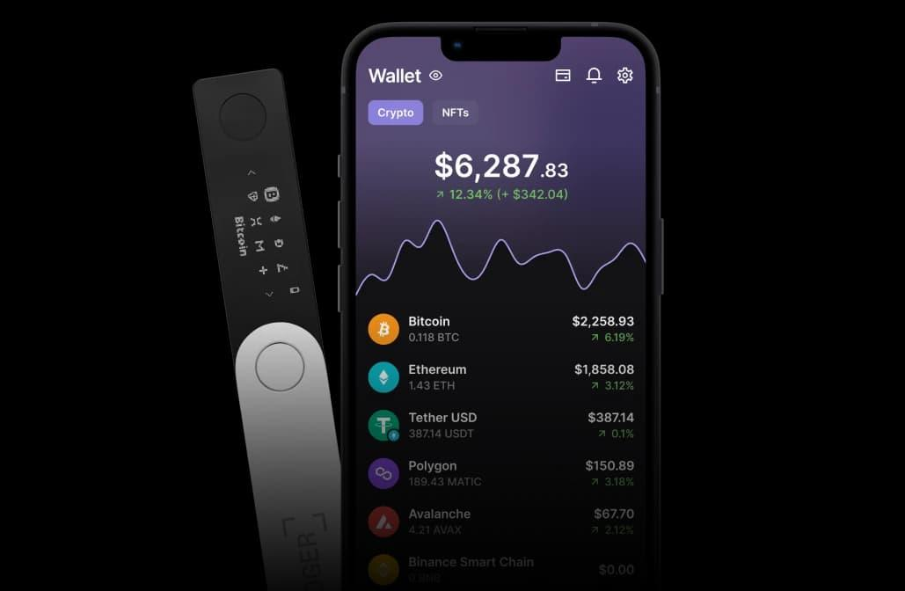

## Table of Contents

## What is a Ledger crypto wallet?

A Ledger crypto wallet is a type of hardware wallet used to store cryptocurrencies securely. It looks like a small USB drive and keeps your digital money safe by storing it offline, away from hackers and online threats. When you want to use your cryptocurrencies, you connect the Ledger wallet to your computer or phone, and it lets you manage your funds without exposing them to the internet.

Using a Ledger wallet is easy. You can set it up by following simple instructions, and then you can send, receive, and check your cryptocurrency balances. The wallet uses a special screen and buttons to confirm transactions, making sure that only you can approve any movement of your funds. This adds an extra layer of security, making it harder for anyone else to access your money.

## How does a Ledger wallet protect my cryptocurrencies?

A Ledger wallet keeps your cryptocurrencies safe by storing them offline, away from the internet where hackers can't reach them. This is called "cold storage." When you want to use your cryptocurrencies, you plug the Ledger wallet into your computer or phone. The wallet only connects to the internet when you need it to, and it never shares your private keys online. This means that even if a website or app you're using gets hacked, your money stays safe because the hackers can't get to your private keys.

The Ledger wallet also uses a special screen and buttons to make sure that only you can approve transactions. When you want to send cryptocurrencies, you have to physically press the buttons on the wallet to confirm. This adds an extra layer of security because no one else can approve a transaction without having the wallet in their hands. Plus, the wallet has a secure chip inside that's similar to the ones used in credit cards, which makes it even harder for anyone to break into your wallet and steal your money.

## What are the basic steps to set up a Ledger wallet?

Setting up a Ledger wallet is easy and takes just a few steps. First, you need to unpack your Ledger wallet and connect it to your computer using the USB cable that comes with it. Once it's plugged in, the wallet will show a welcome message on its screen. Follow the instructions on the screen to choose your language and set up a PIN code. This PIN code will help keep your wallet safe, so make sure to choose one that's hard to guess but easy for you to remember.

After setting your PIN, the wallet will start creating your private keys and recovery phrase. This recovery phrase is very important because it's like a backup key to your wallet. Write down the recovery phrase exactly as it appears on the screen and keep it in a safe place. Never share this phrase with anyone or store it online. Once you've written down the recovery phrase and confirmed it on the wallet, your setup is almost done. You can now install the Ledger Live app on your computer or phone, which will let you manage your cryptocurrencies and connect to your Ledger wallet.

With the Ledger Live app installed, you can add different cryptocurrencies to your wallet. Just follow the app's instructions to install the right apps for the cryptocurrencies you want to use. Once everything is set up, you can start sending and receiving cryptocurrencies safely. Remember to always use the buttons on your Ledger wallet to confirm any transactions, and keep your recovery phrase safe.

## Can I use a Ledger wallet with multiple cryptocurrencies?

Yes, you can use a Ledger wallet with many different cryptocurrencies. It's like having a safe that can hold different types of money. You can add apps for different cryptocurrencies to your Ledger wallet using the Ledger Live app on your computer or phone. This means you can keep Bitcoin, Ethereum, and many other cryptocurrencies all in one place, safe and secure.

Setting up multiple cryptocurrencies on your Ledger wallet is easy. Once your wallet is set up, you can use the Ledger Live app to install the apps for the cryptocurrencies you want to use. Just follow the instructions in the app to add these apps to your wallet. After that, you can send, receive, and check the balances of all your different cryptocurrencies using the same wallet.

## How do I send and receive cryptocurrencies using a Ledger wallet?

To send cryptocurrencies using your Ledger wallet, first, make sure your wallet is connected to your computer or phone. Open the Ledger Live app and go to the section for the [cryptocurrency](/wiki/cryptocurrency) you want to send. Enter the address of the person you want to send the cryptocurrency to, and type in the amount you want to send. Double-check everything to make sure it's correct. Then, use the buttons on your Ledger wallet to confirm the transaction. The wallet will show you the details on its screen, and you'll need to press the buttons to approve the send. Once you confirm, the transaction will be sent, and you'll see it in the Ledger Live app.

Receiving cryptocurrencies is even easier. When someone wants to send you cryptocurrency, they'll need your wallet address. You can find your address in the Ledger Live app by going to the section for the cryptocurrency you want to receive. There, you'll see your address, which you can copy and share with the sender. Once they send the cryptocurrency to your address, it will show up in your Ledger wallet. You can check your balance anytime in the Ledger Live app to see if the transaction has been completed.

## What is the importance of the recovery phrase in a Ledger wallet?

The recovery phrase in a Ledger wallet is super important because it's like a secret key to your money. If something happens to your wallet, like it gets lost or broken, the recovery phrase lets you get your cryptocurrencies back. It's a list of words that you write down when you set up your wallet. You need to keep this phrase safe and secret because anyone who knows it can take your money.

It's really important not to lose your recovery phrase or share it with anyone. If you lose it, you might not be able to get your cryptocurrencies back, even if you still have your wallet. And if someone else finds out your recovery phrase, they could use it to steal your money. So, always keep your recovery phrase in a safe place, like a locked drawer or a secure safe, and never store it online or take a picture of it.

## How can I update the firmware on my Ledger wallet?

Updating the firmware on your Ledger wallet is important to keep it safe and working well. First, make sure your wallet is connected to your computer with the USB cable. Open the Ledger Live app on your computer and go to the "Manager" section. If there's a new firmware update available, you'll see a message telling you to update. Click on the update button and follow the instructions on the screen. Your wallet will show you what to do next, like pressing the buttons to confirm the update.

Once you start the update, make sure not to unplug your wallet or turn off your computer until it's done. The update might take a few minutes, and your wallet's screen will show you how it's going. When the update is finished, your wallet will restart, and you'll need to enter your PIN code again. After that, your Ledger wallet will be up to date and ready to use with the latest security features.

## What advanced security features does a Ledger wallet offer?

A Ledger wallet has some cool advanced security features that help keep your cryptocurrencies safe. One of these is called "Secure Element," which is a special chip inside the wallet that's really hard to hack. It's the same kind of chip that's used in credit cards and passports, so you know it's strong. Another feature is called "Isolation," which means your private keys never leave the wallet. This keeps them safe from online hackers because they can't get to them even if they try to trick you with a fake website or app.

Another important security feature is the "PIN code" and "Passphrase." The PIN code is like a password you set up when you first use your wallet. You need to enter it every time you want to use your wallet, so if someone finds your wallet, they can't use it without knowing your PIN. The passphrase is an extra layer of security that you can add if you want. It's like a secret code that makes your wallet even harder to break into. Together, these features make sure that only you can access your cryptocurrencies, keeping them safe and secure.

## How does the Ledger wallet integrate with other software and platforms?

A Ledger wallet works well with other software and platforms, making it easy to use your cryptocurrencies in different places. You can connect your Ledger wallet to the Ledger Live app, which is like a control center for your wallet. This app helps you manage your cryptocurrencies, check your balances, and send or receive money. But it's not just limited to Ledger Live; you can also use your Ledger wallet with other popular apps and websites like MetaMask for Ethereum or Electrum for Bitcoin. These platforms recognize your Ledger wallet and let you use it to keep your money safe while you're doing things like trading or using decentralized apps.

To connect your Ledger wallet to other software, you just need to plug it into your computer or phone and open the app or website you want to use. The software will usually guide you through the steps to set up your wallet. Once it's set up, you can use the buttons on your Ledger wallet to confirm any actions, like sending money or signing into an app. This way, you can use your cryptocurrencies in lots of different places while still keeping them safe and secure.

## What are the common troubleshooting steps for Ledger wallet issues?

If you're having trouble with your Ledger wallet, the first thing to do is make sure it's properly connected to your computer or phone. Sometimes, the USB cable might be loose or the wrong type, so try using a different cable or port. Also, check if your Ledger Live app is up to date. If it's not, update it because new versions often fix bugs and improve how things work. If your wallet isn't showing up in the app, try restarting your computer or phone and then reconnecting the wallet.

If you're still having problems, look at the screen on your Ledger wallet. It might show an error message that can help you figure out what's wrong. For example, if it says "MCU Firmware is not genuine," you might need to reinstall the firmware. You can do this by going to the "Manager" section in Ledger Live and following the steps to update the firmware. If you're stuck and nothing seems to work, you can visit the Ledger support website or reach out to their customer service team. They can give you more help and advice on fixing your wallet issues.

## How can I optimize the performance and security of my Ledger wallet?

To keep your Ledger wallet working well and staying safe, you need to update it regularly. Just like how you update your phone or computer, updating your Ledger wallet's firmware and the Ledger Live app can fix bugs and make things run smoother. When there's a new update, follow the instructions in the Ledger Live app to install it. This keeps your wallet up to date with the latest security features, which is important for protecting your cryptocurrencies.

Another way to make your Ledger wallet more secure is by being careful with your recovery phrase and PIN code. Always keep your recovery phrase in a safe place, like a locked drawer, and never share it with anyone or store it online. Your PIN code should be hard to guess but easy for you to remember. If you think someone might know your PIN, change it right away. By taking these steps, you can help make sure your Ledger wallet stays safe and works well for a long time.

## What are the future developments and updates planned for Ledger wallets?

Ledger is always working on making their wallets better and safer. They plan to add support for more cryptocurrencies so you can keep even more types of money in one place. They're also looking at ways to make the Ledger Live app easier to use, with new features that help you manage your money better. Plus, they're thinking about adding more ways to connect your wallet to other apps and websites, so you can use your cryptocurrencies in more places without worrying about safety.

Another big thing Ledger is working on is improving the security of their wallets. They want to make the Secure Element chip even stronger to keep your money safe from hackers. They're also looking at new ways to protect your private keys and make sure no one can steal them, even if they get their hands on your wallet. By keeping up with these updates, Ledger wallets will stay one step ahead of any new threats, making sure your cryptocurrencies are always safe and secure.

## References & Further Reading

[1]: ["Using Crypto Hardware Wallets"](https://decrypt.co/19326/best-cryptocurrency-hardware-wallets) – Ledger Academy

[2]: ["Securing Your Digital Assets with Crypto Wallets"](https://www.ledger.com/) – Bitcoin.org

[3]: Nakamoto, S. (2008). ["Bitcoin: A Peer-to-Peer Electronic Cash System."](https://nakamotoinstitute.org/library/bitcoin/)

[4]: Cocco, L., & Marchesi, M. (2016). ["Modeling and Simulation of the Economics of Mining in the Bitcoin Market."](https://journals.plos.org/plosone/article/file?id=10.1371/journal.pone.0164603&type=printable) Journal of Economic Interaction and Coordination.

[5]: Greaves, A., & Au, B. (2015). ["Using Blockchain for Algorithmic Trading Strategies."](https://snap.stanford.edu/class/cs224w-2015/projects_2015/Using_the_Bitcoin_Transaction_Graph_to_Predict_the_Price_of_Bitcoin.pdf) 

[6]: ["Mastering Bitcoin: Unlocking Digital Cryptocurrencies"](https://books.google.com/books/about/Mastering_Bitcoin.html?id=IXmrBQAAQBAJ) by Andreas M. Antonopoulos 

[7]: ["Cryptoassets: The Innovative Investor's Guide to Bitcoin and Beyond"](https://www.amazon.com/Cryptoassets-Innovative-Investors-Bitcoin-Beyond/dp/1260026671) by Chris Burniske and Jack Tatar