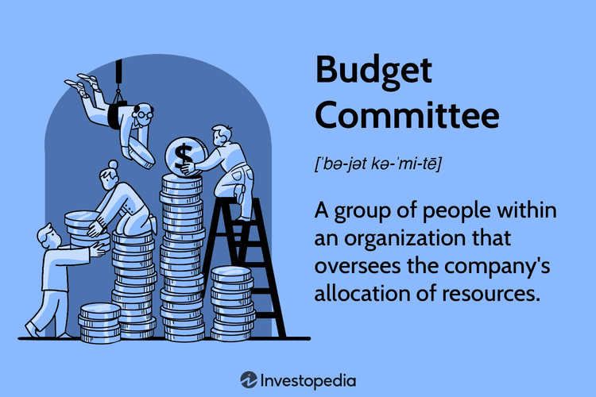

This article examines the roles and accomplishments of budget committees, focusing on their pivotal function in guiding fiscal responsibility within organizations. Budget committees serve as essential financial decision-making bodies, tasked with overseeing and directing financial allocations to ensure that an entity's strategic goals are achieved effectively. Their influence extends beyond traditional budget oversight, making them integral players in the modern financial landscape.

As the financial sector continually evolves with technological advancements, understanding the intersection between budget committees and algorithmic trading has become increasingly important. Algorithmic trading, which relies on complex mathematical models and high-speed computational power to execute trades, requires precise and thoughtful resource allocation. Here, budget committees play a key role in facilitating the alignment of financial resources with the technical infrastructure necessary to support such sophisticated trading methods.

By examining how committee functions align with trading strategies, stakeholders can gain valuable insights into best practices in financial management. This understanding is not only crucial for maintaining fiscal order within an organization but also enhances the ability to adapt to emerging trends and technologies in trading. Continual dialogue around these topics remains essential as the financial markets advance and adapt to technological innovations, ensuring that financial institutions remain competitive and financially prudent in their operations.

## Table of Contents

## What is a Budget Committee?

A budget committee is an essential organizational unit tasked with overseeing and managing the financial allocations within an entity. This committee typically comprises key management personnel who [carry](/wiki/carry-trading) the responsibility of setting fiscal guidelines that steer the organization towards achieving its financial objectives. Through these guidelines, budget committees ensure that financial resources are distributed efficiently and align with the organization's strategic priorities.

The core responsibilities of a budget committee include the development, planning, and execution of budgetary controls and strategies. These strategies are vital for maintaining a balanced approach to financial management, ensuring that resources are used effectively to support both short-term operational needs and long-term strategic goals.

In its role, a budget committee is often involved in various stages of the budget process, which includes preparation, approval, and implementation phases. During these stages, the committee must analyze financial data, evaluate budget proposals, and monitor expenditure against approved budgets. This systematic approach aids in maintaining fiscal discipline and accountability across the organization.

Moreover, budget committees facilitate communication regarding financial matters among different departments, fostering an environment where financial planning and decision-making are transparent and aligned with the overall objectives of the entity. Such coordination helps in preempting potential financial challenges and identifying opportunities for resource optimization. As financial landscapes continue to evolve, the role of budget committees in guiding fiscal policies remains pivotal in ensuring the financial health and sustainability of organizations.

## Functions of a Budget Committee

A budget committee is vital in the financial management of an organization, ensuring that departmental budgets align with overarching strategic objectives. One of the primary functions is to review and approve these budgets, a process that requires a deep understanding of the organization's vision and financial goals. By aligning departmental budgets with strategic objectives, budget committees help maintain a cohesive and focused financial strategy across the organization.

An essential responsibility of the budget committee is to produce and update the budget manual. This document serves as a comprehensive guide for standardizing budgeting processes, ensuring consistency and transparency across all departments. By maintaining an up-to-date budget manual, the committee helps streamline budgeting activities, facilitating more effective financial planning and resource allocation.

In addition, the committee evaluates and oversees capital expenditure requests. This involves scrutinizing proposals for new investments or large purchases to ensure that they are necessary and aligned with the organization's financial strategy. By controlling capital expenditures, budget committees help organizations utilize their resources prudently, avoiding unnecessary spending and enhancing fiscal responsibility.

Forecasting and identifying potential financial trends and requirements is another crucial function. Budget committees assist in anticipating future financial conditions based on current data and trends. This forward-looking approach enables the organization to prepare and adjust its financial plans proactively, reducing risks associated with unexpected financial challenges.

These functions collectively allow budget committees to maintain a balance between current financial demands and long-term strategic objectives, ensuring the organization's financial health and sustainability.

## Accomplishments of Budget Committees

Budget committees play a significant role in the financial management of organizations by effectively aligning financial resources with strategic goals. One primary accomplishment is their ability to ensure fiscal responsibility through a comprehensive overview of the organization's financial status. By maintaining a holistic view, these committees can identify fiscal discrepancies and implement corrective measures to mitigate budget deviations. This approach not only safeguards the organization's financial integrity but also ensures that financial allocations reflect the strategic priorities set forth by management. 

Moreover, budget committees enhance communication and collaboration among various departments to address financial needs efficiently. This inter-departmental coordination is pivotal for the accurate dissemination of financial information and the establishment of a unified financial strategy. By fostering an environment of transparency and cooperation, budget committees enable departments to communicate their financial requirements clearly, ensuring that all parts of the organization work in harmony towards common financial objectives. This collaboration is augmented by regular updates and budgetary evaluations, which help in the timely identification of financial trends and adjustments needed to maintain budgetary alignment with organizational goals.

## Budget Committee and Algorithmic Trading

Algorithmic trading, characterized by automated transactions executed by pre-set algorithms, demands substantial financial oversight due to its reliance on high-frequency and intricate market strategies. Budget committees play a pivotal role in ensuring that necessary financial resources are efficiently allocated to support these sophisticated trading technologies and infrastructural needs.

Effective allocation begins with the strategic prioritization of investments. Budget committees assess potential investments in [algorithmic trading](/wiki/algorithmic-trading) technologies and prioritize those aligning with the organization's broader financial goals. This includes evaluating the cost-effectiveness of advanced trading platforms, data acquisition for model development, and computational infrastructure capable of supporting rapid transaction times and large-scale data analysis. 

Market conditions and emerging algorithmic developments influence budgetary allocations set by the committee. The dynamic nature of financial markets necessitates flexible and responsive budgeting. Committees must analyze market trends and financial metrics to adjust funding levels to optimize trading algorithm performance. This involves financial modeling and risk assessment techniques to project potential returns against investment costs, a critical evaluation in maintaining competitive advantage in algorithmic trading.

Moreover, budget committees are tasked with balancing resource distribution across technology acquisitions, staff training, and compliance requirements. The integration of new trading algorithms often requires extensive validation and potential modifications to existing systems, demanding both financial and human capital. Committees must ensure that budget plans adequately cover these aspects while fostering a culture of innovation and continuous improvement.

In summary, through setting investment priorities and overseeing the alignment of financial resources with trading strategies, budget committees ensure that organizations remain at the forefront of technological advancements in algorithmic trading. This strategic oversight not only enhances trading efficiency but also positions the organization to leverage future market opportunities effectively.

## The Role of Budget Committees in Future Financial Landscapes

As financial technologies continue to advance, budget committees are poised to play a pivotal role in steering organizational investments towards [artificial intelligence](/wiki/ai-artificial-intelligence) (AI) and algorithmic trading. The evolving financial landscape necessitates a strategic approach from these committees to ensure that technological investments align with organizational goals and maximize returns.

The integration of AI and algorithmic trading systems into financial institutions requires budget committees to adopt dynamic management practices. For instance, predictive analytics and [machine learning](/wiki/machine-learning) models within AI systems demand significant investment in data acquisition, storage, and processing capabilities. Budget committees must allocate resources to develop these infrastructures, ensuring that financial operations remain competitive.

Moreover, as algorithmic trading becomes more prevalent, the committees must focus on allocating funds to acquire and maintain sophisticated trading algorithms. These algorithms, often coded in languages like Python, require constant updating to adapt to volatile market conditions. Consequently, budget committees need to support continuous research and development efforts, providing financial resources for algorithm enhancement and adaptation to new market strategies.

One of the challenges budget committees face is ensuring that investments in such technologies yield optimal returns. This involves conducting cost-benefit analyses to assess the potential financial impact of new AI technologies and algorithmic systems. Metrics such as Return on Investment (ROI) and Net Present Value (NPV) can help committees evaluate the financial feasibility of these technological ventures. Formulas like:

$$
\text{ROI} = \frac{\text{Net Profit}}{\text{Cost of Investment}} \times 100
$$

can be used to measure the profitability of investments in AI systems, while:

$$
\text{NPV} = \sum \frac{R_t}{(1+i)^t} - C_0
$$

where $R_t$ is the net cash inflow-outflows during a single period t, $i$ is the discount rate and $C_0$ is the initial investment, can be used to assess the value added by these investments over time.

As financial technologies evolve, budget committees are expected to become integral in navigating the complexities introduced by these advancements. Their role will extend from traditional budgeting to encompassing strategic investment in technology, ensuring that organizations remain resilient and forward-looking in a rapidly transforming financial environment.

## Conclusion

Budget committees play a critical role in ensuring sound fiscal operations across organizations. Their responsibilities have grown beyond traditional oversight, now encompassing the adaptation and integration of advanced technologies, such as algorithmic trading. In the context of fast-paced financial markets, these committees must balance strategic financial management with technological innovation to maintain competitive advantage.

Algorithmic trading, which involves utilizing pre-defined algorithms to execute trades at speeds and efficiencies beyond human capacity, requires substantial investment in technology infrastructure and data management. Budget committees, therefore, need to allocate resources effectively to support these advanced trading operations. This involves not just funding the necessary technology but also ensuring that the financial strategies align with the dynamic nature of these technologies and the associated market conditions.

The successful integration of new trading technologies demands an evolving approach to budgeting processes. Committees must prioritize investments in artificial intelligence and machine learning to support the development of increasingly sophisticated trading algorithms. In doing so, they ensure that financial resources are directed towards initiatives that yield the highest returns, both in terms of competitive positioning and financial performance.

To maintain efficacy in this evolving landscape, budget committees must act as a bridge between strategic financial management and technological advancements. This involves not only traditional budget oversight but also a forward-looking perspective that anticipates future technological trends and market shifts. By fostering close collaboration between financial stakeholders and technology developers, budget committees can enhance their organization's adaptability and ensure sustainable fiscal success.

In summary, the evolving role of budget committees highlights the necessity of integrating technology with financial decision-making. Ensuring an effective balance between these domains will be crucial for maintaining organizational competitiveness and achieving long-term financial objectives.

## References & Further Reading

[1]: Bergstra, J., Bardenet, R., Bengio, Y., & Kégl, B. (2011). ["Algorithms for Hyper-Parameter Optimization."](https://dl.acm.org/doi/10.5555/2986459.2986743) Advances in Neural Information Processing Systems 24.

[2]: ["Advances in Financial Machine Learning"](https://www.amazon.com/Advances-Financial-Machine-Learning-Marcos/dp/1119482089) by Marcos Lopez de Prado

[3]: ["Evidence-Based Technical Analysis: Applying the Scientific Method and Statistical Inference to Trading Signals"](https://www.amazon.com/Evidence-Based-Technical-Analysis-Scientific-Statistical/dp/0470008741) by David Aronson

[4]: ["Machine Learning for Algorithmic Trading"](https://github.com/stefan-jansen/machine-learning-for-trading) by Stefan Jansen

[5]: ["Quantitative Trading: How to Build Your Own Algorithmic Trading Business"](https://www.amazon.com/Quantitative-Trading-Build-Algorithmic-Business/dp/1119800064) by Ernest P. Chan